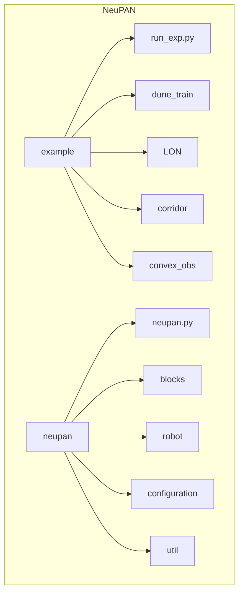
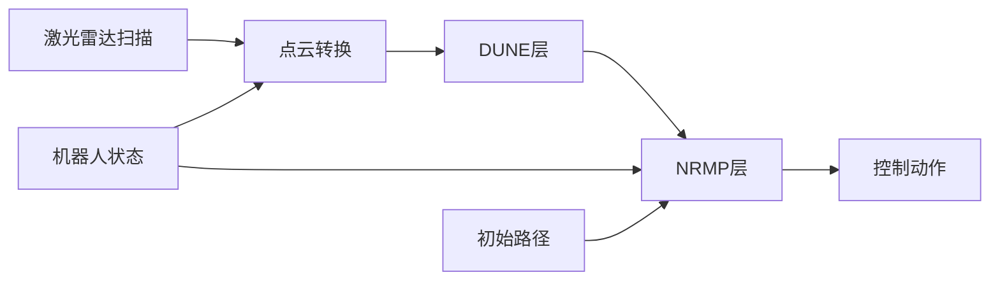
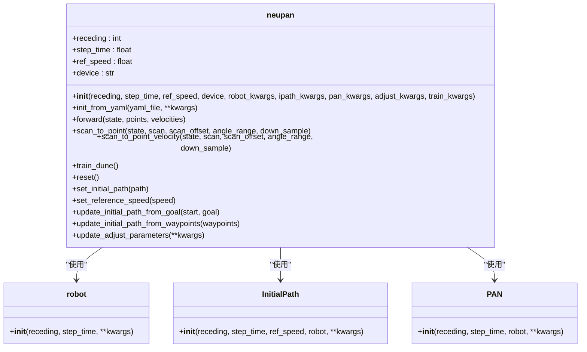
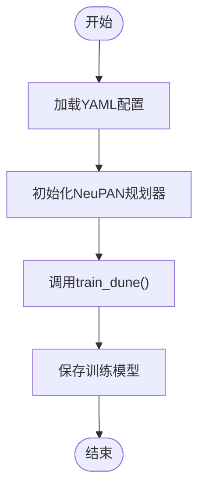
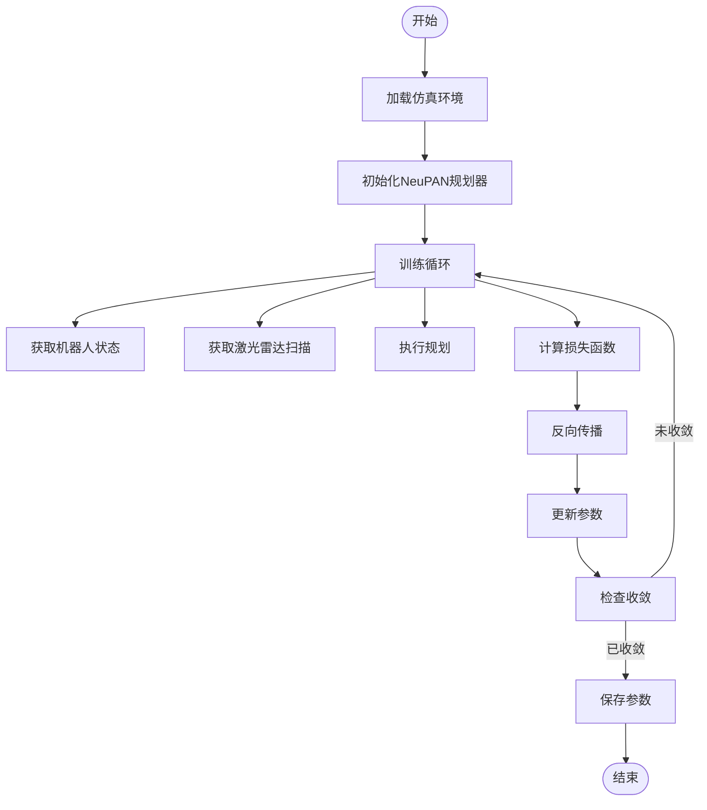
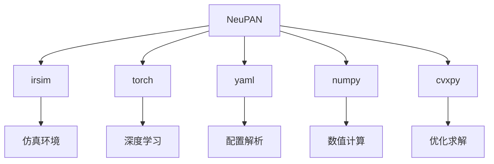

# NeuPAN 使用指南

<cite>
**本文档中引用的文件**  
- [run_exp.py](file://example/run_exp.py)
- [neupan.py](file://neupan/neupan.py)
- [dune_train_acker.py](file://example/dune_train/dune_train_acker.py)
- [dune_train_diff.py](file://example/dune_train/dune_train_diff.py)
- [LON_corridor.py](file://example/LON/LON_corridor.py)
- [LON_corridor.yaml](file://example/LON/LON_corridor.yaml)
- [planner.yaml](file://example/LON/planner.yaml)
- [env.yaml](file://example/corridor/diff/env.yaml)
</cite>

## 目录
1. [简介](#简介)
2. [项目结构](#项目结构)
3. [核心组件](#核心组件)
4. [架构概述](#架构概述)
5. [详细组件分析](#详细组件分析)
6. [依赖分析](#依赖分析)
7. [性能考虑](#性能考虑)
8. [故障排除指南](#故障排除指南)
9. [结论](#结论)

## 简介
NeuPAN（Neural Proximal Alternating-minimization Network）是一种端到端、实时、无需地图且易于部署的基于模型预测控制（MPC）的机器人运动规划器。通过融合基于学习和基于优化的技术，NeuPAN能够直接将障碍物点云数据映射为实时控制动作，解决了传统导航系统中因中间模块设计导致的误差累积问题。该系统适用于差速驱动和阿克曼转向机器人，在复杂和未知环境中实现高效安全的导航。

## 项目结构
NeuPAN项目采用模块化设计，主要包含`example`示例目录、`neupan`核心算法模块和配置文件。`example`目录下包含多种场景的配置和脚本，`neupan`目录包含核心规划算法实现。



**Diagram sources**
- [run_exp.py](file://example/run_exp.py)
- [neupan.py](file://neupan/neupan.py)

**Section sources**
- [run_exp.py](file://example/run_exp.py)
- [neupan.py](file://neupan/neupan.py)

## 核心组件
NeuPAN的核心组件包括`run_exp.py`入口脚本、`neupan.py`主规划模块、DUNE模型训练脚本和LON参数优化脚本。`run_exp.py`作为主要入口点，负责初始化环境和规划器，执行仿真循环。`neupan.py`实现了端到端的规划算法，封装了PAN类并提供了用户友好的接口。

**Section sources**
- [run_exp.py](file://example/run_exp.py#L1-L93)
- [neupan.py](file://neupan/neupan.py#L1-L403)

## 架构概述
NeuPAN的架构由感知、规划和控制三个主要部分组成。系统接收激光雷达扫描数据，通过DUNE层进行障碍物点云处理，然后在NRMP层进行基于优化的轨迹规划，最终输出控制动作。



**Diagram sources**
- [neupan.py](file://neupan/neupan.py#L1-L403)
- [run_exp.py](file://example/run_exp.py#L1-L93)

## 详细组件分析

### run_exp.py 分析
`run_exp.py`是NeuPAN的主要入口点，负责设置仿真环境、初始化规划器并执行主控制循环。该脚本支持多种实验配置，如LON_corridor、dune_train等，通过命令行参数选择不同的机器人类型和场景。

```mermaid
sequenceDiagram
participant Main as main()
participant Arg as argparse
participant Env as irsim.make()
participant Planner as neupan.init_from_yaml()
participant Loop as for loop
Arg->>Main : 解析命令行参数
Main->>Env : 创建仿真环境
Main->>Planner : 初始化NeuPAN规划器
loop 控制循环
Loop->>Planner : 获取机器人状态
Loop->>Planner : 获取激光雷达扫描
Loop->>Planner : scan_to_point()
Loop->>Planner : 执行规划
Loop->>Env : 执行动作
Loop->>Env : 渲染环境
end
```

**Diagram sources**
- [run_exp.py](file://example/run_exp.py#L1-L93)

**Section sources**
- [run_exp.py](file://example/run_exp.py#L1-L93)

### neupan.py 核心模块分析
`neupan.py`是NeuPAN的核心模块，实现了端到端的规划算法。该模块提供了丰富的参数配置和调用方式，支持从环境设置到参数调整的完整流程。

#### 参数配置和调用方式
`neupan`类通过`__init__`方法接收多种参数，包括MPC参数、设备设置和机器人参数。`init_from_yaml`类方法允许从YAML文件初始化规划器，简化了配置过程。



**Diagram sources**
- [neupan.py](file://neupan/neupan.py#L1-L403)

**Section sources**
- [neupan.py](file://neupan/neupan.py#L1-L403)

### DUNE模型训练分析
DUNE模型训练是NeuPAN的重要组成部分，用于为特定机器人几何形状训练模型。训练脚本`dune_train_acker.py`和`dune_train_diff.py`演示了如何为阿克曼转向和差速驱动机器人训练DUNE模型。



**Diagram sources**
- [dune_train_acker.py](file://example/dune_train/dune_train_acker.py)
- [dune_train_diff.py](file://example/dune_train/dune_train_diff.py)

**Section sources**
- [dune_train_acker.py](file://example/dune_train/dune_train_acker.py)
- [dune_train_diff.py](file://example/dune_train/dune_train_diff.py)

### LON参数优化分析
LON（Learnable Optimization Network）参数优化用于调整规划器的可学习参数，如权重和距离阈值。`LON_corridor.py`脚本演示了如何在走廊场景中进行参数优化。



**Diagram sources**
- [LON_corridor.py](file://example/LON/LON_corridor.py)
- [LON_corridor.yaml](file://example/LON/LON_corridor.yaml)

**Section sources**
- [LON_corridor.py](file://example/LON/LON_corridor.py#L1-L146)
- [LON_corridor.yaml](file://example/LON/LON_corridor.yaml#L1-L49)

## 依赖分析
NeuPAN依赖于多个外部库和模块，包括irsim用于仿真，torch用于深度学习，yaml用于配置文件解析。这些依赖关系确保了系统的功能完整性和可扩展性。



**Diagram sources**
- [run_exp.py](file://example/run_exp.py#L1-L93)
- [neupan.py](file://neupan/neupan.py#L1-L403)

**Section sources**
- [run_exp.py](file://example/run_exp.py#L1-L93)
- [neupan.py](file://neupan/neupan.py#L1-L403)

## 性能考虑
NeuPAN的性能受多个因素影响，包括CPU计算能力、调整参数和初始路径质量。建议使用强大的CPU平台（如Intel i7）以实现高于10Hz的控制频率。通过调整`receding`、`nrmp_max_num`、`dune_max_num`、`iter_num`和`iter_threshold`等参数可以优化运行速度。

## 故障排除指南
常见问题包括机器人卡住、无法到达目标和碰撞检测失败。解决方案包括调整`adjust`参数中的权重、检查初始路径设置和验证传感器数据质量。对于新机器人几何形状，需要重新训练DUNE模型以确保准确的碰撞检测。

**Section sources**
- [README.md](file://README.md#L1-L243)

## 结论
NeuPAN提供了一个强大而灵活的端到端机器人导航解决方案。通过本指南，用户可以了解如何设置环境、配置参数、运行仿真并优化性能。对于初学者，建议从提供的示例开始；对于高级用户，可以深入调整参数和自定义配置以满足特定需求。