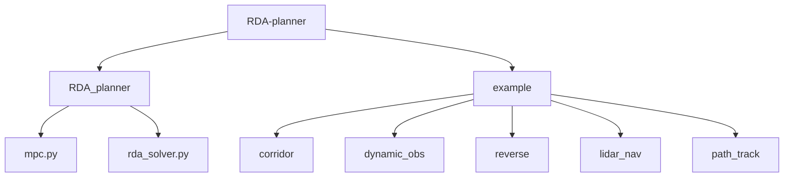
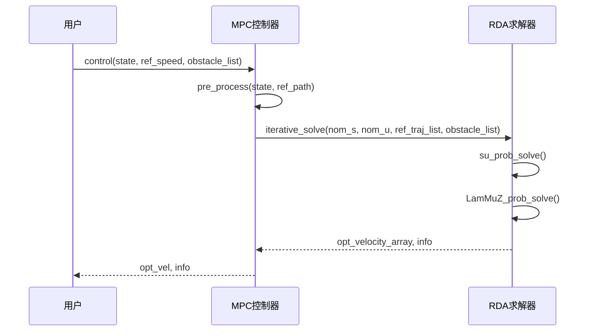
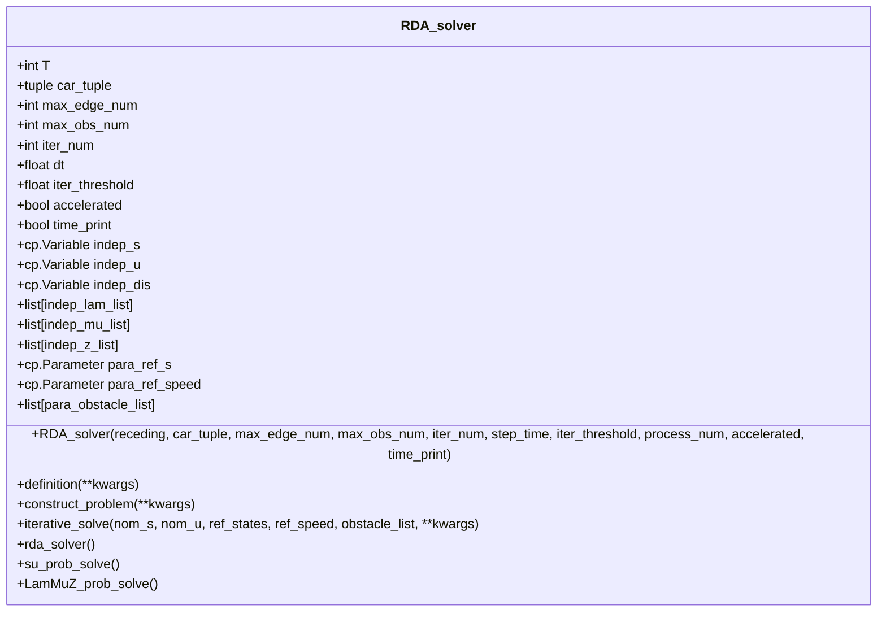
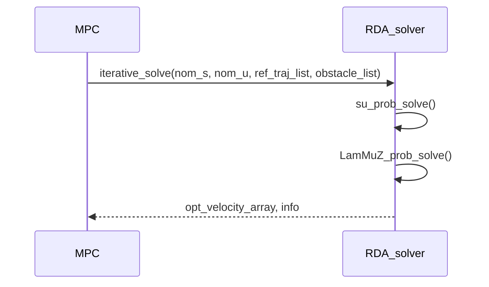
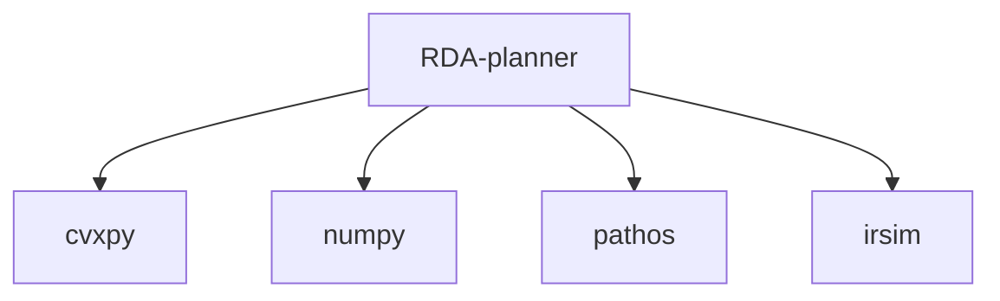

# RDA-planner 使用指南

<cite>
**本文档中引用的文件**
- [rda_solver.py](file://RDA-planner/RDA_planner/rda_solver.py)
- [mpc.py](file://RDA-planner/RDA_planner/mpc.py)
- [corridor.py](file://RDA-planner/example/corridor/corridor.py)
- [dynamic_obs.py](file://RDA-planner/example/dynamic_obs/dynamic_obs.py)
- [reverse.py](file://RDA-planner/example/reverse/reverse.py)
- [corridor.yaml](file://RDA-planner/example/corridor/corridor.yaml)
- [dynamic_obs.yaml](file://RDA-planner/example/dynamic_obs/dynamic_obs.yaml)
- [reverse.yaml](file://RDA-planner/example/reverse/reverse.yaml)
</cite>

## 目录
1. [简介](#简介)
2. [项目结构](#项目结构)
3. [核心组件](#核心组件)
4. [架构概述](#架构概述)
5. [详细组件分析](#详细组件分析)
6. [依赖分析](#依赖分析)
7. [性能考虑](#性能考虑)
8. [故障排除指南](#故障排除指南)
9. [结论](#结论)

## 简介
RDA-planner 是一种高性能、基于优化的模型预测控制（MPC）运动规划器，专为复杂和杂乱环境中的自主导航而设计。该规划器利用交替方向乘子法（ADMM），将复杂的优化问题分解为多个简单的子问题。这种分解使得每个障碍物的碰撞避免约束可以并行计算，从而显著提高计算速度。本指南详细介绍了加速碰撞避免规划器的应用，重点说明了 corridor.py、dynamic_obs.py 和 reverse.py 等示例脚本的使用方法和适用场景，以及 rda_solver.py 求解器的核心参数配置和调用流程。

## 项目结构
RDA-planner 项目的目录结构清晰，主要包含核心规划器模块、示例脚本和配置文件。核心功能实现在 `RDA_planner` 目录下的 `rda_solver.py` 和 `mpc.py` 文件中。`example` 目录包含了多个使用场景的示例脚本，如走廊导航、动态障碍物避让和倒车场景，每个示例都配有相应的 YAML 配置文件来定义仿真环境。

**图示来源**
- [rda_solver.py](file://RDA-planner/RDA_planner/rda_solver.py)
- [mpc.py](file://RDA-planner/RDA_planner/mpc.py)
- [corridor.py](file://RDA-planner/example/corridor/corridor.py)
- [dynamic_obs.py](file://RDA-planner/example/dynamic_obs/dynamic_obs.py)
- [reverse.py](file://RDA-planner/example/reverse/reverse.py)

**章节来源**
- [rda_solver.py](file://RDA-planner/RDA_planner/rda_solver.py)
- [mpc.py](file://RDA-planner/RDA_planner/mpc.py)

## 核心组件
RDA-planner 的核心组件包括 `RDA_solver` 类和 `MPC` 类。`RDA_solver` 类实现了基于 ADMM 的优化求解器，负责处理状态变量、对偶变量和障碍物参数的定义与更新。`MPC` 类作为高层控制器，封装了 `RDA_solver`，提供了更简洁的接口用于路径跟踪和避障。`MPC` 类还负责预处理参考路径、预测状态和处理动态障碍物。

**章节来源**
- [rda_solver.py](file://RDA-planner/RDA_planner/rda_solver.py#L1-L1081)
- [mpc.py](file://RDA-planner/RDA_planner/mpc.py#L1-L570)

## 架构概述
RDA-planner 的架构采用分层设计，底层是基于 ADMM 的优化求解器，上层是 MPC 控制器。MPC 控制器接收当前机器人状态、参考路径和障碍物列表，通过调用 `RDA_solver` 的 `iterative_solve` 方法来求解最优控制输入。求解过程包括状态更新和对偶变量更新两个子问题，通过迭代求解直到收敛。

**图示来源**
- [mpc.py](file://RDA-planner/RDA_planner/mpc.py#L1-L570)
- [rda_solver.py](file://RDA-planner/RDA_planner/rda_solver.py#L1-L1081)

## 详细组件分析
### RDA_solver 分析
`RDA_solver` 类是 RDA-planner 的核心，负责实现 ADMM 优化算法。它定义了状态变量、对偶变量和障碍物参数，并通过 `construct_problem` 方法构建优化问题。`iterative_solve` 方法是求解的主循环，通过多次迭代更新状态和对偶变量，直到满足收敛条件。

#### 类图

**图示来源**
- [rda_solver.py](file://RDA-planner/RDA_planner/rda_solver.py#L1-L1081)

**章节来源**
- [rda_solver.py](file://RDA-planner/RDA_planner/rda_solver.py#L1-L1081)

### MPC 分析
`MPC` 类是 RDA-planner 的高层接口，负责管理参考路径、障碍物列表和机器人状态。它通过 `control` 方法接收当前状态和参考速度，调用 `RDA_solver` 求解最优控制输入，并返回给用户。`MPC` 类还提供了 `update_ref_path` 和 `update_parameter` 方法，用于动态更新参考路径和规划器参数。

#### 序列图

**图示来源**
- [mpc.py](file://RDA-planner/RDA_planner/mpc.py#L1-L570)

**章节来源**
- [mpc.py](file://RDA-planner/RDA_planner/mpc.py#L1-L570)

## 依赖分析
RDA-planner 依赖于多个外部库，包括 `cvxpy` 用于凸优化求解，`numpy` 用于数值计算，`pathos` 用于多进程并行计算。此外，示例脚本依赖于 `irsim` 仿真环境来演示规划器的性能。这些依赖关系在 `setup.py` 文件中定义，并通过 `pip install -e .` 命令安装。

**图示来源**
- [setup.py](file://RDA-planner/setup.py)
- [rda_solver.py](file://RDA-planner/RDA_planner/rda_solver.py)
- [mpc.py](file://RDA-planner/RDA_planner/mpc.py)

**章节来源**
- [setup.py](file://RDA-planner/setup.py)
- [rda_solver.py](file://RDA-planner/RDA_planner/rda_solver.py)
- [mpc.py](file://RDA-planner/RDA_planner/mpc.py)

## 性能考虑
RDA-planner 的性能主要受迭代次数、障碍物数量和求解器参数的影响。增加迭代次数可以提高求解精度，但会增加计算时间。减少障碍物数量可以加快求解速度，但可能影响避障效果。`ro1` 和 `ro2` 参数控制 ADMM 的惩罚项，适当调整这些参数可以平衡求解速度和稳定性。使用多进程并行计算可以显著提高求解速度，特别是在处理大量障碍物时。

## 故障排除指南
### 常见问题
1. **求解失败**：检查障碍物是否为凸多边形，确保障碍物参数正确设置。
2. **求解速度慢**：减少迭代次数或障碍物数量，调整 `ro1` 和 `ro2` 参数。
3. **路径跟踪不准确**：检查参考路径是否平滑，调整 `ws` 和 `wu` 参数。

### 解决方案
- **求解失败**：确保障碍物为凸多边形，使用 `gen_inequal_global` 方法生成不等式约束。
- **求解速度慢**：使用多进程并行计算，减少障碍物数量或迭代次数。
- **路径跟踪不准确**：调整 `ws` 和 `wu` 参数，确保参考路径平滑。

**章节来源**
- [rda_solver.py](file://RDA-planner/RDA_planner/rda_solver.py#L1-L1081)
- [mpc.py](file://RDA-planner/RDA_planner/mpc.py#L1-L570)

## 结论
RDA-planner 是一个高效、灵活的运动规划器，适用于复杂环境中的自主导航。通过合理配置参数和使用多进程并行计算，可以在保证求解精度的同时显著提高计算速度。本指南详细介绍了 RDA-planner 的使用方法和适用场景，帮助用户在不同场景下有效应用该规划器。