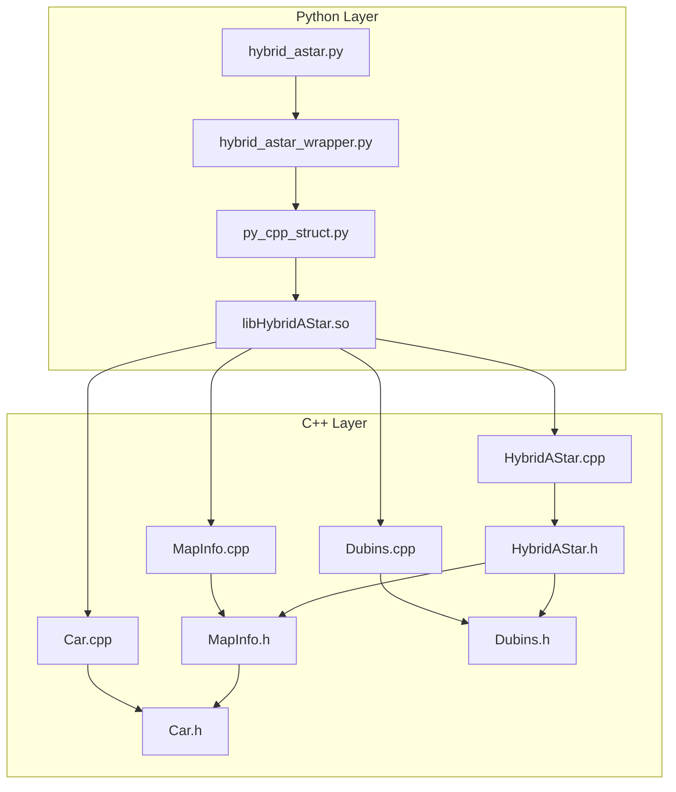
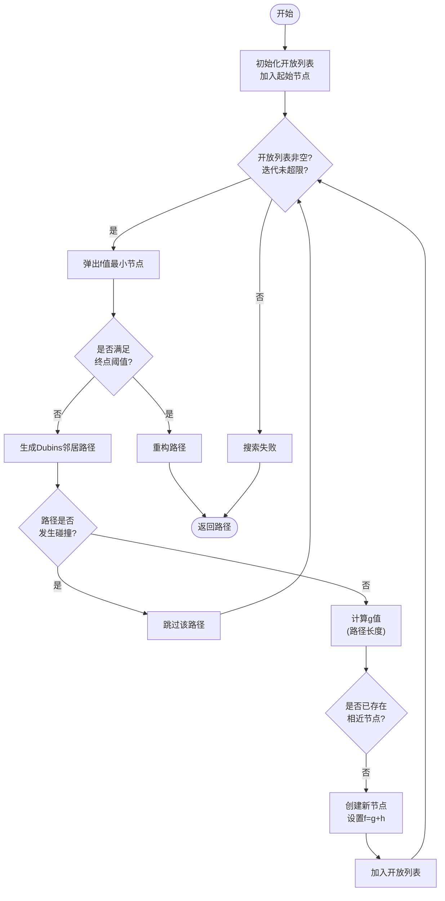
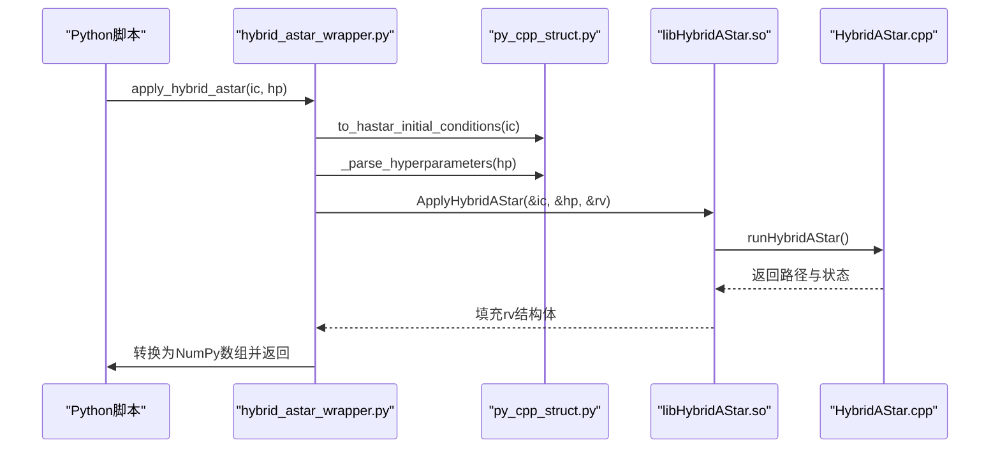
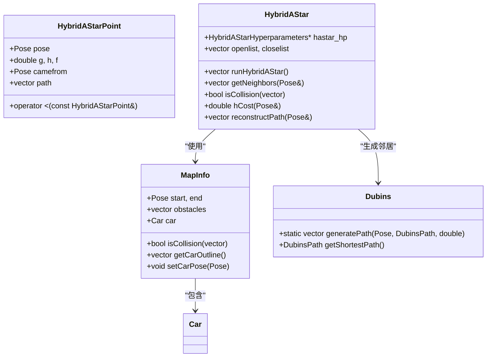

# hybrid_astar_planner 使用指南

<cite>
**本文档中引用的文件**  
- [hybrid_astar.py](file://hybrid_astar_planner/HybridAStar/hybrid_astar.py)
- [hybrid_astar_wrapper.py](file://hybrid_astar_planner/HybridAStar/hybrid_astar_wrapper.py)
- [py_cpp_struct.py](file://hybrid_astar_planner/HybridAStar/py_cpp_struct.py)
- [HybridAStar.h](file://hybrid_astar_planner/include/HybridAStar.h)
- [HybridAStar.cpp](file://hybrid_astar_planner/src/HybridAStar.cpp)
- [MapInfo.h](file://hybrid_astar_planner/include/MapInfo.h)
- [MapInfo.cpp](file://hybrid_astar_planner/src/MapInfo.cpp)
- [Dubins.h](file://hybrid_astar_planner/include/Dubins.h)
- [Dubins.cpp](file://hybrid_astar_planner/src/Dubins.cpp)
- [Car.h](file://hybrid_astar_planner/include/Car.h)
- [constants.h](file://hybrid_astar_planner/include/constants.h)
</cite>

## 目录
1. [简介](#简介)
2. [项目结构](#项目结构)
3. [核心组件](#核心组件)
4. [混合A*算法实现](#混合a-算法实现)
5. [Python与C++接口调用机制](#python与c-接口调用机制)
6. [地图信息、车辆模型与搜索参数配置](#地图信息车辆模型与搜索参数配置)
7. [路径规划示例](#路径规划示例)
8. [关键算法组成部分](#关键算法组成部分)
9. [性能优化建议](#性能优化建议)
10. [故障排除与调试](#故障排除与调试)
11. [结论](#结论)

## 简介
`hybrid_astar_planner` 是一个基于C++实现的混合A*路径规划算法，结合了Python封装接口，适用于自动驾驶场景中的运动规划。该算法通过融合离散搜索与连续空间路径生成（如Dubins路径），在复杂环境中实现高效、平滑的车辆路径规划。

本指南详细说明混合A*算法的实现原理、Python与C++之间的调用机制、地图与车辆参数配置方法，并提供从简单到复杂障碍物环境的导航示例。同时，深入解析Dubins路径生成、碰撞检测和启发式搜索等关键模块，并给出性能优化建议，帮助用户在实时性与路径质量之间取得平衡。

**Section sources**
- [README.md](file://hybrid_astar_planner/README.md#L1-L38)

## 项目结构
`hybrid_astar_planner` 项目采用分层架构，包含Python接口层、C++核心算法层和共享数据结构层，便于跨语言调用与维护。

主要目录结构如下：
- `HybridAStar/`：Python接口与脚本
  - `hybrid_astar.py`：主运行脚本，包含可视化逻辑
  - `hybrid_astar_wrapper.py`：Python到C++的CTypes封装
  - `py_cpp_struct.py`：定义Python与C++共享的数据结构
- `include/`：C++头文件
  - `HybridAStar.h`：混合A*主类定义
  - `MapInfo.h`：地图与车辆状态管理
  - `Dubins.h`：Dubins路径生成
  - `Car.h`：车辆几何模型
- `src/`：C++源文件实现
  - `HybridAStar.cpp`：混合A*算法核心逻辑
  - `MapInfo.cpp`：地图与碰撞检测实现
  - `Dubins.cpp`：Dubins路径计算
- `CMakeLists.txt` 和 `build.sh`：构建脚本，用于编译生成共享库 `libHybridAStar.so`



**Diagram sources**
- [hybrid_astar.py](file://hybrid_astar_planner/HybridAStar/hybrid_astar.py#L1-L101)
- [hybrid_astar_wrapper.py](file://hybrid_astar_planner/HybridAStar/hybrid_astar_wrapper.py#L1-L124)
- [HybridAStar.cpp](file://hybrid_astar_planner/src/HybridAStar.cpp#L1-L171)
- [HybridAStar.h](file://hybrid_astar_planner/include/HybridAStar.h#L1-L38)

**Section sources**
- [hybrid_astar.py](file://hybrid_astar_planner/HybridAStar/hybrid_astar.py#L1-L101)
- [hybrid_astar_wrapper.py](file://hybrid_astar_planner/HybridAStar/hybrid_astar_wrapper.py#L1-L124)
- [HybridAStar.cpp](file://hybrid_astar_planner/src/HybridAStar.cpp#L1-L171)

## 核心组件
本模块的核心组件包括：
- **HybridAStar类**：实现混合A*搜索主循环，管理开放列表与关闭列表，执行启发式搜索。
- **MapInfo类**：管理地图信息、障碍物数据及车辆轮廓，提供碰撞检测功能。
- **Dubins类**：生成满足车辆最小转弯半径约束的Dubins路径。
- **Car类**：定义车辆几何参数（长度、宽度）并计算其在地图中的轮廓。
- **Python-C++接口层**：通过CTypes机制实现Python对C++函数的调用。

这些组件协同工作，完成从起点到终点的无障碍、曲率连续路径规划。

**Section sources**
- [HybridAStar.h](file://hybrid_astar_planner/include/HybridAStar.h#L1-L38)
- [MapInfo.h](file://hybrid_astar_planner/include/MapInfo.h#L1-L25)
- [Dubins.h](file://hybrid_astar_planner/include/Dubins.h#L1-L30)
- [Car.h](file://hybrid_astar_planner/include/Car.h#L1-L20)

## 混合A*算法实现
混合A*算法结合了A*搜索的全局最优性与Dubins路径的运动学可行性，适用于非完整约束车辆（如汽车）的路径规划。

算法流程如下：
1. 初始化开放列表，将起始位姿加入其中。
2. 循环执行以下步骤直至找到路径或达到最大迭代次数：
   - 从开放列表中取出f值最小的节点。
   - 若当前节点满足终点距离与角度阈值，则终止搜索。
   - 否则，生成当前位姿的Dubins邻居路径。
   - 对每条邻居路径：
     - 检查是否与障碍物发生碰撞。
     - 若无碰撞且未被探索过，则计算其g、h、f值并加入开放列表。
3. 使用reconstructPath回溯生成完整路径。

启发式函数h采用欧几里得距离，g值根据路径类型（直行或转弯）累加弧长。



**Diagram sources**
- [HybridAStar.cpp](file://hybrid_astar_planner/src/HybridAStar.cpp#L1-L171)

**Section sources**
- [HybridAStar.cpp](file://hybrid_astar_planner/src/HybridAStar.cpp#L1-L171)

## Python与C++接口调用机制
系统通过Python的`ctypes`库调用编译后的C++共享库（`libHybridAStar.so`），实现高性能计算与易用性结合。

调用流程如下：
1. Python端定义与C++兼容的数据结构（通过`py_cpp_struct.py`中的`Structure`子类）。
2. 加载共享库并声明`ApplyHybridAStar`函数的参数与返回类型。
3. 将Python字典格式的初始条件与超参数转换为C结构体。
4. 调用C++函数执行路径规划。
5. 将C++返回的路径数组转换为NumPy数组供Python使用。

关键函数为`hybrid_astar_wrapper.apply_hybrid_astar()`，其封装了完整的调用逻辑。



**Diagram sources**
- [hybrid_astar_wrapper.py](file://hybrid_astar_planner/HybridAStar/hybrid_astar_wrapper.py#L1-L124)
- [py_cpp_struct.py](file://hybrid_astar_planner/HybridAStar/py_cpp_struct.py#L1-L44)
- [HybridAStar.cpp](file://hybrid_astar_planner/src/HybridAStar.cpp#L1-L171)

**Section sources**
- [hybrid_astar_wrapper.py](file://hybrid_astar_planner/HybridAStar/hybrid_astar_wrapper.py#L1-L124)
- [py_cpp_struct.py](file://hybrid_astar_planner/HybridAStar/py_cpp_struct.py#L1-L44)

## 地图信息、车辆模型与搜索参数配置
### 初始条件配置
通过`initial_conditions`字典传入：
- `start`：起始位姿 `[x, y, yaw]`（弧度）
- `end`：目标位姿 `[x, y, yaw]`
- `obs`：障碍物列表，每个为 `[llx, lly, urx, ury]` 的矩形框

### 超参数配置
通过`hyperparameters`字典设置：
- `step_size`：路径采样步长（米）
- `max_iterations`：最大搜索迭代次数
- `completion_threshold`：位置完成阈值（米）
- `angle_completion_threshold`：航向角完成阈值（弧度）
- `rad_step`：转向角采样分辨率（弧度）
- `rad_upper_range` / `rad_lower_range`：左右最大转向角范围
- `obstacle_clearance`：障碍物安全距离
- `lane_width`：道路宽度
- `radius`：车辆最小转弯半径
- `car_length` / `car_width`：车辆尺寸

合理配置这些参数对算法性能至关重要。

**Section sources**
- [hybrid_astar.py](file://hybrid_astar_planner/HybridAStar/hybrid_astar.py#L15-L50)
- [hybrid_astar_wrapper.py](file://hybrid_astar_planner/HybridAStar/hybrid_astar_wrapper.py#L50-L80)

## 路径规划示例
### 简单直线路径
```python
initial_conditions = {
    'start': np.array([10, 15, 0]),
    'end': np.array([50, 15, 0]),
    'obs': np.array([]),  # 无障碍物
}
```
此场景下算法可在约1ms内完成，适合高速巡航。

### 含障碍物直线路径
```python
'obs': np.array([
    [26.0, 10.0, 34.0, 17.0],
    [26.0, 21.0, 34.0, 28.0],
])
```
算法需绕行，耗时约20ms，体现基本避障能力。

### 转弯路径
```python
'start': np.array([10, 15, 0]),
'end': np.array([30, 35, np.pi/2]),  # 90度左转
```
复杂转向场景耗时可达3秒，建议优化搜索空间。

所有示例可通过运行 `python3 HybridAStar/hybrid_astar.py` 查看可视化结果。

**Section sources**
- [hybrid_astar.py](file://hybrid_astar_planner/HybridAStar/hybrid_astar.py#L15-L101)

## 关键算法组成部分
### Dubins路径生成
Dubins路径连接两个位姿，仅使用“直行-左转-右转”组合，确保路径曲率连续且满足最小转弯半径约束。C++中通过`Dubins`类实现六种基本模式（LSL, RSR, LSR, RSL, LRL, RLR）的计算。

### 碰撞检测
`MapInfo::isCollision()` 方法将车辆轮廓（由`Car`类生成）投影到地图网格，检查是否与任何障碍物矩形相交。检测频率高，是性能瓶颈之一。

### 启发式搜索
使用A*框架，`g`值为已行驶路径长度，`h`值为当前点到目标的欧氏距离。开放列表使用堆结构维护，确保高效提取最小f值节点。



**Diagram sources**
- [HybridAStar.h](file://hybrid_astar_planner/include/HybridAStar.h#L1-L38)
- [MapInfo.h](file://hybrid_astar_planner/include/MapInfo.h#L1-L25)
- [Dubins.h](file://hybrid_astar_planner/include/Dubins.h#L1-L30)

**Section sources**
- [HybridAStar.cpp](file://hybrid_astar_planner/src/HybridAStar.cpp#L1-L171)
- [Dubins.cpp](file://hybrid_astar_planner/src/Dubins.cpp#L1-L100)
- [MapInfo.cpp](file://hybrid_astar_planner/src/MapInfo.cpp#L1-L80)

## 性能优化建议
为在实时性与路径质量间取得平衡，建议：
1. **调整网格分辨率**：增大`step_size`可减少搜索节点数，但可能降低路径精度。
2. **限制转向范围**：减小`rad_upper_range`和`rad_lower_range`可减少邻居数量，加快搜索。
3. **设置合理迭代上限**：`max_iterations`避免无限搜索，建议根据场景复杂度设置（1000~10000）。
4. **优化碰撞检测**：使用空间索引（如四叉树）加速障碍物查询，当前实现为线性扫描。
5. **启用路径平滑**：在混合A*输出后接B样条或TEB平滑器，提升轨迹舒适性。
6. **预计算Dubins路径**：对常见转向角进行缓存，减少重复计算。

性能参考：
- 直线路径：~1ms
- 避障直线：~20ms
- 转弯路径：~3s

**Section sources**
- [README.md](file://hybrid_astar_planner/README.md#L20-L30)
- [HybridAStar.cpp](file://hybrid_astar_planner/src/HybridAStar.cpp#L1-L171)

## 故障排除与调试
常见问题及解决方案：
- **路径未找到**：检查`completion_threshold`是否过小，或障碍物是否完全封锁路径。
- **运行时间过长**：降低`max_iterations`或简化搜索空间（减小转向范围）。
- **路径抖动**：增加`obstacle_clearance`或检查车辆模型参数是否准确。
- **CTypes加载失败**：确保`libHybridAStar.so`已正确编译并位于Python可找到的路径。

调试建议：启用`hybrid_astar.py`中的动画显示，直观观察搜索过程与路径生成。

**Section sources**
- [hybrid_astar.py](file://hybrid_astar_planner/HybridAStar/hybrid_astar.py#L1-L101)
- [hybrid_astar_wrapper.py](file://hybrid_astar_planner/HybridAStar/hybrid_astar_wrapper.py#L1-L124)

## 结论
`hybrid_astar_planner` 提供了一个高效、可配置的混合A*路径规划解决方案，适用于自动驾驶中的局部与全局规划任务。通过Python与C++的混合架构，兼顾了开发效率与运行性能。用户可通过合理配置地图、车辆与搜索参数，在不同复杂度场景下实现可靠的路径规划。未来可结合动态障碍物预测与多模态路径生成进一步提升实用性。