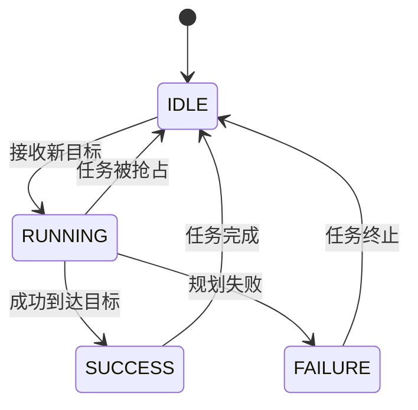
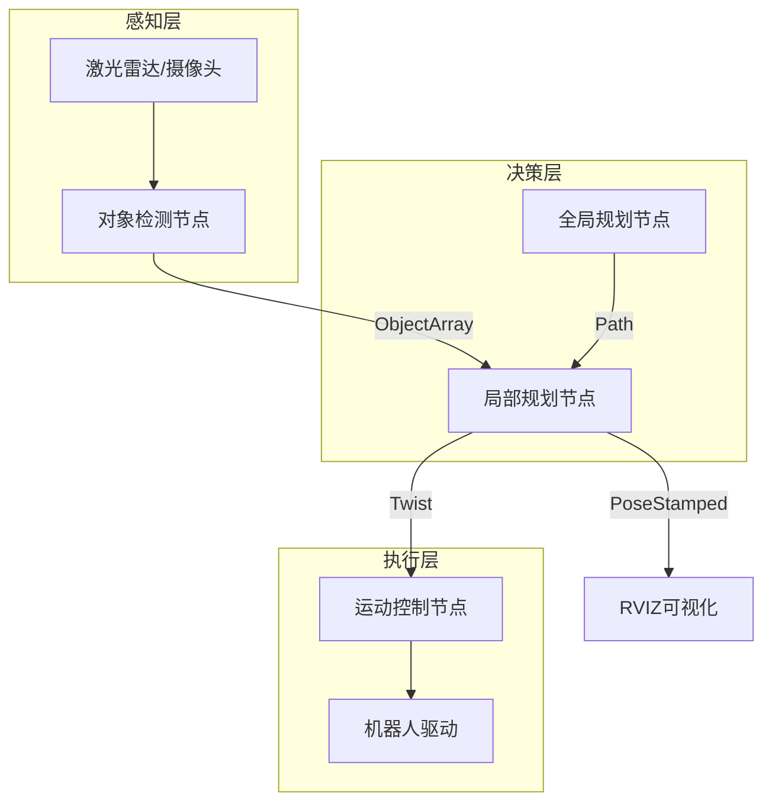
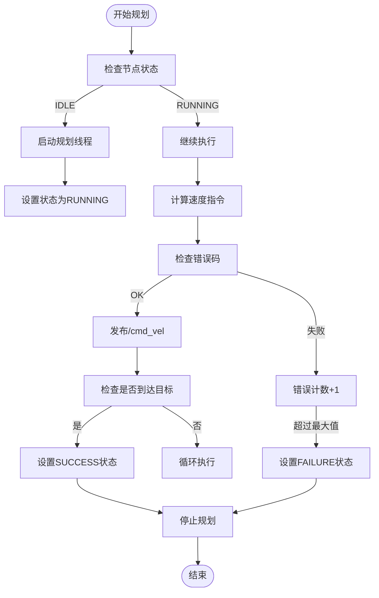

# ROS基础概念

<cite>
**本文档中引用的文件**  
- [local_planner_icra_node.py](file://AEMCARL/attachments/ros_ws/local_planner_py/scripts/local_planner_icra_node.py)
- [local_planner_icra.py](file://AEMCARL/attachments/ros_ws/local_planner_py/scripts/local_planner_icra.py)
- [CMakeLists.txt](file://AEMCARL/attachments/ros_ws/local_planner_py/CMakeLists.txt)
- [package.xml](file://AEMCARL/attachments/ros_ws/local_planner_py/package.xml)
- [helper.msg.ObjectArray](file://AEMCARL/attachments/ros_ws/helper/msg/ObjectArray.msg)
- [RLLocalPlannerv2.py](file://AEMCARL/attachments/ros_ws/local_planner_py/scripts/RLLocalPlannerv2.py)
- [README.md](file://AEMCARL/attachments/ros_ws/README.md)
</cite>

## 目录
1. [引言](#引言)
2. [ROS核心组件详解](#ros核心组件详解)
3. [ROS分布式架构与多模块协同](#ros分布式架构与多模块协同)
4. [ROS工作空间与包管理](#ros工作空间与包管理)
5. [ROS消息类型与自定义消息](#ros消息类型与自定义消息)
6. [ROS环境搭建与基本命令](#ros环境搭建与基本命令)
7. [ROS通信机制性能与最佳实践](#ros通信机制性能与最佳实践)
8. [总结](#总结)

## 引言

ROS（Robot Operating System）是一个为机器人研发提供的灵活框架，支持从简单原型到复杂系统的开发。本项目基于ROS Melodic版本构建，重点实现局部路径规划、动态障碍物感知与自主导航功能。通过分析项目中的实际代码结构与通信机制，本文将系统性地介绍ROS的核心概念，帮助初学者理解其在实际项目中的应用方式。

本项目中的ROS系统主要包含局部规划器、对象感知、TF坐标变换等多个模块，通过话题、服务、动作服务器等机制实现模块间通信。项目采用Python与C++混合编程，体现了ROS在多语言集成方面的优势。

## ROS核心组件详解

ROS的核心组件包括节点（Node）、话题（Topic）、服务（Service）、参数服务器（Parameter Server）和动作（Action）。这些组件共同构成了ROS的通信基础。

### 节点（Node）

节点是ROS中执行计算的进程。在本项目中，`local_planner_node` 是一个典型的Python节点，负责接收全局路径并计算局部速度指令。该节点通过 `rospy.init_node('local_planner_node')` 初始化，表明其在ROS系统中的唯一标识。

节点通过发布/订阅机制与其他节点通信。例如，`LocalPlannerNode` 类中创建了 `/cmd_vel` 的发布者和 `/tracking/objects` 的订阅者，实现了控制指令输出和环境感知输入。

**Section sources**
- [local_planner_icra_node.py](file://AEMCARL/attachments/ros_ws/local_planner_py/scripts/local_planner_icra_node.py#L0-L36)
- [local_planner_icra.py](file://AEMCARL/attachments/ros_ws/local_planner_py/scripts/local_planner_icra.py#L0-L62)

### 话题（Topic）

话题是ROS中实现异步通信的主要方式。节点可以发布或订阅特定话题，实现数据流的传输。在本项目中，`/tracking/objects` 话题用于传输动态障碍物信息，其消息类型为自定义的 `ObjectArray`。

```mermaid
flowchart LR
A["感知节点<br/>发布对象数据"] --> |"/tracking/objects"<br/>ObjectArray| B["局部规划节点<br/>订阅对象数据"]
B --> |"发布控制指令"<br/>"/cmd_vel"<br/>Twist| C["机器人驱动节点"]
```

**Diagram sources**
- [local_planner_icra_node.py](file://AEMCARL/attachments/ros_ws/local_planner_py/scripts/local_planner_icra_node.py#L0-L36)
- [helper.msg.ObjectArray](file://AEMCARL/attachments/ros_ws/helper/msg/ObjectArray.msg)

### 服务（Service）

服务提供同步的请求-响应通信模式。虽然本项目主要使用动作服务器，但服务机制在其他ROS系统中广泛用于配置参数或触发一次性任务。例如，可通过服务动态调整规划器参数。

### 动作（Action）

动作是ROS中用于处理长时间运行任务的通信机制，支持目标、反馈和结果的完整交互。在本项目中，`LocalPlannerNode` 使用 `actionlib.SimpleActionServer` 实现了 `/local_planner_node_action` 动作服务器，用于接收路径规划请求并返回执行状态。

动作服务器的状态机包含 `IDLE`、`RUNNING`、`SUCCESS` 和 `FAILURE` 四种状态，通过 `NodeState` 枚举定义，确保了任务执行的可控性与可中断性。



**Diagram sources**
- [local_planner_icra_node.py](file://AEMCARL/attachments/ros_ws/local_planner_py/scripts/local_planner_icra_node.py#L72-L101)
- [node_state.py](file://AEMCARL/attachments/ros_ws/local_planner_py/scripts/node_state.py)

### 参数服务器（Parameter Server）

参数服务器用于存储和共享全局参数。在本项目中，`frequency`（控制频率）和 `max_error`（最大错误次数）等参数可通过参数服务器配置，实现运行时调整。

## ROS分布式架构与多模块协同

ROS的分布式架构允许不同节点运行在不同的计算设备上，通过ROS_MASTER_URI统一协调。本项目中的模块协同工作流程如下：

1. **感知模块**：通过传感器获取环境数据，发布到 `/tracking/objects` 话题
2. **规划模块**：订阅感知数据和全局路径，计算局部速度指令
3. **控制模块**：接收速度指令，驱动机器人执行运动
4. **可视化模块**：通过RVIZ等工具订阅TF和Marker话题，实现状态可视化

这种松耦合的设计使得各模块可以独立开发、测试和部署，提高了系统的可维护性和扩展性。



**Diagram sources**
- [local_planner_icra_node.py](file://AEMCARL/attachments/ros_ws/local_planner_py/scripts/local_planner_icra_node.py#L0-L36)
- [local_planner_icra.py](file://AEMCARL/attachments/ros_ws/local_planner_py/scripts/local_planner_icra.py#L0-L62)

## ROS工作空间与包管理

ROS采用工作空间（Workspace）和包（Package）的组织结构。本项目中的ROS代码位于 `AEMCARL/attachments/ros_ws` 目录下，遵循标准的Catkin工作空间结构。

### 工作空间结构

- `src/`：源代码目录，包含所有ROS包
- `build/`：编译中间文件
- `devel/`：开发环境配置
- `install/`：安装目录

### 包管理

每个功能模块封装为一个独立的包。本项目包含以下关键包：
- `local_planner_py`：局部规划器主包
- `helper`：辅助功能包，包含自定义消息
- `hunter_listener_node`：TF监听节点

每个包包含 `package.xml` 和 `CMakeLists.txt` 文件，用于声明依赖关系和编译规则。例如，`local_planner_py` 包依赖于 `rospy`、`geometry_msgs`、`nav_msgs` 等核心ROS包。

**Section sources**
- [package.xml](file://AEMCARL/attachments/ros_ws/local_planner_py/package.xml)
- [CMakeLists.txt](file://AEMCARL/attachments/ros_ws/local_planner_py/CMakeLists.txt)

## ROS消息类型与自定义消息

ROS提供了丰富的标准消息类型，并支持自定义消息定义。

### 常用标准消息

- `geometry_msgs/Twist`：用于速度控制指令
- `geometry_msgs/PoseStamped`：用于目标位姿
- `nav_msgs/Path`：用于路径规划
- `sensor_msgs/LaserScan`：用于激光数据

### 自定义消息

本项目定义了 `ObjectArray` 消息类型，用于传输动态障碍物信息。该消息位于 `helper` 包中，体现了ROS对特定应用场景的扩展能力。

在 `CMakeLists.txt` 中通过 `message_generation` 声明消息生成依赖，确保自定义消息被正确编译。

**Section sources**
- [helper.msg.ObjectArray](file://AEMCARL/attachments/ros_ws/helper/msg/ObjectArray.msg)
- [CMakeLists.txt](file://AEMCARL/attachments/ros_ws/local_planner_py/CMakeLists.txt#L0-L32)

## ROS环境搭建与基本命令

### 环境搭建步骤

1. 安装ROS Melodic
2. 创建Catkin工作空间
3. 克隆项目代码到 `src/` 目录
4. 安装依赖包（如husky、rvo_ros）
5. 编译工作空间：`catkin_make`
6. 运行启动脚本：`./autosim.sh`

### 常用ROS命令

- `roscore`：启动ROS核心服务
- `rosrun <package> <node>`：运行指定节点
- `roslaunch <package> <file.launch>`：启动多个节点
- `rostopic list`：查看活跃话题
- `rostopic echo <topic>`：查看话题数据
- `rosnode list`：查看活跃节点
- `rqt_graph`：可视化节点通信关系

## ROS通信机制性能与最佳实践

### 性能特点

- **话题通信**：低延迟、高频率，适合传感器数据流
- **服务通信**：同步阻塞，适合配置请求
- **动作通信**：支持长时间任务，具备反馈机制

### 最佳实践

1. **合理设置队列大小**：避免消息积压导致延迟
2. **使用适当频率**：本项目中规划频率为100Hz，平衡实时性与计算负载
3. **线程安全**：使用互斥锁保护共享数据，如 `LocalPlannerNode` 中的 `lock` 对象
4. **错误处理**：实现重试机制和超时控制，提高系统鲁棒性
5. **日志输出**：使用 `print` 或 `rospy.loginfo` 记录关键状态



**Diagram sources**
- [local_planner_icra_node.py](file://AEMCARL/attachments/ros_ws/local_planner_py/scripts/local_planner_icra_node.py#L114-L148)

## 总结

本文系统介绍了ROS在本项目中的实际应用，涵盖了节点、话题、服务、动作、参数服务器等核心概念。通过分析 `local_planner_py` 等关键模块，展示了ROS如何支持多模块协同工作。项目采用的分布式架构、标准化消息传递和模块化设计，为复杂机器人系统的开发提供了坚实基础。掌握这些基础概念和最佳实践，将为后续高级功能集成和系统优化提供有力支持。