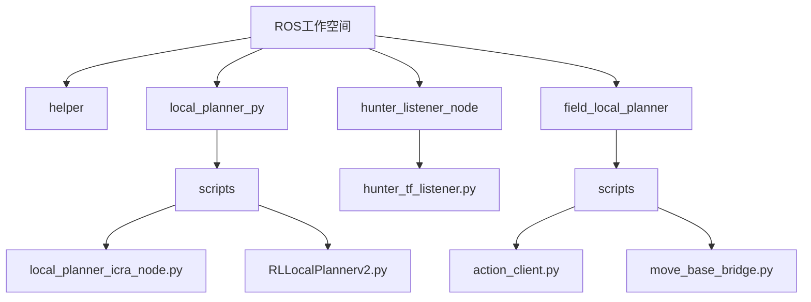
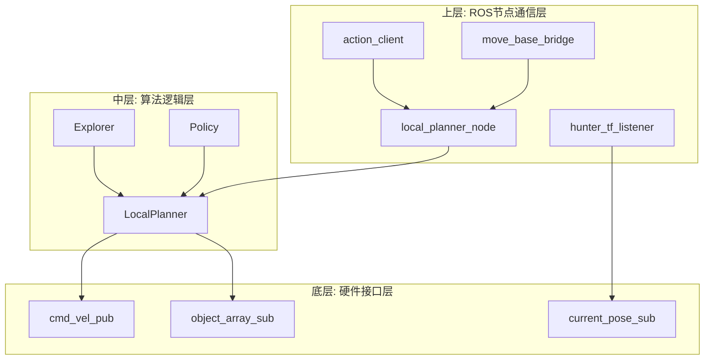
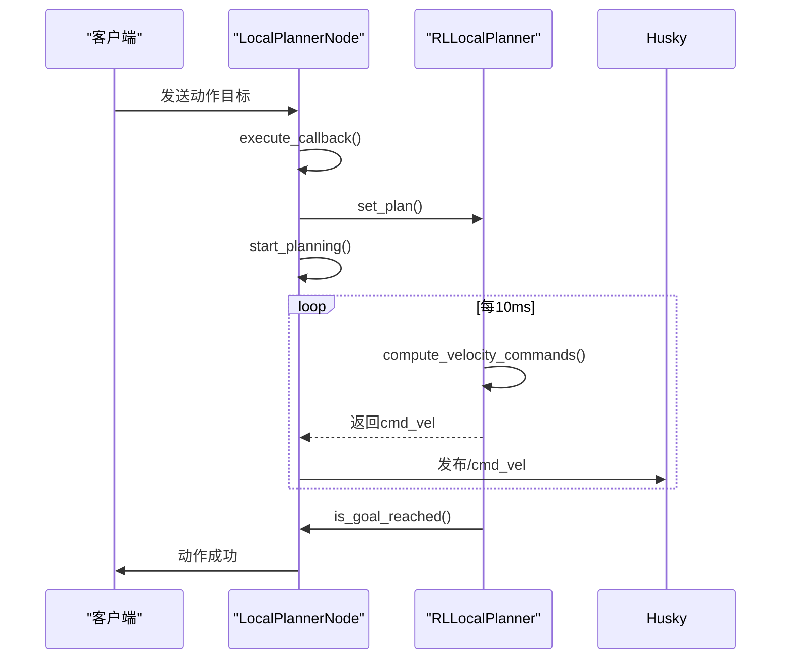
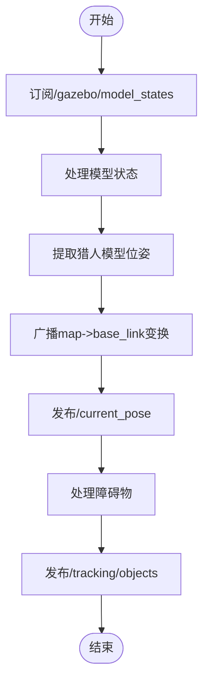
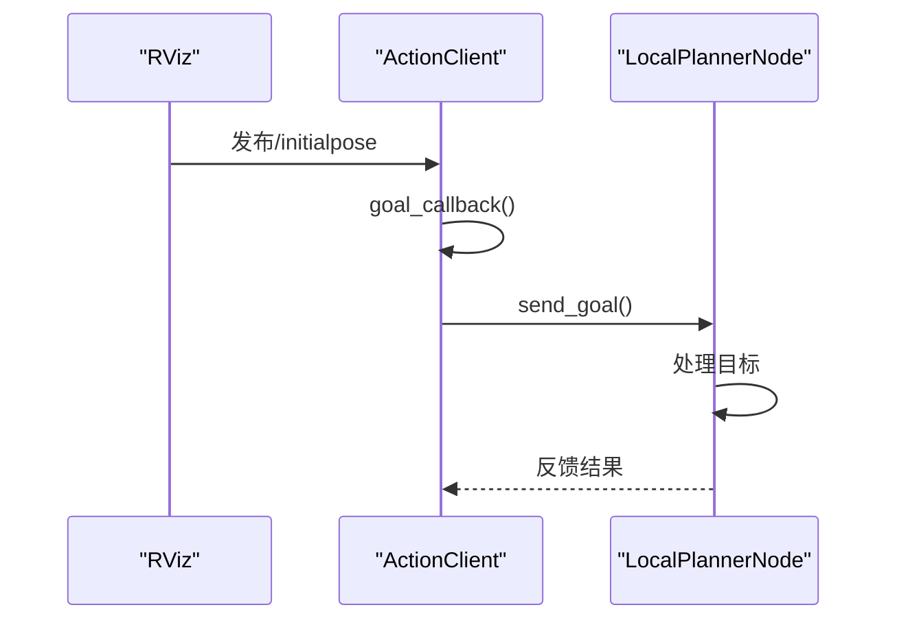
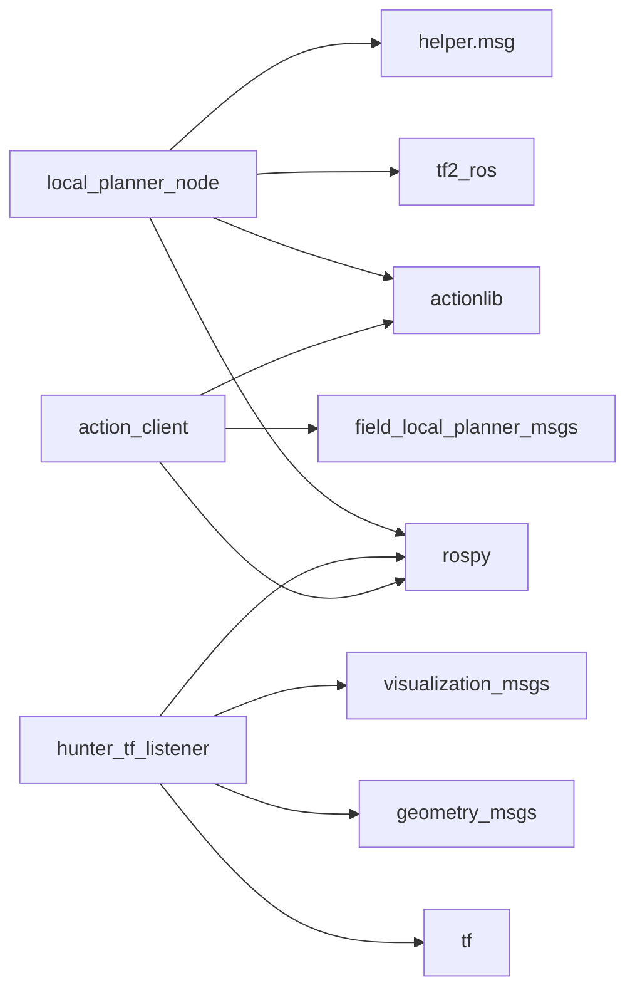

# ROS系统集成

<cite>
**本文档中引用的文件**   
- [local_planner_icra_node.py](file://AEMCARL/attachments/ros_ws/local_planner_py/scripts/local_planner_icra_node.py)
- [RLLocalPlannerv2.py](file://AEMCARL/attachments/ros_ws/local_planner_py/scripts/RLLocalPlannerv2.py)
- [local_planner_icra.py](file://AEMCARL/attachments/ros_ws/local_planner_py/scripts/local_planner_icra.py)
- [hunter_tf_listener.py](file://AEMCARL/attachments/ros_ws/hunter_listener_node/hunter_tf_listener.py)
- [br.py](file://AEMCARL/attachments/ros_ws/hunter_listener_node/br.py)
- [action_client.py](file://field_local_planner/field_local_planner_ros/scripts/action_client.py)
- [move_base_bridge.py](file://field_local_planner/field_local_planner_ros/scripts/move_base_bridge.py)
- [local_planner.launch.xml](file://field_local_planner/field_local_planner_ros/launch/local_planner.launch.xml)
</cite>

## 目录
1. [引言](#引言)
2. [项目结构](#项目结构)
3. [核心组件](#核心组件)
4. [架构概述](#架构概述)
5. [详细组件分析](#详细组件分析)
6. [依赖分析](#依赖分析)
7. [性能考虑](#性能考虑)
8. [故障排除指南](#故障排除指南)
9. [结论](#结论)

## 引言
本文档旨在深入解释本项目中ROS系统的集成方法，涵盖ROS节点的创建、消息传递机制、服务调用和参数管理等关键技术。通过具体代码实例，详细说明如何将不同的规划算法模块集成到ROS框架中，包括话题订阅与发布、动作服务器实现、tf变换处理等内容。为开发者提供从ROS基础概念到高级集成技巧的完整学习路径，并包含常见集成问题的解决方案和性能优化建议。

## 项目结构
本项目的结构主要由多个ROS工作空间组成，每个工作空间包含若干功能包。核心功能包位于`AEMCARL/attachments/ros_ws`目录下，主要包括`helper`、`hunter_listener_node`和`local_planner_py`三个功能包。此外，`field_local_planner`目录下的功能包提供了本地规划器的ROS接口实现。

**图示来源**
- [local_planner_icra_node.py](file://AEMCARL/attachments/ros_ws/local_planner_py/scripts/local_planner_icra_node.py)
- [RLLocalPlannerv2.py](file://AEMCARL/attachments/ros_ws/local_planner_py/scripts/RLLocalPlannerv2.py)
- [hunter_tf_listener.py](file://AEMCARL/attachments/ros_ws/hunter_listener_node/hunter_tf_listener.py)
- [action_client.py](file://field_local_planner/field_local_planner_ros/scripts/action_client.py)
- [move_base_bridge.py](file://field_local_planner/field_local_planner_ros/scripts/move_base_bridge.py)

**本节来源**
- [AEMCARL/attachments/ros_ws](file://AEMCARL/attachments/ros_ws)
- [field_local_planner](file://field_local_planner)

## 核心组件

本项目的核心组件包括基于强化学习的局部规划器、TF变换监听器、动作服务器客户端以及MoveBase桥接器。这些组件共同实现了机器人导航中的关键功能，如路径规划、状态估计、目标发布和动作执行。

**本节来源**
- [local_planner_icra_node.py](file://AEMCARL/attachments/ros_ws/local_planner_py/scripts/local_planner_icra_node.py#L1-L184)
- [RLLocalPlannerv2.py](file://AEMCARL/attachments/ros_ws/local_planner_py/scripts/RLLocalPlannerv2.py#L1-L493)
- [hunter_tf_listener.py](file://AEMCARL/attachments/ros_ws/hunter_listener_node/hunter_tf_listener.py#L1-L315)

## 架构概述

本系统的整体架构采用分层设计，上层为ROS节点通信层，中层为算法逻辑层，底层为硬件接口层。各层之间通过标准ROS消息和服务进行交互，确保了系统的模块化和可扩展性。

**图示来源**
- [local_planner_icra_node.py](file://AEMCARL/attachments/ros_ws/local_planner_py/scripts/local_planner_icra_node.py#L1-L184)
- [RLLocalPlannerv2.py](file://AEMCARL/attachments/ros_ws/local_planner_py/scripts/RLLocalPlannerv2.py#L1-L493)
- [hunter_tf_listener.py](file://AEMCARL/attachments/ros_ws/hunter_listener_node/hunter_tf_listener.py#L1-L315)
- [action_client.py](file://field_local_planner/field_local_planner_ros/scripts/action_client.py#L1-L39)
- [move_base_bridge.py](file://field_local_planner/field_local_planner_ros/scripts/move_base_bridge.py#L1-L71)

## 详细组件分析

### 局部规划器节点分析
`local_planner_icra_node.py`实现了基于动作服务器的局部规划器节点，负责接收全局路径并生成速度指令。该节点使用`actionlib.SimpleActionServer`来处理外部请求，并通过多线程方式执行规划任务。

#### 对于API/服务组件:

**图示来源**
- [local_planner_icra_node.py](file://AEMCARL/attachments/ros_ws/local_planner_py/scripts/local_planner_icra_node.py#L1-L184)

**本节来源**
- [local_planner_icra_node.py](file://AEMCARL/attachments/ros_ws/local_planner_py/scripts/local_planner_icra_node.py#L1-L184)

### TF变换监听器分析
`hunter_tf_listener.py`负责监听和广播坐标变换，将Gazebo仿真环境中的模型状态转换为ROS TF树中的变换关系。该组件对于实现准确的定位和导航至关重要。

#### 对于复杂逻辑组件:

**图示来源**
- [hunter_tf_listener.py](file://AEMCARL/attachments/ros_ws/hunter_listener_node/hunter_tf_listener.py#L1-L315)

**本节来源**
- [hunter_tf_listener.py](file://AEMCARL/attachments/ros_ws/hunter_listener_node/hunter_tf_listener.py#L1-L315)

### 动作客户端分析
`action_client.py`实现了向局部规划器发送目标的动作客户端，它订阅`/initialpose`话题并将接收到的位姿转换为动作目标发送给动作服务器。

#### 对于API/服务组件:

**图示来源**
- [action_client.py](file://field_local_planner/field_local_planner_ros/scripts/action_client.py#L1-L39)

**本节来源**
- [action_client.py](file://field_local_planner/field_local_planner_ros/scripts/action_client.py#L1-L39)

## 依赖分析

本系统各组件之间的依赖关系清晰，形成了一个松耦合的架构。主要依赖包括ROS核心库、tf变换库、actionlib动作库以及自定义的消息类型。

**图示来源**
- [local_planner_icra_node.py](file://AEMCARL/attachments/ros_ws/local_planner_py/scripts/local_planner_icra_node.py#L1-L184)
- [hunter_tf_listener.py](file://AEMCARL/attachments/ros_ws/hunter_listener_node/hunter_tf_listener.py#L1-L315)
- [action_client.py](file://field_local_planner/field_local_planner_ros/scripts/action_client.py#L1-L39)

**本节来源**
- [local_planner_icra_node.py](file://AEMCARL/attachments/ros_ws/local_planner_py/scripts/local_planner_icra_node.py#L1-L184)
- [hunter_tf_listener.py](file://AEMCARL/attachments/ros_ws/hunter_listener_node/hunter_tf_listener.py#L1-L315)
- [action_client.py](file://field_local_planner/field_local_planner_ros/scripts/action_client.py#L1-L39)

## 性能考虑

在实际部署中，需要注意以下性能优化点：首先，确保规划循环的频率稳定（当前设置为100Hz），避免因计算耗时导致控制延迟；其次，合理配置TF监听器的更新频率，平衡实时性和计算开销；最后，使用适当的队列大小来缓冲消息，防止消息丢失或积压。

## 故障排除指南

常见问题及解决方案：
1. **TF变换未正确广播**：检查`br.py`脚本是否正常运行，确认静态变换已正确发布。
2. **无法接收到对象数组**：验证`/gazebo/model_states`话题是否存在且有数据发布。
3. **动作服务器无响应**：确保`local_planner_node`已正确初始化并启动了动作服务器。
4. **规划器不发布速度指令**：检查`cmd_vel`话题的发布者和订阅者连接状态。

**本节来源**
- [br.py](file://AEMCARL/attachments/ros_ws/hunter_listener_node/br.py#L1-L31)
- [hunter_tf_listener.py](file://AEMCARL/attachments/ros_ws/hunter_listener_node/hunter_tf_listener.py#L1-L315)
- [local_planner_icra_node.py](file://AEMCARL/attachments/ros_ws/local_planner_py/scripts/local_planner_icra_node.py#L1-L184)

## 结论

本文档详细介绍了ROS系统集成的关键技术和实现方法。通过分析具体的代码实例，展示了如何构建一个完整的机器人导航系统。建议开发者在实际应用中遵循模块化设计原则，充分利用ROS提供的工具和库，以提高开发效率和系统可靠性。