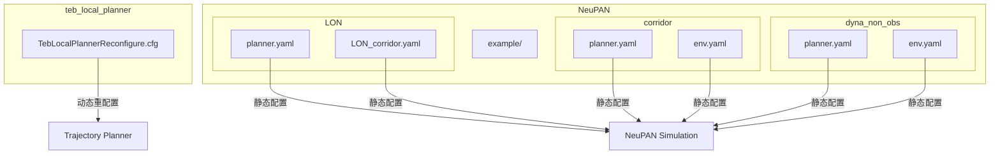
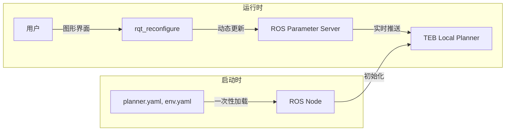
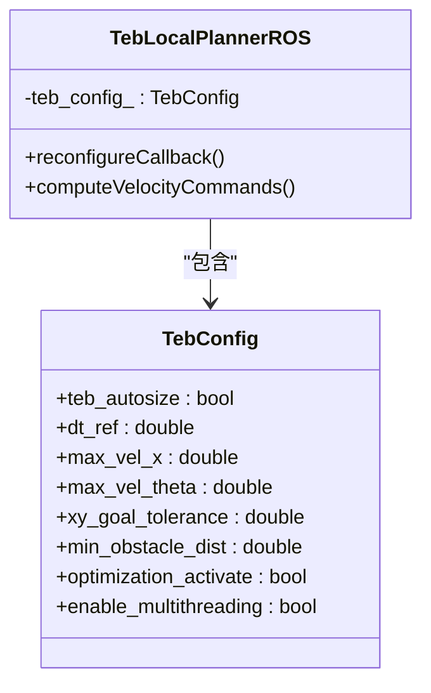
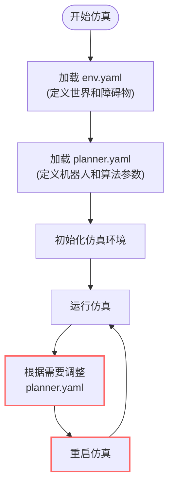
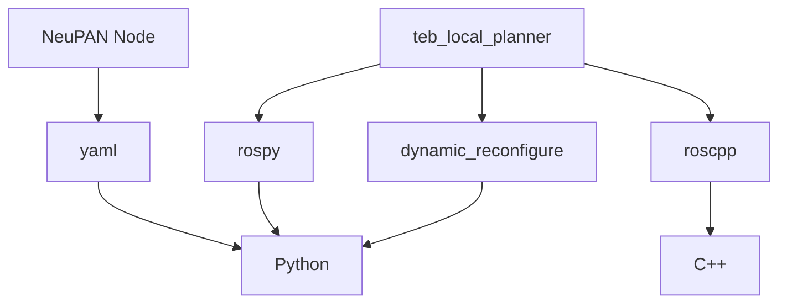

# 参数配置与管理

<cite>
**本文档中引用的文件**  
- [TebLocalPlannerReconfigure.cfg](file://teb_local_planner/cfg/TebLocalPlannerReconfigure.cfg)
- [planner.yaml](file://NeuPAN/example/LON/planner.yaml)
- [env.yaml](file://NeuPAN/example/LON/LON_corridor.yaml)
- [planner.yaml](file://NeuPAN/example/corridor/acker/planner.yaml)
- [env.yaml](file://NeuPAN/example/corridor/acker/env.yaml)
- [planner.yaml](file://NeuPAN/example/dyna_non_obs/acker/planner.yaml)
- [env.yaml](file://NeuPAN/example/dyna_non_obs/acker/env.yaml)
</cite>

## 目录
1. [引言](#引言)
2. [项目结构](#项目结构)
3. [核心组件](#核心组件)
4. [架构概述](#架构概述)
5. [详细组件分析](#详细组件分析)
6. [依赖分析](#依赖分析)
7. [性能考虑](#性能考虑)
8. [故障排除指南](#故障排除指南)
9. [结论](#结论)

## 引言
本文档详细阐述了ROS环境中参数配置与管理的核心机制，重点聚焦于动态参数重配置（dynamic_reconfigure）在局部路径规划器中的实现。通过分析`TebLocalPlannerReconfigure.cfg`配置文件，深入探讨了如何定义可调参数、其数据类型、范围和默认值。同时，文档涵盖了YAML配置文件的组织结构与最佳实践，展示了如何为不同应用场景（如走廊导航、动态避障）创建专用配置。此外，还提供了参数管理的调试技巧和版本控制策略，以确保配置的一致性和可复现性。

## 项目结构
本项目包含多个子模块，其中与参数配置直接相关的核心模块是`teb_local_planner`和`NeuPAN`。`teb_local_planner`模块通过`cfg`目录下的`TebLocalPlannerReconfigure.cfg`文件实现动态参数重配置。`NeuPAN`模块则使用`example`目录下的多个`planner.yaml`和`env.yaml`文件进行静态参数配置，这些文件为不同实验场景（如走廊、动态障碍物）提供了具体的参数集。



**图示来源**
- [TebLocalPlannerReconfigure.cfg](file://teb_local_planner/cfg/TebLocalPlannerReconfigure.cfg)
- [planner.yaml](file://NeuPAN/example/LON/planner.yaml)
- [LON_corridor.yaml](file://NeuPAN/example/LON/LON_corridor.yaml)
- [planner.yaml](file://NeuPAN/example/corridor/acker/planner.yaml)
- [env.yaml](file://NeuPAN/example/corridor/acker/env.yaml)
- [planner.yaml](file://NeuPAN/example/dyna_non_obs/acker/planner.yaml)
- [env.yaml](file://NeuPAN/example/dyna_non_obs/acker/env.yaml)

**本节来源**
- [teb_local_planner/cfg/TebLocalPlannerReconfigure.cfg](file://teb_local_planner/cfg/TebLocalPlannerReconfigure.cfg)
- [NeuPAN/example/](file://NeuPAN/example/)

## 核心组件
本项目的核心参数管理机制分为两大类：基于`dynamic_reconfigure`的动态参数调整和基于YAML文件的静态参数配置。`TebLocalPlannerReconfigure.cfg`是动态配置的核心，它定义了TEB（Timed Elastic Band）局部规划器在运行时可以实时调整的所有参数。而`NeuPAN`项目中的`planner.yaml`和`env.yaml`文件则代表了静态配置，它们在启动时加载，为特定的实验场景提供完整的参数集。

**本节来源**
- [TebLocalPlannerReconfigure.cfg](file://teb_local_planner/cfg/TebLocalPlannerReconfigure.cfg)
- [planner.yaml](file://NeuPAN/example/LON/planner.yaml)
- [env.yaml](file://NeuPAN/example/LON/LON_corridor.yaml)

## 架构概述
系统的参数管理架构结合了动态和静态两种策略。对于需要在运行时频繁调整的参数（如速度、加速度限制），采用`dynamic_reconfigure`机制，允许用户通过ROS工具（如`rqt_reconfigure`）实时修改，而无需重启节点。这极大地提高了调试效率和对环境变化的适应能力。对于定义整个实验场景的参数（如机器人模型、障碍物布局、初始路径），则使用YAML文件进行静态配置，确保实验的可复现性和配置的清晰组织。



**图示来源**
- [TebLocalPlannerReconfigure.cfg](file://teb_local_planner/cfg/TebLocalPlannerReconfigure.cfg)
- [planner.yaml](file://NeuPAN/example/LON/planner.yaml)
- [env.yaml](file://NeuPAN/example/LON/LON_corridor.yaml)

## 详细组件分析

### TebLocalPlanner 动态参数配置分析
`TebLocalPlannerReconfigure.cfg`文件是实现动态参数重配置的关键。它使用Python脚本定义了一组参数，这些参数在ROS节点启动时会自动生成一个配置服务器。

#### 参数定义与分组
该文件将参数逻辑地组织成多个标签页（tab），如“Trajectory”、“Robot”、“GoalTolerance”等。每个参数通过`add`方法定义，包含以下关键信息：
- **名称 (Name)**: 参数的唯一标识符，如`max_vel_x`。
- **类型 (Type)**: 使用`bool_t`, `double_t`, `int_t`等定义，确保类型安全。
- **描述 (Description)**: 清晰说明参数的作用和影响。
- **默认值、最小值、最大值**: 定义了参数的有效范围，例如`max_vel_x`的默认值为0.4，范围在0.01到100之间。



**图示来源**
- [TebLocalPlannerReconfigure.cfg](file://teb_local_planner/cfg/TebLocalPlannerReconfigure.cfg)

#### 动态重配置的优势
使用`dynamic_reconfigure`的主要优势在于：
1.  **实时优化**: 可以在机器人运行时，根据实际表现（如路径平滑度、避障效果）即时调整参数，例如在狭窄走廊中临时降低`max_vel_x`以提高安全性。
2.  **适应环境**: 当环境条件变化（如从空旷区域进入密集人群）时，可以动态调整`min_obstacle_dist`和`inflation_dist`来增强避障能力。
3.  **高效调试**: 开发者无需反复停止、修改配置文件、重启节点，即可快速测试不同参数组合的效果，显著缩短调试周期。

**本节来源**
- [TebLocalPlannerReconfigure.cfg](file://teb_local_planner/cfg/TebLocalPlannerReconfigure.cfg)

### NeuPAN 静态YAML配置分析
`NeuPAN`项目使用YAML文件进行配置，这些文件结构清晰，易于阅读和维护。

#### YAML配置文件结构
以`example/corridor/acker/planner.yaml`为例，其结构如下：
```yaml
# mpc: MPC控制器参数
mpc:
  receding: 10
  step_time: 0.2
  ref_speed: 4

# robot: 机器人物理参数
robot:
  kinematics: 'acker'
  max_speed: [8, 1.0]
  max_acce: [8, 0.5]
  length: 4.6
  width: 1.6
  wheelbase: 3

# ipath: 初始路径参数
ipath:
  waypoints: [[0, 20, 0], [60, 20, 0]]
  curve_style: 'dubins'
  min_radius: 3.0

# pan: 算法核心参数
pan:
  iter_num: 2
  dune_max_num: 100
  dune_checkpoint: 'example/model/acker_robot_default/model_5000.pth'
```
这种分层结构（`mpc`, `robot`, `ipath`, `pan`）使得配置项逻辑分明，便于管理和理解。

#### 为不同场景创建专用配置
项目通过为不同场景创建独立的YAML文件来实现配置的专用化：
- **走廊导航**: `example/corridor/acker/env.yaml`定义了两侧有长墙的走廊环境，`planner.yaml`则配置了适合该场景的机器人尺寸和速度。
- **动态避障**: `example/dyna_non_obs/acker/env.yaml`不仅定义了静态障碍物，还通过`behavior: {name: 'rvo'}`启用了动态障碍物的RVO（Reciprocal Velocity Obstacles）行为模型，`planner.yaml`中的参数也相应调整以应对动态环境。



**图示来源**
- [planner.yaml](file://NeuPAN/example/corridor/acker/planner.yaml)
- [env.yaml](file://NeuPAN/example/corridor/acker/env.yaml)
- [planner.yaml](file://NeuPAN/example/dyna_non_obs/acker/planner.yaml)
- [env.yaml](file://NeuPAN/example/dyna_non_obs/acker/env.yaml)

**本节来源**
- [planner.yaml](file://NeuPAN/example/corridor/acker/planner.yaml)
- [env.yaml](file://NeuPAN/example/corridor/acker/env.yaml)
- [planner.yaml](file://NeuPAN/example/dyna_non_obs/acker/planner.yaml)
- [env.yaml](file://NeuPAN/example/dyna_non_obs/acker/env.yaml)

## 依赖分析
参数配置系统依赖于ROS的核心功能。`dynamic_reconfigure`依赖于`rospy`和`dynamic_reconfigure`包，需要在`package.xml`中正确声明依赖。YAML文件的解析依赖于Python的`yaml`库。`teb_local_planner`节点在启动时会加载`TebLocalPlannerReconfigure.cfg`生成的配置服务器，并监听来自`rqt_reconfigure`等客户端的参数变更请求。



**图示来源**
- [teb_local_planner/package.xml](file://teb_local_planner/package.xml)
- [NeuPAN/neupan/neupan.py](file://NeuPAN/neupan/neupan.py)

**本节来源**
- [teb_local_planner/package.xml](file://teb_local_planner/package.xml)
- [NeuPAN/neupan/neupan.py](file://NeuPAN/neupan/neupan.py)

## 性能考虑
动态参数重配置本身引入的开销极小，因为参数变更通过ROS服务调用，仅在发生变更时才触发。然而，参数变更后，规划器内部的优化算法（如TEB的非线性优化）可能会因为新的约束条件而增加计算负担。例如，将`no_outer_iterations`设置得过高会显著增加CPU使用率。因此，在追求更高性能（如更平滑的路径）时，需要权衡计算资源的消耗。

## 故障排除指南
- **参数未生效**: 检查`rqt_reconfigure`是否连接到了正确的节点名称。确认`TebLocalPlannerReconfigure.cfg`文件已正确编译，并且`CMakeLists.txt`中包含了`dynamic_reconfigure`的生成规则。
- **YAML文件加载失败**: 检查文件路径是否正确，YAML语法是否正确（特别是缩进和冒号后的空格）。确保节点有权限读取该文件。
- **配置不一致**: 使用版本控制系统（如Git）管理YAML配置文件，为每个实验或场景创建独立的分支或标签，以确保配置的可追溯性和可复现性。

**本节来源**
- [TebLocalPlannerReconfigure.cfg](file://teb_local_planner/cfg/TebLocalPlannerReconfigure.cfg)
- [planner.yaml](file://NeuPAN/example/LON/planner.yaml)
- [env.yaml](file://NeuPAN/example/LON/LON_corridor.yaml)

## 结论
有效的参数配置与管理是机器人系统成功的关键。本项目展示了`dynamic_reconfigure`和YAML静态配置两种互补的策略。`TebLocalPlannerReconfigure.cfg`提供了强大的运行时调优能力，而`NeuPAN`的YAML文件则确保了实验配置的清晰和可复现。通过结合使用这两种方法，并遵循良好的组织和版本控制实践，可以高效地开发、调试和部署复杂的机器人导航系统。