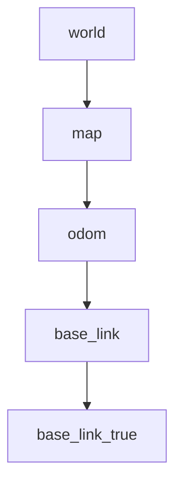
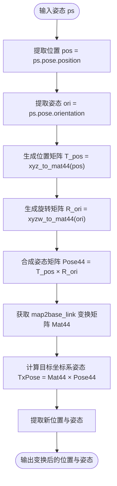

# 坐标变换系统

<cite>
**本文档中引用的文件**  
- [hunter_tf_listener.py](file://AEMCARL/attachments/ros_ws/hunter_listener_node/hunter_tf_listener.py)
- [hunter_tf_listener-v2.py](file://AEMCARL/attachments/ros_ws/hunter_listener_node/hunter_tf_listener-v2.py)
- [br.py](file://AEMCARL/attachments/ros_ws/hunter_listener_node/br.py)
</cite>

## 目录
1. [引言](#引言)
2. [项目结构与核心模块](#项目结构与核心模块)
3. [TF树的构建与维护机制](#tf树的构建与维护机制)
4. [坐标变换的实现方法](#坐标变换的实现方法)
5. [TF监听器的使用技巧](#tf监听器的使用技巧)
6. [多坐标系管理的实际应用](#多坐标系管理的实际应用)
7. [常见TF问题诊断与优化](#常见tf问题诊断与优化)
8. [结论](#结论)

## 引言

在机器人操作系统（ROS）中，坐标变换系统（tf）是实现多坐标系管理的核心机制。本项目通过`hunter_tf_listener.py`等关键脚本，实现了机器人本体、传感器、地图等不同坐标系之间的精确变换。本文将深入解析该系统的实现原理，涵盖tf树的构建、静态与动态变换的发布策略、监听器的使用技巧以及性能优化建议，确保实时导航系统的稳定性与可靠性。

## 项目结构与核心模块

本项目的坐标变换功能主要集中在`AEMCARL/attachments/ros_ws/hunter_listener_node`目录下，包含多个关键Python脚本：

- `hunter_tf_listener.py`：主监听节点，负责处理来自Gazebo仿真环境的模型状态，并发布必要的tf变换。
- `hunter_tf_listener-v2.py`：简化版本的tf监听器，用于获取`map`到`base_link`的变换。
- `br.py`：静态tf广播器，用于建立`world`到`odom`的固定坐标关系。

这些模块共同构成了一个完整的坐标变换系统，支持机器人在复杂环境中的定位与导航。

**Section sources**
- [hunter_tf_listener.py](file://AEMCARL/attachments/ros_ws/hunter_listener_node/hunter_tf_listener.py#L1-L315)
- [hunter_tf_listener-v2.py](file://AEMCARL/attachments/ros_ws/hunter_listener_node/hunter_tf_listener-v2.py#L1-L35)
- [br.py](file://AEMCARL/attachments/ros_ws/hunter_listener_node/br.py#L1-L32)

## TF树的构建与维护机制

tf树是ROS中用于表示多个坐标系之间关系的有向无环图（DAG）。在本项目中，tf树的构建通过以下方式完成：

1. **静态变换发布**：`br.py`脚本使用`tf2_ros.StaticTransformBroadcaster`发布`world`到`odom`的静态变换。该变换在整个运行期间保持不变，适用于固定安装的传感器或已知的机械结构。

2. **动态变换发布**：`hunter_tf_listener.py`中的`TransformListenerFunc`函数通过`tf.TransformListener`持续监听`base_link`到`odom`的变换，并结合`map2base_link_ts`信息，动态计算并发布`map`到`odom`的变换。

3. **真值坐标发布**：`ModelMsgCb`回调函数接收来自`/ground_truth/state`的话题数据，提取`base_link_true`的位置信息，并通过`tf2_ros.TransformBroadcaster`发布`map`到`base_link_true`的变换，用于仿真环境中的真值参考。

**Diagram sources**
- [br.py](file://AEMCARL/attachments/ros_ws/hunter_listener_node/br.py#L13-L31)
- [hunter_tf_listener.py](file://AEMCARL/attachments/ros_ws/hunter_listener_node/hunter_tf_listener.py#L54-L150)

## 坐标变换的实现方法

本项目通过矩阵运算实现坐标变换，核心函数包括：

- `xyz_to_mat44(pos)`：将三维位置转换为4x4齐次变换矩阵。
- `xyzw_to_mat44(ori)`：将四元数表示的姿态转换为4x4旋转矩阵。
- `TransPose(ps)`：结合`map2base_link_ts`的变换，将输入姿态从`base_link`坐标系转换到`map`坐标系。

该方法利用`numpy.dot`进行矩阵乘法，确保了变换的数学正确性与计算效率。

**Diagram sources**
- [hunter_tf_listener.py](file://AEMCARL/attachments/ros_ws/hunter_listener_node/hunter_tf_listener.py#L29-L47)

## TF监听器的使用技巧

### 坐标变换插值

`tf.TransformListener`支持时间戳查询，允许在历史数据中进行插值。例如，`lookupTransform('base_link', 'odom', rospy.Time(0))`会返回最近可用的变换，ROS自动处理时间同步与插值。

### 超时处理与异常恢复

在`TransformListenerFunc`中，使用了`try-except`机制捕获`tf.LookupException`、`tf.ConnectivityException`和`tf.ExtrapolationException`，避免因短暂的tf树不完整而导致程序崩溃。遇到异常时，程序继续循环，等待下一周期的更新。

### 多线程处理

通过`thread.start_new_thread`启动独立线程运行`TransformListenerFunc`，确保tf监听与主程序逻辑解耦，提高系统响应性与稳定性。

**Section sources**
- [hunter_tf_listener.py](file://AEMCARL/attachments/ros_ws/hunter_listener_node/hunter_tf_listener.py#L54-L150)

## 多坐标系管理的实际应用

在`DealObstacleModel`函数中，系统处理12个动态障碍物（agent1-agent12）的状态信息，将其从`world`坐标系发布为可视化标记（MarkerArray）和障碍物对象（ObjectArray）。同时，计算每个障碍物相对于机器人本体的距离，并在RViz中显示，辅助路径规划与避障决策。

此外，系统通过`/current_pose`话题发布机器人在`map`坐标系下的当前位姿，供导航堆栈使用。

**Section sources**
- [hunter_tf_listener.py](file://AEMCARL/attachments/ros_ws/hunter_listener_node/hunter_tf_listener.py#L152-L280)

## 常见TF问题诊断与优化

### 循环依赖检测

ROS tf系统自动检测坐标系间的循环依赖。若出现此类问题，可通过`rosrun tf view_frames`生成tf树PDF，检查是否存在闭环。

### 时间戳不匹配

确保所有传感器数据与tf变换使用相同的时间源。在仿真中，通常使用`/clock`话题同步时间。若出现`ExtrapolationException`，可适当增加`tf.Buffer`的缓存时间。

### 性能优化建议

1. **减少不必要的广播**：仅在坐标变化时发布tf，避免固定坐标系的重复广播。
2. **使用静态变换**：对于不变的坐标关系（如传感器安装位置），使用`StaticTransformBroadcaster`。
3. **合理设置发布频率**：根据应用需求调整tf发布频率，避免过高频率造成网络负担。
4. **优化矩阵运算**：复用变换矩阵，减少重复计算。

**Section sources**
- [hunter_tf_listener.py](file://AEMCARL/attachments/ros_ws/hunter_listener_node/hunter_tf_listener.py#L54-L150)
- [br.py](file://AEMCARL/attachments/ros_ws/hunter_listener_node/br.py#L13-L31)

## 结论

本项目通过`hunter_tf_listener.py`等模块，实现了完整的ROS坐标变换系统。系统支持静态与动态变换的混合发布，具备良好的异常处理与多线程能力。通过合理的tf树设计与性能优化，确保了机器人在复杂环境中的稳定导航。未来可进一步集成更多传感器坐标系，并优化实时性以适应高速运动场景。