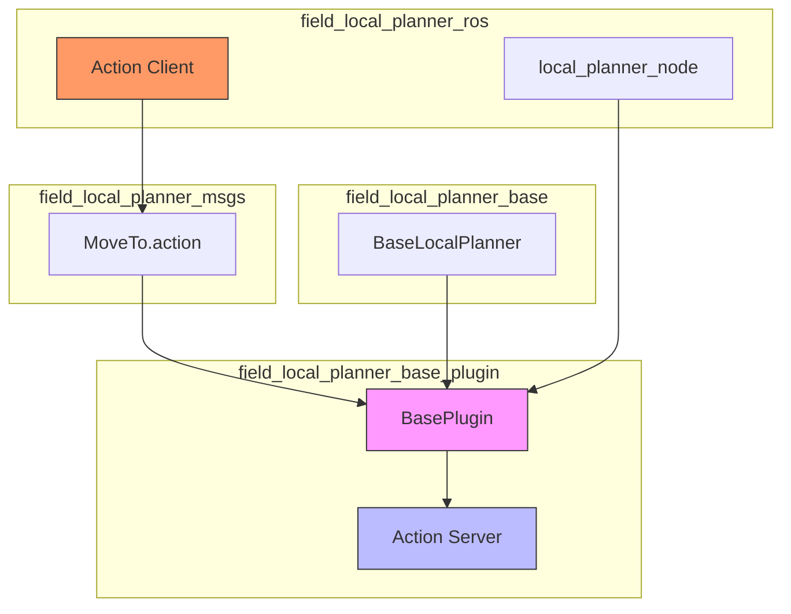
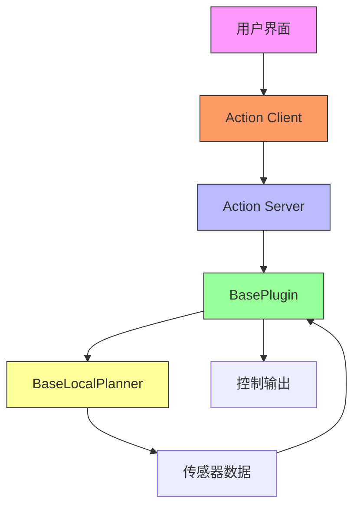
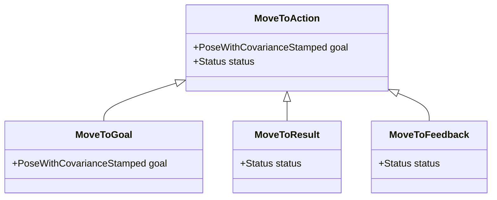
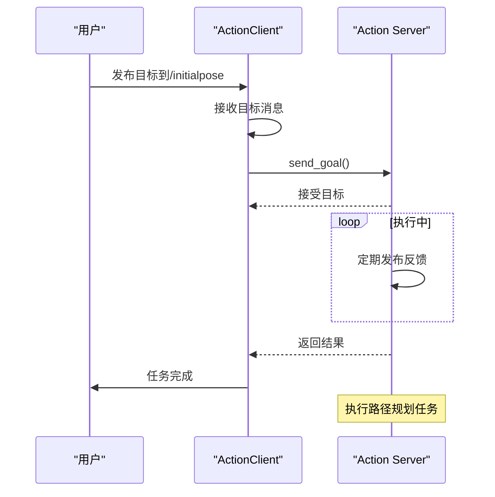
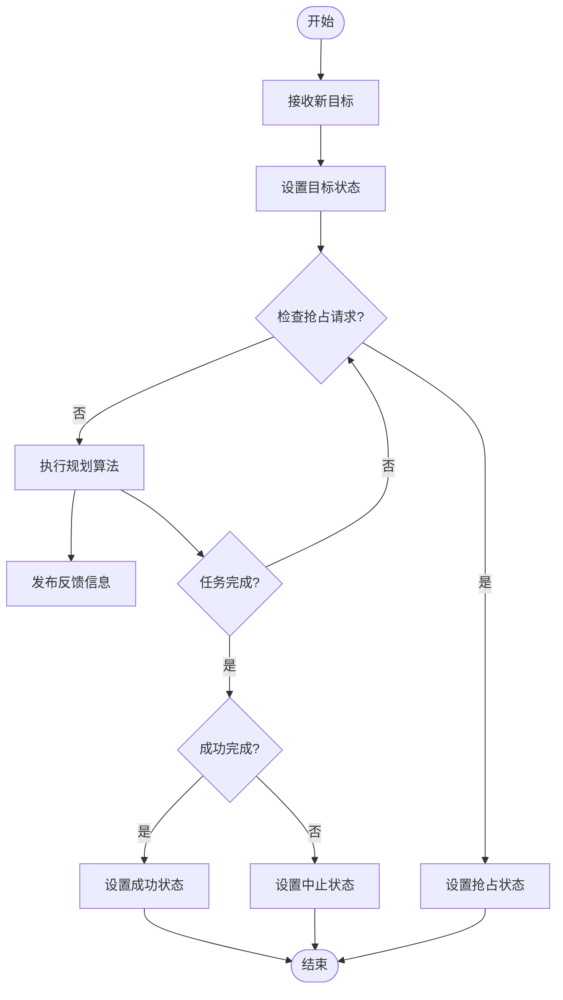
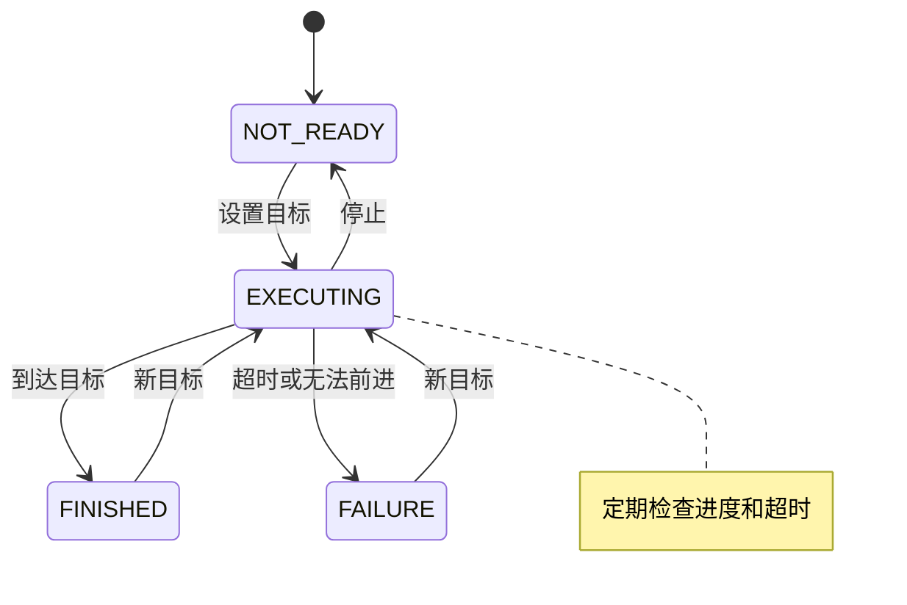
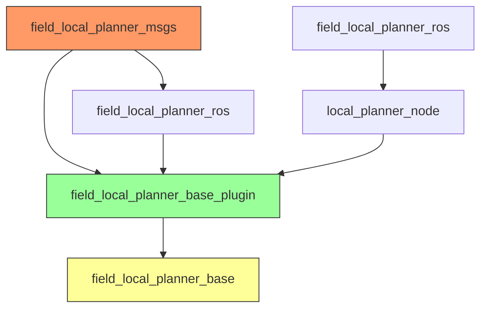

# 动作通信

<cite>
**本文档中引用的文件**
- [action_client.py](file://field_local_planner/field_local_planner_ros/scripts/action_client.py)
- [base_plugin.hpp](file://field_local_planner/field_local_planner_base/field_local_planner_base_plugin/include/field_local_planner_base_plugin/base_plugin.hpp)
- [base_plugin.cpp](file://field_local_planner/field_local_planner_base/field_local_planner_base_plugin/src/field_local_planner_base_plugin/base_plugin.cpp)
- [base_local_planner.hpp](file://field_local_planner/field_local_planner_base/field_local_planner_base/include/field_local_planner_base/base_local_planner.hpp)
- [base_local_planner.cpp](file://field_local_planner/field_local_planner_base/field_local_planner_base/src/field_local_planner_base/base_local_planner.cpp)
- [MoveTo.action](file://field_local_planner/field_local_planner_msgs/action/MoveTo.action)
- [local_planner_node.cpp](file://field_local_planner/field_local_planner_ros/src/local_planner_node.cpp)
</cite>

## 目录
1. [引言](#引言)
2. [项目结构](#项目结构)
3. [核心组件](#核心组件)
4. [架构概述](#架构概述)
5. [详细组件分析](#详细组件分析)
6. [依赖分析](#依赖分析)
7. [性能考虑](#性能考虑)
8. [故障排除指南](#故障排除指南)
9. [结论](#结论)

## 引言
本文档详细阐述了ROS中动作通信机制在路径规划任务中的应用，重点分析了长时间运行操作的管理方式。通过`field_local_planner`项目中的具体实现，展示了如何使用动作（Action）机制实现目标导航等典型应用场景。文档涵盖了动作客户端与服务端的交互流程、状态机管理、抢占机制和错误恢复策略，并结合实际代码示例说明带反馈的路径跟踪任务实现方法。

## 项目结构
`field_local_planner`项目采用模块化设计，将功能划分为多个独立但相互协作的包。核心功能分布在`field_local_planner_base`中，而ROS接口和插件系统则分别位于`field_local_planner_base_plugin`和具体规划器插件中。动作通信接口通过`field_local_planner_msgs`包定义，并在`field_local_planner_ros`中实现客户端和服务端。

**图示来源**
- [base_plugin.hpp](file://field_local_planner/field_local_planner_base/field_local_planner_base_plugin/include/field_local_planner_base_plugin/base_plugin.hpp#L0-L188)
- [MoveTo.action](file://field_local_planner/field_local_planner_msgs/action/MoveTo.action#L0-L11)

**本节来源**
- [field_local_planner](file://field_local_planner)

## 核心组件
本项目的核心组件包括动作定义、客户端实现、服务端插件和基础规划器。`MoveTo.action`文件定义了动作的接口规范，包含目标、结果和反馈三个部分。`ActionClient`类实现了动作客户端，负责接收目标并发送到动作服务器。`BasePlugin`作为服务端插件，封装了动作服务器的逻辑处理。`BaseLocalPlanner`提供了路径规划的基础功能和状态管理。

**本节来源**
- [MoveTo.action](file://field_local_planner/field_local_planner_msgs/action/MoveTo.action#L0-L11)
- [action_client.py](file://field_local_planner/field_local_planner_ros/scripts/action_client.py#L0-L39)
- [base_plugin.hpp](file://field_local_planner/field_local_planner_base/field_local_planner_base_plugin/include/field_local_planner_base_plugin/base_plugin.hpp#L0-L188)

## 架构概述
系统采用分层架构设计，最底层是`BaseLocalPlanner`提供的路径规划算法，中间层是`BasePlugin`提供的ROS接口封装，最上层是具体的动作客户端和服务端实现。这种设计实现了算法与接口的解耦，便于不同规划算法的插件化替换。

**图示来源**
- [base_plugin.hpp](file://field_local_planner/field_local_planner_base/field_local_planner_base_plugin/include/field_local_planner_base_plugin/base_plugin.hpp#L0-L188)
- [base_local_planner.hpp](file://field_local_planner/field_local_planner_base/field_local_planner_base/include/field_local_planner_base/base_local_planner.hpp#L0-L187)

## 详细组件分析

### 动作定义分析
`MoveTo.action`文件定义了路径规划动作的接口，包含目标、结果和反馈三部分。目标部分包含一个`PoseWithCovarianceStamped`类型的`goal`字段，用于指定导航目标。结果和反馈部分都包含`Status`消息，提供任务执行状态信息。

**图示来源**
- [MoveTo.action](file://field_local_planner/field_local_planner_msgs/action/MoveTo.action#L0-L11)

**本节来源**
- [MoveTo.action](file://field_local_planner/field_local_planner_msgs/action/MoveTo.action#L0-L11)

### 客户端实现分析
`ActionClient`类实现了动作客户端功能，通过订阅`/initialpose`话题接收目标，并将其转换为动作目标发送到动作服务器。客户端使用`actionlib.SimpleActionClient`与服务器建立连接，并在初始化时等待服务器就绪。

**图示来源**
- [action_client.py](file://field_local_planner/field_local_planner_ros/scripts/action_client.py#L0-L39)

**本节来源**
- [action_client.py](file://field_local_planner/field_local_planner_ros/scripts/action_client.py#L0-L39)

### 服务端实现分析
`BasePlugin`类实现了动作服务器，使用`actionlib::SimpleActionServer`处理客户端请求。当收到新目标时，服务器调用`executeActionCB`回调函数，启动规划任务并进入执行循环，直到任务完成或被抢占。

**图示来源**
- [base_plugin.cpp](file://field_local_planner/field_local_planner_base/field_local_planner_base_plugin/src/field_local_planner_base_plugin/base_plugin.cpp#L292-L329)

**本节来源**
- [base_plugin.hpp](file://field_local_planner/field_local_planner_base/field_local_planner_base_plugin/include/field_local_planner_base_plugin/base_plugin.hpp#L69-L93)
- [base_plugin.cpp](file://field_local_planner/field_local_planner_base/field_local_planner_base_plugin/src/field_local_planner_base_plugin/base_plugin.cpp#L292-L329)

### 状态机分析
`BaseLocalPlanner`类定义了路径规划的状态机，包含四种状态：NOT_READY（未就绪）、FINISHED（已完成）、EXECUTING（执行中）和FAILURE（失败）。状态机根据规划进度和超时条件在不同状态间转换。

**图示来源**
- [base_local_planner.hpp](file://field_local_planner/field_local_planner_base/field_local_planner_base/include/field_local_planner_base/base_local_planner.hpp#L42-L185)

**本节来源**
- [base_local_planner.hpp](file://field_local_planner/field_local_planner_base/field_local_planner_base/include/field_local_planner_base/base_local_planner.hpp#L42-L185)

## 依赖分析
项目各组件之间存在明确的依赖关系。`field_local_planner_ros`依赖于`field_local_planner_base_plugin`提供的插件接口，而`field_local_planner_base_plugin`又依赖于`field_local_planner_base`的核心规划功能。消息定义独立于具体实现，被客户端和服务端共同依赖。

**图示来源**
- [CMakeLists.txt](file://field_local_planner/field_local_planner_ros/CMakeLists.txt#L45-L84)
- [local_planner_node.cpp](file://field_local_planner/field_local_planner_ros/src/local_planner_node.cpp#L28-L49)

**本节来源**
- [field_local_planner_msgs](file://field_local_planner/field_local_planner_msgs)
- [field_local_planner_base_plugin](file://field_local_planner/field_local_planner_base/field_local_planner_base_plugin)
- [field_local_planner_ros](file://field_local_planner/field_local_planner_ros)

## 性能考虑
系统性能主要受规划算法复杂度和控制频率影响。`BaseLocalPlanner`中的`control_rate`参数（默认10.0Hz）决定了规划循环的执行频率。长时间运行任务需要考虑内存管理和计算资源分配，避免在执行过程中出现性能下降。

## 故障排除指南
常见问题包括动作服务器未就绪、目标帧无效和规划失败。当出现"Action preempted"日志时，表示任务被外部请求中断。如果状态持续为EXECUTING但无进展，可能是环境障碍物导致规划失败。可通过检查`/field_local_planner/status`话题获取详细状态信息。

**本节来源**
- [base_plugin.cpp](file://field_local_planner/field_local_planner_base/field_local_planner_base_plugin/src/field_local_planner_base_plugin/base_plugin.cpp#L292-L329)
- [base_local_planner.hpp](file://field_local_planner/field_local_planner_base/field_local_planner_base/include/field_local_planner_base/base_local_planner.hpp#L42-L185)

## 结论
本文档详细分析了`field_local_planner`项目中基于ROS动作的路径规划实现。通过动作通信机制，系统能够有效管理长时间运行的导航任务，提供目标发送、实时反馈和结果返回的完整流程。模块化设计使得不同规划算法可以作为插件集成，提高了系统的灵活性和可扩展性。抢占机制和错误恢复策略确保了系统在复杂环境中的可靠运行。