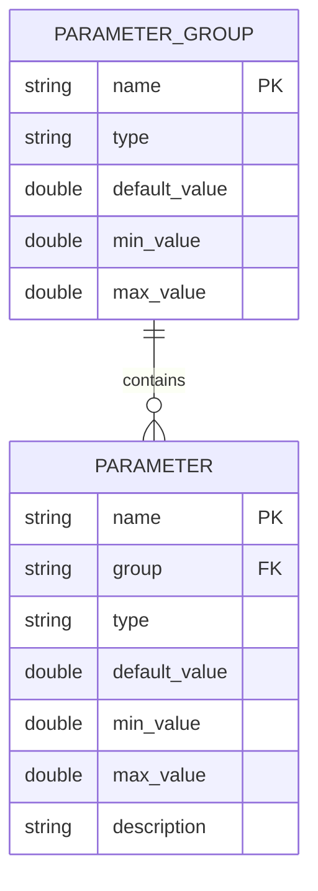
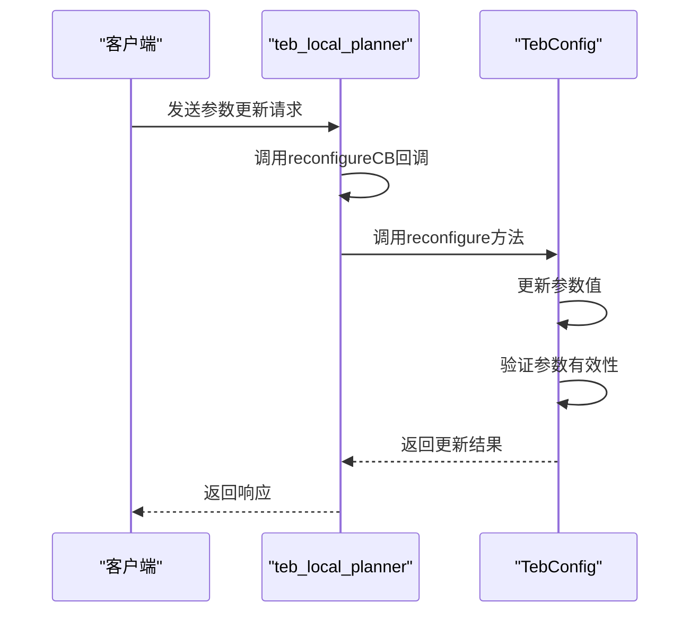
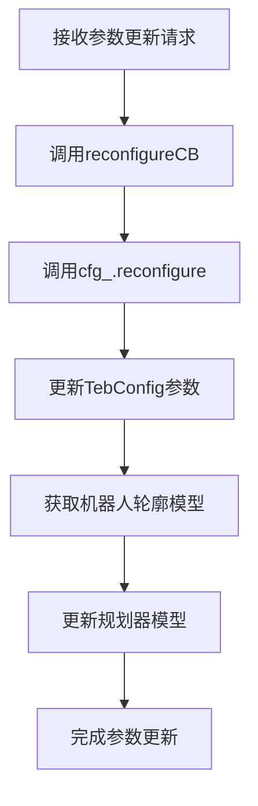

# 服务通信

<cite>
**本文档引用的文件**  
- [TebLocalPlannerReconfigure.cfg](file://teb_local_planner/cfg/TebLocalPlannerReconfigure.cfg)
- [teb_local_planner_ros.cpp](file://teb_local_planner/src/teb_local_planner_ros.cpp)
- [teb_config.cpp](file://teb_local_planner/src/teb_config.cpp)
- [teb_config.h](file://teb_local_planner/include/teb_local_planner/teb_config.h)
</cite>

## 目录
1. [引言](#引言)
2. [ROS服务通信机制概述](#ros服务通信机制概述)
3. [动态参数配置服务实现](#动态参数配置服务实现)
4. [teb_local_planner参数重配置分析](#teb_local_planner参数重配置分析)
5. [服务端与客户端编程模式](#服务端与客户端编程模式)
6. [数据序列化与错误处理](#数据序列化与错误处理)
7. [服务通信性能与最佳实践](#服务通信性能与最佳实践)
8. [结论](#结论)

## 引言

ROS（Robot Operating System）中的服务通信是一种同步的请求-响应模式，广泛应用于机器人系统中的参数配置、状态查询和控制指令发送等场景。本文重点分析在路径规划系统中，特别是teb_local_planner中，如何通过动态参数配置服务（如reconfigure）实现规划器参数的实时调整。通过深入研究服务端和客户端的编程模式、数据序列化过程和错误处理策略，为开发者提供高效使用服务通信机制的指导。

## ROS服务通信机制概述

ROS服务通信采用同步的请求-响应模式，客户端发送请求后会阻塞等待服务端的响应。这种模式适用于需要立即获取结果的操作，如参数查询或状态检查。服务定义由.srv文件描述，包含请求和响应的数据结构。服务通信的同步特性确保了操作的原子性，但可能影响系统的实时性，特别是在高频率调用时。

## 动态参数配置服务实现

动态参数配置服务允许在运行时调整节点的参数，而无需重启节点。ROS的dynamic_reconfigure包提供了这一功能，通过生成配置服务器和客户端，实现参数的实时修改。配置服务器监听参数变化请求，更新内部参数，并触发相应的回调函数。这种机制在路径规划等需要根据环境变化调整行为的系统中尤为重要。

## teb_local_planner参数重配置分析

teb_local_planner通过dynamic_reconfigure实现了丰富的参数动态调整功能，允许在运行时优化路径规划性能。

### 参数配置文件分析

teb_local_planner的参数配置定义在`TebLocalPlannerReconfigure.cfg`文件中，该文件使用Python语法定义了多个参数组，包括轨迹、机器人、目标容差、障碍物、优化和恢复等。每个参数都指定了类型、默认值和取值范围，确保参数调整的安全性。



**图源**
- [TebLocalPlannerReconfigure.cfg](file://teb_local_planner/cfg/TebLocalPlannerReconfigure.cfg)

### 服务端实现机制

teb_local_planner的服务端实现主要在`teb_local_planner_ros.cpp`中，通过`reconfigureCB`回调函数处理参数更新请求。该函数接收`TebLocalPlannerReconfigureConfig`类型的配置对象，调用`cfg_.reconfigure(config)`方法更新内部参数。



**图源**
- [teb_local_planner_ros.cpp](file://teb_local_planner/src/teb_local_planner_ros.cpp#L76-L90)
- [teb_config.cpp](file://teb_local_planner/src/teb_config.cpp#L184-L210)

### 参数更新流程

参数更新流程涉及多个组件的协同工作。首先，`TebConfig::reconfigure`方法更新内部参数结构，然后通过`getRobotFootprintFromParamServer`获取更新后的机器人轮廓模型，最后调用`planner_->updateRobotModel`通知规划器使用新的模型。



**图源**
- [teb_local_planner_ros.cpp](file://teb_local_planner/src/teb_local_planner_ros.cpp#L76-L90)
- [teb_config.cpp](file://teb_local_planner/src/teb_config.cpp#L184-L210)

## 服务端与客户端编程模式

### 服务端编程模式

服务端需要注册服务并实现处理函数。在teb_local_planner中，通过`dynamic_reconfigure::Server`创建配置服务器，并绑定`reconfigureCB`作为回调函数。服务端还需要处理参数验证和错误报告，确保系统稳定性。

```cpp
[SPEC SYMBOL](file://teb_local_planner/src/teb_local_planner_ros.cpp#L76-L90)
```

### 客户端编程模式

客户端通过`dynamic_reconfigure::Client`连接到配置服务器，发送参数更新请求。客户端需要处理响应结果，根据返回状态决定后续操作。在调试和优化过程中，rqt_reconfigure工具提供了图形化界面，简化了参数调整过程。

## 数据序列化与错误处理

### 数据序列化过程

ROS服务通信使用Google Protocol Buffers进行数据序列化，将参数配置对象转换为字节流在网络中传输。`TebLocalPlannerReconfigureConfig`结构体包含了所有可配置参数，序列化过程自动处理数据类型转换和内存对齐。

### 错误处理策略

teb_local_planner实现了多层次的错误处理机制。在参数更新时，`checkParameters`方法验证参数的有效性，对不合理值发出警告。`checkDeprecated`方法检测已弃用的参数，提供迁移指导。此外，系统还实现了振荡恢复和发散检测等高级恢复策略。

```cpp
[SPEC SYMBOL](file://teb_local_planner/src/teb_config.cpp#L397-L434)
```

## 服务通信性能与最佳实践

### 适用场景

服务通信适用于低频、需要立即响应的操作，如：
- 参数配置更新
- 系统状态查询
- 单次任务请求

### 性能限制

- 同步阻塞可能影响实时性
- 高频调用增加网络负载
- 序列化开销影响性能

### 最佳实践

1. **合理设计参数结构**：将相关参数分组，减少服务调用次数
2. **实现参数验证**：确保输入参数在合理范围内
3. **提供默认值**：保证系统在未配置时的可用性
4. **记录参数变更**：便于调试和问题追踪
5. **考虑异步替代方案**：对于高频更新，考虑使用话题通信

## 结论

teb_local_planner通过dynamic_reconfigure实现了强大的动态参数配置功能，展示了ROS服务通信在机器人系统中的典型应用。理解服务端和客户端的编程模式、数据序列化过程和错误处理策略，对于开发高效可靠的机器人软件至关重要。在实际应用中，应根据具体需求权衡同步服务通信的优缺点，选择最适合的通信机制。

**文档来源**
- [TebLocalPlannerReconfigure.cfg](file://teb_local_planner/cfg/TebLocalPlannerReconfigure.cfg)
- [teb_local_planner_ros.cpp](file://teb_local_planner/src/teb_local_planner_ros.cpp)
- [teb_config.cpp](file://teb_local_planner/src/teb_config.cpp)
- [teb_config.h](file://teb_local_planner/include/teb_local_planner/teb_config.h)