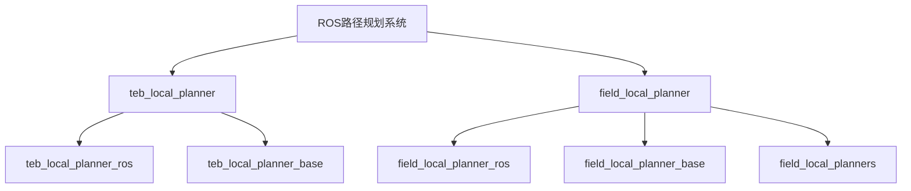
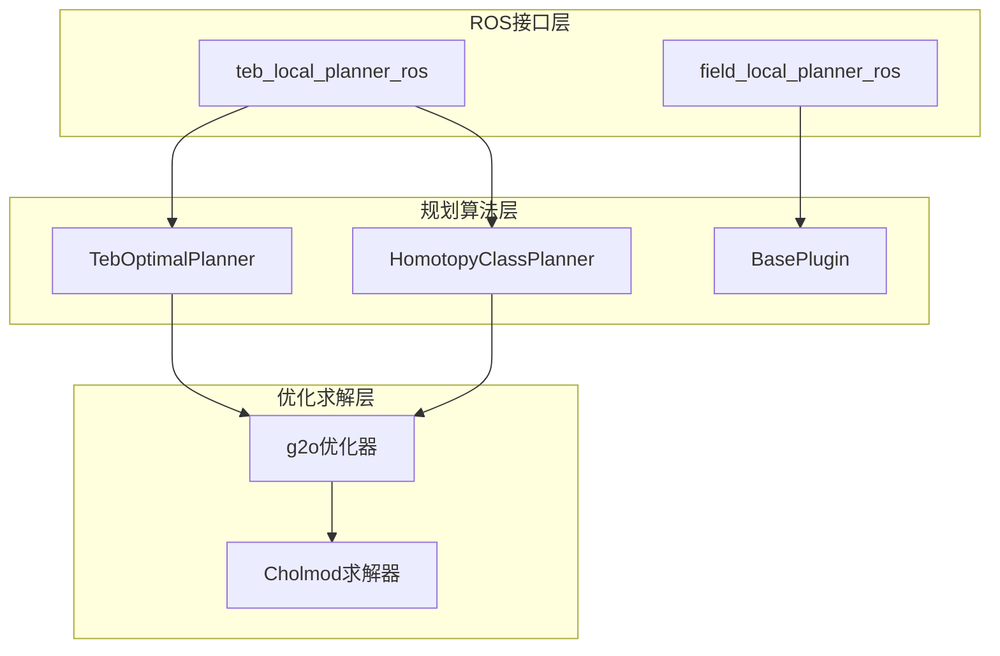
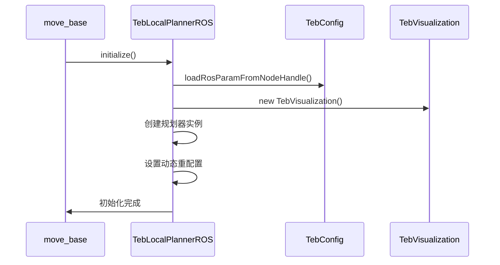
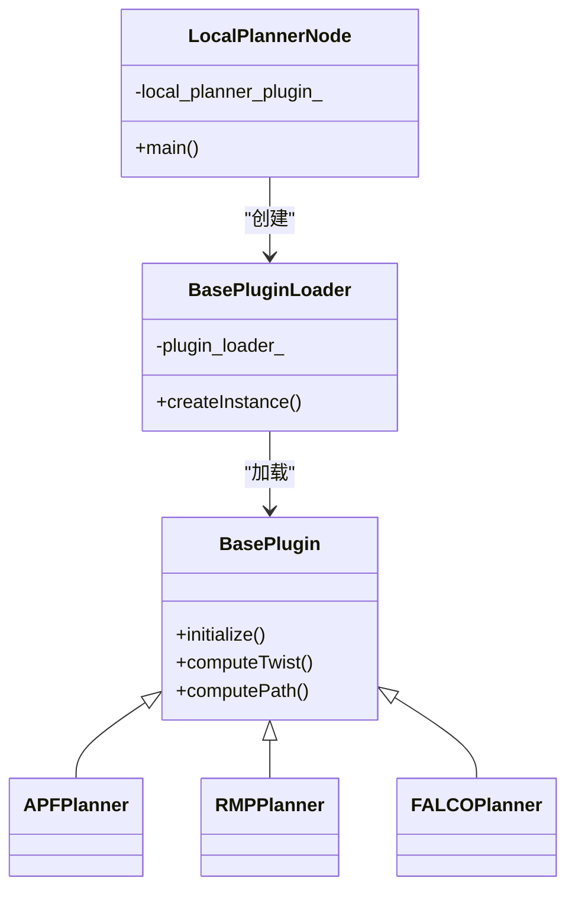
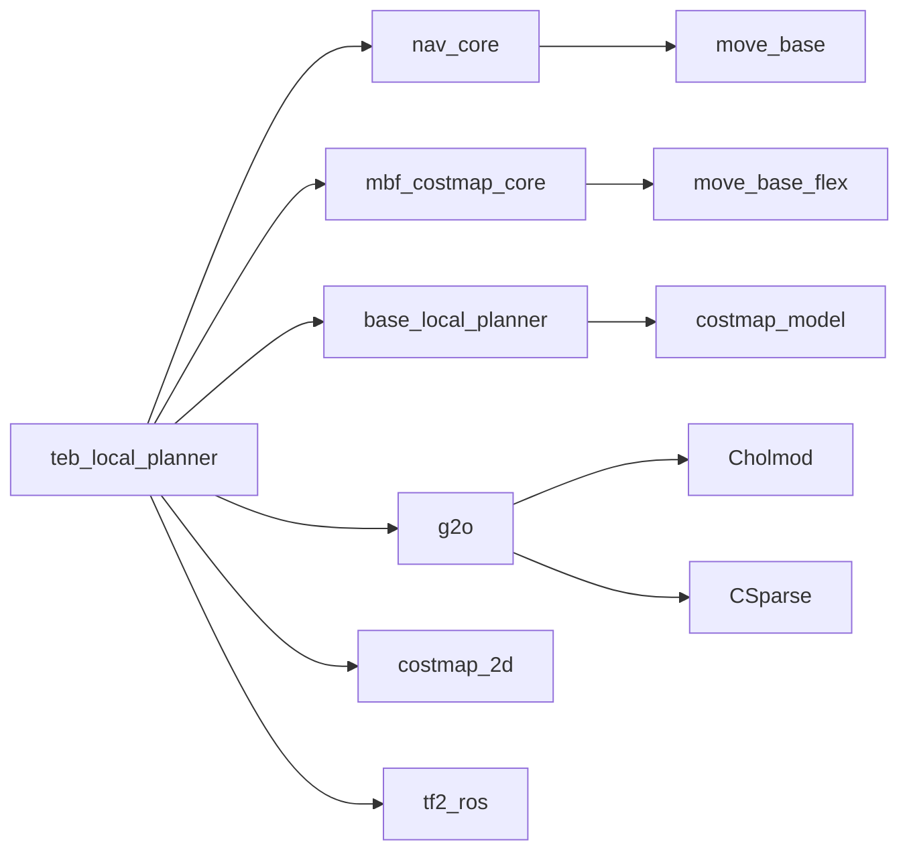

# 节点通信机制

<cite>
**本文档引用的文件**   
- [teb_local_planner_ros.cpp](file://teb_local_planner/src/teb_local_planner_ros.cpp)
- [local_planner_node.cpp](file://field_local_planner/field_local_planner_ros/src/local_planner_node.cpp)
- [teb_local_planner_ros.h](file://teb_local_planner/include/teb_local_planner/teb_local_planner_ros.h)
- [teb_config.h](file://teb_local_planner/include/teb_local_planner/teb_config.h)
- [visualization.h](file://teb_local_planner/include/teb_local_planner/visualization.h)
- [base_plugin.cpp](file://field_local_planner/field_local_planner_base/field_local_planner_base_plugin/src/field_local_planner_base_plugin/base_plugin.cpp)
- [teb_local_planner_plugin.xml](file://teb_local_planner/teb_local_planner_plugin.xml)
</cite>

## 目录
1. [引言](#引言)
2. [项目结构](#项目结构)
3. [核心组件](#核心组件)
4. [架构概述](#架构概述)
5. [详细组件分析](#详细组件分析)
6. [依赖分析](#依赖分析)
7. [性能考虑](#性能考虑)
8. [故障排除指南](#故障排除指南)
9. [结论](#结论)

## 引言
本文档深入分析了ROS系统中路径规划器的通信机制，重点研究teb_local_planner_ros和field_local_planner_ros两个规划器与ROS系统的交互模式。文档详细解释了在路径规划中话题订阅与发布的关键应用，包括/cmd_vel、/odom、/map等核心话题的处理流程。通过分析具体实现，说明了如何高效处理实时传感器数据和控制指令，涵盖了消息回调函数的设计模式、队列管理策略和线程安全考虑。

## 项目结构
本项目包含多个路径规划相关的ROS包，主要分为teb_local_planner和field_local_planner两大模块。teb_local_planner实现了基于时间弹性带的局部路径规划算法，而field_local_planner提供了可扩展的规划器框架。



**图源**
- [teb_local_planner](file://teb_local_planner)
- [field_local_planner](file://field_local_planner)

**节源**
- [teb_local_planner](file://teb_local_planner)
- [field_local_planner](file://field_local_planner)

## 核心组件
teb_local_planner_ros和field_local_planner_ros是本项目的核心规划器组件。teb_local_planner_ros实现了nav_core::BaseLocalPlanner和mbf_costmap_core::CostmapController接口，使其能够在move_base和move_base_flex中使用。field_local_planner_ros采用插件化设计，通过pluginlib动态加载不同的规划算法。

**节源**
- [teb_local_planner_ros.h](file://teb_local_planner/include/teb_local_planner/teb_local_planner_ros.h#L78-L126)
- [local_planner_node.cpp](file://field_local_planner/field_local_planner_ros/src/local_planner_node.cpp#L28-L49)

## 架构概述
系统采用分层架构设计，上层为ROS接口层，中层为规划算法层，底层为优化求解层。teb_local_planner使用g2o优化库进行轨迹优化，而field_local_planner采用模块化设计，支持多种规划算法插件。



**图源**
- [teb_local_planner_ros.cpp](file://teb_local_planner/src/teb_local_planner_ros.cpp#L92-L134)
- [teb_local_planner_ros.h](file://teb_local_planner/include/teb_local_planner/teb_local_planner_ros.h#L38-L84)

## 详细组件分析

### teb_local_planner_ros分析
teb_local_planner_ros作为ROS插件，实现了完整的局部路径规划功能，包括初始化、全局路径设置、速度命令计算等。

#### 初始化流程


**图源**
- [teb_local_planner_ros.cpp](file://teb_local_planner/src/teb_local_planner_ros.cpp#L92-L134)
- [teb_config.h](file://teb_local_planner/include/teb_local_planner/teb_config.h#L231-L251)

#### 话题通信机制
teb_local_planner_ros通过多种话题与ROS系统交互：

```mermaid
flowchart TD
A[/odom] --> B[获取机器人速度]
C[/map] --> D[获取地图信息]
E[/cmd_vel] --> F[发布控制指令]
G[obstacles] --> H[接收自定义障碍物]
I[via_points] --> J[接收途经点]
K[global_plan] --> L[接收全局路径]
B --> M[computeVelocityCommands]
D --> M
H --> M
J --> M
L --> M
M --> F
```

**图源**
- [teb_local_planner_ros.cpp](file://teb_local_planner/src/teb_local_planner_ros.cpp#L169-L198)
- [teb_local_planner_ros.h](file://teb_local_planner/include/teb_local_planner/teb_local_planner_ros.h#L78-L126)

### field_local_planner_ros分析
field_local_planner_ros采用插件化架构，通过动态加载机制支持多种局部规划算法。

#### 插件加载机制


**图源**
- [local_planner_node.cpp](file://field_local_planner/field_local_planner_ros/src/local_planner_node.cpp#L0-L29)
- [base_plugin.cpp](file://field_local_planner/field_local_planner_base/field_local_planner_base_plugin/src/field_local_planner_base_plugin/base_plugin.cpp#L147-L175)

#### 消息发布机制
```mermaid
flowchart LR
A[规划器] --> B[status_pub_]
A --> C[path_pub_]
A --> D[current_goal_pub_]
A --> E[current_base_pub_]
A --> F[output_twist_pub_]
B --> G[/field_local_planner/status]
C --> H[/field_local_planner/path]
D --> I[/field_local_planner/current_goal]
E --> J[/field_local_planner/current_base]
F --> K[/field_local_planner/twist]
```

**图源**
- [base_plugin.cpp](file://field_local_planner/field_local_planner_base/field_local_planner_base_plugin/src/field_local_planner_base_plugin/base_plugin.cpp#L147-L175)

**节源**
- [local_planner_node.cpp](file://field_local_planner/field_local_planner_ros/src/local_planner_node.cpp#L28-L49)
- [base_plugin.cpp](file://field_local_planner/field_local_planner_base/field_local_planner_base_plugin/src/field_local_planner_base_plugin/base_plugin.cpp#L147-L175)

## 依赖分析
系统依赖多个ROS包和第三方库，形成了复杂的依赖关系网络。



**图源**
- [teb_local_planner_plugin.xml](file://teb_local_planner/teb_local_planner_plugin.xml#L0-L12)
- [teb_local_planner_ros.h](file://teb_local_planner/include/teb_local_planner/teb_local_planner_ros.h#L38-L84)

**节源**
- [teb_local_planner_plugin.xml](file://teb_local_planner/teb_local_planner_plugin.xml#L0-L12)
- [teb_local_planner_ros.h](file://teb_local_planner/include/teb_local_planner/teb_local_planner_ros.h#L38-L84)

## 性能考虑
在路径规划系统中，通信性能至关重要。以下是一些性能优化建议：

1. **消息过滤**：通过设置合理的障碍物距离阈值，过滤掉对规划无影响的远距离障碍物
2. **采样率调整**：根据机器人运动速度动态调整轨迹优化的采样率
3. **零拷贝传输**：对于大容量数据（如地图信息），考虑使用共享内存或零拷贝技术
4. **队列管理**：合理设置消息队列长度，避免消息积压导致延迟
5. **线程安全**：在多线程环境下，确保共享数据的访问安全

## 故障排除指南
当规划器出现通信问题时，可以按照以下步骤进行排查：

1. 检查ROS话题是否正确发布和订阅
2. 验证TF坐标变换是否正常
3. 确认参数服务器中的配置参数是否正确加载
4. 检查动态重配置是否正常工作
5. 验证插件是否成功加载

**节源**
- [teb_local_planner_ros.cpp](file://teb_local_planner/src/teb_local_planner_ros.cpp#L464-L513)
- [teb_local_planner_ros.h](file://teb_local_planner/include/teb_local_planner/teb_local_planner_ros.h#L427-L454)

## 结论
本文档详细分析了ROS路径规划系统的通信机制，重点介绍了teb_local_planner_ros和field_local_planner_ros的实现细节。通过理解这些规划器的通信模式，开发者可以更好地构建高效稳定的机器人导航系统。建议在实际应用中结合具体场景，合理配置通信参数，优化系统性能。