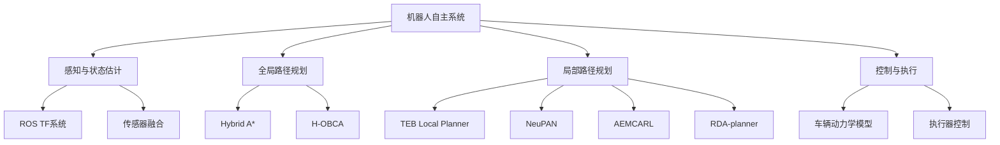
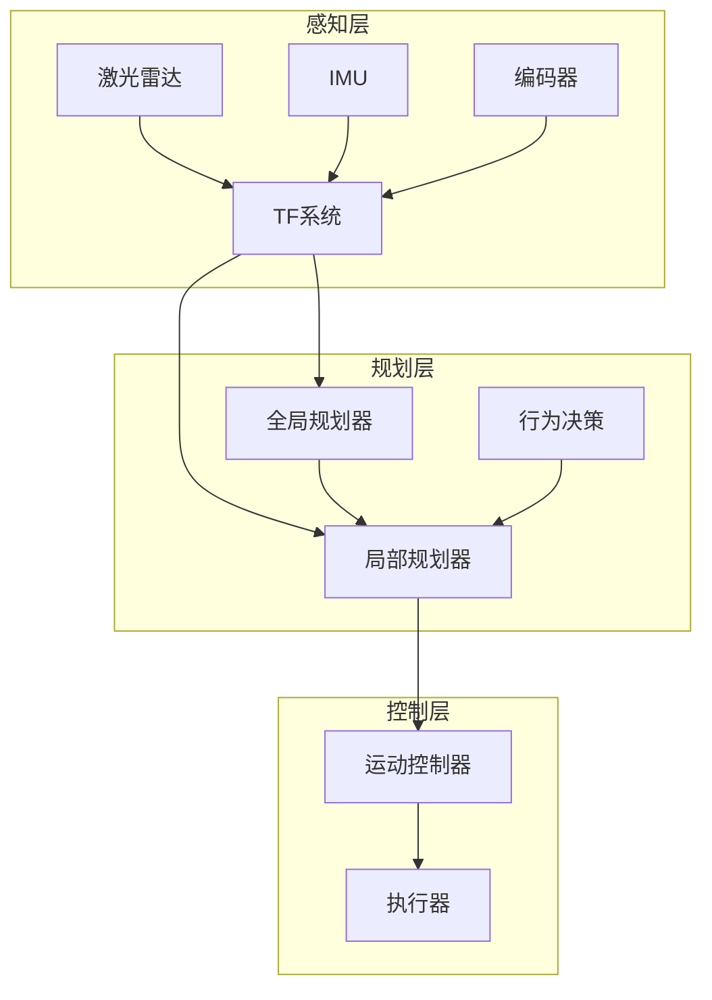
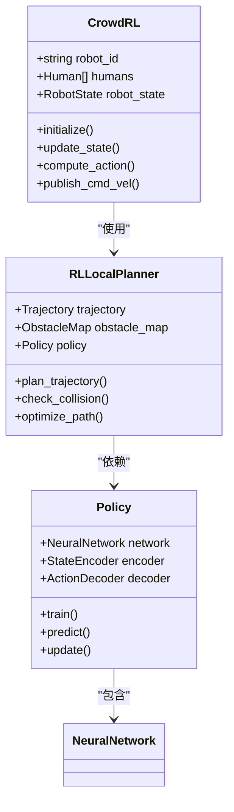
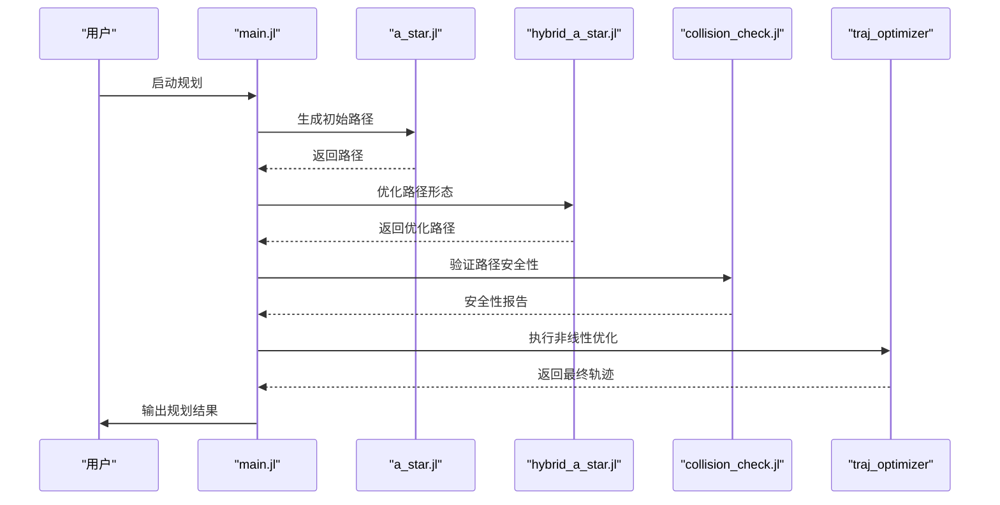
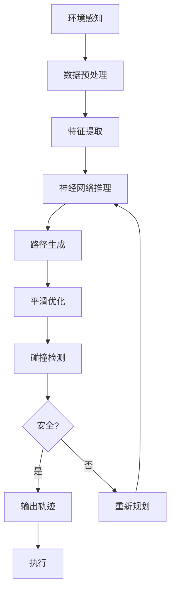
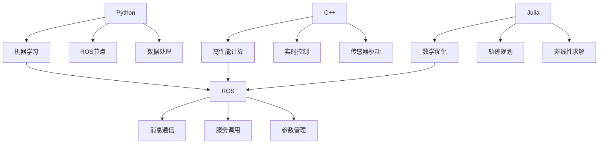

# 学习资源

<cite>
**本文档中引用的文件**  
- [README.md](file://AEMCARL/README.md)
- [env.yaml](file://AEMCARL/env.yaml)
- [tools.cpp](file://AEMCARL/attachments/ros_ws/helper/src/tools.cpp)
- [hunter_tf_listener.py](file://AEMCARL/attachments/ros_ws/hunter_listener_node/hunter_tf_listener.py)
- [CrowdRL.py](file://AEMCARL/attachments/ros_ws/local_planner_py/scripts/CrowdRL.py)
- [RLLocalPlannerv2.py](file://AEMCARL/attachments/ros_ws/local_planner_py/scripts/RLLocalPlannerv2.py)
- [components.py](file://AEMCARL/attachments/ros_ws/local_planner_py/scripts/crowd_nav/common/components.py)
- [policy_factory.py](file://AEMCARL/attachments/ros_ws/local_planner_py/scripts/crowd_nav/policy/policy_factory.py)
- [main.jl](file://H-OBCA/main.jl)
- [collision_check.jl](file://H-OBCA/collision_check.jl)
- [hybrid_a_star.jl](file://H-OBCA/hybrid_a_star.jl)
- [NeuPAN.py](file://NeuPAN/neupan/neupan.py)
- [planner.yaml](file://NeuPAN/example/LON/planner.yaml)
- [teb_local_planner_ros.cpp](file://teb_local_planner/src/teb_local_planner_ros.cpp)
- [traj_optimizer.cpp](file://Dftpav/src/Plan/traj_planner/src/traj_optimizer.cpp)
- [RDA_planner.py](file://RDA-planner/RDA_planner/mpc.py)
</cite>

## 目录
1. [引言](#引言)
2. [项目结构](#项目结构)
3. [核心组件](#核心组件)
4. [架构概述](#架构概述)
5. [详细组件分析](#详细组件分析)
6. [依赖分析](#依赖分析)
7. [性能考虑](#性能考虑)
8. [故障排除指南](#故障排除指南)
9. [结论](#结论)

## 引言
本学习资源文档旨在为初学者和经验丰富的开发者提供一个全面的知识体系，涵盖机器人路径规划、自主导航与智能决策系统开发所需的核心技能。文档重点介绍Python、C++、Julia编程基础，ROS系统集成，机器学习和深度学习基础等先决知识的学习方法。结合项目文档，深入解释端到端MPC规划、并行碰撞避免优化、通用碰撞避免约束的平滑重构等关键概念。通过循序渐进的学习指南、推荐的学习材料、实践项目和社区资源，帮助用户建立完整的知识体系并持续成长。

## 项目结构
本项目包含多个子模块，涵盖从基础感知到高级路径规划的完整机器人自主系统。主要模块包括基于强化学习的局部规划器（AEMCARL）、混合A*路径规划（hybrid_astar_planner）、基于时间弹性带的局部规划器（teb_local_planner）、神经网络路径规划（NeuPAN）、基于模型预测控制的规划器（RDA-planner）以及使用Julia实现的优化碰撞避免（H-OBCA）等。

**Diagram sources**
- [hunter_tf_listener.py](file://AEMCARL/attachments/ros_ws/hunter_listener_node/hunter_tf_listener.py)
- [hybrid_a_star.jl](file://H-OBCA/hybrid_a_star.jl)
- [teb_local_planner_ros.cpp](file://teb_local_planner/src/teb_local_planner_ros.cpp)

## 核心组件
项目的核心组件包括基于强化学习的局部规划器AEMCARL、神经网络路径规划器NeuPAN、基于优化的H-OBCA规划器和基于模型预测控制的RDA-planner。这些组件共同构成了一个多层次、多策略的机器人自主决策系统。

**Section sources**
- [CrowdRL.py](file://AEMCARL/attachments/ros_ws/local_planner_py/scripts/CrowdRL.py)
- [NeuPAN.py](file://NeuPAN/neupan/neupan.py)
- [main.jl](file://H-OBCA/main.jl)
- [mpc.py](file://RDA-planner/RDA_planner/mpc.py)

## 架构概述
系统采用分层架构设计，包括感知层、规划层和控制层。感知层负责获取环境信息和机器人状态；规划层包括全局规划器和局部规划器，负责生成安全高效的路径；控制层负责将规划结果转化为具体的控制指令。

**Diagram sources**
- [hunter_tf_listener.py](file://AEMCARL/attachments/ros_ws/hunter_listener_node/hunter_tf_listener.py)
- [traj_optimizer.cpp](file://Dftpav/src/Plan/traj_planner/src/traj_optimizer.cpp)
- [teb_local_planner_ros.cpp](file://teb_local_planner/src/teb_local_planner_ros.cpp)

## 详细组件分析

### AEMCARL局部规划器分析
AEMCARL是一个基于强化学习的局部规划器，使用深度神经网络学习在复杂动态环境中的导航策略。该系统通过模拟大量人机交互场景来训练智能体，使其能够安全高效地穿越人群。

**Diagram sources**
- [CrowdRL.py](file://AEMCARL/attachments/ros_ws/local_planner_py/scripts/CrowdRL.py)
- [RLLocalPlannerv2.py](file://AEMCARL/attachments/ros_ws/local_planner_py/scripts/RLLocalPlannerv2.py)
- [policy_factory.py](file://AEMCARL/attachments/ros_ws/local_planner_py/scripts/crowd_nav/policy/policy_factory.py)

### H-OBCA优化规划器分析
H-OBCA是一个基于Julia语言实现的优化碰撞避免规划器，采用混合整数规划方法解决复杂的停车和导航问题。该系统结合A*搜索和Reeds-Shepp曲线生成初始路径，然后通过非线性优化进行平滑和优化。

**Diagram sources**
- [main.jl](file://H-OBCA/main.jl)
- [a_star.jl](file://H-OBCA/a_star.jl)
- [hybrid_a_star.jl](file://H-OBCA/hybrid_a_star.jl)
- [collision_check.jl](file://H-OBCA/collision_check.jl)

### NeuPAN神经网络规划器分析
NeuPAN是一个基于神经网络的路径规划系统，采用端到端的学习方法，直接从环境感知数据生成控制指令。该系统结合了自动编码器和路径规划网络，能够处理复杂的非结构化环境。

**Diagram sources**
- [neupan.py](file://NeuPAN/neupan/neupan.py)
- [planner.yaml](file://NeuPAN/example/LON/planner.yaml)
- [components.py](file://AEMCARL/attachments/ros_ws/local_planner_py/scripts/crowd_nav/common/components.py)

## 依赖分析
项目依赖多种编程语言和技术栈，包括Python用于机器学习和ROS集成，C++用于高性能计算，Julia用于数学优化，以及ROS作为中间件框架。这些技术的有机结合实现了高性能的机器人自主系统。

**Diagram sources**
- [requirements.txt](file://AEMCARL/requirements.txt)
- [package.xml](file://AEMCARL/attachments/ros_ws/local_planner_py/package.xml)
- [CMakeLists.txt](file://Dftpav/src/Plan/traj_planner/CMakeLists.txt)

## 性能考虑
系统性能受多个因素影响，包括传感器数据处理延迟、规划算法计算复杂度、通信延迟和执行器响应时间。优化策略包括算法复杂度降低、并行计算、缓存机制和预测控制。

## 故障排除指南
常见问题包括传感器数据丢失、规划失败、控制不稳定等。解决方法包括检查TF树完整性、验证传感器数据质量、调整规划参数和检查执行器状态。

**Section sources**
- [tools.cpp](file://AEMCARL/attachments/ros_ws/helper/src/tools.cpp)
- [env.yaml](file://AEMCARL/env.yaml)
- [teb_local_planner_ros.cpp](file://teb_local_planner/src/teb_local_planner_ros.cpp)

## 结论
本项目提供了一个完整的机器人自主系统开发框架，涵盖了从基础编程到高级规划的各个方面。通过系统学习和实践，开发者可以掌握机器人导航的核心技术，并在此基础上进行创新和优化。