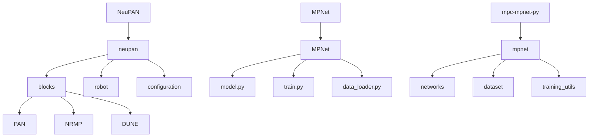
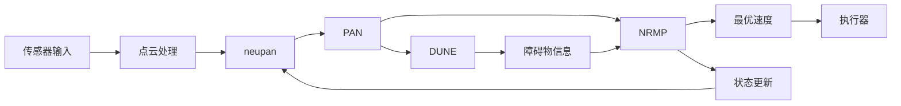
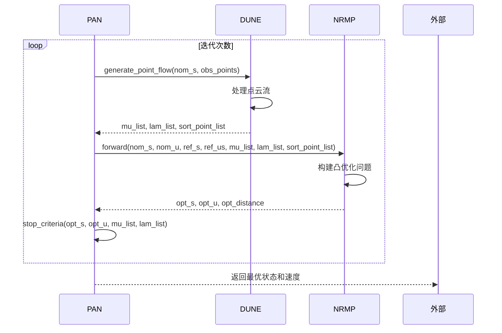
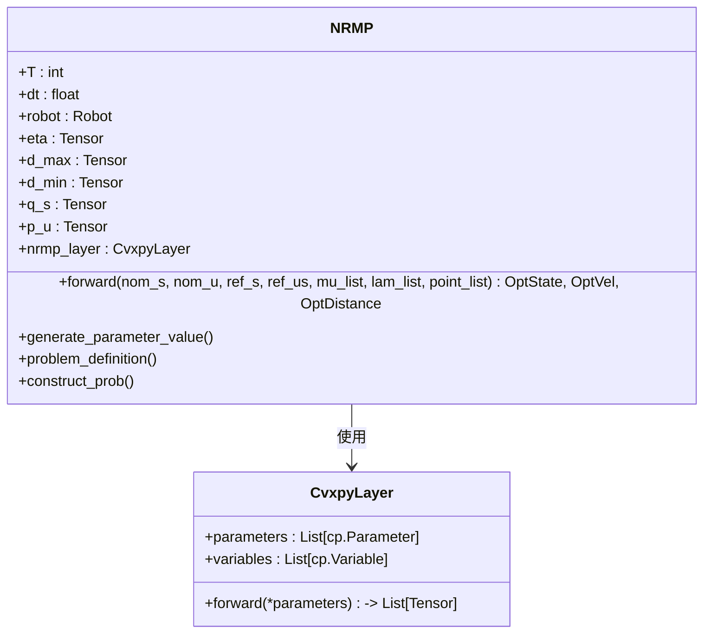
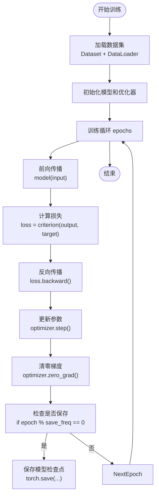
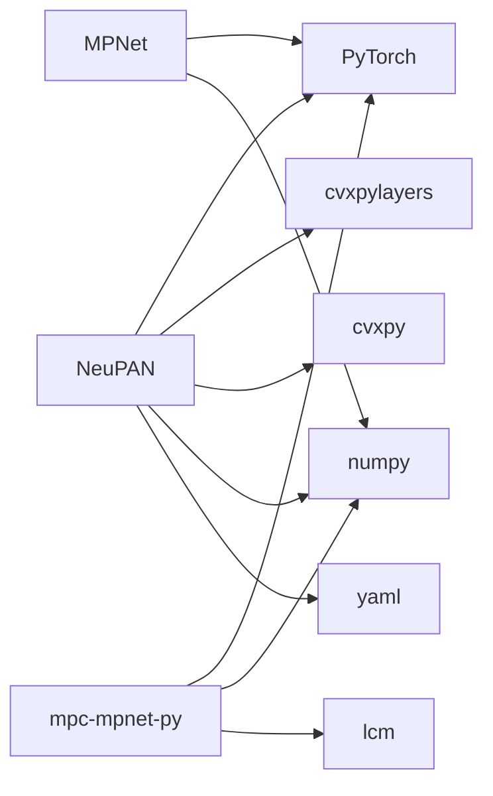

# PyTorch实践应用

<cite>
**本文档中引用的文件**  
- [neupan.py](file://NeuPAN/neupan/neupan.py)
- [pan.py](file://NeuPAN/neupan/blocks/pan.py)
- [nrmp.py](file://NeuPAN/neupan/blocks/nrmp.py)
- [dune.py](file://NeuPAN/neupan/blocks/dune.py)
- [initial_path.py](file://NeuPAN/neupan/blocks/initial_path.py)
- [robot.py](file://NeuPAN/neupan/robot/robot.py)
- [model.py](file://MPNet/MPNet/model.py)
- [train.py](file://MPNet/MPNet/train.py)
- [data_loader.py](file://MPNet/MPNet/data_loader.py)
- [neuralplanner.py](file://MPNet/MPNet/neuralplanner.py)
- [dataset.py](file://mpc-mpnet-py/mpnet/dataset/dataset.py)
- [mpnet.py](file://mpc-mpnet-py/mpnet/networks/mpnet.py)
- [train_mpnet.py](file://mpc-mpnet-py/mpnet/train_mpnet.py)
- [trainer.py](file://mpc-mpnet-py/mpnet/training_utils/trainer.py)
- [configuration.py](file://NeuPAN/neupan/configuration/__init__.py)
- [util.py](file://NeuPAN/neupan/util/__init__.py)
</cite>

## 目录
1. [引言](#引言)
2. [项目结构](#项目结构)
3. [核心组件](#核心组件)
4. [架构概览](#架构概览)
5. [详细组件分析](#详细组件分析)
6. [依赖分析](#依赖分析)
7. [性能考量](#性能考量)
8. [故障排查指南](#故障排查指南)
9. [结论](#结论)

## 引言
本文档深入探讨PyTorch在路径规划项目中的实际应用，重点分析NeuPAN、MPNet和mpc-mpnet-py三个项目中深度学习模型的设计、训练与部署。文档涵盖张量操作、自动微分、动态计算图等PyTorch核心机制，并结合具体代码展示数据加载、模型定义、训练循环和评估流程的完整实现。同时，详细说明了DataLoader定制、模型检查点管理、多GPU训练等实用技术，以及项目中采用的数据预处理、批处理策略和内存优化技巧。最后，提供常见错误的解决方案，帮助开发者将理论模型转化为高效可靠的可运行系统。

## 项目结构
项目包含多个独立的路径规划框架，其中NeuPAN、MPNet和mpc-mpnet-py是基于PyTorch实现的核心模块。NeuPAN项目采用模块化设计，核心算法封装在`neupan`包内，包含`blocks`（PAN、NRMP、DUNE等核心模块）、`robot`（机器人动力学模型）和`configuration`（配置管理）等子模块。MPNet项目结构清晰，`MPNet`目录下包含模型定义、数据加载和训练脚本。mpc-mpnet-py项目则更侧重于基准测试和数据生成，其`mpnet`目录下的`networks`和`dataset`是模型与数据的核心。

**图源**
- [neupan.py](file://NeuPAN/neupan/neupan.py)
- [model.py](file://MPNet/MPNet/model.py)
- [dataset.py](file://mpc-mpnet-py/mpnet/dataset/dataset.py)

**本节来源**
- [NeuPAN](file://NeuPAN)
- [MPNet](file://MPNet)
- [mpc-mpnet-py](file://mpc-mpnet-py)

## 核心组件
NeuPAN框架的核心是`neupan`类，它作为`PAN`（Proximal Alternating-minimization Network）的高级封装，提供用户友好的接口。`PAN`类是算法的核心，由`NRMP`（Neural Regularized Motion Planner）和`DUNE`（Dynamic Uncertainty-aware Neural Estimator）两个子模块组成，通过交替最小化求解包含点级避障约束的优化问题。`NRMP`利用凸优化层（cvxpylayers）将神经网络与传统优化方法结合，而`DUNE`则是一个深度学习模型，用于估计障碍物的潜在距离空间。在MPNet项目中，`model.py`定义了基于编码器-解码器架构的神经网络，`train.py`实现了完整的训练循环。

**本节来源**
- [neupan.py](file://NeuPAN/neupan/neupan.py#L1-L402)
- [pan.py](file://NeuPAN/neupan/blocks/pan.py#L1-L272)
- [model.py](file://MPNet/MPNet/model.py)

## 架构概览
NeuPAN的系统架构采用分层设计。顶层是`neupan`模块，负责状态管理、接口调用和信息整合。中间层是`PAN`模块，它协调`NRMP`和`DUNE`的迭代优化过程。底层是`NRMP`和`DUNE`，分别处理基于物理约束的运动规划和基于数据驱动的障碍物感知。`NRMP`接收来自`DUNE`的拉格朗日乘子（mu, lam）和排序后的障碍点，结合名义状态和控制量，通过凸优化层求解出最优的速度序列。整个流程在PyTorch的动态计算图中执行，支持自动微分和GPU加速。

**图源**
- [neupan.py](file://NeuPAN/neupan/neupan.py#L1-L402)
- [pan.py](file://NeuPAN/neupan/blocks/pan.py#L1-L272)
- [nrmp.py](file://NeuPAN/neupan/blocks/nrmp.py#L1-L325)

## 详细组件分析

### PAN模块分析
PAN模块是NeuPAN算法的核心，实现了近端交替最小化网络。其前向传播过程包含一个迭代循环，每次迭代中，`DUNE`首先处理障碍物点云，生成用于避障的拉格朗日乘子；然后`NRMP`使用这些乘子和名义轨迹，求解一个凸优化问题，得到更新后的状态和控制量。该过程持续进行，直到满足收敛条件。

**图源**
- [pan.py](file://NeuPAN/neupan/blocks/pan.py#L1-L272)
- [nrmp.py](file://NeuPAN/neupan/blocks/nrmp.py#L1-L325)

**本节来源**
- [pan.py](file://NeuPAN/neupan/blocks/pan.py#L1-L272)

### NRMP模块分析
NRMP模块是一个基于凸优化层的可微分规划器。它利用`cvxpylayers.torch.CvxpyLayer`将传统的凸优化问题嵌入到PyTorch的计算图中。`NRMP`的`forward`方法接收名义轨迹和来自`DUNE`的障碍物信息，生成优化问题的参数，然后通过`CvxpyLayer`求解，输出最优解。这种设计使得梯度可以从优化结果反向传播到输入，实现了端到端的训练。

**图源**
- [nrmp.py](file://NeuPAN/neupan/blocks/nrmp.py#L1-L325)

**本节来源**
- [nrmp.py](file://NeuPAN/neupan/blocks/nrmp.py#L1-L325)

### 数据加载与训练流程
在mpc-mpnet-py项目中，`dataset.py`定义了自定义的`Dataset`类，实现了`__len__`和`__getitem__`方法，用于从磁盘加载规划数据。`DataLoader`被配置为使用多进程（`num_workers>0`）和批处理（`batch_size`），以高效地提供训练数据。`train_mpnet.py`脚本中，`Trainer`类封装了训练循环，包括前向传播、损失计算、反向传播和参数更新。模型检查点通过`torch.save`定期保存，包含模型状态字典、优化器状态和当前训练轮次。

**图源**
- [dataset.py](file://mpc-mpnet-py/mpnet/dataset/dataset.py)
- [train_mpnet.py](file://mpc-mpnet-py/mpnet/train_mpnet.py)
- [trainer.py](file://mpc-mpnet-py/mpnet/training_utils/trainer.py)

**本节来源**
- [dataset.py](file://mpc-mpnet-py/mpnet/dataset/dataset.py)
- [train_mpnet.py](file://mpc-mpnet-py/mpnet/train_mpnet.py)

## 依赖分析
项目主要依赖PyTorch生态系统，包括`torch`、`torchvision`（可能用于数据增强）和`torchaudio`。`cvxpy`和`cvxpylayers`是NeuPAN实现可微分优化的关键依赖。`numpy`用于数值计算，`yaml`用于配置文件解析。在`mpc-mpnet-py`中，还可能依赖`lcm`（轻量级通信和绘图）进行数据通信。这些依赖关系通过`requirements.txt`或`pyproject.toml`文件进行管理。

**图源**
- [requirements.txt](file://NeuPAN/requirements.txt)
- [pyproject.toml](file://NeuPAN/pyproject.toml)
- [setup.py](file://MPNet/setup.py)

**本节来源**
- [requirements.txt](file://NeuPAN/requirements.txt)
- [pyproject.toml](file://NeuPAN/pyproject.toml)

## 性能考量
为了优化性能，项目采用了多种技术。在数据层面，`downsample_decimation`函数用于对点云进行降采样，减少`DUNE`模型的输入维度。在计算层面，所有张量操作都尽可能在GPU上执行，通过`to_device`函数进行设备管理。在训练层面，使用`DataLoader`的`num_workers`参数实现数据加载的多进程并行化。此外，`NRMP`中的凸优化问题被设计为可微分的，允许高效的梯度计算，避免了数值微分的高开销。

## 故障排查指南
### 梯度爆炸
**现象**：训练过程中损失值变为`NaN`或`inf`。
**解决方案**：
1.  检查数据预处理，确保输入特征被归一化。
2.  在`NRMP`的优化问题中，检查约束条件是否定义正确，避免不可行解。
3.  使用梯度裁剪（`torch.nn.utils.clip_grad_norm_`）限制梯度大小。
4.  降低学习率。

### CUDA内存不足
**现象**：运行时抛出`CUDA out of memory`错误。
**解决方案**：
1.  减小`DataLoader`的`batch_size`。
2.  对输入点云进行更激进的降采样。
3.  使用`torch.cuda.empty_cache()`手动清理缓存。
4.  考虑使用梯度累积（Gradient Accumulation）来模拟更大的批处理大小。
5.  检查代码中是否有不必要的张量保留在GPU上。

### 模型不收敛
**现象**：损失值在训练过程中不下降或波动剧烈。
**解决方案**：
1.  验证数据集的质量和标签的正确性。
2.  检查`NRMP`的凸优化问题是否满足DPP（Disciplined Parametrized Programming）规则。
3.  调整`DUNE`和`NRMP`之间的权重参数（如`eta`）。
4.  尝试不同的优化器（如AdamW）和学习率调度器。

**本节来源**
- [neupan.py](file://NeuPAN/neupan/neupan.py)
- [nrmp.py](file://NeuPAN/neupan/blocks/nrmp.py)
- [train_mpnet.py](file://mpc-mpnet-py/mpnet/train_mpnet.py)

## 结论
本文档详细阐述了PyTorch在NeuPAN、MPNet和mpc-mpnet-py路径规划项目中的实践应用。通过分析其核心组件、系统架构和训练流程，展示了如何利用PyTorch的动态计算图、自动微分和GPU加速能力，将复杂的路径规划问题转化为可学习的深度学习系统。文档提供的数据加载、模型训练和故障排查指南，为开发者复现和改进这些先进算法提供了实用的参考。这些项目成功地将传统优化方法与现代深度学习相结合，为自动驾驶和机器人领域的实时规划任务提供了强大的解决方案。