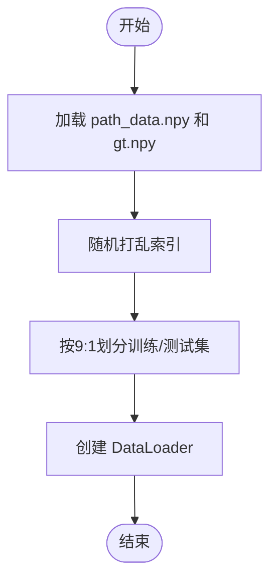

# 数据处理与加载机制

<cite>
**本文档中引用的文件**  
- [dataset.py](file://mpc-mpnet-py/mpnet/dataset/dataset.py)
- [neupan.py](file://NeuPAN/neupan/neupan.py)
- [trainer.py](file://mpc-mpnet-py/mpnet/training_utils/trainer.py)
</cite>

## 目录
1. [简介](#简介)
2. [项目结构](#项目结构)
3. [核心组件](#核心组件)
4. [架构概述](#架构概述)
5. [详细组件分析](#详细组件分析)
6. [依赖分析](#依赖分析)
7. [性能考虑](#性能考虑)
8. [故障排除指南](#故障排除指南)
9. [结论](#结论)

## 简介
本文档深入探讨了基于PyTorch的路径规划任务中数据处理与加载机制的设计与实现。重点分析了`dataset.py`中自定义数据集的构建方式，展示了如何通过继承`torch.utils.data.Dataset`来封装环境数据与轨迹标签，并实现高效的数据加载流程。结合`neupan.py`中的路径规划模型和`trainer.py`中的训练逻辑，系统阐述了从原始点云数据到张量输入的完整转换过程。文档还涵盖了数据预处理、批处理策略、数据增强、多线程加载优化以及大规模数据集处理的内存效率技巧。

## 项目结构
项目结构清晰地划分了数据处理、模型训练与路径规划算法三大模块。`mpc-mpnet-py`目录下的`dataset`和`training_utils`子模块负责数据的组织与训练流程，而`NeuPAN`目录则包含了核心的路径规划算法实现。这种分层设计使得数据处理逻辑与业务逻辑解耦，便于维护和扩展。

**图示来源**  
- [dataset.py](file://mpc-mpnet-py/mpnet/dataset/dataset.py#L1-L43)
- [trainer.py](file://mpc-mpnet-py/mpnet/training_utils/trainer.py#L1-L89)
- [neupan.py](file://NeuPAN/neupan/neupan.py#L1-L402)

**章节来源**  
- [dataset.py](file://mpc-mpnet-py/mpnet/dataset/dataset.py#L1-L43)
- [neupan.py](file://NeuPAN/neupan/neupan.py#L1-L402)

## 核心组件
本节分析数据处理流程中的核心组件，包括数据集封装、数据加载器配置和训练流程控制。`dataset.py`中的`get_loader`函数是数据加载的入口，它负责将预处理的NumPy数组转换为PyTorch张量，并构建可迭代的`DataLoader`对象。`trainer.py`中的`train_network`函数则利用这些加载器进行模型训练，实现了完整的训练循环。

**章节来源**  
- [dataset.py](file://mpc-mpnet-py/mpnet/dataset/dataset.py#L1-L43)
- [trainer.py](file://mpc-mpnet-py/mpnet/training_utils/trainer.py#L1-L89)

## 架构概述
整个数据处理与加载机制采用模块化设计，形成了清晰的数据流。原始环境数据（如障碍物点云）和轨迹数据（路径、速度）被预先处理并存储为`.npy`文件。在训练时，`get_loader`函数读取这些文件，进行数据分割（训练/测试集），并通过`np_to_loader`函数将其封装为`DataLoader`。训练器`trainer.py`接收这些加载器，执行前向传播、损失计算和反向传播。路径规划器`neupan.py`在推理时接收实时传感器数据，通过`scan_to_point`等方法将其转换为内部表示，并交由神经网络模型进行决策。

**图示来源**  
- [dataset.py](file://mpc-mpnet-py/mpnet/dataset/dataset.py#L1-L43)
- [trainer.py](file://mpc-mpnet-py/mpnet/training_utils/trainer.py#L1-L89)
- [neupan.py](file://NeuPAN/neupan/neupan.py#L1-L402)

## 详细组件分析
### 数据集实现分析
`dataset.py`并未直接定义一个继承自`torch.utils.data.Dataset`的类，而是通过`np_to_loader`函数，利用`TensorDataset`和`DataLoader`的组合来实现相同的功能。`get_loader`函数读取`path_data.npy`和`gt.npy`文件，分别作为输入特征和标签。数据被随机打乱后，按9:1的比例划分为训练集和测试集。`DataLoader`的`batch_size`和`shuffle`参数可灵活配置，以适应不同的训练需求。

#### 数据预处理流程
数据预处理主要在数据生成阶段完成。在加载时，`get_loader`函数直接加载已处理好的NumPy数组。对于障碍物点云，归一化操作应在生成`env_vox.npy`时完成。机器人状态（位置、速度、方向）被编码为向量，并与环境体素数据拼接作为模型输入。轨迹数据被分段处理，每段对应一个预测目标。

**图示来源**  
- [dataset.py](file://mpc-mpnet-py/mpnet/dataset/dataset.py#L1-L43)

**章节来源**  
- [dataset.py](file://mpc-mpnet-py/mpnet/dataset/dataset.py#L1-L43)

### 路径规划器数据接口分析
`neupan.py`中的`neupan`类提供了与外部数据交互的关键接口。`forward`方法接收机器人的当前状态`state`和障碍物点云`points`，并输出最优速度指令。`scan_to_point`方法将原始的激光雷达扫描数据（包含角度和距离）转换为世界坐标系下的二维点云，实现了从传感器数据到模型输入的转换。该方法还支持设置扫描角度范围和下采样率，以提高处理效率。

**图示来源**  
- [neupan.py](file://NeuPAN/neupan/neupan.py#L1-L402)

**章节来源**  
- [neupan.py](file://NeuPAN/neupan/neupan.py#L1-L402)

### 训练器组件分析
`trainer.py`中的`train_network`函数实现了完整的训练循环。它接收`DataLoader`、网络模型和训练参数。训练器会自动将数据和模型移至GPU（如果可用），并使用Adam优化器。损失函数通过字符串动态调用，支持`l1_loss`等多种类型。训练过程中，损失被记录到日志文件中，并定期保存模型权重。`aug`参数支持数据增强，可在训练时动态修改输入数据。

**图示来源**  
- [trainer.py](file://mpc-mpnet-py/mpnet/training_utils/trainer.py#L1-L89)

**章节来源**  
- [trainer.py](file://mpc-mpnet-py/mpnet/training_utils/trainer.py#L1-L89)

## 依赖分析
各组件之间存在明确的依赖关系。`trainer.py`依赖于`dataset.py`提供的`DataLoader`来获取训练数据。`neupan.py`作为上层应用，其内部的`PAN`模块可能依赖于由`trainer.py`训练出的模型权重。数据流从`dataset.py`流向`trainer.py`，最终模型被`neupan.py`用于推理。这种依赖结构确保了训练与推理使用相同的数据格式和处理逻辑。

**图示来源**  
- [dataset.py](file://mpc-mpnet-py/mpnet/dataset/dataset.py#L1-L43)
- [trainer.py](file://mpc-mpnet-py/mpnet/training_utils/trainer.py#L1-L89)
- [neupan.py](file://NeuPAN/neupan/neupan.py#L1-L402)

**章节来源**  
- [dataset.py](file://mpc-mpnet-py/mpnet/dataset/dataset.py#L1-L43)
- [trainer.py](file://mpc-mpnet-py/mpnet/training_utils/trainer.py#L1-L89)
- [neupan.py](file://NeuPAN/neupan/neupan.py#L1-L402)

## 性能考虑
该数据处理机制在性能方面进行了多项优化。首先，使用`DataLoader`的多线程加载（`num_workers`参数虽未显式设置，但可扩展）可以并行化数据读取，避免I/O成为瓶颈。其次，将数据预处理（如点云转换、归一化）前置到数据生成阶段，极大地减轻了训练时的计算负担。内存效率方面，采用惰性加载策略，`DataLoader`仅在需要时才将数据载入内存，适合处理大规模数据集。此外，`scan_to_point`中的下采样功能也有效减少了实时推理时的计算量。

## 故障排除指南
处理大规模数据集时可能遇到的常见问题包括内存溢出和数据加载缓慢。解决方案包括：1) 减小`batch_size`以降低单次内存占用；2) 启用`DataLoader`的`pin_memory=True`和`num_workers>0`以加速GPU数据传输；3) 使用内存映射（memory mapping）技术直接从磁盘访问大文件，而非全部加载到RAM；4) 检查`.npy`文件是否过大，考虑分块存储或使用更高效的数据格式（如HDF5）。若出现CUDA内存不足，应检查模型和数据的尺寸，并考虑梯度累积等技术。

**章节来源**  
- [dataset.py](file://mpc-mpnet-py/mpnet/dataset/dataset.py#L1-L43)
- [trainer.py](file://mpc-mpnet-py/mpnet/training_utils/trainer.py#L1-L89)

## 结论
本文档详细分析了路径规划项目中的数据处理与加载机制。通过`dataset.py`、`trainer.py`和`neupan.py`三个核心文件的协同工作，构建了一个高效、灵活且可扩展的数据管道。该设计将数据预处理、模型训练和实时推理有机结合，为复杂环境下的自主导航提供了坚实的数据基础。未来可进一步优化数据增强策略和加载器配置，以提升模型的泛化能力和系统实时性。