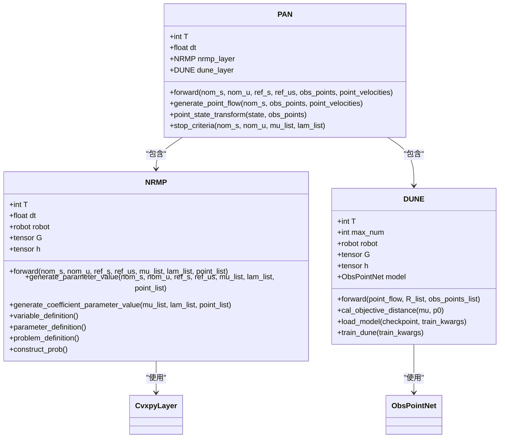
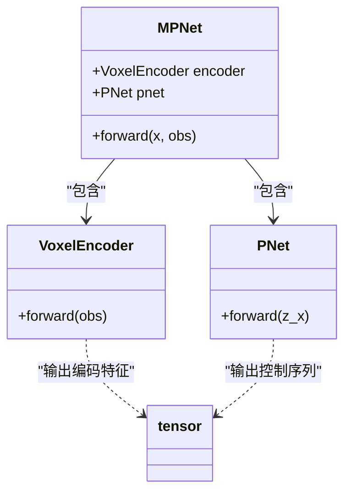
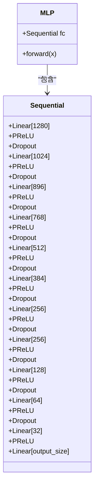
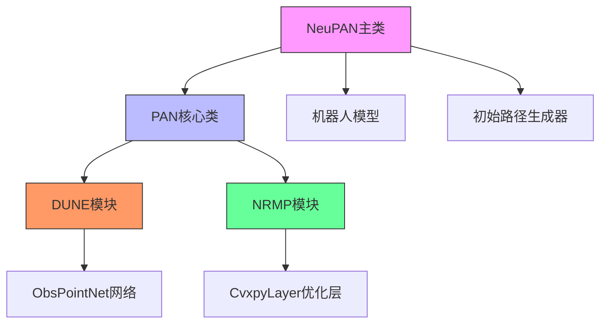
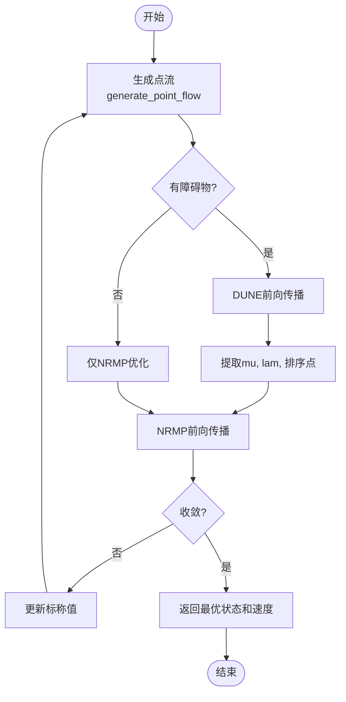
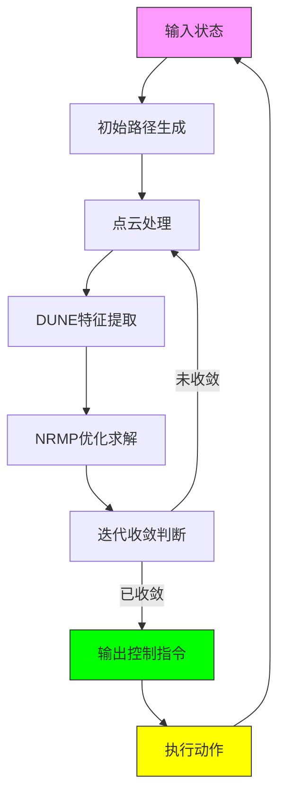

# 模型构建与架构设计

<cite>
**本文档中引用的文件**  
- [neupan.py](file://NeuPAN/neupan/neupan.py)
- [dune.py](file://NeuPAN/neupan/blocks/dune.py)
- [nrmp.py](file://NeuPAN/neupan/blocks/nrmp.py)
- [pan.py](file://NeuPAN/neupan/blocks/pan.py)
- [mpnet.py](file://mpc-mpnet-py/mpnet/networks/mpnet.py)
- [model.py](file://MPNet/MPNet/model.py)
</cite>

## 目录
1. [引言](#引言)
2. [NeuPAN神经网络架构](#neupan神经网络架构)
3. [MPNet编码器-解码器结构](#mpnet编码器-解码器结构)
4. [模型初始化与参数配置](#模型初始化与参数配置)
5. [模块化设计与继承组合](#模块化设计与继承组合)
6. [前向传播逻辑设计](#前向传播逻辑设计)
7. [自定义层与函数实现](#自定义层与函数实现)
8. [模型可视化与复杂度分析](#模型可视化与复杂度分析)
9. [结论](#结论)

## 引言
本文档深入解析NeuPAN、MPNet和mpc-mpnet-py项目中的PyTorch模型构建与架构设计。重点分析端到端MPC规划器的神经网络架构，包括DUNE、NRMP和PAN模块的设计原理与实现细节，以及MPNet模型的编码器-解码器结构在路径规划中的应用。文档详细说明如何使用PyTorch的nn.Module构建可复用的网络组件，设计适应运动规划任务的前向传播逻辑，以及通过继承和组合实现模块化设计。

## NeuPAN神经网络架构

NeuPAN算法的核心是PAN（Proximal Alternating-minimization Network）类，它由DUNE和NRMP两个核心模块组成，实现了在每个步骤中解决具有大量点级碰撞避免约束的优化问题。

**图示来源**  
- [pan.py](file://NeuPAN/neupan/blocks/pan.py#L1-L273)
- [dune.py](file://NeuPAN/neupan/blocks/dune.py#L1-L252)
- [nrmp.py](file://NeuPAN/neupan/blocks/nrmp.py#L1-L326)

**本节来源**  
- [neupan.py](file://NeuPAN/neupan/neupan.py#L1-L403)
- [pan.py](file://NeuPAN/neupan/blocks/pan.py#L1-L273)

### DUNE模块设计
DUNE（Deep Unfolded Neural Encoder）模块是PAN算法的核心组件之一，负责将点流映射到潜在距离空间（mu和lambda）。该模块使用ObsPointNet神经网络将障碍物点云转换为机器人约束边界的距离特征。

DUNE模块的前向传播过程包括：
1. 将整个时间序列的点流通过ObsPointNet模型进行特征提取
2. 对每个时间步的特征进行切片和处理
3. 计算lambda特征用于坐标系转换
4. 根据距离对点进行排序以优化计算效率

### NRMP模块设计
NRMP（Neural Regularized Motion Planner）模块负责解决集成神经潜在距离空间的优化问题，生成最优控制序列。该模块基于cvxpylayers库构建凸优化层，实现了可微分的优化求解器。

NRMP模块的关键特性包括：
- 使用CvxpyLayer将凸优化问题封装为PyTorch可微分层
- 定义状态变量、参数和优化问题的完整框架
- 实现导航成本和DUNE成本的联合最小化
- 通过调整参数动态控制状态成本、控制成本和安全距离

## MPNet编码器-解码器结构

MPNet模型采用典型的编码器-解码器架构，专门设计用于路径规划任务。该架构由VoxelEncoder和PNet两个主要组件构成，实现了从环境感知到运动规划的端到端学习。

**图示来源**  
- [mpnet.py](file://mpc-mpnet-py/mpnet/networks/mpnet.py#L1-L47)

**本节来源**  
- [mpnet.py](file://mpc-mpnet-py/mpnet/networks/mpnet.py#L1-L47)

### 编码器设计
VoxelEncoder组件负责将三维点云数据编码为固定长度的特征向量。该编码器将体素化的环境表示转换为紧凑的潜在空间表示，捕捉环境的关键几何特征。

### 解码器设计
PNet组件作为解码器，接收编码后的环境特征和当前状态信息，输出最优的控制序列。该网络采用多层感知机结构，通过非线性变换学习从环境状态到控制动作的映射关系。

## 模型初始化与参数配置

模型的初始化策略和参数配置在`model.py`文件中定义，采用深度多层感知机（MLP）架构作为路径生成器。

**图示来源**  
- [model.py](file://MPNet/MPNet/model.py#L1-L32)

**本节来源**  
- [model.py](file://MPNet/MPNet/model.py#L1-L32)

### 初始化策略
MLP模型采用逐层初始化策略，构建了深度为14层的全连接网络。每层包含线性变换、PReLU激活函数和Dropout正则化，形成了深度非线性映射能力。

### 层定义
网络层定义遵循递减维度模式：
- 输入层：可变尺寸
- 隐藏层：1280 → 1024 → 896 → 768 → 512 → 384 → 256 → 256 → 128 → 64 → 32
- 输出层：固定尺寸

### 参数配置
关键参数配置包括：
- 使用PReLU作为激活函数，提供可学习的负斜率参数
- 在每个隐藏层后添加Dropout层，防止过拟合
- 采用深度网络结构，增强模型的表达能力
- 逐步减小隐藏层维度，实现特征压缩和抽象

## 模块化设计与继承组合

NeuPAN架构通过精心设计的继承和组合关系实现了高度模块化的系统设计。这种设计模式使得各个组件可以独立开发、测试和优化，同时保持系统的整体一致性。

**图示来源**  
- [neupan.py](file://NeuPAN/neupan/neupan.py#L1-L403)
- [pan.py](file://NeuPAN/neupan/blocks/pan.py#L1-L273)

**本节来源**  
- [neupan.py](file://NeuPAN/neupan/neupan.py#L1-L403)
- [pan.py](file://NeuPAN/neupan/blocks/pan.py#L1-L273)

### 继承机制
所有核心组件都继承自PyTorch的`nn.Module`类，这使得它们可以无缝集成到PyTorch的计算图中，享受自动微分、GPU加速和分布式训练等特性。

### 组合模式
系统采用组合模式构建复杂功能：
- `neupan`类组合了`InitialPath`和`PAN`组件
- `PAN`类组合了`DUNE`和`NRMP`模块
- `NRMP`类组合了CVXPY优化层
- `DUNE`类组合了`ObsPointNet`神经网络

这种层次化的组合结构实现了关注点分离，每个组件负责特定的功能领域，同时通过明确定义的接口进行协作。

## 前向传播逻辑设计

前向传播逻辑的设计充分考虑了运动规划任务的特殊需求，实现了高效、鲁棒的实时规划能力。

### PAN前向传播流程

**图示来源**  
- [pan.py](file://NeuPAN/neupan/blocks/pan.py#L1-L273)

**本节来源**  
- [pan.py](file://NeuPAN/neupan/blocks/pan.py#L1-L273)

### 迭代优化机制
PAN算法采用交替最小化框架，在DUNE和NRMP模块之间进行迭代优化：
1. DUNE模块将障碍物点云转换为潜在距离特征
2. NRMP模块基于这些特征求解优化问题
3. 使用停止准则判断收敛性
4. 重复迭代直到满足收敛条件

这种设计使得系统能够在保证安全性的同时，生成平滑、高效的运动轨迹。

## 自定义层与函数实现

项目中实现了多个自定义层和函数，以满足特定的运动规划需求。

### 自定义损失函数
虽然代码中未显式定义损失函数，但NRMP模块中的优化问题本质上定义了复合损失函数，包括：
- 导航成本（nav_cost）：包含状态和控制成本
- DUNE成本（dune_cost）：负的最小距离和，鼓励远离障碍物
- 约束违反成本：通过凸优化确保约束满足

### 自定义激活函数
在MLP模型中使用了PReLU（Parametric ReLU）激活函数，相比标准ReLU具有以下优势：
- 可学习的负斜率参数，增强了模型的表达能力
- 避免了神经元"死亡"问题
- 在保持计算效率的同时提供了非线性变换能力

### 自定义层实现
- **CvxpyLayer**：将凸优化问题封装为可微分层，实现了优化与学习的统一
- **ObsPointNet**：专门设计的点云处理网络，将三维点云映射到距离特征空间
- **DUNETrain**：DUNE模块的训练封装器，简化了模型训练流程

## 模型可视化与复杂度分析

### 参数统计
对主要模型进行参数统计分析：

| 模型组件 | 参数数量估算 | 主要参数来源 |
|---------|------------|------------|
| MLP (model.py) | ~3.5M | 全连接层权重 |
| VoxelEncoder | 依赖输入尺寸 | 卷积/线性层 |
| PNet | 依赖输入输出尺寸 | 全连接层 |
| ObsPointNet | 依赖输入输出尺寸 | 点云处理层 |

### 复杂度分析
#### 时间复杂度
- **DUNE模块**：O(T×N×D)，其中T为时间步长，N为点数，D为特征维度
- **NRMP模块**：O(T×M)，其中M为优化变量数量，主要由凸优化求解器决定
- **PAN整体**：O(iter×(T×N×D + T×M))，其中iter为迭代次数

#### 空间复杂度
- **内存占用**：主要由点云数据、优化变量和网络参数决定
- **显存需求**：取决于批量大小和网络深度
- **实时性**：通过点云下采样和迭代优化控制计算时间

### 可视化技巧
项目中实现了多种可视化功能：
- **轨迹可视化**：通过`opt_trajectory`和`ref_trajectory`属性获取优化和参考轨迹
- **障碍物可视化**：通过`dune_points`和`nrmp_points`属性获取考虑的障碍物点
- **状态监控**：通过`info`字典获取规划状态信息

**图示来源**  
- [neupan.py](file://NeuPAN/neupan/neupan.py#L1-L403)

**本节来源**  
- [neupan.py](file://NeuPAN/neupan/neupan.py#L1-L403)

## 结论
NeuPAN、MPNet和mpc-mpnet-py项目展示了先进的PyTorch模型构建与架构设计技术在运动规划领域的应用。通过DUNE、NRMP和PAN模块的协同工作，系统实现了端到端的MPC规划能力。MPNet的编码器-解码器结构为路径规划提供了强大的学习能力。模块化设计和继承组合模式使得系统具有良好的可维护性和扩展性。前向传播逻辑针对运动规划任务进行了专门优化，确保了实时性和鲁棒性。这些设计实践为开发复杂的机器人学习系统提供了有价值的参考。