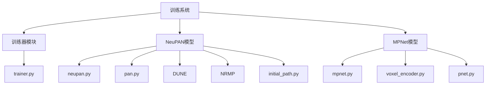
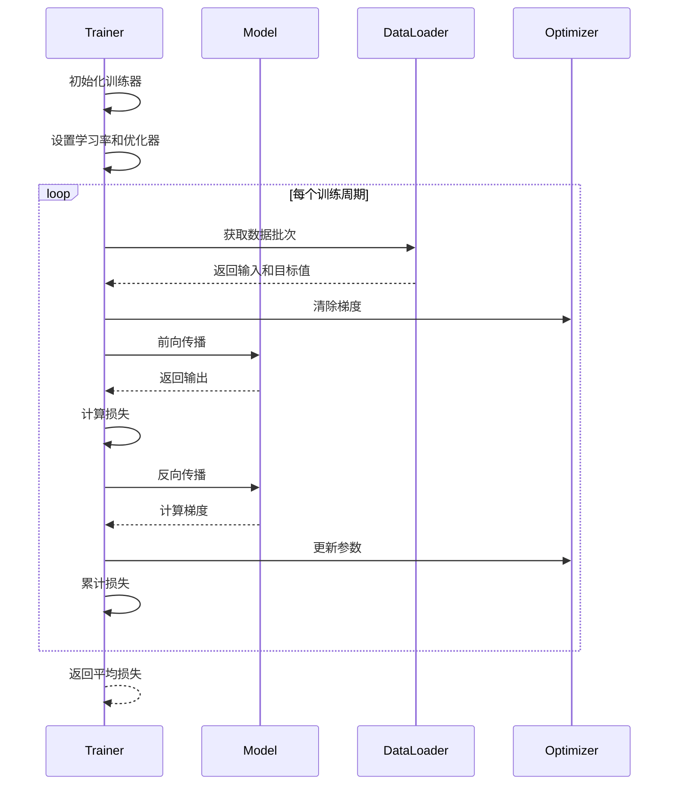
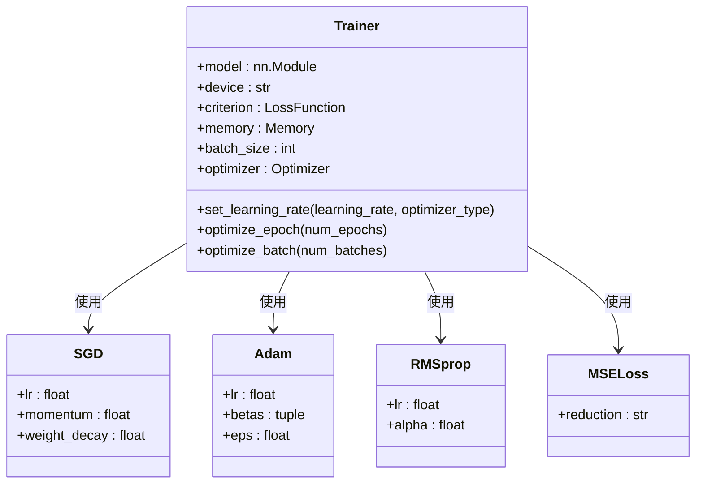
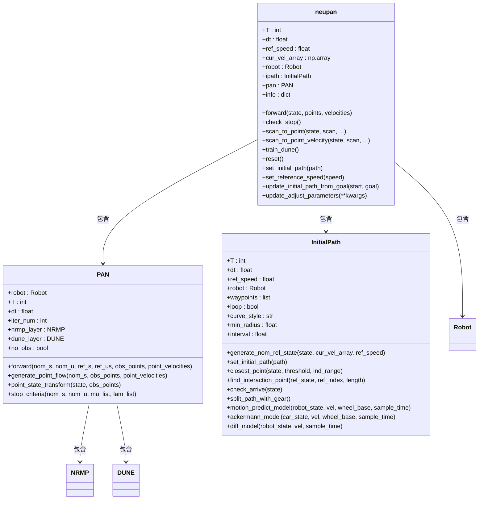
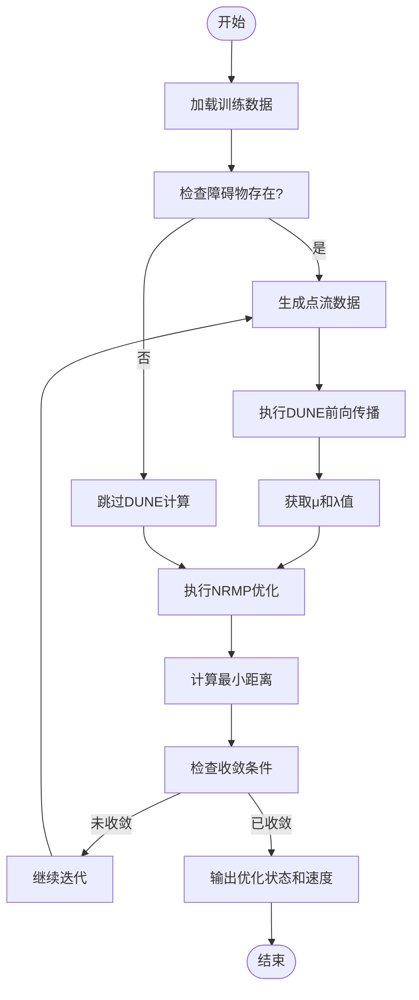
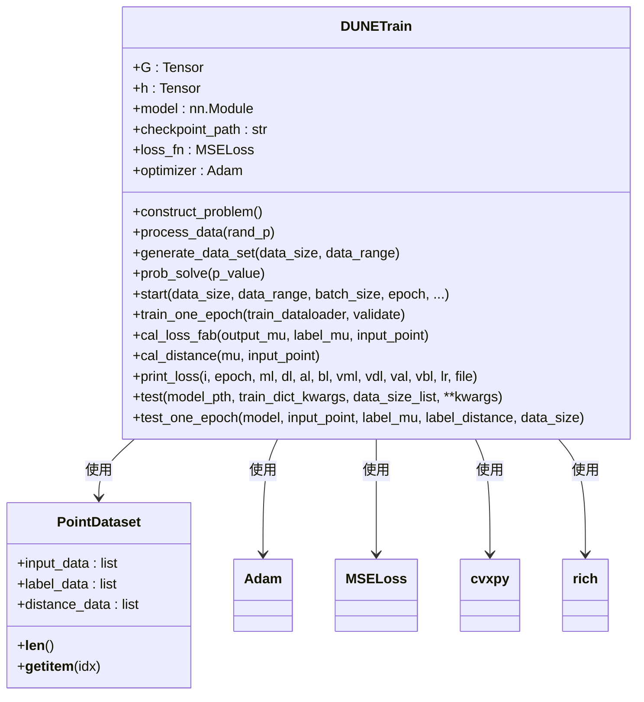

# 训练流程与优化策略

<cite>
**本文档中引用的文件**  
- [trainer.py](file://AEMCARL/crowd_nav/utils/trainer.py)
- [neupan.py](file://NeuPAN/neupan/neupan.py)
- [mpnet.py](file://mpc-mpnet-py/mpnet/networks/mpnet.py)
- [pan.py](file://NeuPAN/neupan/blocks/pan.py)
- [dune_train.py](file://NeuPAN/neupan/blocks/dune_train.py)
- [initial_path.py](file://NeuPAN/neupan/blocks/initial_path.py)
</cite>

## 目录
1. [项目结构](#项目结构)
2. [核心组件](#核心组件)
3. [训练循环架构](#训练循环架构)
4. [优化器与学习率策略](#优化器与学习率策略)
5. [NeuPAN模型结构分析](#neupan模型结构分析)
6. [损失函数设计](#损失函数设计)
7. [高级训练优化技术](#高级训练优化技术)
8. [训练监控与调优](#训练监控与调优)
9. [结论](#结论)

## 项目结构

**图示来源**  
- [trainer.py](file://AEMCARL/crowd_nav/utils/trainer.py)
- [neupan.py](file://NeuPAN/neupan/neupan.py)
- [mpnet.py](file://mpc-mpnet-py/mpnet/networks/mpnet.py)

**章节来源**  
- [trainer.py](file://AEMCARL/crowd_nav/utils/trainer.py)
- [neupan.py](file://NeuPAN/neupan/neupan.py)

## 核心组件

本系统包含三个核心组件：训练器（Trainer）、NeuPAN路径规划模型和MPNet运动规划网络。训练器负责管理训练流程，NeuPAN实现基于模型预测控制的实时路径规划，MPNet则提供基于深度学习的运动规划能力。

**章节来源**  
- [trainer.py](file://AEMCARL/crowd_nav/utils/trainer.py#L1-L86)
- [neupan.py](file://NeuPAN/neupan/neupan.py#L1-L403)
- [mpnet.py](file://mpc-mpnet-py/mpnet/networks/mpnet.py#L1-L47)

## 训练循环架构

**图示来源**  
- [trainer.py](file://AEMCARL/crowd_nav/utils/trainer.py#L40-L86)

**章节来源**  
- [trainer.py](file://AEMCARL/crowd_nav/utils/trainer.py#L40-L86)

## 优化器与学习率策略

**图示来源**  
- [trainer.py](file://AEMCARL/crowd_nav/utils/trainer.py#L20-L38)

**章节来源**  
- [trainer.py](file://AEMCARL/crowd_nav/utils/trainer.py#L20-L38)

## NeuPAN模型结构分析

**图示来源**  
- [neupan.py](file://NeuPAN/neupan/neupan.py#L1-L403)
- [pan.py](file://NeuPAN/neupan/blocks/pan.py#L1-L273)
- [initial_path.py](file://NeuPAN/neupan/blocks/initial_path.py#L1-L484)

**章节来源**  
- [neupan.py](file://NeuPAN/neupan/neupan.py#L1-L403)
- [pan.py](file://NeuPAN/neupan/blocks/pan.py#L1-L273)
- [initial_path.py](file://NeuPAN/neupan/blocks/initial_path.py#L1-L484)

## 损失函数设计

**图示来源**  
- [pan.py](file://NeuPAN/neupan/blocks/pan.py#L100-L150)
- [dune_train.py](file://NeuPAN/neupan/blocks/dune_train.py#L1-L545)

**章节来源**  
- [pan.py](file://NeuPAN/neupan/blocks/pan.py#L100-L150)
- [dune_train.py](file://NeuPAN/neupan/blocks/dune_train.py#L1-L545)

## 高级训练优化技术

**图示来源**  
- [dune_train.py](file://NeuPAN/neupan/blocks/dune_train.py#L1-L545)

**章节来源**  
- [dune_train.py](file://NeuPAN/neupan/blocks/dune_train.py#L1-L545)

## 训练监控与调优

本系统实现了全面的训练监控机制，包括损失值跟踪、学习率调度和模型检查点保存。在DUNE训练过程中，系统会定期验证模型性能，保存检查点，并记录详细的训练日志。通过Rich库提供的进度条和实时输出功能，用户可以直观地监控训练进度和性能指标。

训练过程中采用了多种优化策略：
1. 学习率衰减：每隔指定周期将学习率乘以衰减因子
2. 验证频率控制：定期在验证集上评估模型性能
3. 模型检查点：按指定频率保存模型状态
4. 损失记录：可选择性保存每个周期的损失值

这些机制共同确保了训练过程的稳定性和可追溯性，为模型调优提供了重要依据。

**章节来源**  
- [dune_train.py](file://NeuPAN/neupan/blocks/dune_train.py#L300-L500)
- [trainer.py](file://AEMCARL/crowd_nav/utils/trainer.py#L40-L86)

## 结论

本文档系统地分析了PyTorch训练流程与优化策略在路径规划系统中的应用。通过Trainer类实现了标准化的训练循环，支持多种优化器选择（SGD、Adam、RMSprop）和灵活的学习率配置。NeuPAN模型采用创新的PAN架构，结合DUNE和NRMP组件，实现了高效的实时路径规划。

DUNE训练模块展示了如何为特定机器人几何形状训练专用模型，通过生成大规模训练数据集和多目标损失函数优化，确保了模型的准确性和鲁棒性。整个系统体现了深度学习与传统优化方法的有机结合，为复杂环境下的路径规划提供了有效的解决方案。