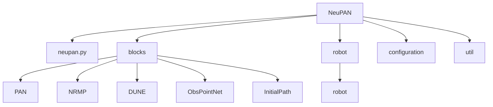
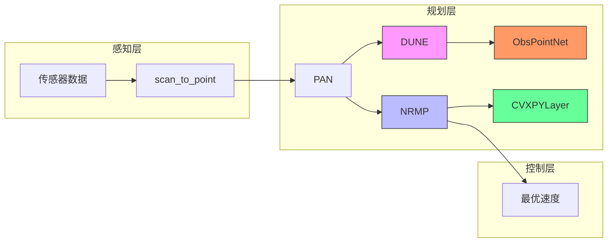
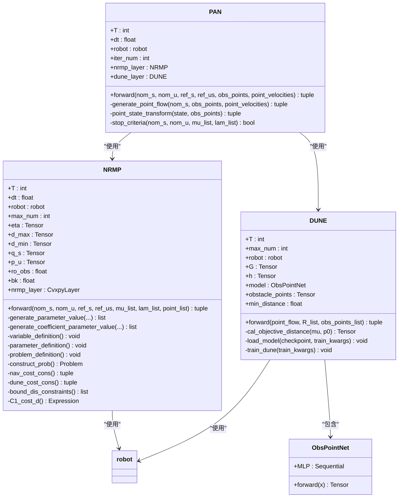
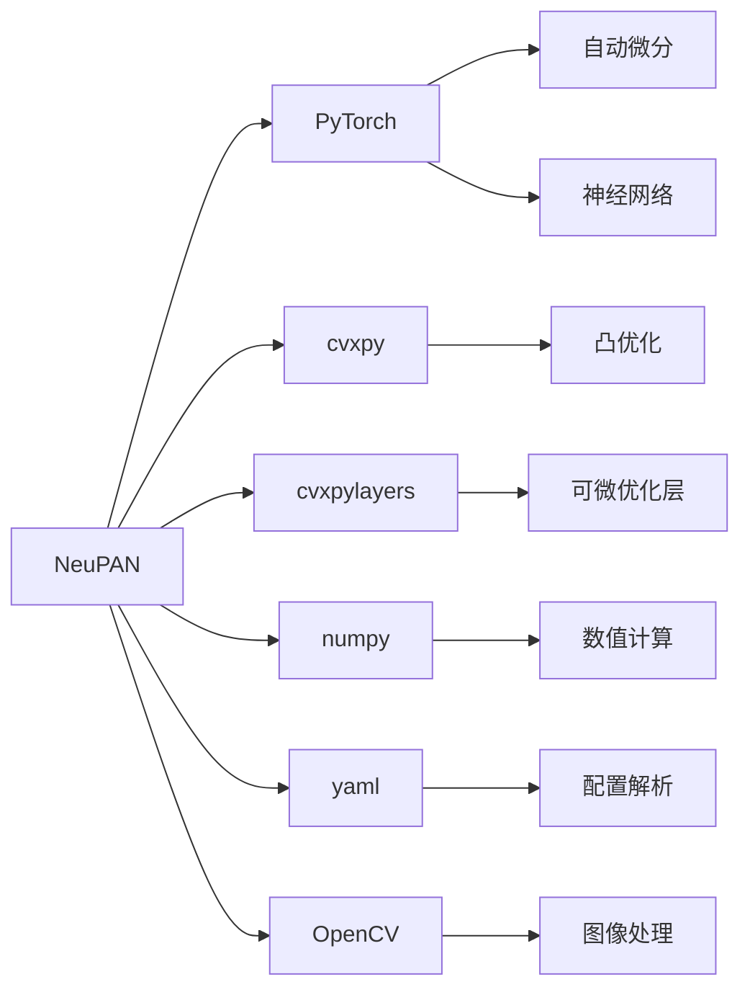

# 机器学习基础

<cite>
**本文档中引用的文件**  
- [neupan.py](file://NeuPAN/neupan/neupan.py)
- [pan.py](file://NeuPAN/neupan/blocks/pan.py)
- [nrmp.py](file://NeuPAN/neupan/blocks/nrmp.py)
- [dune.py](file://NeuPAN/neupan/blocks/dune.py)
- [obs_point_net.py](file://NeuPAN/neupan/blocks/obs_point_net.py)
- [initial_path.py](file://NeuPAN/neupan/blocks/initial_path.py)
- [robot.py](file://NeuPAN/neupan/robot/robot.py)
</cite>

## 目录
1. [引言](#引言)
2. [项目结构](#项目结构)
3. [核心组件](#核心组件)
4. [架构概述](#架构概述)
5. [详细组件分析](#详细组件分析)
6. [依赖分析](#依赖分析)
7. [性能考虑](#性能考虑)
8. [故障排除指南](#故障排除指南)
9. [结论](#结论)

## 引言
本文档旨在为初学者提供关于深度学习在路径规划中应用的全面指导，重点介绍NeuPAN（Neural Proximal Alternating Minimization Network）端到端规划器的实现。文档详细解释了神经网络的基本原理、PyTorch框架的使用方法以及模型训练与评估的完整流程。通过分析NeuPAN项目的具体实现，说明了其架构设计、损失函数定义和优化策略。此外，还提供了从数据预处理到模型部署的完整学习路径，包括张量操作、自动微分、反向传播等核心概念的实践指导，并推荐了经典的学习材料、论文和开源项目，帮助开发者建立扎实的机器学习基础。

## 项目结构
NeuPAN项目是一个基于深度学习的端到端路径规划器，其核心功能实现在`NeuPAN/neupan`目录下。该项目采用模块化设计，主要包含`blocks`、`robot`、`configuration`和`util`等子模块，分别负责核心算法、机器人模型、配置管理和工具函数。`blocks`模块是NeuPAN的核心，包含了`PAN`、`NRMP`、`DUNE`等关键类，实现了基于交替最小化的优化框架。`robot`模块定义了机器人的运动学模型和约束条件。项目通过`neupan.py`作为主入口，封装了`PAN`类，为用户提供了一个用户友好的接口。

**图表来源**
- [neupan.py](file://NeuPAN/neupan/neupan.py)
- [pan.py](file://NeuPAN/neupan/blocks/pan.py)
- [nrmp.py](file://NeuPAN/neupan/blocks/nrmp.py)
- [dune.py](file://NeuPAN/neupan/blocks/dune.py)
- [obs_point_net.py](file://NeuPAN/neupan/blocks/obs_point_net.py)
- [initial_path.py](file://NeuPAN/neupan/blocks/initial_path.py)
- [robot.py](file://NeuPAN/neupan/robot/robot.py)

**章节来源**
- [neupan.py](file://NeuPAN/neupan/neupan.py)
- [blocks](file://NeuPAN/neupan/blocks)
- [robot](file://NeuPAN/neupan/robot)

## 核心组件
NeuPAN的核心组件是一个基于PyTorch构建的端到端神经规划网络。其主类`neupan`继承自`torch.nn.Module`，封装了路径规划的整个流程。该组件接收机器人的当前状态和障碍物点云作为输入，输出最优的速度控制指令。其内部集成了`InitialPath`模块用于生成初始参考路径，以及`PAN`（Proximal Alternating-minimization Network）模块用于执行核心的优化计算。`PAN`模块本身又由`NRMP`（Neural Regularized Motion Planner）和`DUNE`（Deep Unfolded Neural Encoder）两个子模块协同工作，前者负责求解带约束的优化问题，后者则利用神经网络将障碍物点云映射到一个利于优化的潜在距离空间。

**章节来源**
- [neupan.py](file://NeuPAN/neupan/neupan.py#L1-L402)
- [pan.py](file://NeuPAN/neupan/blocks/pan.py#L1-L272)
- [nrmp.py](file://NeuPAN/neupan/blocks/nrmp.py#L1-L325)
- [dune.py](file://NeuPAN/neupan/blocks/dune.py#L1-L211)

## 架构概述
NeuPAN的架构设计遵循了“感知-规划-控制”的经典范式，并通过深度学习技术实现了端到端的优化。其整体架构可以分为三个主要层次：感知层、规划层和控制层。感知层负责将传感器（如激光雷达）获取的原始数据（如`scan`字典）转换为可用于规划的障碍物点云。规划层是核心，由`PAN`算法驱动，它采用交替最小化（Alternating Minimization）的策略，在`NRMP`和`DUNE`之间迭代求解。`DUNE`利用一个名为`ObsPointNet`的神经网络，将复杂的点云避障约束“编码”成一个可微的、低维的潜在距离特征（`mu`和`lambda`）。`NRMP`则利用这些特征，结合机器人动力学模型和参考路径，构建并求解一个凸优化问题，以生成平滑、安全的轨迹。最终，控制层输出最优的速度指令。

**图表来源**
- [neupan.py](file://NeuPAN/neupan/neupan.py#L1-L402)
- [pan.py](file://NeuPAN/neupan/blocks/pan.py#L1-L272)
- [nrmp.py](file://NeuPAN/neupan/blocks/nrmp.py#L1-L325)
- [dune.py](file://NeuPAN/neupan/blocks/dune.py#L1-L211)
- [obs_point_net.py](file://NeuPAN/neupan/blocks/obs_point_net.py#L1-L48)

## 详细组件分析
本节将深入分析NeuPAN中的关键组件，揭示其内部工作原理。

### PAN模块分析
`PAN`（Proximal Alternating-minimization Network）是NeuPAN算法的核心优化引擎。它通过交替更新两个变量集来求解路径规划问题：机器人的状态和控制输入（由`NRMP`处理），以及障碍物的潜在距离特征（由`DUNE`处理）。这种交替策略将一个复杂的非凸问题分解为两个相对容易求解的子问题。

**图表来源**
- [pan.py](file://NeuPAN/neupan/blocks/pan.py#L1-L272)
- [nrmp.py](file://NeuPAN/neupan/blocks/nrmp.py#L1-L325)
- [dune.py](file://NeuPAN/neupan/blocks/dune.py#L1-L211)
- [obs_point_net.py](file://NeuPAN/neupan/blocks/obs_point_net.py#L1-L48)

**章节来源**
- [pan.py](file://NeuPAN/neupan/blocks/pan.py#L1-L272)

#### 神经网络组件：DUNE与ObsPointNet
`DUNE`（Deep Unfolded Neural Encoder）模块的核心是一个名为`ObsPointNet`的神经网络。`ObsPointNet`是一个多层感知机（MLP），其作用是将障碍物点云映射到一个“潜在距离空间”。这个网络的输入是障碍物点在机器人坐标系下的位置（`point_flow`），输出是`mu`向量。`mu`向量与机器人自身的几何约束矩阵`G`和`h`相结合，可以计算出机器人与障碍物之间的“距离”。`DUNE`模块利用`ObsPointNet`的输出，结合旋转矩阵`R`，计算出优化问题中的拉格朗日乘子`lambda`，从而将复杂的非凸避障约束转化为一个可微的、凸的优化项，供`NRMP`模块使用。

#### 优化求解组件：NRMP
`NRMP`（Neural Regularized Motion Planner）模块负责求解一个带约束的凸优化问题。它利用`cvxpylayers`库，将一个`cvxpy`定义的优化问题封装成一个可微的PyTorch层（`CvxpyLayer`）。该优化问题的目标函数由两部分组成：导航成本（`nav_cost`）和避障成本（`dune_cost`）。导航成本确保生成的轨迹平滑并跟踪参考路径，而避障成本则利用`DUNE`提供的`lambda`和`mu`来强制执行安全距离。约束条件包括机器人动力学、速度/加速度限制以及状态边界。通过将优化问题作为神经网络的一层，`NRMP`能够实现端到端的训练和推理。

### 初始路径生成分析
`InitialPath`模块负责为`PAN`算法提供一个初始的、可行的参考路径。它可以根据给定的航路点（`waypoints`）或目标点（`goal`）生成一条平滑的曲线。该模块支持多种曲线风格（如直线、样条线），并能处理不同运动学模型（如阿克曼转向、差速驱动）的机器人。生成的初始路径不仅包含位置和朝向，还包括了前进/后退的档位信息（`gear`），这对于处理复杂的倒车入库等场景至关重要。`InitialPath`模块还实现了路径跟踪逻辑，能够根据机器人的当前位置动态地更新参考状态，为`PAN`模块提供持续的参考输入。

**章节来源**
- [initial_path.py](file://NeuPAN/neupan/blocks/initial_path.py#L1-L483)

### 机器人模型分析
`robot`模块定义了机器人的抽象模型，为`NRMP`模块提供必要的信息。它通过`vertices`（顶点）或`length`、`width`等参数定义了机器人的几何形状，并利用`gen_inequal_from_vertex`函数将其转换为线性不等式约束`Gx <= h`，这是避障优化的基础。该模块还根据机器人的运动学类型（`kinematics`）定义了其动力学方程（如阿克曼模型或差速模型），并在线性化后生成优化问题所需的`A`、`B`、`C`矩阵。此外，它还封装了速度、加速度等边界约束的定义。`robot`模块的设计使得NeuPAN算法可以轻松适配不同类型的机器人。

**章节来源**
- [robot.py](file://NeuPAN/neupan/robot/robot.py#L1-L349)

## 依赖分析
NeuPAN项目依赖于多个关键的第三方库。其核心依赖是`PyTorch`，用于构建和训练神经网络（`ObsPointNet`）以及进行张量运算。`cvxpy`和`cvxpylayers`库是实现`NRMP`模块的关键，前者用于定义凸优化问题，后者则将其与PyTorch无缝集成，实现可微优化。`numpy`用于处理数值计算和数组操作。此外，项目还依赖于`yaml`库来解析配置文件，`cv2`（OpenCV）可能用于某些图像处理任务（尽管在当前分析的代码中未直接体现）。这些依赖共同构成了一个强大的深度学习与优化框架。

**图表来源**
- [neupan.py](file://NeuPAN/neupan/neupan.py#L1-L402)
- [pan.py](file://NeuPAN/neupan/blocks/pan.py#L1-L272)
- [nrmp.py](file://NeuPAN/neupan/blocks/nrmp.py#L1-L325)
- [dune.py](file://NeuPAN/neupan/blocks/dune.py#L1-L211)

**章节来源**
- [neupan.py](file://NeuPAN/neupan/neupan.py#L1-L402)
- [pan.py](file://NeuPAN/neupan/blocks/pan.py#L1-L272)
- [nrmp.py](file://NeuPAN/neupan/blocks/nrmp.py#L1-L325)
- [dune.py](file://NeuPAN/neupan/blocks/dune.py#L1-L211)

## 性能考虑
NeuPAN的性能主要受其核心优化循环的影响。`PAN`模块的`forward`方法需要在`NRMP`和`DUNE`之间进行多次迭代，每次迭代都涉及一次神经网络前向传播和一次凸优化求解。其中，凸优化求解（由`cvxpylayers`调用底层求解器如ECOS）通常是计算瓶颈。为了提升性能，代码中实现了点云的下采样（`downsample_decimation`），以减少`DUNE`模块的输入数据量。此外，`ObsPointNet`模型在推理时被设置为`eval()`模式并使用`torch.no_grad()`，以关闭梯度计算，加快前向传播速度。对于实时性要求极高的应用，可以考虑使用更轻量级的神经网络架构或更高效的优化求解器。

## 故障排除指南
在使用NeuPAN时，可能会遇到以下常见问题：
1.  **DUNE模型未找到**：当`DUNE`模块初始化时找不到预训练的检查点（`checkpoint`），它会提示用户是否要立即训练模型。如果选择不训练，程序将退出。解决方案是确保提供了正确的模型路径，或在`train_kwargs`中设置`direct_train=True`以跳过此检查。
2.  **碰撞检测失败**：如果机器人在运行中发生碰撞，可能是`collision_threshold`设置过高，或者`DUNE`模型未在足够多样化的场景中进行训练，导致其对障碍物的感知不准确。应检查传感器数据是否正确转换为点云，并考虑重新训练`DUNE`模型。
3.  **轨迹不平滑或震荡**：这通常与`NRMP`模块中的权重参数（`q_s`, `p_u`, `eta`）有关。可以尝试调整这些参数，例如增加`p_u`以使速度更平滑，或增加`eta`以加强避障。
4.  **初始路径生成失败**：如果`InitialPath`无法生成路径，应检查输入的航路点是否有效，以及`curve_style`参数是否正确。

**章节来源**
- [dune.py](file://NeuPAN/neupan/blocks/dune.py#L1-L211)
- [neupan.py](file://NeuPAN/neupan/neupan.py#L1-L402)

## 结论
NeuPAN是一个创新的端到端路径规划框架，它巧妙地结合了深度学习和凸优化的优势。通过`DUNE`模块，它将复杂的环境感知问题转化为一个可微的优化输入；通过`NRMP`模块，它利用成熟的凸优化技术生成安全、平滑的轨迹。这种混合方法既保留了深度学习的灵活性，又保证了规划结果的可靠性和可解释性。对于初学者而言，NeuPAN项目是学习PyTorch、自动微分、可微优化和机器人路径规划的绝佳范例。建议从理解`ObsPointNet`的结构和`NRMP`的优化问题构建开始，逐步深入到整个`PAN`的交替优化流程，从而全面掌握这一先进的机器学习应用。