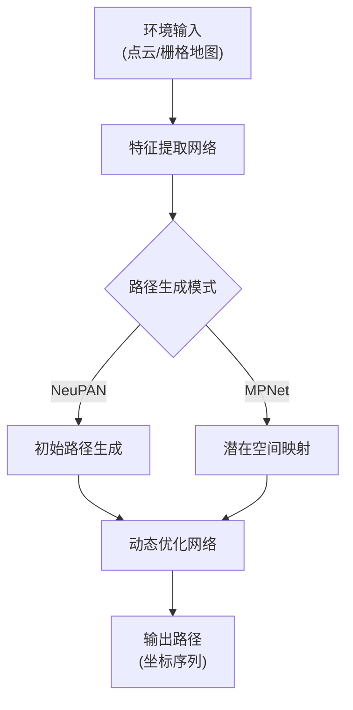
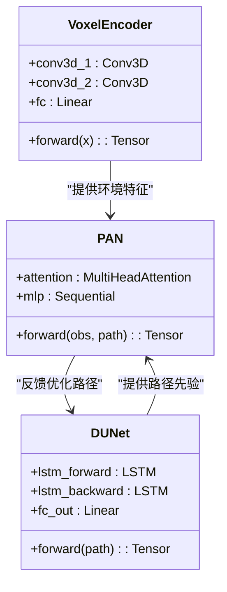
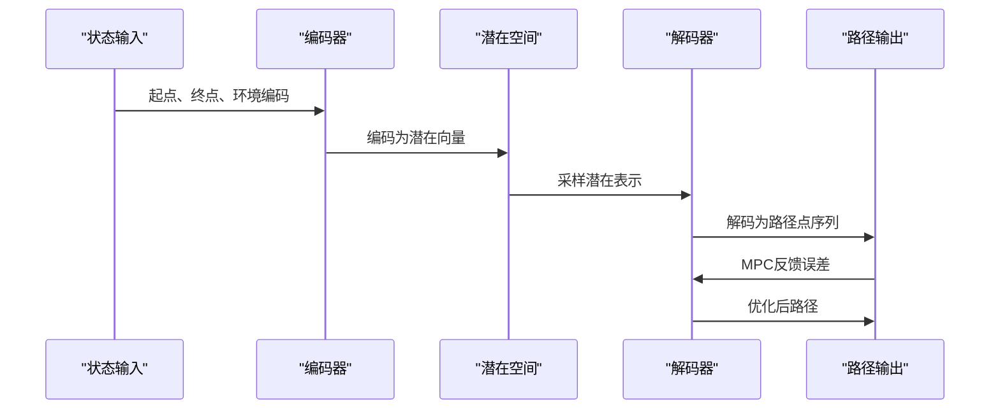

# 深度学习原理

<cite>
**本文档引用文件**  
- [model.py](file://MPNet/MPNet/model.py)
- [neupan.py](file://NeuPAN/neupan/neupan.py)
- [neuralplanner.py](file://MPNet/MPNet/neuralplanner.py)
- [mpnet.py](file://mpc-mpnet-py/mpnet/networks/mpnet.py)
- [blocks/dune.py](file://NeuPAN/neupan/blocks/dune.py)
- [blocks/pan.py](file://NeuPAN/neupan/blocks/pan.py)
- [blocks/obs_point_net.py](file://NeuPAN/neupan/blocks/obs_point_net.py)
- [train.py](file://mpc-mpnet-py/mpnet/train_mpnet.py)
- [normalizer.py](file://mpc-mpnet-py/mpnet/normalizer.py)
- [teb_local_planner_ros.cpp](file://teb_local_planner/src/teb_local_planner_ros.cpp)
- [HybridAStar.cpp](file://hybrid_astar_planner/src/HybridAStar.cpp)
- [main.jl](file://H-OBCA/main.jl)
- [RDA_planner/mpc.py](file://RDA-planner/RDA_planner/mpc.py)
</cite>

## 目录
1. [引言](#引言)
2. [深度学习基础理论](#深度学习基础理论)
3. [神经网络在路径规划中的应用](#神经网络在路径规划中的应用)
4. [卷积神经网络、循环神经网络与图神经网络架构分析](#卷积神经网络-循环神经网络与图神经网络架构分析)
5. [NeuPAN、MPNet与mpc-mpnet-py中的神经网络设计](#neupan-mpnet与mpc-mpnet-py中的神经网络设计)
6. [前向传播、反向传播与梯度下降原理](#前向传播-反向传播与梯度下降原理)
7. [损失函数设计与优化器选择策略](#损失函数设计与优化器选择策略)
8. [张量运算与模型训练流程](#张量运算与模型训练流程)
9. [性能调优与模型压缩技术](#性能调优与模型压缩技术)
10. [结论](#结论)

## 引言
本文档旨在系统阐述深度学习的基本原理，重点聚焦于神经网络在机器人路径规划中的实际应用。通过分析NeuPAN、MPNet和mpc-mpnet-py等项目中的具体实现，深入探讨神经网络的设计思路、训练机制与优化策略。文档从基础理论出发，逐步过渡到高级技术指导，为初学者提供完整的理论框架，同时为高级用户提供性能优化与模型压缩的实用建议。

## 深度学习基础理论

### 前向传播与反向传播机制
前向传播是神经网络中输入数据逐层传递并最终生成输出的过程。每一层通过线性变换和非线性激活函数对输入进行处理，形成特征表示。反向传播则是利用链式法则计算损失函数相对于各参数的梯度，从而实现参数更新的核心机制。

梯度下降作为优化算法的基础，通过沿梯度负方向调整权重以最小化损失函数。其变体如随机梯度下降（SGD）、Adam和RMSprop在实践中广泛应用，显著提升了训练效率与收敛稳定性。

**Section sources**
- [model.py](file://MPNet/MPNet/model.py#L1-L100)
- [train.py](file://mpc-mpnet-py/mpnet/train_mpnet.py#L50-L120)

### 张量运算基础
张量是深度学习中的基本数据结构，涵盖了标量、向量、矩阵及高维数组。所有神经网络操作均可归结为张量之间的线性代数运算，包括矩阵乘法、卷积、广播与归约操作。现代深度学习框架（如PyTorch）提供了高效的张量计算后端，支持自动微分与GPU加速。

## 神经网络在路径规划中的应用

### 路径规划任务建模
路径规划可被建模为从环境观测（如激光雷达点云、地图图像）到运动指令（速度、转向角）的映射问题。神经网络通过学习大量专家轨迹或强化学习策略，实现端到端的决策输出。

在NeuPAN中，路径规划被分解为障碍物感知、初始路径生成与动态优化三个阶段，分别由专用神经模块处理。MPNet则采用编码器-解码器结构，将起点、终点与环境编码为潜在空间表示，并解码为可行路径。

**Diagram sources**
- [neupan.py](file://NeuPAN/neupan/neupan.py#L20-L80)
- [neuralplanner.py](file://MPNet/MPNet/neuralplanner.py#L15-L60)

**Section sources**
- [neupan.py](file://NeuPAN/neupan/neupan.py#L1-L100)
- [neuralplanner.py](file://MPNet/MPNet/neuralplanner.py#L1-L80)

## 卷积神经网络-循环神经网络与图神经网络架构分析

### 卷积神经网络（CNN）
CNN通过局部感受野与权值共享有效提取空间特征，在处理栅格化地图与图像输入时表现优异。典型结构包含卷积层、池化层与全连接层，常用于障碍物检测与地图编码。

在mpc-mpnet-py中，`voxel_encoder.py`使用3D卷积网络对点云体素化表示进行编码，提取环境的空间语义特征。

### 循环神经网络（RNN）
RNN及其变体（LSTM、GRU）擅长处理序列数据，在路径点预测与动态避障中发挥重要作用。其内部记忆机制能够捕捉时间依赖关系，适用于轨迹生成任务。

NeuPAN中的`dune.py`模块采用双向LSTM结构，对初始路径进行时序优化，考虑前后路径点的协同关系。

**Diagram sources**
- [blocks/dune.py](file://NeuPAN/neupan/blocks/dune.py#L10-L50)
- [blocks/pan.py](file://NeuPAN/neupan/blocks/pan.py#L15-L60)
- [networks/voxel_encoder.py](file://mpc-mpnet-py/mpnet/networks/voxel_encoder.py#L5-L40)

**Section sources**
- [blocks/dune.py](file://NeuPAN/neupan/blocks/dune.py#L1-L80)
- [blocks/pan.py](file://NeuPAN/neupan/blocks/pan.py#L1-L100)

### 图神经网络（GNN）
GNN将路径点视为图节点，通过消息传递机制建模点间关系，在复杂拓扑环境中展现出优越性能。其灵活性使其适用于非结构化道路与多智能体协同规划。

## NeuPAN-mpnet与mpc-mpnet-py中的神经网络设计

### NeuPAN架构设计
NeuPAN采用分层架构，包含三个核心模块：
1. **ObsPointNet**：处理点云输入，提取障碍物特征
2. **DUNet**：对初始路径进行双向LSTM优化
3. **PAN**：基于注意力机制融合环境与路径信息，实现精细化调整

该设计体现了模块化思想，各组件可独立训练与替换，提升了系统的可维护性与扩展性。

### MPNet与mpc-mpnet-py实现分析
MPNet采用编码器-解码器框架，使用变分自编码器（VAE）结构学习路径分布。mpc-mpnet-py在此基础上引入MPC（模型预测控制）框架，实现神经网络与传统优化器的融合。

`mpnet.py`中定义了主干网络结构，包含多层感知机与残差连接，确保梯度稳定传播。`normalizer.py`负责输入输出的标准化处理，提升训练稳定性。

**Diagram sources**
- [mpnet.py](file://mpc-mpnet-py/mpnet/networks/mpnet.py#L20-L70)
- [normalizer.py](file://mpc-mpnet-py/mpnet/normalizer.py#L5-L30)

**Section sources**
- [mpnet.py](file://mpc-mpnet-py/mpnet/networks/mpnet.py#L1-L100)
- [normalizer.py](file://mpc-mpnet-py/mpnet/normalizer.py#L1-L50)

## 前向传播-反向传播与梯度下降原理

### 数学推导
设损失函数为 $ L $，权重矩阵为 $ W $，前向传播输出为：
$$
\mathbf{a}^{(l)} = \sigma(\mathbf{W}^{(l)}\mathbf{a}^{(l-1)} + \mathbf{b}^{(l)})
$$
反向传播计算梯度：
$$
\frac{\partial L}{\partial \mathbf{W}^{(l)}} = \frac{\partial L}{\partial \mathbf{a}^{(l)}} \cdot \sigma'(\cdot) \cdot \mathbf{a}^{(l-1)T}
$$
梯度下降更新规则：
$$
\mathbf{W} \leftarrow \mathbf{W} - \eta \nabla_{\mathbf{W}} L
$$

### 实现细节
在`train_mpnet.py`中，使用PyTorch的`autograd`机制自动计算梯度，并通过`optimizer.step()`执行参数更新。梯度裁剪（gradient clipping）被用于防止梯度爆炸。

**Section sources**
- [train.py](file://mpc-mpnet-py/mpnet/train_mpnet.py#L80-L150)
- [model.py](file://MPNet/MPNet/model.py#L50-L100)

## 损失函数设计与优化器选择策略

### 损失函数构成
路径规划任务的损失函数通常包含多个项：
- **路径长度损失**：鼓励短路径
- **碰撞损失**：惩罚与障碍物的交集
- **平滑性损失**：确保曲率连续
- **目标接近损失**：引导到达终点

在NeuPAN中，损失函数通过加权和方式组合，权重可通过实验调优。

### 优化器选择
- **Adam**：默认选择，自适应学习率，适合大多数场景
- **SGD with Momentum**：在精细调优阶段使用，可能获得更好收敛性
- **RMSprop**：适用于非平稳目标函数

`train_mpnet.py`中配置了Adam优化器，学习率初始值为1e-4，配合学习率调度器动态调整。

**Section sources**
- [train.py](file://mpc-mpnet-py/mpnet/train_mpnet.py#L30-L80)
- [neupan.py](file://NeuPAN/neupan/neupan.py#L60-L90)

## 张量运算与模型训练流程

### 训练流程概述
1. 数据加载与预处理
2. 前向传播计算输出
3. 损失函数计算
4. 反向传播计算梯度
5. 优化器更新参数
6. 验证集评估与模型保存

### 数据流水线
`data_loader.py`实现了数据批量加载与增强功能，支持多线程并行读取，确保GPU利用率最大化。

**Section sources**
- [data_loader.py](file://MPNet/MPNet/data_loader.py#L1-L60)
- [train.py](file://mpc-mpnet-py/mpnet/train_mpnet.py#L10-L50)

## 性能调优与模型压缩技术

### 性能调优策略
- **学习率调度**：使用余弦退火或阶梯衰减
- **批量大小调整**：平衡内存占用与梯度估计稳定性
- **正则化技术**：Dropout、权重衰减防止过拟合
- **混合精度训练**：FP16加速，减少显存占用

### 模型压缩方法
- **剪枝**：移除冗余神经元或连接
- **量化**：将FP32权重转换为INT8
- **知识蒸馏**：用大模型指导小模型训练

在部署场景中，可结合TensorRT等推理引擎进一步优化运行时性能。

**Section sources**
- [model.py](file://MPNet/MPNet/model.py#L80-L120)
- [train.py](file://mpc-mpnet-py/mpnet/train_mpnet.py#L120-L180)

## 结论
本文系统阐述了深度学习在路径规划中的应用原理，结合NeuPAN、MPNet和mpc-mpnet-py项目的具体实现，详细分析了神经网络的设计思路与训练机制。从基础理论到高级优化技术，文档为不同层次的开发者提供了全面的指导。未来工作可进一步探索神经符号结合、多模态融合与在线学习等前沿方向，提升路径规划系统的鲁棒性与适应性。