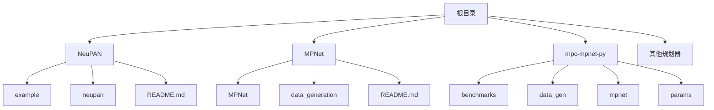
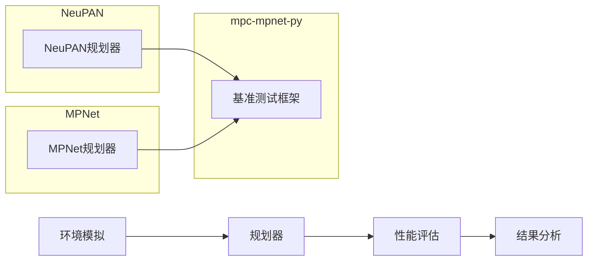
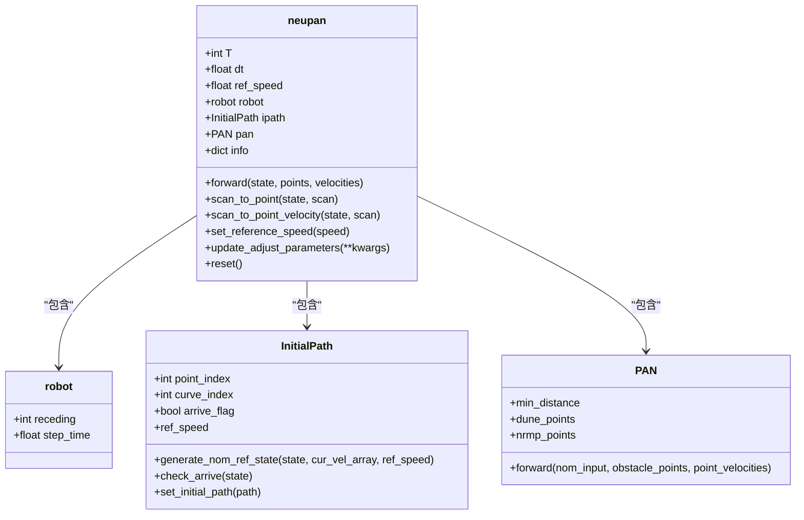
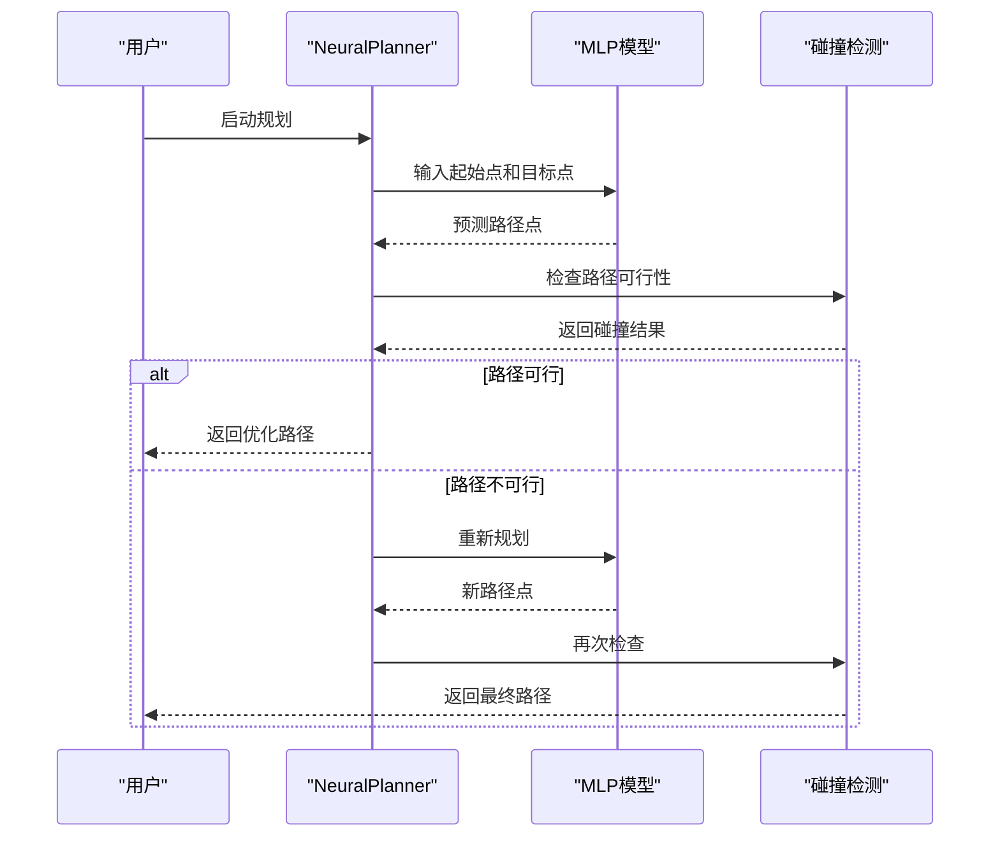
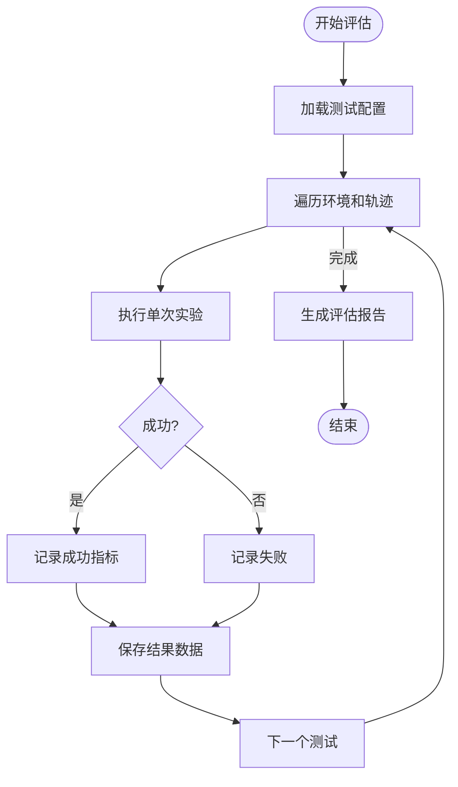
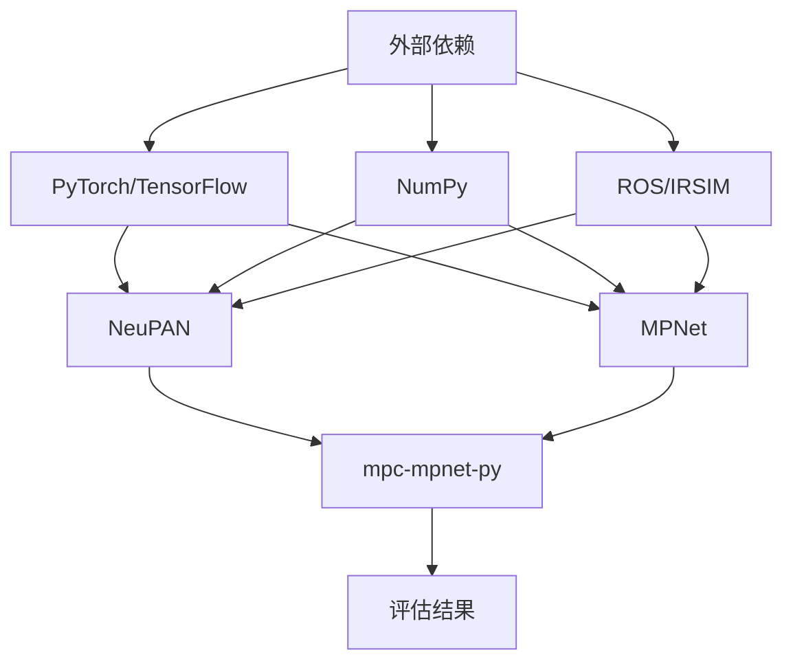

# 性能评估与基准测试

<cite>
**本文档引用的文件**  
- [run_exp.py](file://NeuPAN/example/run_exp.py)
- [neupan.py](file://NeuPAN/neupan/neupan.py)
- [benchmark.py](file://mpc-mpnet-py/benchmarks/benchmark.py)
- [mp_path_exp.py](file://mpc-mpnet-py/benchmarks/experiments/mp_path_exp.py)
- [neuralplanner.py](file://MPNet/MPNet/neuralplanner.py)
</cite>

## 目录
1. [引言](#引言)
2. [项目结构](#项目结构)
3. [核心组件](#核心组件)
4. [架构概述](#架构概述)
5. [详细组件分析](#详细组件分析)
6. [依赖分析](#依赖分析)
7. [性能考量](#性能考量)
8. [故障排除指南](#故障排除指南)
9. [结论](#结论)

## 引言
本文档系统介绍了NeuPAN、MPNet和mpc-mpnet-py中采用的端到端规划器性能评估方法和基准测试框架。重点分析了这些系统中的评估指标、测试流程和定量评估方法，包括成功率、路径长度、计算时间和安全性等关键指标。通过实际测试案例，展示了不同规划器在各种复杂环境下的表现对比，并提供了详细的测试配置指南和结果分析方法，帮助开发者建立可靠的评估体系以验证和改进其规划算法。

## 项目结构
本项目包含多个独立的规划器实现和评估框架，主要包括NeuPAN、MPNet和mpc-mpnet-py三个核心组件。每个组件都有独立的目录结构，包含示例、配置文件和核心代码。NeuPAN提供了基于Python的端到端规划器实现，MPNet包含神经网络规划器的训练和推理代码，而mpc-mpnet-py则提供了完整的基准测试框架。

**Diagram sources**
- [NeuPAN](file://NeuPAN)
- [MPNet](file://MPNet)
- [mpc-mpnet-py](file://mpc-mpnet-py)

**Section sources**
- [NeuPAN](file://NeuPAN)
- [MPNet](file://MPNet)
- [mpc-mpnet-py](file://mpc-mpnet-py)

## 核心组件
系统的核心组件包括NeuPAN规划器、MPNet神经网络规划器和mpc-mpnet-py基准测试框架。NeuPAN实现了基于模型预测控制(MPC)和神经网络的端到端规划算法，MPNet提供了基于深度学习的路径规划解决方案，而mpc-mpnet-py则为这些规划器提供了统一的性能评估平台。

**Section sources**
- [neupan.py](file://NeuPAN/neupan/neupan.py)
- [neuralplanner.py](file://MPNet/MPNet/neuralplanner.py)
- [benchmark.py](file://mpc-mpnet-py/benchmarks/benchmark.py)

## 架构概述
系统采用模块化架构设计，将规划算法、环境模拟和性能评估分离。NeuPAN和MPNet作为独立的规划器实现，通过标准化接口与评估框架交互。mpc-mpnet-py提供了统一的基准测试接口，支持多种规划算法的性能对比。

**Diagram sources**
- [neupan.py](file://NeuPAN/neupan/neupan.py)
- [neuralplanner.py](file://MPNet/MPNet/neuralplanner.py)
- [benchmark.py](file://mpc-mpnet-py/benchmarks/benchmark.py)

## 详细组件分析

### NeuPAN规划器分析
NeuPAN规划器实现了基于MPC框架的端到端规划算法，通过`neupan`类封装了完整的规划逻辑。该类提供了`forward`方法进行实时规划决策，`scan_to_point`方法处理传感器数据，以及多种辅助方法用于路径生成和参数调整。

#### 类图

**Diagram sources**
- [neupan.py](file://NeuPAN/neupan/neupan.py)

**Section sources**
- [neupan.py](file://NeuPAN/neupan/neupan.py)
- [run_exp.py](file://NeuPAN/example/run_exp.py)

### MPNet规划器分析
MPNet规划器基于深度学习技术实现路径规划，通过神经网络模型预测最优路径。`neuralplanner.py`文件包含了完整的推理逻辑，包括路径生成、碰撞检测和路径优化等功能。

#### 序列图

**Diagram sources**
- [neuralplanner.py](file://MPNet/MPNet/neuralplanner.py)

**Section sources**
- [neuralplanner.py](file://MPNet/MPNet/neuralplanner.py)

### 基准测试框架分析
mpc-mpnet-py提供了完整的基准测试框架，通过`benchmark.py`和`mp_path_exp.py`文件实现了系统化的性能评估流程。该框架支持多种评估指标的自动化测试和结果记录。

#### 流程图

**Diagram sources**
- [benchmark.py](file://mpc-mpnet-py/benchmarks/benchmark.py)
- [mp_path_exp.py](file://mpc-mpnet-py/benchmarks/experiments/mp_path_exp.py)

**Section sources**
- [benchmark.py](file://mpc-mpnet-py/benchmarks/benchmark.py)
- [mp_path_exp.py](file://mpc-mpnet-py/benchmarks/experiments/mp_path_exp.py)

## 依赖分析
系统各组件之间的依赖关系清晰，NeuPAN和MPNet作为独立的规划器实现，依赖于各自的深度学习框架和环境模拟器。mpc-mpnet-py基准测试框架则依赖于具体的规划器实现和数据生成模块。

**Diagram sources**
- [neupan.py](file://NeuPAN/neupan/neupan.py)
- [neuralplanner.py](file://MPNet/MPNet/neuralplanner.py)
- [benchmark.py](file://mpc-mpnet-py/benchmarks/benchmark.py)

**Section sources**
- [neupan.py](file://NeuPAN/neupan/neupan.py)
- [neuralplanner.py](file://MPNet/MPNet/neuralplanner.py)
- [benchmark.py](file://mpc-mpnet-py/benchmarks/benchmark.py)

## 性能考量
在性能评估过程中，需要重点关注以下几个方面：计算效率、内存使用、实时性和可扩展性。NeuPAN规划器通过MPC框架实现了较好的实时性能，MPNet则在路径质量方面表现出色，而mpc-mpnet-py框架提供了全面的性能监控能力。

## 故障排除指南
当评估过程中遇到问题时，可以参考以下常见问题的解决方案：确保所有依赖项正确安装，验证配置文件的正确性，检查数据路径是否有效，以及确认硬件资源充足。对于特定的规划器问题，需要检查其特有的参数设置和运行环境。

**Section sources**
- [neupan.py](file://NeuPAN/neupan/neupan.py)
- [neuralplanner.py](file://MPNet/MPNet/neuralplanner.py)
- [benchmark.py](file://mpc-mpnet-py/benchmarks/benchmark.py)

## 结论
本文档详细介绍了NeuPAN、MPNet和mpc-mpnet-py中的性能评估方法和基准测试框架。通过系统化的评估流程和全面的指标体系，开发者可以有效地验证和改进其规划算法。建议在实际应用中结合具体需求选择合适的评估方法，并持续优化规划器的性能表现。