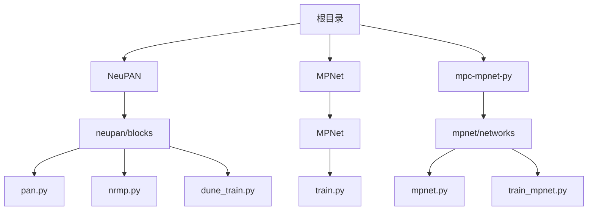
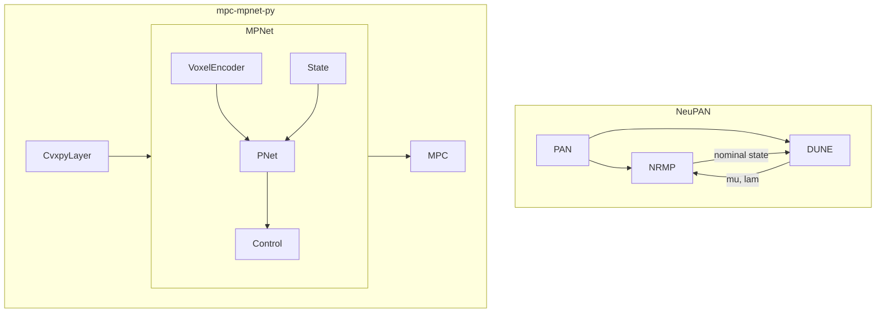
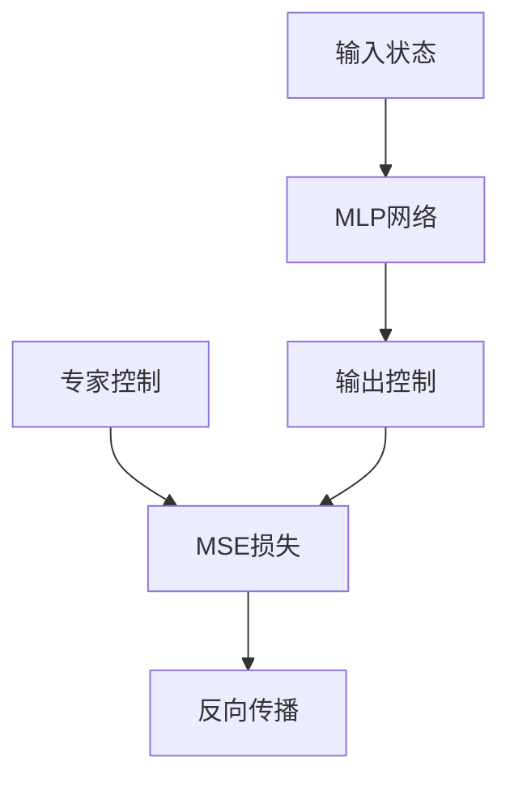
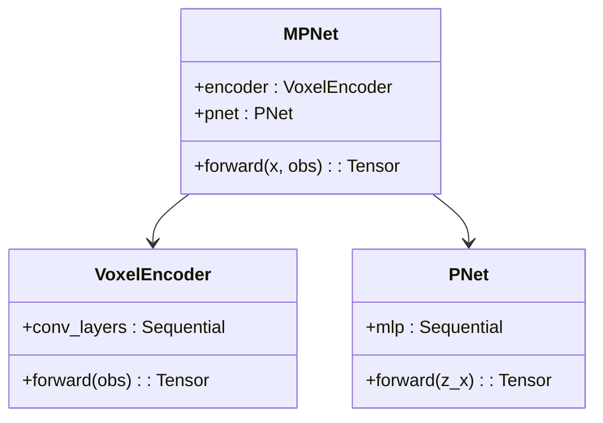
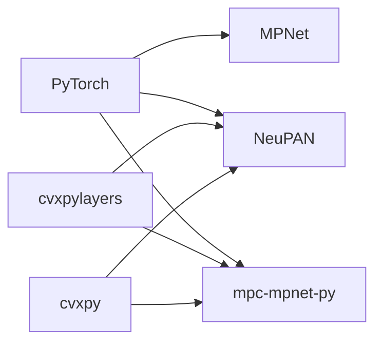

# 损失函数设计与优化

<cite>
**本文档中引用的文件**  
- [pan.py](file://NeuPAN/neupan/blocks/pan.py)
- [dune_train.py](file://NeuPAN/neupan/blocks/dune_train.py)
- [nrmp.py](file://NeuPAN/neupan/blocks/nrmp.py)
- [train.py](file://MPNet/MPNet/train.py)
- [train_mpnet.py](file://mpc-mpnet-py/mpnet/train_mpnet.py)
- [mpnet.py](file://mpc-mpnet-py/mpnet/networks/mpnet.py)
</cite>

## 目录
1. [引言](#引言)
2. [项目结构](#项目结构)
3. [核心组件](#核心组件)
4. [架构概述](#架构概述)
5. [详细组件分析](#详细组件分析)
6. [依赖分析](#依赖分析)
7. [性能考量](#性能考量)
8. [故障排除指南](#故障排除指南)
9. [结论](#结论)

## 引言
本文档深入探讨了端到端规划器中损失函数的设计原则与实现方法，重点分析NeuPAN、MPNet和mpc-mpnet-py三种系统中采用的不同损失函数组合。通过加权组合轨迹平滑度、碰撞距离、目标接近度等多目标损失，优化规划性能。结合代码实例说明损失函数在训练过程中的动态调整策略，如课程学习和自适应权重分配。讨论损失函数设计对模型收敛速度、泛化能力和安全性的具体影响，并提供调优建议和常见问题解决方案。

## 项目结构
本项目包含多个独立的路径规划与控制算法实现，主要包括NeuPAN、MPNet、mpc-mpnet-py等核心模块。每个模块具有独立的训练、推理和配置文件结构。NeuPAN采用基于神经网络的交替最小化框架，MPNet使用编码器-解码器结构进行运动规划，而mpc-mpnet-py则结合了模型预测控制与神经网络。



**Diagram sources**
- [pan.py](file://NeuPAN/neupan/blocks/pan.py)
- [train.py](file://MPNet/MPNet/train.py)
- [mpnet.py](file://mpc-mpnet-py/mpnet/networks/mpnet.py)

**Section sources**
- [pan.py](file://NeuPAN/neupan/blocks/pan.py)
- [train.py](file://MPNet/MPNet/train.py)
- [mpnet.py](file://mpc-mpnet-py/mpnet/networks/mpnet.py)

## 核心组件
NeuPAN系统的核心组件包括PAN（Proximal Alternating-minimization Network）、NRMP（Neural Regularized Motion Planner）和DUNE（Distance UNducing Encoder）。PAN作为主控制器，协调NRMP和DUNE的交替优化过程。MPNet系统则由VoxelEncoder和PNet组成，分别负责环境特征提取和路径生成。mpc-mpnet-py通过CvxpyLayer将可微优化层集成到神经网络训练中。

**Section sources**
- [pan.py](file://NeuPAN/neupan/blocks/pan.py)
- [mpnet.py](file://mpc-mpnet-py/mpnet/networks/mpnet.py)
- [nrmp.py](file://NeuPAN/neupan/blocks/nrmp.py)

## 架构概述
NeuPAN采用双层优化架构：外层为PAN网络，内层由NRMP和DUNE构成交替优化循环。NRMP负责基于参考轨迹的运动规划，DUNE则处理点云级别的碰撞避免。MPNet采用编码器-解码器架构，其中VoxelEncoder将三维点云编码为低维特征，PNet将特征与状态拼接后输出控制指令。mpc-mpnet-py将MPC优化问题转化为可微层，实现端到端训练。



**Diagram sources**
- [pan.py](file://NeuPAN/neupan/blocks/pan.py)
- [mpnet.py](file://mpc-mpnet-py/mpnet/networks/mpnet.py)
- [nrmp.py](file://NeuPAN/neupan/blocks/nrmp.py)

## 详细组件分析

### NeuPAN损失函数分析
NeuPAN的损失函数设计体现在DUNE的训练过程中，采用多任务学习策略联合优化多个目标。损失函数包含四个部分：mu_loss（对偶变量预测误差）、distance_loss（距离函数预测误差）、fa_loss和fb_loss（物理一致性约束）。

```mermaid
flowchart TD
A[输入点云] --> B[DUNE网络]
B --> C[mu预测值]
B --> D[距离预测值]
C --> E[MSE(mu预测, mu标签)]
D --> F[MSE(距离预测, 距离标签)]
C --> G[fa一致性损失]
C --> H[fb一致性损失]
E --> I[总损失]
F --> I
G --> I
H --> I
```

**Diagram sources**
- [dune_train.py](file://NeuPAN/neupan/blocks/dune_train.py)

#### 损失函数组合策略
NeuPAN通过加权求和方式组合多目标损失：
- **mu_loss**：确保对偶变量μ的准确预测
- **distance_loss**：保证距离函数的几何准确性
- **fa_loss**：维护 -μ^T * G * R^T = λ^T 的物理关系
- **fb_loss**：保持 μ^T * G * R^T * p - μ^T * h = λ^T * p + μ^T * h 的约束一致性

这种设计使网络不仅学习数值映射，还内化了机器人动力学和几何约束。

**Section sources**
- [dune_train.py](file://NeuPAN/neupan/blocks/dune_train.py)

### MPNet损失函数分析
MPNet采用标准的均方误差（MSE）损失函数，直接监督网络输出的控制指令与专家轨迹之间的差异。该损失函数简洁高效，适用于大规模轨迹数据的监督学习。



**Diagram sources**
- [train.py](file://MPNet/MPNet/train.py)

#### 动态调整策略
MPNet通过学习率调度实现动态调整：
- 初始学习率设置为0.0001
- 每1500个epoch衰减50%
- 使用Adagrad优化器自动调整参数学习率
- 课程学习通过逐步增加训练epoch实现

**Section sources**
- [train.py](file://MPNet/MPNet/train.py)

### mpc-mpnet-py损失函数分析
mpc-mpnet-py采用模块化损失设计，支持多种损失类型（如mse_loss），并通过CvxpyLayer将优化目标与神经网络损失统一。



**Diagram sources**
- [mpnet.py](file://mpc-mpnet-py/mpnet/networks/mpnet.py)

#### 多目标优化
该系统通过加权组合实现多目标优化：
- 轨迹平滑度：通过MPC中的控制代价项实现
- 碰撞距离：由DUNE或编码器隐式学习
- 目标接近度：通过参考轨迹跟踪误差体现
- 权重通过调整参数q_s、p_u、eta等动态配置

**Section sources**
- [mpnet.py](file://mpc-mpnet-py/mpnet/networks/mpnet.py)
- [train_mpnet.py](file://mpc-mpnet-py/mpnet/train_mpnet.py)

## 依赖分析
各系统间存在技术理念的传承与演进关系。NeuPAN继承了MPNet的端到端思想，但引入了可微优化层。mpc-mpnet-py则进一步将MPC与深度学习深度融合。依赖关系主要体现在：
- NeuPAN依赖PyTorch和cvxpylayers实现可微优化
- MPNet依赖基础PyTorch功能
- mpc-mpnet-py依赖特定版本的cvxpy和cvxpylayers



**Diagram sources**
- [requirements.txt](file://NeuPAN/requirements.txt)
- [setup.py](file://MPNet/setup.py)

**Section sources**
- [dune_train.py](file://NeuPAN/neupan/blocks/dune_train.py)
- [train.py](file://MPNet/MPNet/train.py)
- [train_mpnet.py](file://mpc-mpnet-py/mpnet/train_mpnet.py)

## 性能考量
损失函数设计直接影响模型性能：
- **收敛速度**：NeuPAN的多任务损失可能收敛较慢但更稳定
- **泛化能力**：隐式编码物理约束的损失函数具有更好泛化性
- **安全性**：fa/fb等物理一致性损失增强系统安全性
- **调优建议**：
  - 初始阶段优先优化distance_loss
  - 逐步增加fa/fb损失权重
  - 使用课程学习策略
  - 监控各损失分量的平衡

## 故障排除指南
常见问题及解决方案：
- **损失不下降**：检查数据预处理、学习率设置、梯度裁剪
- **过拟合**：增加正则化、使用dropout、数据增强
- **物理不一致**：调整fa/fb损失权重、检查约束定义
- **训练不稳定**：使用梯度裁剪、调整优化器参数
- **收敛慢**：采用课程学习、调整损失权重比例

**Section sources**
- [dune_train.py](file://NeuPAN/neupan/blocks/dune_train.py)
- [train.py](file://MPNet/MPNet/train.py)
- [train_mpnet.py](file://mpc-mpnet-py/mpnet/train_mpnet.py)

## 结论
NeuPAN、MPNet和mpc-mpnet-py代表了端到端规划器损失函数设计的不同范式。NeuPAN通过多任务学习显式编码物理约束，mpc-mpnet-py利用可微优化层实现精确控制，而MPNet采用简洁的监督学习框架。选择合适的损失函数组合策略对系统性能至关重要，未来方向包括自适应权重分配、基于强化学习的损失设计等。