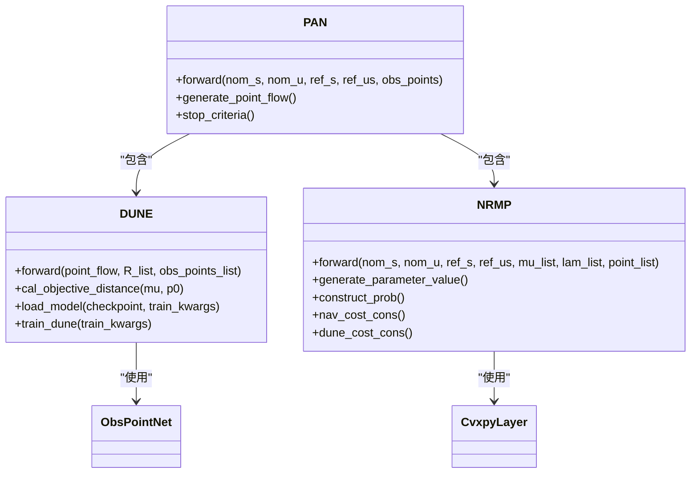
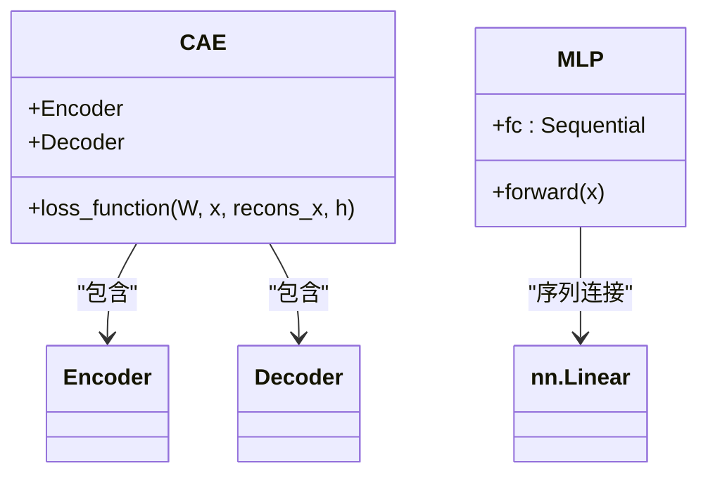
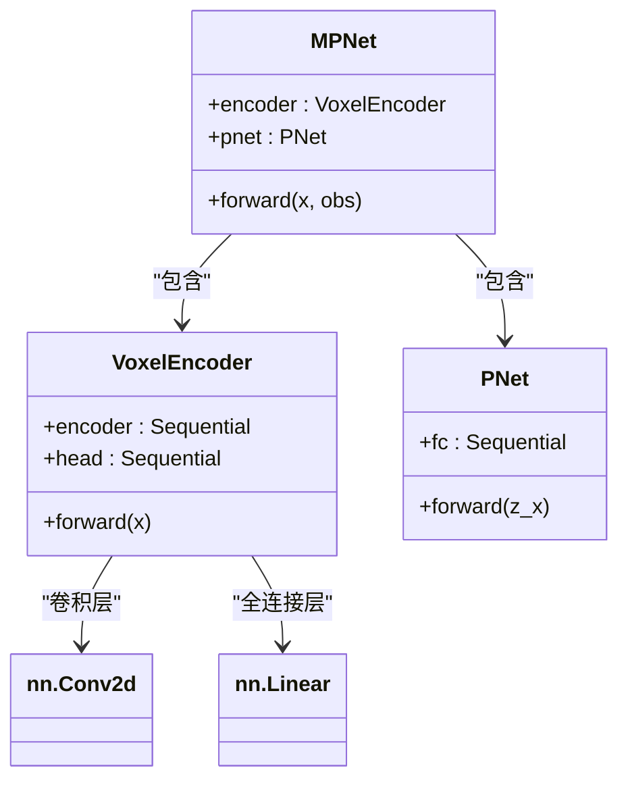
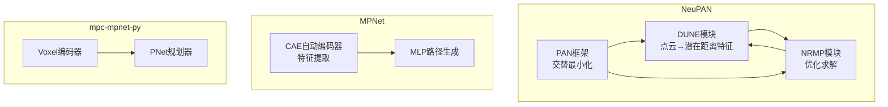

# 端到端规划器架构模式

<cite>
**本文档中引用的文件**  
- [dune.py](file://NeuPAN/neupan/blocks/dune.py)
- [nrmp.py](file://NeuPAN/neupan/blocks/nrmp.py)
- [pan.py](file://NeuPAN/neupan/blocks/pan.py)
- [CAE.py](file://MPNet/MPNet/AE/CAE.py)
- [model.py](file://MPNet/MPNet/model.py)
- [mpnet.py](file://mpc-mpnet-py/mpnet/networks/mpnet.py)
- [voxel_encoder.py](file://mpc-mpnet-py/mpnet/networks/voxel_encoder.py)
</cite>

## 目录
1. [引言](#引言)
2. [NeuPAN架构分析](#neupan架构分析)
3. [MPNet架构分析](#mpnet架构分析)
4. [mpc-mpnet-py架构分析](#mpc-mpnet-py架构分析)
5. [模块集成与数据流](#模块集成与数据流)
6. [适用场景与性能对比](#适用场景与性能对比)
7. [结论](#结论)

## 引言
本文深入分析NeuPAN、MPNet和mpc-mpnet-py三种端到端规划器的架构设计。重点阐述其网络结构、数据流和模块集成方式，详细解释各架构在处理传感器输入、生成运动指令和应对动态障碍物方面的具体实现，为开发者选择合适架构提供指导。

## NeuPAN架构分析
NeuPAN通过DUNE（Deep Unfolded Neural Encoder）和NRMP（Neural Regularized Motion Planner）模块实现动态不确定性感知导航。该架构采用PAN（Proximal Alternating-minimization Network）框架，将感知与规划深度融合。

**图示来源**  
- [pan.py](file://NeuPAN/neupan/blocks/pan.py#L1-L273)
- [dune.py](file://NeuPAN/neupan/blocks/dune.py#L1-L252)
- [nrmp.py](file://NeuPAN/neupan/blocks/nrmp.py#L1-L326)

**本节来源**  
- [pan.py](file://NeuPAN/neupan/blocks/pan.py#L1-L273)
- [dune.py](file://NeuPAN/neupan/blocks/dune.py#L1-L252)
- [nrmp.py](file://NeuPAN/neupan/blocks/nrmp.py#L1-L326)

### DUNE模块：动态不确定性感知
DUNE模块将点云流映射到潜在距离空间（mu和lambda），实现对障碍物的动态感知。其核心流程包括：
1. 将全局坐标系下的障碍点转换到机器人坐标系
2. 使用ObsPointNet神经网络提取距离特征
3. 按距离排序障碍点，优先处理近距离障碍
4. 输出每个时间步的mu（距离特征）和lam（坐标变换参数）

该模块通过`cal_objective_distance`方法计算障碍物到机器人边界的最小距离，为后续规划提供安全约束。

### NRMP模块：神经正则化运动规划
NRMP模块求解集成神经潜在距离空间的优化问题，生成最优控制序列。其核心特点包括：
- 使用CVXPYLayers将凸优化问题转化为可微分层
- 定义导航成本（nav_cost）和DUNE成本（dune_cost）的组合目标函数
- 实现动力学约束、控制边界约束和安全距离约束
- 通过调整参数（eta, d_max, d_min）平衡安全性与效率

优化问题在每个时间步重新求解，实现模型预测控制（MPC）框架下的实时规划。

### PAN框架：交替最小化
PAN框架将DUNE和NRMP模块集成，通过交替最小化算法迭代求解：
1. 使用当前名义轨迹生成点云流
2. DUNE模块处理点云流，输出潜在距离特征
3. NRMP模块基于特征求解优化问题，更新轨迹
4. 检查收敛条件，若未满足则返回步骤1

这种设计实现了感知-规划闭环，能够有效应对动态环境中的不确定性。

## MPNet架构分析
MPNet利用自动编码器进行环境特征提取，实现从高维传感器输入到低维运动指令的端到端映射。

**图示来源**  
- [CAE.py](file://MPNet/MPNet/AE/CAE.py#L1-L126)
- [model.py](file://MPNet/MPNet/model.py#L1-L32)

**本节来源**  
- [CAE.py](file://MPNet/MPNet/AE/CAE.py#L1-L126)
- [model.py](file://MPNet/MPNet/model.py#L1-L32)

### 自动编码器特征提取
MPNet使用收缩自动编码器（Contractive Autoencoder, CAE）进行环境特征提取：
- 编码器将2800维输入压缩到28维潜在空间
- 解码器重建原始输入，实现无监督学习
- 损失函数包含MSE重建误差和收缩项，提高特征鲁棒性

这种设计能够从原始传感器数据中提取紧凑且信息丰富的环境表示，为后续规划提供高质量输入。

### 多层感知机路径生成
特征提取后，MPNet使用深度MLP生成运动指令：
- 10层全连接网络，包含PReLU激活函数和Dropout正则化
- 逐步降维：从1280维到32维，最终输出目标维度
- 深层结构能够学习复杂的非线性映射关系

该MLP直接学习从环境特征到运动轨迹的映射，实现端到端的规划能力。

## mpc-mpnet-py架构分析
mpc-mpnet-py结合MPC与神经网络实现精确控制，通过Voxel编码器处理三维环境信息。

**图示来源**  
- [mpnet.py](file://mpc-mpnet-py/mpnet/networks/mpnet.py#L1-L47)
- [voxel_encoder.py](file://mpc-mpnet-py/mpnet/networks/voxel_encoder.py#L1-L31)

**本节来源**  
- [mpnet.py](file://mpc-mpnet-py/mpnet/networks/mpnet.py#L1-L47)
- [voxel_encoder.py](file://mpc-mpnet-py/mpnet/networks/voxel_encoder.py#L1-L31)

### Voxel编码器设计
Voxel编码器专门处理体素化环境表示：
- 2D卷积网络处理输入体素网格
- 两层卷积+池化结构提取空间特征
- 全连接头将特征映射到固定维度潜在空间
- 动态计算第一全连接层输入尺寸，提高灵活性

该编码器能够有效处理稀疏的三维点云数据，生成紧凑的环境特征表示。

### MPNet整体架构
MPNet架构将环境特征与状态信息融合：
- Voxel编码器处理环境观测
- 特征与当前状态拼接作为PNet输入
- PNet生成状态转移和控制指令
- 支持条件输入，实现多任务学习

这种设计实现了环境感知与运动规划的紧密耦合，能够在复杂环境中生成安全高效的轨迹。

## 模块集成与数据流
三种架构在模块集成和数据流设计上各有特点：

**图示来源**  
- [dune.py](file://NeuPAN/neupan/blocks/dune.py)
- [nrmp.py](file://NeuPAN/neupan/blocks/nrmp.py)
- [pan.py](file://NeuPAN/neupan/blocks/pan.py)
- [CAE.py](file://MPNet/MPNet/AE/CAE.py)
- [model.py](file://MPNet/MPNet/model.py)
- [mpnet.py](file://mpc-mpnet-py/mpnet/networks/mpnet.py)
- [voxel_encoder.py](file://mpc-mpnet-py/mpnet/networks/voxel_encoder.py)

**本节来源**  
- [dune.py](file://NeuPAN/neupan/blocks/dune.py#L1-L252)
- [nrmp.py](file://NeuPAN/neupan/blocks/nrmp.py#L1-L326)
- [pan.py](file://NeuPAN/neupan/blocks/pan.py#L1-L273)

### 数据流比较
| 架构 | 输入类型 | 特征提取 | 规划方法 | 输出类型 |
|------|---------|---------|---------|---------|
| NeuPAN | 点云流 | ObsPointNet神经网络 | 凸优化求解器 | 状态与控制序列 |
| MPNet | 高维向量 | 收缩自动编码器 | 深度MLP | 运动轨迹 |
| mpc-mpnet-py | 体素网格 | 2D卷积网络 | PNet网络 | 状态转移与控制 |

NeuPAN采用迭代优化框架，MPNet为纯前馈网络，mpc-mpnet-py则结合了两者优点。

## 适用场景与性能对比
不同架构在适用场景、计算复杂度和实时性方面表现各异：

| 架构 | 适用场景 | 计算复杂度 | 实时性 | 优势 | 局限性 |
|------|---------|-----------|-------|------|--------|
| NeuPAN | 动态环境、高安全性要求 | 高（迭代优化） | 中等 | 安全性高、可解释性强 | 计算开销大 |
| MPNet | 静态环境、快速响应 | 低（前馈计算） | 高 | 速度快、易于部署 | 泛化能力有限 |
| mpc-mpnet-py | 三维环境、精确控制 | 中等 | 高 | 三维处理能力强、精度高 | 需要体素化预处理 |

**本节来源**  
- [dune.py](file://NeuPAN/neupan/blocks/dune.py#L1-L252)
- [nrmp.py](file://NeuPAN/neupan/blocks/nrmp.py#L1-L326)
- [pan.py](file://NeuPAN/neupan/blocks/pan.py#L1-L273)
- [CAE.py](file://MPNet/MPNet/AE/CAE.py#L1-L126)
- [model.py](file://MPNet/MPNet/model.py#L1-L32)
- [mpnet.py](file://mpc-mpnet-py/mpnet/networks/mpnet.py#L1-L47)

## 结论
NeuPAN、MPNet和mpc-mpnet-py代表了端到端规划器的不同设计哲学。NeuPAN通过DUNE-NRMP-PAN框架实现了感知与规划的深度耦合，适合高安全性要求的动态环境。MPNet采用经典的自动编码器-MLP架构，计算效率高，适合静态环境下的快速响应。mpc-mpnet-py结合MPC与神经网络，特别适合三维环境中的精确控制任务。开发者应根据具体应用场景、计算资源和性能要求选择合适的架构。