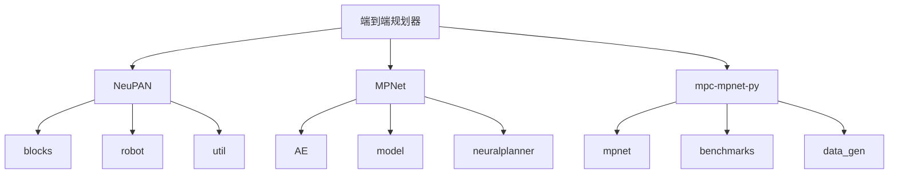
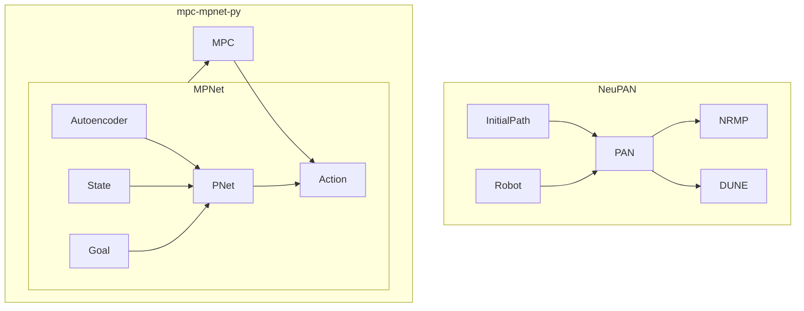
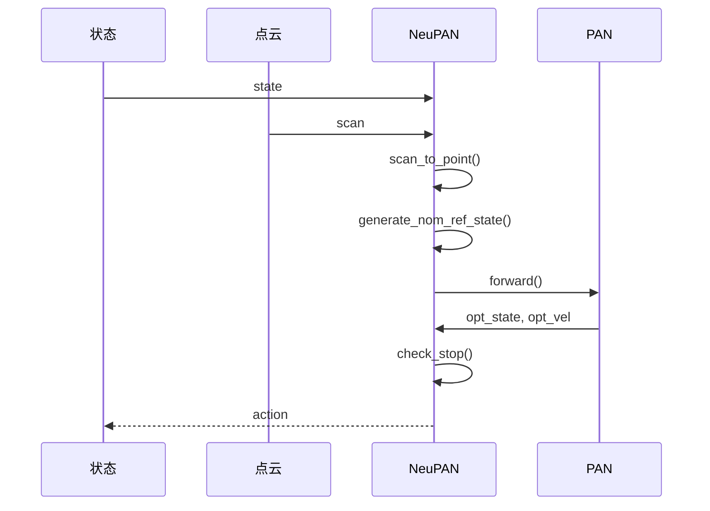
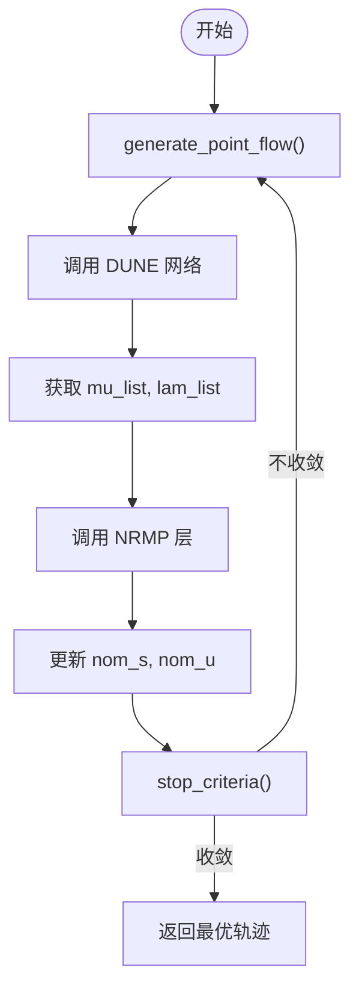
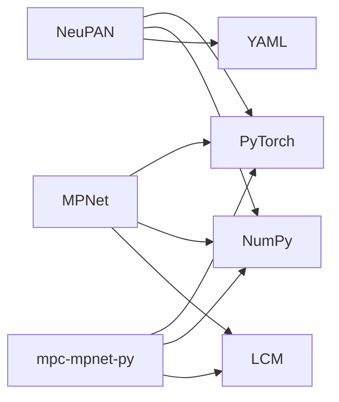

# 端到端规划器设计

<cite>
**本文档引用的文件**  
- [neupan.py](file://NeuPAN/neupan/neupan.py)
- [pan.py](file://NeuPAN/neupan/blocks/pan.py)
- [nrmp.py](file://NeuPAN/neupan/blocks/nrmp.py)
- [dune.py](file://NeuPAN/neupan/blocks/dune.py)
- [model.py](file://MPNet/MPNet/model.py)
- [neuralplanner.py](file://MPNet/MPNet/neuralplanner.py)
- [mpnet.py](file://mpc-mpnet-py/mpnet/networks/mpnet.py)
- [voxel_encoder.py](file://mpc-mpnet-py/mpnet/networks/voxel_encoder.py)
- [costnet.py](file://mpc-mpnet-py/mpnet/networks/costnet.py)
</cite>

## 目录
1. [引言](#引言)
2. [项目结构](#项目结构)
3. [核心组件](#核心组件)
4. [架构概述](#架构概述)
5. [详细组件分析](#详细组件分析)
6. [依赖分析](#依赖分析)
7. [性能考量](#性能考量)
8. [故障排除指南](#故障排除指南)
9. [结论](#结论)

## 引言
本文档深入分析了三种先进的端到端神经规划器架构：NeuPAN、MPNet 和 mpc-mpnet-py。重点阐述如何将环境感知、路径规划和运动控制整合到单一神经网络中，实现从传感器输入到控制输出的直接映射。文档详细解释了输入特征工程、网络架构设计和输出动作解码的完整流程，并结合代码实例分析多层感知机、卷积层和注意力机制在不同规划场景中的应用效果。同时，讨论了端到端方法的优势与局限性，并提供了性能评估指标和测试方法。

## 项目结构
项目包含多个独立的规划器实现，每个都封装在独立的目录中。NeuPAN、MPNet 和 mpc-mpnet-py 是三个主要的端到端规划器，各自拥有完整的训练和推理代码。NeuPAN 采用基于模型的神经优化架构，MPNet 使用无模型的深度强化学习方法，而 mpc-mpnet-py 则结合了模型预测控制与神经网络。

**图示来源**
- [NeuPAN](file://NeuPAN)
- [MPNet](file://MPNet)
- [mpc-mpnet-py](file://mpc-mpnet-py)

**本节来源**
- [NeuPAN](file://NeuPAN)
- [MPNet](file://MPNet)
- [mpc-mpnet-py](file://mpc-mpnet-py)

## 核心组件
NeuPAN 的核心是 `neupan` 类，它封装了初始路径生成、神经优化（PAN）和机器人模型。MPNet 的核心是 `NeuralPlanner` 类，它结合了自动编码器和路径规划网络。mpc-mpnet-py 的核心是 `MPNet` 网络，它将状态、目标和障碍物编码为紧凑表示，并输出控制动作。

**本节来源**
- [neupan.py](file://NeuPAN/neupan/neupan.py#L1-L402)
- [neuralplanner.py](file://MPNet/MPNet/neuralplanner.py)
- [mpnet.py](file://mpc-mpnet-py/mpnet/networks/mpnet.py)

## 架构概述
NeuPAN 采用分层优化架构，由初始路径生成器（InitialPath）、神经优化层（PAN）和机器人模型（Robot）组成。PAN 层进一步分为 NRMP（神经递归运动规划）和 DUNE（动态不确定性神经估计）两个子模块，通过交替最小化实现高效求解。MPNet 采用编码器-解码器架构，使用卷积神经网络处理障碍物点云，多层感知机处理状态和目标信息。mpc-mpnet-py 将 MPNet 与 MPC 框架结合，利用神经网络提供高质量的初始猜测。

**图示来源**
- [neupan.py](file://NeuPAN/neupan/neupan.py#L1-L402)
- [pan.py](file://NeuPAN/neupan/blocks/pan.py#L1-L272)
- [model.py](file://MPNet/MPNet/model.py)
- [neuralplanner.py](file://MPNet/MPNet/neuralplanner.py)

## 详细组件分析

### NeuPAN 组件分析
NeuPAN 的 `forward` 方法实现了完整的推理流程：首先检查是否到达目标，然后生成名义参考状态，将输入转换为张量，调用 PAN 层进行优化，最后返回最优速度动作。`scan_to_point` 方法将激光雷达扫描数据转换为全局坐标系下的点云，作为环境感知的输入。

**图示来源**
- [neupan.py](file://NeuPAN/neupan/neupan.py#L1-L402)

**本节来源**
- [neupan.py](file://NeuPAN/neupan/neupan.py#L1-L402)

#### PAN 模块分析
PAN 模块是 NeuPAN 的核心优化引擎。它通过 `forward` 方法执行交替最小化迭代。首先调用 `generate_point_flow` 将障碍物点云转换到机器人坐标系并考虑其运动，然后调用 DUNE 网络预测碰撞风险（mu 和 lam），最后调用 NRMP 层基于这些预测进行轨迹优化。迭代直到满足收敛条件。

**图示来源**
- [pan.py](file://NeuPAN/neupan/blocks/pan.py#L1-L272)

**本节来源**
- [pan.py](file://NeuPAN/neupan/blocks/pan.py#L1-L272)

### MPNet 组件分析
MPNet 的 `NeuralPlanner` 类将自动编码器（CAE）与路径规划网络（PNet）结合。CAE 负责将高维的障碍物点云压缩为低维的潜在表示，PNet 则接收当前状态、目标状态和潜在表示，输出控制动作。这种设计有效降低了网络输入的维度，提高了训练效率和泛化能力。

**本节来源**
- [neuralplanner.py](file://MPNet/MPNet/neuralplanner.py)
- [model.py](file://MPNet/MPNet/model.py)

### mpc-mpnet-py 组件分析
mpc-mpnet-py 中的 `MPNet` 网络是一个深度神经网络，通常包含卷积层用于处理障碍物编码（如体素网格），全连接层用于处理状态和目标信息。`train_mpnet.py` 脚本负责网络的训练，使用从 RRT* 等传统规划器生成的专家数据进行监督学习。

**本节来源**
- [mpnet.py](file://mpc-mpnet-py/mpnet/networks/mpnet.py)
- [voxel_encoder.py](file://mpc-mpnet-py/mpnet/networks/voxel_encoder.py)
- [train_mpnet.py](file://mpc-mpnet-py/mpnet/train_mpnet.py)

## 依赖分析
NeuPAN 依赖于 PyTorch 进行张量计算和自动微分，依赖于 NumPy 进行数值计算。MPNet 和 mpc-mpnet-py 同样基于 PyTorch，并依赖于 LCM（轻量级通信和多播）进行数据类型定义和通信。所有项目都依赖于 YAML 库进行配置文件的读取。

**图示来源**
- [neupan.py](file://NeuPAN/neupan/neupan.py#L1-L402)
- [neuralplanner.py](file://MPNet/MPNet/neuralplanner.py)
- [mpnet.py](file://mpc-mpnet-py/mpnet/networks/mpnet.py)

**本节来源**
- [neupan.py](file://NeuPAN/neupan/neupan.py#L1-L402)
- [neuralplanner.py](file://MPNet/MPNet/neuralplanner.py)
- [mpnet.py](file://mpc-mpnet-py/mpnet/networks/mpnet.py)

## 性能考量
NeuPAN 的性能关键在于 PAN 模块的迭代次数和点云下采样数量。减少 `iter_num` 和 `dune_max_num` 可以显著提高推理速度，但可能牺牲轨迹质量。MPNet 和 mpc-mpnet-py 的性能主要受网络深度和宽度影响，更深更宽的网络需要更多计算资源。所有方法在 GPU 上运行时性能远优于 CPU。

## 故障排除指南
常见问题包括点云数据格式错误、配置文件路径无效和 PyTorch 设备不匹配。应确保 `scan` 字典包含正确的键（如 `ranges`, `angle_min`），YAML 配置文件路径正确，且 `device` 参数设置为可用的 'cuda' 或 'cpu'。对于训练问题，检查数据生成脚本（如 `data_generation.py`）是否成功生成了足够的训练样本。

**本节来源**
- [neupan.py](file://NeuPAN/neupan/neupan.py#L1-L402)
- [data_generation.py](file://mpc-mpnet-py/data_gen/data_generation.py)

## 结论
NeuPAN、MPNet 和 mpc-mpnet-py 代表了端到端神经规划器的不同设计范式。NeuPAN 通过结合传统优化与深度学习，在可解释性和性能之间取得了良好平衡。MPNet 展示了纯数据驱动方法的强大能力。mpc-mpnet-py 则通过融合 MPC 的鲁棒性与神经网络的智能性，提供了高性能的解决方案。开发者应根据具体应用场景选择合适的架构，并利用提供的工具进行充分的验证和调优。