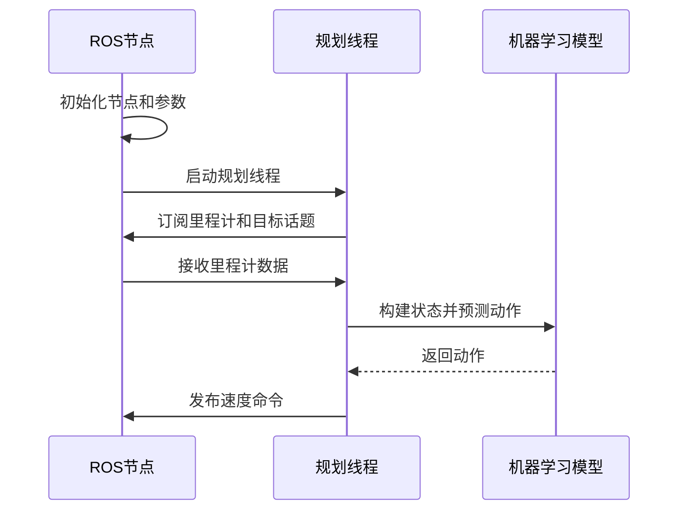
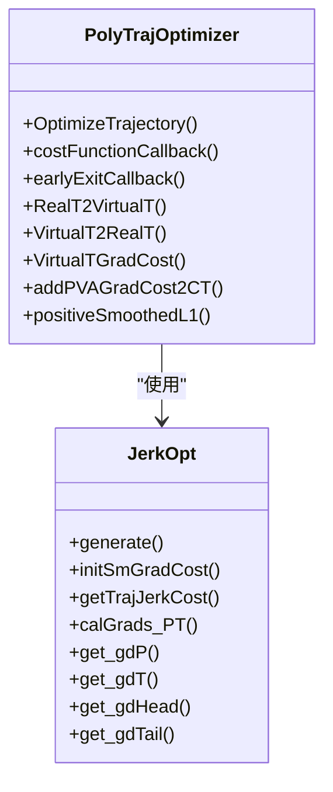
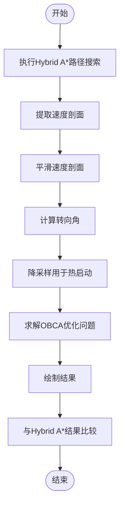

# 编程基础

<cite>
**本文档中引用的文件**  
- [RLLocalPlannerv2.py](file://AEMCARL/attachments/ros_ws/local_planner_py/scripts/RLLocalPlannerv2.py)
- [tools.cpp](file://AEMCARL/attachments/ros_ws/helper/src/tools.cpp)
- [traj_optimizer.cpp](file://Dftpav/src/Plan/traj_planner/src/traj_optimizer.cpp)
- [main.jl](file://H-OBCA/main.jl)
- [hybrid_a_star.jl](file://H-OBCA/hybrid_a_star.jl)
- [collision_check.jl](file://H-OBCA/collision_check.jl)
- [setup.jl](file://H-OBCA/setup.jl)
- [a_star.jl](file://H-OBCA/a_star.jl)
</cite>

## 目录
1. [项目概述](#项目概述)
2. [Python编程基础](#python编程基础)
3. [C++编程基础](#c编程基础)
4. [Julia编程基础](#julia编程基础)
5. [语言交互与集成](#语言交互与集成)
6. [开发环境搭建](#开发环境搭建)
7. [代码调试与性能优化](#代码调试与性能优化)
8. [学习资源与练习项目](#学习资源与练习项目)

## 项目概述

本项目是一个复杂的自动驾驶系统，集成了多种编程语言和技术栈。系统主要由三个核心语言构成：Python用于高层逻辑和机器学习，C++用于实时控制和性能关键模块，Julia用于路径规划和数值优化。项目结构清晰，各语言在不同子系统中发挥各自优势，通过ROS（机器人操作系统）进行通信和集成。

**项目来源**
- [RLLocalPlannerv2.py](file://AEMCARL/attachments/ros_ws/local_planner_py/scripts/RLLocalPlannerv2.py)
- [traj_optimizer.cpp](file://Dftpav/src/Plan/traj_planner/src/traj_optimizer.cpp)
- [main.jl](file://H-OBCA/main.jl)

## Python编程基础

Python在本项目中主要用于高层决策、机器学习模型和ROS节点的实现。代码主要位于`AEMCARL/attachments/ros_ws/local_planner_py`目录下，特别是`RLLocalPlannerv2.py`文件实现了基于强化学习的局部路径规划器。

Python代码遵循标准的ROS Python编程规范，使用`rospy`库进行节点创建、话题订阅和发布。代码结构清晰，包含初始化、回调函数和主循环。使用`argparse`进行命令行参数解析，`configparser`读取配置文件，`torch`和`numpy`进行机器学习和数值计算。

代码中实现了线程安全机制，使用`threading.Lock`保护共享资源，避免竞态条件。通过`threading.Thread`创建独立的规划线程，确保主循环的实时性。代码还展示了如何将机器学习模型集成到ROS系统中，使用预训练的PyTorch模型进行动作预测。



**图示来源**
- [RLLocalPlannerv2.py](file://AEMCARL/attachments/ros_ws/local_planner_py/scripts/RLLocalPlannerv2.py)

**节来源**
- [RLLocalPlannerv2.py](file://AEMCARL/attachments/ros_ws/local_planner_py/scripts/RLLocalPlannerv2.py)

## C++编程基础

C++在本项目中用于实现性能关键的路径优化和实时控制模块。代码主要位于`Dftpav/src/Plan/traj_planner`目录下，特别是`traj_optimizer.cpp`文件实现了基于L-BFGS算法的轨迹优化器。

C++代码遵循现代C++编程规范，使用`Eigen`库进行线性代数运算，`ROS`进行系统集成。代码结构模块化，包含类定义、成员函数和回调函数。使用`lbfgs::lbfgs_optimize`进行非线性优化，处理轨迹平滑、时间最优和约束满足。

代码中实现了复杂的数学计算，包括轨迹系数计算、梯度计算和约束处理。使用模板函数实现虚拟时间和实际时间的映射，确保优化过程的数值稳定性。代码还展示了如何处理多段轨迹的优化，支持前进和后退模式的切换。



**图示来源**
- [traj_optimizer.cpp](file://Dftpav/src/Plan/traj_planner/src/traj_optimizer.cpp)

**节来源**
- [traj_optimizer.cpp](file://Dftpav/src/Plan/traj_planner/src/traj_optimizer.cpp)

## Julia编程基础

Julia在本项目中用于实现高级路径规划算法，特别是H-OBCA（分层优化避障）算法。代码主要位于`H-OBCA`目录下，包括`main.jl`、`hybrid_a_star.jl`、`collision_check.jl`等文件。

Julia代码充分利用了语言的高性能数值计算能力，实现了复杂的优化算法和几何计算。`main.jl`作为主入口文件，协调Hybrid A*路径搜索和OBCA优化过程。代码使用`PyCall`与Python进行交互，实现跨语言集成。

算法流程包括：首先使用Hybrid A*生成初始路径，然后提取速度剖面并进行平滑处理，最后使用OBCA进行优化以确保碰撞避免。代码中定义了详细的场景参数，包括车辆尺寸、障碍物布局和运动学约束。



**图示来源**
- [main.jl](file://H-OBCA/main.jl)
- [hybrid_a_star.jl](file://H-OBCA/hybrid_a_star.jl)
- [collision_check.jl](file://H-OBCA/collision_check.jl)

**节来源**
- [main.jl](file://H-OBCA/main.jl)
- [hybrid_a_star.jl](file://H-OBCA/hybrid_a_star.jl)
- [collision_check.jl](file://H-OBCA/collision_check.jl)

## 语言交互与集成

本项目通过ROS实现了Python、C++和Julia三种语言的无缝集成。ROS作为中间件，提供话题通信、服务调用和参数服务器功能。不同语言的节点通过标准消息类型进行数据交换，确保系统的模块化和可扩展性。

Python节点主要负责高层决策和机器学习推理，发布速度命令到`/cmd_vel`话题。C++节点处理实时控制和轨迹优化，订阅传感器数据并发布控制指令。Julia节点实现复杂的路径规划算法，通过ROS服务或话题与其他节点交互。

跨语言集成通过ROS客户端库实现：Python使用`rospy`，C++使用`roscpp`，Julia使用`PyCall`调用Python的`rospy`。这种设计允许每种语言在其优势领域发挥最佳性能，同时保持系统的整体一致性。

```mermaid
graph TB
subgraph "Python"
A[机器学习模型]
B[ROS节点]
end
subgraph "C++"
C[轨迹优化器]
D[ROS节点]
end
subgraph "Julia"
E[路径规划器]
F[ROS节点]
end
A --> B
B < --> D
D < --> F
F --> B
```

**图示来源**
- [RLLocalPlannerv2.py](file://AEMCARL/attachments/ros_ws/local_planner_py/scripts/RLLocalPlannerv2.py)
- [traj_optimizer.cpp](file://Dftpav/src/Plan/traj_planner/src/traj_optimizer.cpp)
- [main.jl](file://H-OBCA/main.jl)

**节来源**
- [RLLocalPlannerv2.py](file://AEMCARL/attachments/ros_ws/local_planner_py/scripts/RLLocalPlannerv2.py)
- [traj_optimizer.cpp](file://Dftpav/src/Plan/traj_planner/src/traj_optimizer.cpp)
- [main.jl](file://H-OBCA/main.jl)

## 开发环境搭建

为了开发和运行本项目，需要搭建包含Python、C++和Julia的综合开发环境。首先安装ROS（推荐Melodic或Noetic版本），然后配置各语言的开发环境。

Python环境需要安装`rospy`、`numpy`、`torch`等包，建议使用`conda`或`pip`进行管理。C++环境需要安装`Eigen`、`ROS`开发库和`lbfgs`优化库。Julia环境需要安装`PyCall`包以实现与Python的交互。

项目使用CMake进行C++代码的构建，使用标准的ROS包结构。Python和Julia代码可以直接运行，但需要确保ROS环境变量正确设置。建议使用Docker容器来确保环境的一致性。

**节来源**
- [RLLocalPlannerv2.py](file://AEMCARL/attachments/ros_ws/local_planner_py/scripts/RLLocalPlannerv2.py)
- [traj_optimizer.cpp](file://Dftpav/src/Plan/traj_planner/src/traj_optimizer.cpp)
- [main.jl](file://H-OBCA/main.jl)

## 代码调试与性能优化

代码调试需要针对不同语言采用不同的工具和方法。Python代码可以使用`pdb`或IDE的调试器，C++代码使用`gdb`和`valgrind`，Julia代码使用内置的调试工具。

性能优化方面，Python代码应避免在回调函数中进行耗时计算，将复杂计算移到独立线程。C++代码应优化Eigen矩阵运算，避免不必要的内存分配。Julia代码应利用其JIT编译优势，确保类型稳定性。

对于跨语言性能问题，应减少不必要的数据序列化和反序列化，使用共享内存或零拷贝技术。监控各节点的CPU和内存使用情况，确保实时性要求得到满足。

**节来源**
- [RLLocalPlannerv2.py](file://AEMCARL/attachments/ros_ws/local_planner_py/scripts/RLLocalPlannerv2.py)
- [traj_optimizer.cpp](file://Dftpav/src/Plan/traj_planner/src/traj_optimizer.cpp)
- [main.jl](file://H-OBCA/main.jl)

## 学习资源与练习项目

初学者应首先掌握ROS基础，然后分别学习三种语言在项目中的具体应用。Python学习重点是`rospy`和机器学习集成，C++学习重点是`Eigen`和实时系统编程，Julia学习重点是数值优化和科学计算。

推荐练习项目包括：实现一个简单的Python ROS节点，修改C++轨迹优化器的约束条件，调整Julia路径规划器的参数。通过这些练习，可以深入理解各语言的特点和系统集成方式。

**节来源**
- [RLLocalPlannerv2.py](file://AEMCARL/attachments/ros_ws/local_planner_py/scripts/RLLocalPlannerv2.py)
- [traj_optimizer.cpp](file://Dftpav/src/Plan/traj_planner/src/traj_optimizer.cpp)
- [main.jl](file://H-OBCA/main.jl)