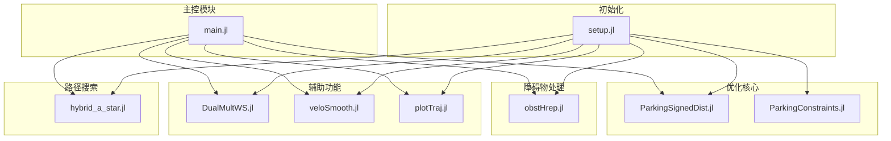
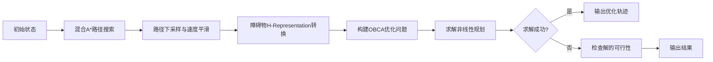
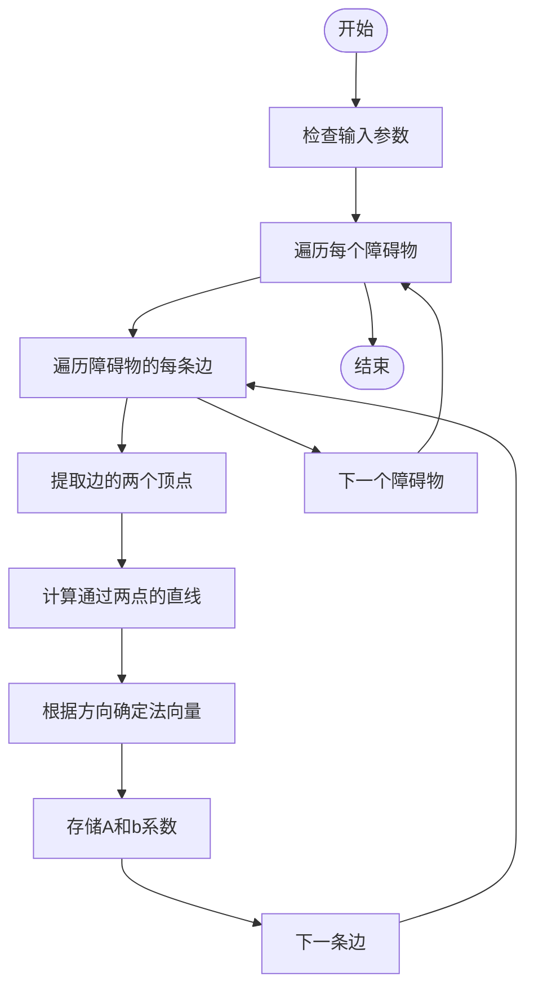
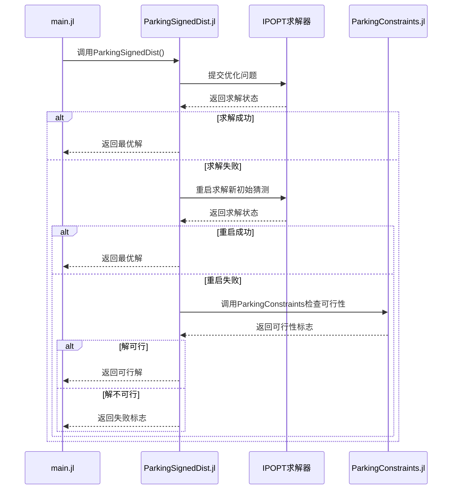
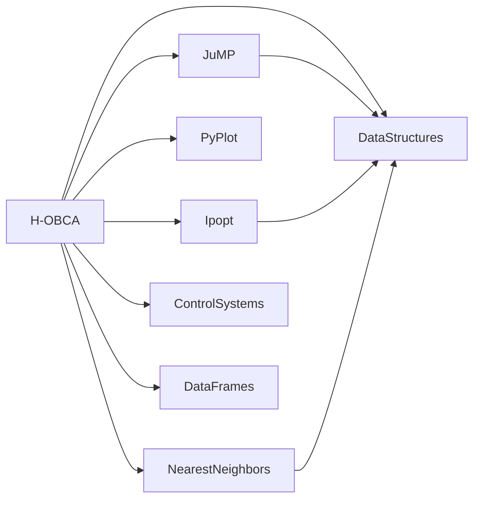

# 优化碰撞避免算法

<cite>
**本文档中引用的文件**   
- [main.jl](file://H-OBCA/main.jl)
- [ParkingSignedDist.jl](file://H-OBCA/ParkingSignedDist.jl)
- [obstHrep.jl](file://H-OBCA/obstHrep.jl)
- [ParkingConstraints.jl](file://H-OBCA/ParkingConstraints.jl)
- [DualMultWS.jl](file://H-OBCA/DualMultWS.jl)
- [setup.jl](file://H-OBCA/setup.jl)
- [hybrid_a_star.jl](file://H-OBCA/hybrid_a_star.jl)
- [veloSmooth.jl](file://H-OBCA/veloSmooth.jl)
- [plotTraj.jl](file://H-OBCA/plotTraj.jl)
</cite>

## 目录
1. [简介](#简介)
2. [项目结构](#项目结构)
3. [核心组件](#核心组件)
4. [架构概述](#架构概述)
5. [详细组件分析](#详细组件分析)
6. [依赖分析](#依赖分析)
7. [性能考虑](#性能考虑)
8. [故障排除指南](#故障排除指南)
9. [结论](#结论)

## 简介
优化碰撞避免（OBCA）算法是一种用于自主泊车场景的路径规划方法，其核心思想是将碰撞避免约束通过半平滑障碍函数融入连续优化问题中。该算法利用符号距离场（Signed Distance Field）或H-Representation对障碍物进行精确建模，并将其转化为可微的约束项。H-OBCA采用分层结构，首先使用混合A*算法生成初始路径，然后通过非线性规划求解器进行优化，确保路径的可行性与平滑性。该方法在处理复杂多边形障碍物时表现出显著优势，但也面临计算复杂度的挑战。

## 项目结构
H-OBCA项目采用模块化设计，主要由Julia脚本文件构成，各文件职责明确，协同完成路径规划任务。项目结构清晰，便于维护与扩展。

**图源**
- [main.jl](file://H-OBCA/main.jl#L1-L262)
- [setup.jl](file://H-OBCA/setup.jl#L1-L57)

**本节来源**
- [main.jl](file://H-OBCA/main.jl#L1-L262)
- [setup.jl](file://H-OBCA/setup.jl#L1-L57)

## 核心组件
H-OBCA的核心组件包括路径生成、障碍物建模、非线性优化和约束验证。`main.jl`作为主入口，协调各模块工作。`hybrid_a_star.jl`负责生成初始路径，`obstHrep.jl`将多边形障碍物顶点转换为H-Representation，`ParkingSignedDist.jl`构建并求解非线性优化问题，而`ParkingConstraints.jl`则用于验证解的可行性。

**本节来源**
- [main.jl](file://H-OBCA/main.jl#L1-L262)
- [ParkingSignedDist.jl](file://H-OBCA/ParkingSignedDist.jl#L1-L307)
- [obstHrep.jl](file://H-OBCA/obstHrep.jl#L1-L105)

## 架构概述
H-OBCA采用分层优化架构，结合了搜索算法与数值优化的优点。首先，混合A*算法在离散网格上快速搜索出一条可行的粗略路径。随后，该路径被用作非线性优化问题的初始猜测（Warm Start）。优化器的核心是`ParkingSignedDist`函数，它通过引入对偶变量（拉格朗日乘子）和符号距离函数，将复杂的碰撞避免约束转化为一组可微的等式与不等式约束。通过求解这个优化问题，最终得到一条平滑、安全且满足车辆动力学的轨迹。

**图源**
- [main.jl](file://H-OBCA/main.jl#L1-L262)
- [ParkingSignedDist.jl](file://H-OBCA/ParkingSignedDist.jl#L1-L307)

## 详细组件分析

### 障碍物H-Representation转换分析
该组件负责将多边形障碍物的顶点列表转换为H-Representation（半空间表示），即Ax ≤ b的形式。这是将几何约束融入优化问题的关键步骤。

**图源**
- [obstHrep.jl](file://H-OBCA/obstHrep.jl#L1-L105)

**本节来源**
- [obstHrep.jl](file://H-OBCA/obstHrep.jl#L1-L105)

### OBCA优化问题求解分析
`ParkingSignedDist`函数是整个算法的核心，它定义了一个复杂的非线性优化问题。

#### 数学基础与约束建模
该函数利用对偶原理和符号距离场，将碰撞避免约束转化为以下形式的可微约束：
- **法向量归一化**: `||A'λ|| = 1`，确保对偶变量λ定义了一个单位法向量。
- **力平衡方程**: `G'μ + R'Aλ = 0`，表示车辆形状与障碍物形状在接触点的几何关系。
- **安全距离约束**: `-g'μ + (A*t - b)'λ ≥ dmin`，确保车辆与障碍物之间的距离大于最小安全距离dmin。

这些约束通过引入对偶变量λ（与障碍物相关）和μ（与车辆形状相关），巧妙地将不可微的碰撞检测问题转化为一个光滑的优化问题。

#### 非线性规划求解器的使用
该函数使用JuMP建模语言和IPOPT求解器来处理这个非凸优化问题。IPOPT是一个强大的内点法求解器，适用于大规模非线性问题。代码中设置了详细的求解器参数，如`hessian_approximation="exact"`和`tol=1e-5`，以平衡求解速度和精度。

#### 约束平滑技术
为了保证解的可行性，算法采用了“约束平滑”技术。当IPOPT报告“恢复失败”时，算法不会直接放弃，而是调用`ParkingConstraints`函数手动检查解的可行性。如果解是可行的，则接受该解。这种策略显著提高了算法的成功率。

#### 保证解的可行性
算法通过多层机制保证解的可行性：
1.  **初始猜测**: 使用`DualMultWS.jl`为对偶变量提供合理的初始猜测，加速收敛。
2.  **重启策略**: 如果首次求解失败，算法会以第一次的解作为新的初始猜测重新求解。
3.  **可行性验证**: 最终通过`ParkingConstraints`函数对解进行全面验证。

**图源**
- [ParkingSignedDist.jl](file://H-OBCA/ParkingSignedDist.jl#L1-L307)
- [ParkingConstraints.jl](file://H-OBCA/ParkingConstraints.jl#L1-L165)

**本节来源**
- [ParkingSignedDist.jl](file://H-OBCA/ParkingSignedDist.jl#L1-L307)
- [ParkingConstraints.jl](file://H-OBCA/ParkingConstraints.jl#L1-L165)

## 依赖分析
H-OBCA项目依赖于多个Julia包，这些包提供了关键功能。

**图源**
- [setup.jl](file://H-OBCA/setup.jl#L1-L57)

**本节来源**
- [setup.jl](file://H-OBCA/setup.jl#L1-L57)

## 性能考虑
H-OBCA的性能主要受两个阶段影响：混合A*搜索和OBCA优化。混合A*的性能取决于网格分辨率和启发式函数，而OBCA优化的性能则与问题规模（时间步长N、障碍物数量）和非线性求解器的收敛速度密切相关。代码中通过下采样Hybrid A*的路径来控制N的大小，从而保证实时性。此外，为对偶变量提供良好的初始猜测（Warm Start）是提高IPOPT求解速度的关键。

## 故障排除指南
当H-OBCA求解失败时，应按以下步骤排查：
1.  **检查输入参数**: 确认初始状态`x0`、目标状态`xF`和障碍物定义`lOb`是否正确。
2.  **验证障碍物H-Representation**: 确保`obstHrep`函数正确生成了A和b矩阵。
3.  **检查求解器状态**: 查看IPOPT的输出日志，判断是“最优解”、“达到用户限制”还是“错误”。
4.  **评估解的可行性**: 即使求解器返回失败，也应调用`ParkingConstraints`检查解是否可行。
5.  **调整优化参数**: 可尝试调整`dmin`（最小安全距离）、`max_iter`（最大迭代次数）或`tol`（容差）等参数。

**本节来源**
- [ParkingConstraints.jl](file://H-OBCA/ParkingConstraints.jl#L1-L165)
- [ParkingSignedDist.jl](file://H-OBCA/ParkingSignedDist.jl#L1-L307)

## 结论
优化碰撞避免（OBCA）算法通过将几何约束巧妙地转化为可微的优化问题，为自主泊车等复杂场景提供了一种有效的路径规划方案。H-OBCA实现展示了该方法的完整流程，从混合A*的初始路径生成，到基于符号距离场的精确障碍物建模，再到利用IPOPT求解器进行非线性优化。该方法能够有效处理复杂多边形障碍物，生成高质量的平滑轨迹。尽管存在计算复杂度的挑战，但通过分层架构和Warm Start策略，其在实际应用中展现了良好的性能和鲁棒性。