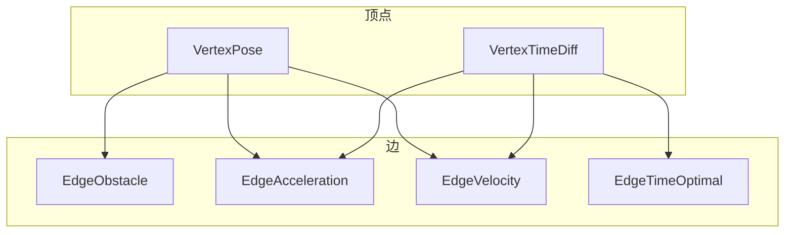

# 时序弹性带算法

<cite>
**本文档中引用的文件**   
- [timed_elastic_band.h](file://teb_local_planner/include/teb_local_planner/timed_elastic_band.h)
- [optimal_planner.h](file://teb_local_planner/include/teb_local_planner/optimal_planner.h)
- [vertex_pose.h](file://teb_local_planner/include/teb_local_planner/g2o_types/vertex_pose.h)
- [vertex_timediff.h](file://teb_local_planner/include/teb_local_planner/g2o_types/vertex_timediff.h)
- [edge_obstacle.h](file://teb_local_planner/include/teb_local_planner/g2o_types/edge_obstacle.h)
- [edge_acceleration.h](file://teb_local_planner/include/teb_local_planner/g2o_types/edge_acceleration.h)
- [edge_velocity.h](file://teb_local_planner/include/teb_local_planner/g2o_types/edge_velocity.h)
- [edge_time_optimal.h](file://teb_local_planner/include/teb_local_planner/g2o_types/edge_time_optimal.h)
</cite>

## 目录
1. [简介](#简介)
2. [核心组件](#核心组件)
3. [图优化结构](#图优化结构)
4. [关键约束条件](#关键约束条件)
5. [求解流程](#求解流程)
6. [参数调优指南](#参数调优指南)
7. [结论](#结论)

## 简介
时序弹性带（Temporal Elastic Band, TEB）算法是一种基于优化的局部路径规划器，它将路径规划问题建模为一个带有时间信息的弹性带，并通过非线性优化框架（g2o）来最小化包含路径长度、时间、加速度、与障碍物距离等在内的综合代价函数。该算法能够有效处理动态环境中的避障问题，并确保生成的轨迹满足机器人的动力学约束。

## 核心组件

TEB算法的核心在于其对轨迹的表示方式和优化过程。轨迹由一系列位姿（pose）和时间差（time difference）组成，分别用`VertexPose`和`VertexTimeDiff`类表示。这些顶点构成了一个可优化的图结构，其中每个位姿顶点代表机器人在某一时刻的位置和方向，而时间差顶点则定义了从一个位姿到下一个位姿所需的时间。

**本节来源**
- [timed_elastic_band.h](file://teb_local_planner/include/teb_local_planner/timed_elastic_band.h#L1-L660)
- [vertex_pose.h](file://teb_local_planner/include/teb_local_planner/g2o_types/vertex_pose.h#L1-L230)
- [vertex_timediff.h](file://teb_local_planner/include/teb_local_planner/g2o_types/vertex_timediff.h#L1-L146)

## 图优化结构

TEB算法使用g2o框架构建了一个超图（hyper-graph），其中包含了多种类型的边（edges），每种边对应一种特定的代价函数。这些边连接着位姿和时间差顶点，共同构成了整个优化问题。主要的边类型包括：

- **EdgeObstacle**: 用于保持与静态障碍物的最小距离。
- **EdgeAcceleration**: 限制平移和旋转加速度。
- **EdgeVelocity**: 限制平移和旋转速度。
- **EdgeTimeOptimal**: 最小化过渡时间。

这些边的组合使得TEB能够在保证安全的同时，生成平滑且高效的轨迹。

**图来源**
- [optimal_planner.h](file://teb_local_planner/include/teb_local_planner/optimal_planner.h#L1-L707)
- [edge_obstacle.h](file://teb_local_planner/include/teb_local_planner/g2o_types/edge_obstacle.h#L1-L262)
- [edge_acceleration.h](file://teb_local_planner/include/teb_local_planner/g2o_types/edge_acceleration.h#L1-L735)
- [edge_velocity.h](file://teb_local_planner/include/teb_local_planner/g2o_types/edge_velocity.h#L1-L286)
- [edge_time_optimal.h](file://teb_local_planner/include/teb_local_planner/g2o_types/edge_time_optimal.h#L1-L117)

**本节来源**
- [optimal_planner.h](file://teb_local_planner/include/teb_local_planner/optimal_planner.h#L1-L707)

## 关键约束条件

TEB算法通过多种边来实现不同的约束条件，以确保生成的轨迹既安全又高效。以下是几种关键的约束条件及其对应的边：

- **避障约束**: 通过`EdgeObstacle`边，确保机器人与障碍物之间的距离大于预设的安全距离。
- **加速度约束**: 通过`EdgeAcceleration`边，限制机器人的平移和旋转加速度不超过最大允许值。
- **速度约束**: 通过`EdgeVelocity`边，限制机器人的平移和旋转速度不超过最大允许值。
- **时间最优性**: 通过`EdgeTimeOptimal`边，最小化轨迹的总过渡时间。

这些约束条件共同作用，确保了生成的轨迹不仅满足物理限制，还能在复杂环境中快速响应变化。

**本节来源**
- [edge_obstacle.h](file://teb_local_planner/include/teb_local_planner/g2o_types/edge_obstacle.h#L1-L262)
- [edge_acceleration.h](file://teb_local_planner/include/teb_local_planner/g2o_types/edge_acceleration.h#L1-L735)
- [edge_velocity.h](file://teb_local_planner/include/teb_local_planner/g2o_types/edge_velocity.h#L1-L286)
- [edge_time_optimal.h](file://teb_local_planner/include/teb_local_planner/g2o_types/edge_time_optimal.h#L1-L117)

## 求解流程

TEB算法的求解流程主要包括以下几个步骤：

1. **初始化轨迹**: 根据给定的起始和目标位姿，初始化一条初始轨迹。
2. **构建超图**: 将轨迹中的位姿和时间差作为顶点，添加各种约束条件作为边，构建出一个超图。
3. **优化超图**: 使用g2o框架中的非线性优化算法（如Levenberg-Marquardt）对超图进行优化，最小化综合代价函数。
4. **调整轨迹**: 在优化过程中，根据需要动态调整轨迹的分辨率，确保轨迹的平滑性和计算效率。
5. **输出结果**: 优化完成后，输出最终的轨迹，供机器人执行。

整个求解过程是一个迭代的过程，通过不断优化，逐步逼近最优解。

**本节来源**
- [optimal_planner.h](file://teb_local_planner/include/teb_local_planner/optimal_planner.h#L1-L707)
- [timed_elastic_band.h](file://teb_local_planner/include/teb_local_planner/timed_elastic_band.h#L1-L660)

## 参数调优指南

为了平衡动态可行性、避障能力和计算效率，TEB算法提供了多个可调参数。以下是一些关键参数及其调优建议：

- **`max_vel_x` 和 `max_vel_theta`**: 控制机器人的最大线速度和角速度。增加这些值可以提高运动速度，但可能会导致避障能力下降。
- **`acc_lim_x` 和 `acc_lim_theta`**: 控制机器人的最大线加速度和角加速度。适当降低这些值可以使轨迹更加平滑，但会增加完成任务的时间。
- **`min_obstacle_dist`**: 定义机器人与障碍物之间的最小安全距离。增大此值可以提高安全性，但可能限制机器人的灵活性。
- **`weight_obstacle`**: 调整避障代价的权重。增加此值可以增强避障能力，但可能导致轨迹偏离最优路径。

通过合理设置这些参数，可以在不同的应用场景中找到最佳的平衡点。

**本节来源**
- [optimal_planner.h](file://teb_local_planner/include/teb_local_planner/optimal_planner.h#L1-L707)
- [teb_config.h](file://teb_local_planner/include/teb_local_planner/teb_config.h#L1-L500)

## 结论
时序弹性带（TEB）算法通过将路径规划问题建模为一个带有时间信息的弹性带，并利用g2o框架进行非线性优化，成功地解决了动态环境中的局部路径规划问题。该算法不仅能够生成平滑且高效的轨迹，还具备良好的避障能力和动态适应性。通过合理的参数调优，TEB算法可以在多种应用场景中表现出色，是现代机器人导航系统中的重要组成部分。