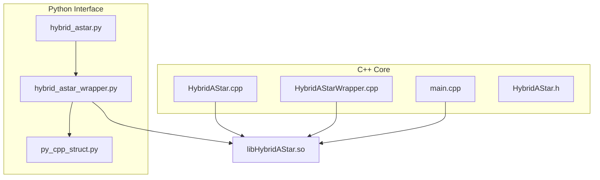
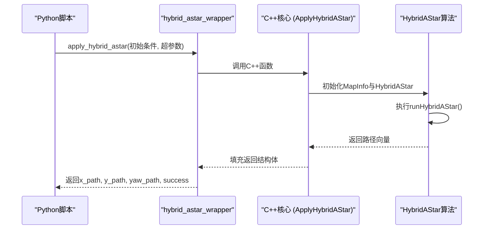
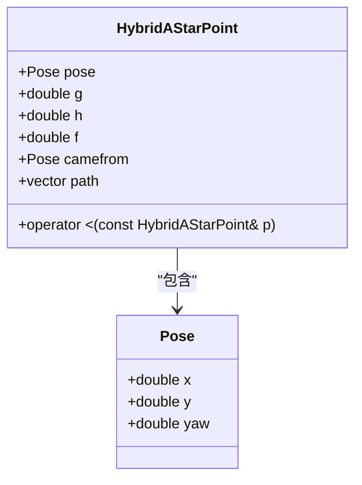
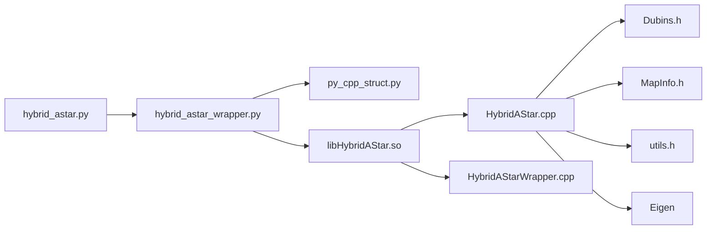

# 混合A*算法

<cite>
**本文档中引用的文件**  
- [hybrid_astar.py](file://hybrid_astar_planner/HybridAStar/hybrid_astar.py)
- [hybrid_astar_wrapper.py](file://hybrid_astar_planner/HybridAStar/hybrid_astar_wrapper.py)
- [py_cpp_struct.py](file://hybrid_astar_planner/HybridAStar/py_cpp_struct.py)
- [HybridAStar.cpp](file://hybrid_astar_planner/src/HybridAStar.cpp)
- [HybridAStarWrapper.cpp](file://hybrid_astar_planner/src/HybridAStarWrapper.cpp)
- [HybridAStar.h](file://hybrid_astar_planner/include/HybridAStar.h)
- [main.cpp](file://hybrid_astar_planner/src/main.cpp)
</cite>

## 目录
1. [简介](#简介)
2. [项目结构](#项目结构)
3. [核心组件](#核心组件)
4. [架构概述](#架构概述)
5. [详细组件分析](#详细组件分析)
6. [依赖分析](#依赖分析)
7. [性能考量](#性能考量)
8. [故障排除指南](#故障排除指南)
9. [结论](#结论)

## 简介
混合A*算法是一种专为非完整约束系统（如汽车类机器人）设计的路径规划算法，结合了离散网格搜索与连续空间运动学模型（如Dubins路径），能够在狭窄空间和复杂障碍物环境中生成平滑且可行的路径。本文档深入分析该算法在`hybrid_astar.py`中的实现机制，涵盖状态空间离散化、启发式函数设计、运动原语生成、后处理平滑技术等关键环节，并探讨关键参数对规划结果的影响，提供实际应用案例与优化建议。

## 项目结构
混合A*算法实现位于`hybrid_astar_planner`目录下，采用C++核心算法与Python封装接口相结合的方式。主要结构包括：
- `HybridAStar/`：Python接口与测试脚本
- `src/`：C++核心算法实现
- `include/`：头文件定义
- `build.sh`：编译脚本

**Diagram sources**  
- [hybrid_astar.py](file://hybrid_astar_planner/HybridAStar/hybrid_astar.py)
- [hybrid_astar_wrapper.py](file://hybrid_astar_planner/HybridAStar/hybrid_astar_wrapper.py)
- [HybridAStar.cpp](file://hybrid_astar_planner/src/HybridAStar.cpp)
- [HybridAStarWrapper.cpp](file://hybrid_astar_planner/src/HybridAStarWrapper.cpp)

**Section sources**
- [hybrid_astar.py](file://hybrid_astar_planner/HybridAStar/hybrid_astar.py)
- [HybridAStar.cpp](file://hybrid_astar_planner/src/HybridAStar.cpp)

## 核心组件
混合A*算法的核心组件包括状态表示、启发式函数、邻居生成、碰撞检测与路径重构。算法通过维护开放列表（openlist）和关闭列表（closelist）进行搜索，使用Dubins路径模型生成运动原语，并结合A*搜索策略寻找最优路径。

**Section sources**
- [HybridAStar.h](file://hybrid_astar_planner/include/HybridAStar.h#L0-L37)
- [HybridAStar.cpp](file://hybrid_astar_planner/src/HybridAStar.cpp#L0-L170)

## 架构概述
混合A*算法采用分层架构，上层为Python调用接口，下层为C++高性能计算核心。Python层负责初始化条件与参数配置，通过ctypes调用C++编译的共享库执行路径搜索，最终返回路径坐标与状态信息。

**Diagram sources**  
- [hybrid_astar_wrapper.py](file://hybrid_astar_planner/HybridAStar/hybrid_astar_wrapper.py#L0-L123)
- [HybridAStarWrapper.cpp](file://hybrid_astar_planner/src/HybridAStarWrapper.cpp#L0-L32)
- [HybridAStar.cpp](file://hybrid_astar_planner/src/HybridAStar.cpp#L91-L111)

## 详细组件分析

### 状态空间与节点结构
算法使用`HybridAStarPoint`结构体表示搜索空间中的节点，包含位姿（pose）、代价（g, h, f）、父节点（camefrom）和路径段（path）。优先队列基于f值排序，确保最优优先搜索。

**Diagram sources**  
- [HybridAStar.h](file://hybrid_astar_planner/include/HybridAStar.h#L0-L37)

### 启发式函数设计
启发式函数`hCost`采用欧几里得距离作为从当前位姿到目标位姿的估计代价，保证算法的可接受性（admissible），从而确保找到最优路径。

**Section sources**
- [HybridAStar.cpp](file://hybrid_astar_planner/src/HybridAStar.cpp#L85-L89)

### 运动原语生成
`getNeighbors`函数生成当前位姿的可达邻居，通过不同转向角（rad_step）生成左转、右转和直行的Dubins路径段，形成离散化的运动原语集合。

**Section sources**
- [HybridAStar.cpp](file://hybrid_astar_planner/src/HybridAStar.cpp#L44-L89)

### 碰撞检测机制
`isCollision`函数沿路径逐点检测车辆轮廓是否与障碍物相交。通过`MapInfo`类设置车辆位姿并获取轮廓，调用`isCollision`进行几何碰撞判断。

**Section sources**
- [HybridAStar.cpp](file://hybrid_astar_planner/src/HybridAStar.cpp#L85-L89)

### 路径重构
`reconstructPath`函数从最优终点反向遍历关闭列表，拼接各节点的路径段，最终生成完整路径并反转顺序输出。

**Section sources**
- [HybridAStar.cpp](file://hybrid_astar_planner/src/HybridAStar.cpp#L75-L84)

## 依赖分析
混合A*算法依赖多个外部组件与库：
- Eigen：用于线性代数运算
- ctypes：Python与C++交互
- matplotlib：路径可视化
- Dubins路径库：运动学模型支持

**Diagram sources**  
- [hybrid_astar_wrapper.py](file://hybrid_astar_planner/HybridAStar/hybrid_astar_wrapper.py)
- [HybridAStar.h](file://hybrid_astar_planner/include/HybridAStar.h)

**Section sources**
- [hybrid_astar_wrapper.py](file://hybrid_astar_planner/HybridAStar/hybrid_astar_wrapper.py)
- [HybridAStar.h](file://hybrid_astar_planner/include/HybridAStar.h)

## 性能考量
算法性能受以下关键参数影响：
- `step_size`：步长越大搜索越快但精度越低
- `max_iterations`：限制最大迭代次数防止无限循环
- `completion_threshold`：位置收敛阈值
- `angle_completion_threshold`：朝向收敛阈值
- `radius`：车辆最小转弯半径，直接影响Dubins路径生成
- `obstacle_clearance`：安全距离，避免路径贴近障碍物

合理配置这些参数可在规划质量与计算效率之间取得平衡。

## 故障排除指南
常见问题及解决方案：
- **路径未找到**：检查起始与目标位姿是否被障碍物包围，或增大`max_iterations`
- **路径不平滑**：减小`step_size`或增加后处理平滑步骤
- **计算时间过长**：增大`completion_threshold`或减小搜索范围
- **C++库加载失败**：确保已执行`build.sh`正确编译共享库

**Section sources**
- [hybrid_astar.py](file://hybrid_astar_planner/HybridAStar/hybrid_astar.py#L0-L100)
- [hybrid_astar_wrapper.py](file://hybrid_astar_planner/HybridAStar/hybrid_astar_wrapper.py#L0-L123)

## 结论
混合A*算法通过融合离散搜索与连续运动模型，有效解决了非完整约束系统的路径规划难题。其在狭窄空间泊车、复杂障碍物规避等场景中表现出色。通过合理配置超参数并结合后处理优化，可进一步提升路径质量与实时性。未来可探索引入Reeds-Shepp路径支持倒车、优化启发式函数或集成动态障碍物预测模块。