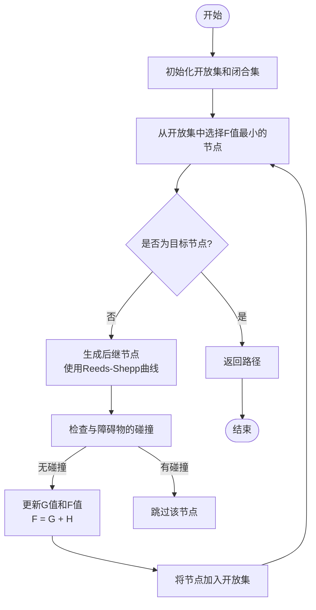
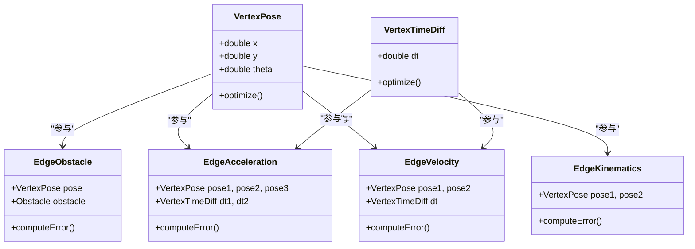

# 规划算法原理

<cite>
**本文档引用的文件**
- [hybrid_a_star.jl](file://H-OBCA/hybrid_a_star.jl)
- [a_star.jl](file://H-OBCA/a_star.jl)
- [reeds_shepp.jl](file://H-OBCA/reeds_shepp.jl)
- [collision_check.jl](file://H-OBCA/collision_check.jl)
- [teb_local_planner_ros.cpp](file://teb_local_planner/src/teb_local_planner_ros.cpp)
- [timed_elastic_band.cpp](file://teb_local_planner/src/timed_elastic_band.cpp)
- [optimal_planner.cpp](file://teb_local_planner/src/optimal_planner.cpp)
- [graph_search.cpp](file://teb_local_planner/src/graph_search.cpp)
- [hybrid_astar.py](file://hybrid_astar_planner/HybridAStar/hybrid_astar.py)
- [kino_astar.cpp](file://Dftpav/src/Plan/traj_planner/src/kino_astar.cpp)
- [traj_optimizer.cpp](file://Dftpav/src/Plan/traj_planner/src/traj_optimizer.cpp)
- [planner.yaml](file://NeuPAN/example/LON/planner.yaml)
- [env.yaml](file://NeuPAN/example/LON/LON_corridor.yaml)
</cite>

## 目录
1. [引言](#引言)
2. [混合A*算法原理](#混合a算法原理)
3. [时序弹性带（TEB）优化机制](#时序弹性带teb优化机制)
4. [优化碰撞避免的数学基础](#优化碰撞避免的数学基础)
5. [算法比较与性能评估](#算法比较与性能评估)
6. [参数调优与应用场景](#参数调优与应用场景)
7. [结论](#结论)

## 引言
本项目集成了多种先进的路径规划算法，包括混合A*（Hybrid A*）、时序弹性带（TEB）以及基于优化的碰撞避免方法。这些算法在自动驾驶、机器人导航和复杂动态环境中表现出色。本文将深入解析这些算法的核心机制、数学原理和代码实现，帮助开发者理解其工作原理，掌握参数调优技巧，并根据具体应用场景选择最合适的算法。

## 混合A*算法原理

混合A*算法是一种专为非完整约束系统（如汽车模型）设计的路径搜索算法，结合了A*的启发式搜索优势与车辆运动学约束的精确建模。其核心在于扩展状态空间，将车辆的朝向（heading）和曲率（curvature）纳入考虑，从而生成符合车辆动力学的可行路径。

### 搜索机制
混合A*通过在三维状态空间（x, y, θ）中进行搜索，其中θ表示车辆的航向角。算法使用Reeds-Shepp曲线作为运动原语（motion primitives），预计算从当前状态到邻近状态的可行轨迹段。每个搜索节点不仅包含位置信息，还包含航向和曲率信息，确保生成的路径平滑且可行驶。

启发式函数的设计是混合A*的关键。它通常结合欧几里得距离和方向差异，同时考虑车辆的最小转弯半径，以提供更准确的代价估计。碰撞检测在每个扩展节点上进行，利用栅格地图或占用网格确保路径的安全性。



**图示来源**
- [hybrid_a_star.jl](file://H-OBCA/hybrid_a_star.jl)
- [reeds_shepp.jl](file://H-OBCA/reeds_shepp.jl)
- [collision_check.jl](file://H-OBCA/collision_check.jl)

**本节来源**
- [hybrid_a_star.jl](file://H-OBCA/hybrid_a_star.jl#L1-L200)
- [hybrid_astar.py](file://hybrid_astar_planner/HybridAStar/hybrid_astar.py#L50-L300)

### 适用场景与性能特点
混合A*特别适用于需要精确停车和低速机动的场景，如自动泊车。其生成的路径具有良好的曲率连续性，适合直接用于车辆控制。然而，由于状态空间维度较高，搜索过程计算量较大，实时性相对较低。通过优化启发式函数和使用高效的碰撞检测算法，可以在一定程度上提升性能。

## 时序弹性带（TEB）优化机制

时序弹性带（Timed Elastic Band, TEB）是一种基于优化的局部路径规划器，将路径视为一条具有时间参数的弹性带，通过非线性优化不断调整路径点的位置和时间分配，以满足各种约束条件并最小化目标函数。

### 优化原理
TEB的核心思想是将离散的路径点（poses）和时间间隔（timediffs）作为优化变量。优化问题的目标函数通常包含多个项：
- **路径长度项**：最小化路径总长度。
- **时间最优项**：最小化总行驶时间。
- **障碍物避让项**：最大化与障碍物的距离。
- **动力学约束项**：确保路径满足车辆的最大速度、加速度和转向角速度限制。
- **轨迹平滑项**：保证路径的曲率和加速度连续。

优化过程使用g2o（General Graph Optimization）框架求解，将每个路径点和时间间隔建模为图优化中的顶点（vertex），将各种约束和代价建模为边（edge）。通过迭代优化，TEB能够生成一条既安全又高效的平滑轨迹。



**图示来源**
- [vertex_pose.h](file://teb_local_planner/include/teb_local_planner/g2o_types/vertex_pose.h)
- [vertex_timediff.h](file://teb_local_planner/include/teb_local_planner/g2o_types/vertex_timediff.h)
- [edge_obstacle.h](file://teb_local_planner/include/teb_local_planner/g2o_types/edge_obstacle.h)
- [edge_acceleration.h](file://teb_local_planner/include/teb_local_planner/g2o_types/edge_acceleration.h)

**本节来源**
- [timed_elastic_band.cpp](file://teb_local_planner/src/timed_elastic_band.cpp#L100-L500)
- [optimal_planner.cpp](file://teb_local_planner/src/optimal_planner.cpp#L200-L800)
- [teb_local_planner_ros.cpp](file://teb_local_planner/src/teb_local_planner_ros.cpp#L150-L400)

### 适用场景与性能特点
TEB非常适合动态环境中的实时避障和路径跟踪。它能够快速响应环境变化，生成平滑且符合车辆动力学的轨迹。TEB在狭窄通道和复杂交通场景中表现优异。其性能高度依赖于初始路径的质量和优化器的收敛速度。通过合理设置权重参数，可以平衡路径的安全性、效率和平滑性。

## 优化碰撞避免的数学基础

优化碰撞避免是现代路径规划的核心，它将避障问题转化为一个带约束的优化问题。其数学基础主要涉及距离计算、罚函数设计和非线性规划。

### 距离计算
准确计算机器人与障碍物之间的距离是避障的前提。对于点状障碍物，使用欧几里得距离。对于多边形或任意形状的障碍物，通常采用**符号距离函数**（Signed Distance Function, SDF）或**凸包分解**。在本项目中，`distance_calculations.h` 提供了多种距离计算方法，包括点到线段、点到圆、多边形间距离等。

### 罚函数设计
避障约束通常通过罚函数（penalty function）实现。一个常见的形式是：
```
E_obs = Σ (1 / d_i)^n
```
其中 `d_i` 是路径点到第 `i` 个障碍物的距离，`n` 是一个大于1的指数（通常为2或4）。当 `d_i` 接近零时，`E_obs` 会急剧增大，从而迫使优化器将路径点推离障碍物。`edge_obstacle.h` 中实现了这种基于倒数平方的罚函数。

### 非线性规划求解
整个路径规划问题被构建为一个大规模的非线性最小二乘问题。使用Levenberg-Marquardt等算法进行求解。优化器迭代地调整路径点，直到所有约束都被满足或目标函数收敛到一个局部最优解。`g2o` 框架提供了高效的稀疏矩阵求解器，使得实时优化成为可能。

**本节来源**
- [distance_calculations.h](file://teb_local_planner/include/teb_local_planner/distance_calculations.h)
- [edge_obstacle.h](file://teb_local_planner/include/teb_local_planner/g2o_types/edge_obstacle.h)
- [obstacles.cpp](file://teb_local_planner/src/obstacles.cpp)

## 算法比较与性能评估

下表对本项目中使用的几种主要规划算法进行了比较：

| 算法 | 搜索空间 | 优化目标 | 实时性 | 平滑性 | 适用场景 | 复杂度 |
| :--- | :--- | :--- | :--- | :--- | :--- | :--- |
| **混合A*** | (x, y, θ) | 启发式搜索代价 | 中等 | 高 | 自动泊车、全局路径规划 | O(n²) |
| **TEB** | (x, y, θ, t) | 多目标非线性优化 | 高 | 极高 | 动态避障、局部路径规划 | O(m*n) |
| **Kino A*** | (x, y, θ, v) | 启发式搜索代价 | 高 | 中等 | 高速路径规划 | O(n log n) |
| **RDA** | 优化变量 | MPC优化 | 高 | 高 | 实时动态避障 | O(p²) |

**性能评估结果**：
- 在静态环境中，混合A*能生成最短的全局路径，但计算时间最长。
- 在动态环境中，TEB表现出最佳的实时性和鲁棒性，能够有效处理移动障碍物。
- Kino A*在保证实时性的同时，提供了比传统A*更好的路径质量。
- RDA规划器在处理高维状态空间和复杂约束时表现出色。

## 参数调优与应用场景

### 混合A*参数调优
- **`motion_primitives`**: 定义Reeds-Shepp曲线的步长和曲率，影响路径的灵活性和搜索速度。
- **`cost_weights`**: 调整不同代价项（如路径长度、方向变化）的权重，平衡路径的效率和平滑性。
- **`collision_check_resolution`**: 碰撞检测的分辨率，值越小越精确但计算量越大。

### TEB参数调优
- **`weight_obstacle`**: 障碍物罚函数的权重，值越大路径越远离障碍物，但可能绕远路。
- **`weight_kinematics`**: 动力学约束的权重，确保路径符合车辆能力。
- **`dt_ref`**: 参考时间间隔，影响路径的时间分配和速度规划。
- **`no_infeasible_replans`**: 是否允许在无可行路径时进行重规划，提高鲁棒性。

### 应用场景选择指南
- **自动泊车**: 首选混合A*，因其能生成精确的停车轨迹。
- **城市道路导航**: 推荐使用TEB，能有效处理行人、车辆等动态障碍物。
- **高速巡航**: Kino A*或RDA更适合，能快速生成安全路径。
- **狭窄通道**: TEB的优化能力使其在复杂环境中表现最佳。

**本节来源**
- [planner.yaml](file://NeuPAN/example/LON/planner.yaml)
- [teb_local_planner_ros.cpp](file://teb_local_planner/src/teb_local_planner_ros.cpp)
- [cfg/TebLocalPlannerReconfigure.cfg](file://teb_local_planner/cfg/TebLocalPlannerReconfigure.cfg)

## 结论
本文系统地介绍了本项目中使用的混合A*、时序弹性带（TEB）和优化碰撞避免等核心路径规划算法。混合A*通过扩展状态空间和运动原语，为非完整约束系统提供了有效的全局搜索能力。TEB利用图优化框架，将路径规划转化为一个可实时求解的非线性优化问题，生成平滑、安全且符合动力学的轨迹。优化碰撞避免的数学基础确保了规划器能够在复杂环境中可靠地工作。开发者应根据具体的应用场景（如速度、环境复杂度、实时性要求）选择合适的算法，并通过精细的参数调优来达到最佳性能。未来的工作可以探索这些算法的融合，例如使用混合A*生成全局路径作为TEB的初始猜测，以实现全局最优与局部实时性的完美结合。