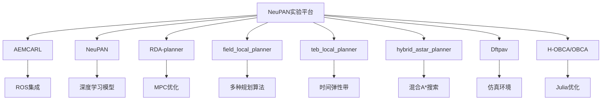

# 安装与配置

<cite>
**本文档引用的文件**  
- [README.md](file://AEMCARL/README.md)
- [requirements.txt](file://AEMCARL/attachments/ros_ws/requirements.txt)
- [setup.py](file://AEMCARL/setup.py)
- [env.yaml](file://AEMCARL/env.yaml)
- [CMakeLists.txt](file://field_local_planner/field_local_planner_base/CMakeLists.txt)
- [package.xml](file://field_local_planner/field_local_planner_base/package.xml)
- [teb_local_planner_ros.cpp](file://teb_local_planner/src/teb_local_planner_ros.cpp)
- [teb_config.h](file://teb_local_planner/include/teb_local_planner/teb_config.h)
- [build.sh](file://hybrid_astar_planner/build.sh)
- [main.jl](file://H-OBCA/main.jl)
- [run.sh](file://Dftpav/run.sh)
- [pyproject.toml](file://NeuPAN/pyproject.toml)
- [setup.py](file://RDA-planner/setup.py)
</cite>

## 目录
1. [简介](#简介)
2. [项目结构概览](#项目结构概览)
3. [环境准备](#环境准备)
4. [核心子项目安装与配置](#核心子项目安装与配置)
5. [ROS集成配置](#ros集成配置)
6. [高级配置与性能优化](#高级配置与性能优化)
7. [常见问题排查](#常见问题排查)
8. [结论](#结论)

## 简介
本指南旨在为用户提供在不同操作系统环境下搭建NeuPAN实验项目的完整安装与配置流程。文档覆盖从基础环境准备到各子项目具体配置的详细步骤，结合实际配置文件解释关键参数，并为初学者和高级开发者分别提供操作指引与优化建议。

## 项目结构概览
项目包含多个独立但可集成的子系统，主要分为：
- **AEMCARL**: 基于ROS的局部路径规划与人群导航系统
- **NeuPAN**: 深度学习驱动的路径规划框架
- **RDA-planner**: 基于MPC的实时动态避障规划器
- **field_local_planner**: 多种局部规划器插件集合
- **teb_local_planner**: 时间弹性带局部规划器
- **hybrid_astar_planner**: 混合A*全局规划器
- **Dftpav**: 规划与仿真集成系统
- **H-OBCA/OBCA**: 基于Julia的优化规划器



**Diagram sources**
- [README.md](file://AEMCARL/README.md)
- [README.md](file://NeuPAN/README.md)
- [README.md](file://RDA-planner/README.md)

## 环境准备

### 操作系统支持
项目主要支持以下操作系统：
- Ubuntu 20.04/22.04 LTS
- Windows 10/11 (WSL2环境)
- macOS Monterey及以上版本

### 基础依赖安装
#### Python环境
```bash
# 推荐使用conda创建独立环境
conda create -n neupan python=3.8
conda activate neupan
```

#### ROS环境（Ubuntu）
```bash
# 安装ROS Noetic
sudo sh -c 'echo "deb http://packages.ros.org/ros/ubuntu $(lsb_release -sc) main" > /etc/apt/sources.list.d/ros-latest.list'
sudo apt-key adv --keyserver 'hkp://keyserver.ubuntu.com:80' --recv-key C1CF6E31E6BADE8868B172B4F42ED6FBAB17C654
sudo apt update
sudo apt install ros-noetic-desktop-full
```

#### Julia环境
```bash
# 下载并安装Julia
wget https://julialang-s3.julialang.org/bin/linux/x64/1.9/julia-1.9.0-linux-x86_64.tar.gz
tar -xvzf julia-1.9.0-linux-x86_64.tar.gz
export PATH="$PATH:/path/to/julia-1.9.0/bin"
```

**Section sources**
- [README.md](file://AEMCARL/README.md)
- [README.md](file://H-OBCA/README.md)
- [README.md](file://OBCA/README.md)

## 核心子项目安装与配置

### AEMCARL安装配置
AEMCARL是基于ROS的人群导航系统，包含多个ROS包。

#### 依赖安装
```bash
# 安装Python依赖
pip install -r AEMCARL/attachments/ros_ws/requirements.txt

# 安装ROS依赖
rosdep install --from-paths AEMCARL/attachments/ros_ws --ignore-src -r -y
```

#### 构建过程
```bash
cd AEMCARL/attachments/ros_ws
catkin_make
source devel/setup.bash
```

#### 环境变量配置
```bash
# 添加到~/.bashrc
export AEMCARL_PATH=/path/to/AEMCARL
export PYTHONPATH=$PYTHONPATH:$AEMCARL_PATH/crowd_nav:$AEMCARL_PATH/crowd_sim
```

**Section sources**
- [requirements.txt](file://AEMCARL/attachments/ros_ws/requirements.txt)
- [setup.py](file://AEMCARL/setup.py)

### NeuPAN安装配置
NeuPAN是基于深度学习的路径规划框架。

#### 安装步骤
```bash
cd NeuPAN
pip install -e .
```

#### 配置文件说明
NeuPAN使用YAML格式配置文件，主要配置项包括：

| 配置项 | 说明 | 默认值 |
|--------|------|--------|
| `model.type` | 模型类型 | pan |
| `robot.type` | 机器人类型 | diff |
| `planner.max_iter` | 最大迭代次数 | 1000 |
| `planner.step_size` | 步长 | 0.1 |

配置文件示例路径：`NeuPAN/example/corridor/acker/planner.yaml`

**Section sources**
- [pyproject.toml](file://NeuPAN/pyproject.toml)
- [example/corridor/acker/planner.yaml](file://NeuPAN/example/corridor/acker/planner.yaml)

### RDA-planner安装配置
RDA-planner是基于MPC的实时动态避障规划器。

#### 安装步骤
```bash
cd RDA-planner
pip install -e .
```

#### 依赖说明
- `casadi`: 用于MPC求解
- `numpy`: 数值计算
- `matplotlib`: 可视化

#### 配置参数
```yaml
# example/corridor/corridor.yaml
mpc:
  horizon: 20
  dt: 0.1
  Q: [1.0, 1.0, 0.1]
  R: [0.1, 0.1]
```

**Section sources**
- [setup.py](file://RDA-planner/setup.py)
- [example/corridor/corridor.yaml](file://RDA-planner/example/corridor/corridor.yaml)

### hybrid_astar_planner安装配置
混合A*规划器提供全局路径规划功能。

#### 构建过程
```bash
cd hybrid_astar_planner
chmod +x build.sh
./build.sh
```

#### CMakeLists.txt关键配置
```cmake
find_package(catkin REQUIRED COMPONENTS
  roscpp
  rospy
  std_msgs
  geometry_msgs
)

catkin_package(
  INCLUDE_DIRS include
  LIBRARIES hybrid_astar
  CATKIN_DEPENDS roscpp std_msgs geometry_msgs
)
```

**Section sources**
- [build.sh](file://hybrid_astar_planner/build.sh)
- [CMakeLists.txt](file://hybrid_astar_planner/CMakeLists.txt)

## ROS集成配置

### 工作空间设置
```bash
# 创建catkin工作空间
mkdir -p ~/catkin_ws/src
cd ~/catkin_ws/src
catkin_init_workspace

# 链接项目中的ROS包
ln -s /path/to/neupan_experiments/field_local_planner .
ln -s /path/to/neupan_experiments/AEMCARL/attachments/ros_ws/src/helper .
```

### 包依赖管理
field_local_planner系列包使用标准的ROS包结构：

```xml
<!-- package.xml 示例 -->
<package format="2">
  <name>field_local_planner_base</name>
  <version>1.0.0</version>
  <description>Base local planner for field robots</description>
  
  <maintainer email="maintainer@todo.todo">maintainer</maintainer>
  <license>BSD</license>
  
  <buildtool_depend>catkin</buildtool_depend>
  <build_depend>roscpp</build_depend>
  <build_depend>pluginlib</build_depend>
  <exec_depend>roscpp</exec_depend>
  <exec_depend>pluginlib</exec_depend>
</package>
```

### 动态重配置
field_local_planner支持动态参数调整：

```python
# dynamic_reconfigure配置文件
from dynamic_reconfigure.parameter_generator_catkin import *

gen = ParameterGenerator()
gen.add("max_speed", double_t, 0, "Maximum speed", 2.0, 0.1, 5.0)
gen.add("min_speed", double_t, 0, "Minimum speed", 0.1, 0.0, 2.0)
gen.add("acc_limit", double_t, 0, "Acceleration limit", 1.0, 0.1, 10.0)
```

**Section sources**
- [package.xml](file://field_local_planner/field_local_planner_base/package.xml)
- [Base.cfg](file://field_local_planner/field_local_planner_base/dynamic_reconfigure/Base.cfg)

## 高级配置与性能优化

### teb_local_planner参数调优
TEB局部规划器的关键参数配置：

```cpp
// teb_config.h 中的参数类
class TEBConfig
{
public:
  double dt_ref;           // 时间步长参考值
  double dt_hysteresis;    // 时间步长滞后
  int min_samples;         // 最小采样点数
  int max_samples;         // 最大采样点数
  bool exact_arc_length;   // 是否使用精确弧长
};
```

推荐调优策略：
1. **轨迹平滑度**: 调整`weight_velocity`和`weight_acc`参数
2. **避障灵敏度**: 调整`weight_obstacle`和`inflation_dist`
3. **计算效率**: 调整`no_inner_iterations`和`no_outer_iterations`

**Section sources**
- [teb_config.h](file://teb_local_planner/include/teb_local_planner/teb_config.h)
- [teb_local_planner_ros.cpp](file://teb_local_planner/src/teb_local_planner_ros.cpp)

### Dftpav系统集成
Dftpav提供完整的规划与仿真集成环境。

#### 启动流程
```bash
cd Dftpav
./run.sh
```

#### 配置文件结构
```protobuf
// traj_planner/config/minco_config.pb.txt
trajectory_config {
  max_velocity: 2.0
  max_acceleration: 1.5
  resolution: 0.1
  time_step: 0.05
}
```

**Section sources**
- [run.sh](file://Dftpav/run.sh)
- [minco_config.pb.txt](file://Dftpav/src/Plan/traj_planner/config/minco_config.pb.txt)

### H-OBCA参数配置
基于Julia的优化规划器配置：

```julia
# main.jl 中的参数设置
const MAX_ITER = 100
const TOLERANCE = 1e-6
const DT = 0.1
const N = 50  # 时间步数

# 碰撞检测参数
const ROBOT_RADIUS = 0.5
const OBSTACLE_INFLATION = 0.3
```

**Section sources**
- [main.jl](file://H-OBCA/main.jl)
- [setup.jl](file://H-OBCA/setup.jl)

## 常见问题排查

### Python依赖冲突
**问题**: 不同子项目使用不同版本的依赖包

**解决方案**:
```bash
# 使用虚拟环境隔离
python -m venv aemcarl_env
source aemcarl_env/bin/activate
pip install -r AEMCARL/requirements.txt

python -m venv rda_env  
source rda_env/bin/activate
pip install -r RDA-planner/requirements.txt
```

### ROS包找不到
**问题**: catkin_make时报错"package not found"

**解决方案**:
1. 确保所有ROS包都在`src`目录下
2. 运行`rosdep update`更新依赖数据库
3. 检查`package.xml`中的依赖声明是否正确
4. 执行`source /opt/ros/noetic/setup.bash`确保ROS环境已加载

### C++编译错误
**问题**: CMakeLists.txt配置错误导致编译失败

**检查清单**:
- 确保`find_package()`包含所有依赖
- 检查`catkin_package()`的`INCLUDE_DIRS`和`LIBRARIES`
- 验证`add_executable()`和`target_link_libraries()`的匹配

### Julia包加载失败
**问题**: Julia无法加载OBCA相关包

**解决方案**:
```julia
# 在Julia REPL中
import Pkg
Pkg.activate(".")
Pkg.instantiate()  # 安装所有依赖
```

### 环境变量未生效
**问题**: 自定义环境变量在新终端中丢失

**解决方案**:
将环境变量添加到shell配置文件中：
```bash
echo 'export NEUPAN_PATH=/path/to/neupan_experiments' >> ~/.bashrc
echo 'source /opt/ros/noetic/setup.bash' >> ~/.bashrc
source ~/.bashrc
```

**Section sources**
- [env.yaml](file://AEMCARL/env.yaml)
- [.bashrc](file://~/.bashrc)

## 结论
本指南提供了NeuPAN实验平台的完整安装与配置方案。通过遵循上述步骤，用户可以在不同操作系统环境下成功搭建开发环境。建议初学者按照顺序逐步操作，而经验丰富的开发者可根据需求直接调整高级配置参数以优化性能。