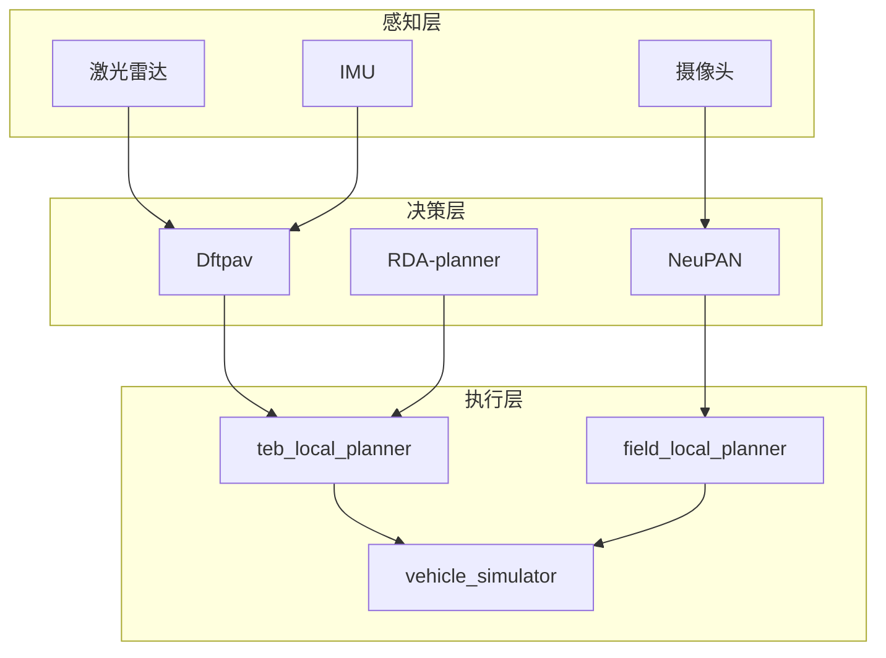
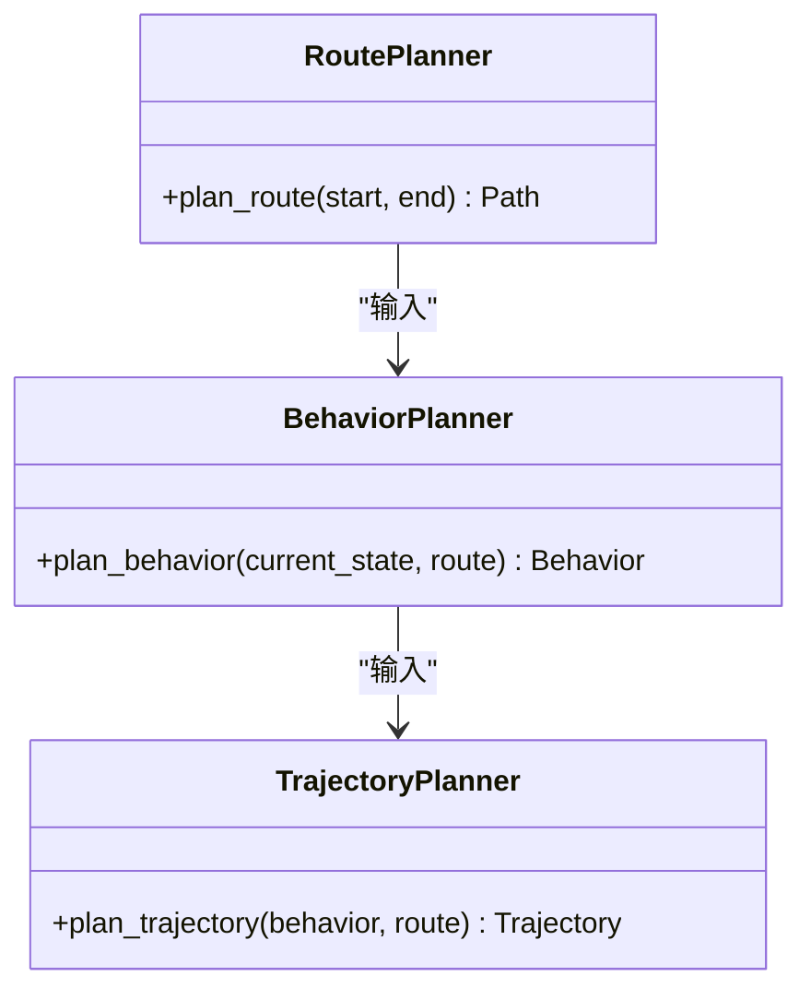
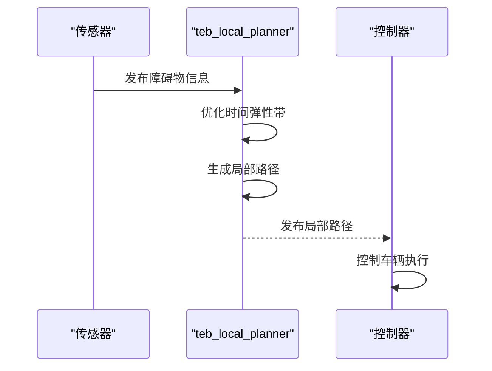
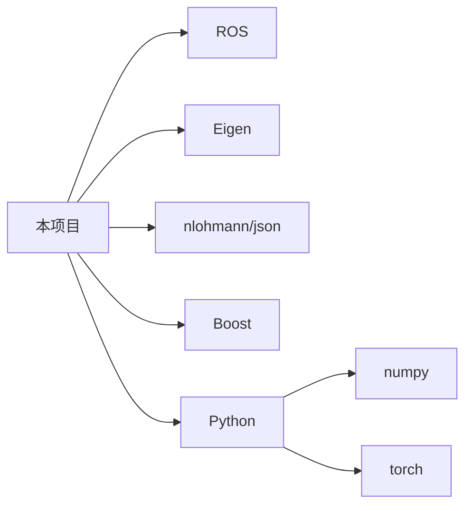

# 代码贡献流程

<cite>
**本文档中引用的文件**
- [CONTRIBUTING.md](file://CONTRIBUTING.md)
- [CODE_OF_CONDUCT.md](file://CODE_OF_CONDUCT.md)
- [README.md](file://README.md)
</cite>

## 目录
1. [简介](#简介)
2. [项目结构](#项目结构)
3. [核心组件](#核心组件)
4. [架构概述](#架构概述)
5. [详细组件分析](#详细组件分析)
6. [依赖分析](#依赖分析)
7. [性能考虑](#性能考虑)
8. [故障排除指南](#故障排除指南)
9. [结论](#结论)
10. [附录](#附录)（如有必要）

## 简介
本文档详细阐述了向本项目贡献代码的完整流程，旨在为新贡献者提供清晰的路径指引。文档涵盖了从环境搭建、分支创建、代码修改到提交Pull Request的每一步操作。同时，本文档解释了CONTRIBUTING.md中规定的贡献指南，包括问题报告规范、功能请求流程和代码审查机制，并说明了CODE_OF_CONDUCT.md中的行为准则要求，以确保社区健康协作。通过提供实际操作示例，展示如何正确提交代码变更、如何响应审查意见以及如何处理合并冲突，帮助贡献者顺利完成代码贡献。

## 项目结构
本项目包含多个子项目和模块，主要目录结构如下：
- AEMCARL：包含ROS工作空间和相关工具
- CrowdNav：人群导航相关模块
- Dftpav：路径规划和仿真模块
- H-OBCA：Julia语言实现的路径规划算法
- MPNet：神经网络路径规划器
- NeuPAN：神经路径规划模块
- OBCA：自主泊车和四旋翼导航
- RDA-planner：MPC路径规划器
- field_local_planner：局部路径规划器
- ground_based_autonomy_basic：地面自主基础模块
- hybrid_astar_planner：混合A*规划器
- mpc-mpnet-py：MPC与MPNet结合的Python实现
- teb_local_planner：时间弹性带局部规划器

每个子项目都有其独立的README.md文件，提供了该项目的详细信息和使用方法。

**Section sources**
- [README.md](file://README.md)

## 核心组件
项目的核心组件主要包括路径规划、仿真和局部规划模块。Dftpav模块提供了路径规划和仿真的核心功能，包括行为规划、运动预测和物理仿真。NeuPAN模块实现了基于神经网络的路径规划算法，能够处理复杂环境下的路径规划问题。teb_local_planner和field_local_planner提供了局部路径规划功能，能够在动态环境中实时调整路径。

**Section sources**
- [Dftpav/src/Sim/core/behavior_planner](file://Dftpav/src/Sim/core/behavior_planner)
- [NeuPAN/neupan/neupan.py](file://NeuPAN/neupan/neupan.py)
- [teb_local_planner/src](file://teb_local_planner/src)

## 架构概述
项目采用模块化架构，各子项目相对独立，通过标准接口进行通信。整体架构分为三层：感知层、决策层和执行层。感知层负责获取环境信息，决策层进行路径规划和行为决策，执行层负责控制车辆执行规划的路径。各模块通过ROS（Robot Operating System）进行通信，实现了松耦合的设计。

**Diagram sources**
- [Dftpav/src/Sim/core](file://Dftpav/src/Sim/core)
- [NeuPAN/neupan](file://NeuPAN/neupan)
- [teb_local_planner/src](file://teb_local_planner/src)

## 详细组件分析
### 路径规划组件分析
Dftpav模块中的路径规划组件是项目的核心之一，负责生成从起点到终点的最优路径。该组件采用分层规划架构，包括路线规划、行为规划和轨迹规划三个子模块。路线规划负责生成全局路径，行为规划决定车辆的驾驶行为（如变道、超车等），轨迹规划生成具体的车辆轨迹。

**Diagram sources**
- [Dftpav/src/Sim/core/route_planner](file://Dftpav/src/Sim/core/route_planner)
- [Dftpav/src/Sim/core/behavior_planner](file://Dftpav/src/Sim/core/behavior_planner)
- [Dftpav/src/Plan/traj_planner](file://Dftpav/src/Plan/traj_planner)

### 局部规划组件分析
teb_local_planner是项目中重要的局部规划器，采用时间弹性带（Timed Elastic Band）算法，在考虑时间维度的同时优化路径。该规划器能够处理动态障碍物，生成平滑且安全的局部路径。

**Diagram sources**
- [teb_local_planner/src/teb_local_planner_ros.cpp](file://teb_local_planner/src/teb_local_planner_ros.cpp)
- [teb_local_planner/include/teb_local_planner/timed_elastic_band.hpp](file://teb_local_planner/include/teb_local_planner/timed_elastic_band.hpp)

## 依赖分析
项目依赖于多个外部库和框架，主要包括：
- ROS（Robot Operating System）：作为主要的通信框架
- Eigen：线性代数计算库
- nlohmann/json：JSON处理库
- Boost：C++扩展库
- Python相关库：如numpy、torch等

这些依赖通过各子项目的配置文件（如CMakeLists.txt、package.xml、requirements.txt等）进行管理。

**Diagram sources**
- [Dftpav/src/Sim/core/CMakeLists.txt](file://Dftpav/src/Sim/core/CMakeLists.txt)
- [NeuPAN/requirements.txt](file://NeuPAN/requirements.txt)
- [teb_local_planner/package.xml](file://teb_local_planner/package.xml)

## 性能考虑
项目在设计时充分考虑了性能因素，特别是在路径规划和仿真的实时性方面。Dftpav模块采用了多线程架构，将计算密集型任务（如轨迹优化）放在独立线程中执行，避免阻塞主控制循环。NeuPAN模块利用神经网络的并行计算能力，能够在短时间内完成复杂环境的路径规划。teb_local_planner通过优化算法和数据结构，确保在动态环境中能够快速生成局部路径。

## 故障排除指南
在贡献代码过程中可能遇到的常见问题及解决方案：
1. 编译错误：检查依赖库是否正确安装，CMakeLists.txt配置是否正确
2. 运行时错误：使用调试工具（如gdb）定位问题，检查参数配置
3. 性能问题：使用性能分析工具（如gprof）找出瓶颈，优化算法或数据结构
4. 测试失败：检查测试用例的输入输出，确保代码逻辑正确

**Section sources**
- [CONTRIBUTING.md](file://CONTRIBUTING.md)
- [CODE_OF_CONDUCT.md](file://CODE_OF_CONDUCT.md)

## 结论
本文档详细介绍了向本项目贡献代码的完整流程，包括环境搭建、分支管理、代码修改、Pull Request提交等各个环节。通过遵循CONTRIBUTING.md中的贡献指南和CODE_OF_CONDUCT.md中的行为准则，贡献者可以有效地参与到项目开发中。项目采用模块化架构，各组件相对独立，便于开发和维护。希望本文档能够帮助新贡献者快速上手，共同推动项目的发展。

## 附录
### 代码贡献流程示例
1. Fork项目仓库
2. 克隆本地副本：`git clone https://github.com/your-username/repository.git`
3. 创建新分支：`git checkout -b feature/new-feature`
4. 进行代码修改
5. 提交更改：`git commit -m "Add new feature"`
6. 推送到远程分支：`git push origin feature/new-feature`
7. 在GitHub上创建Pull Request

### 代码审查要点
- 代码风格是否符合项目规范
- 是否有充分的注释和文档
- 是否包含必要的单元测试
- 是否考虑了边界情况和错误处理
- 性能是否满足要求