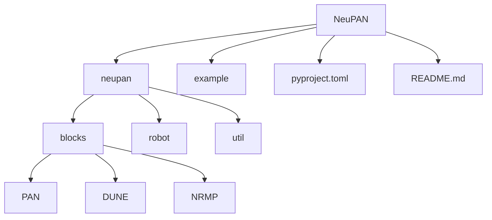

# 开发规范

<cite>
**本文档引用的文件**  
- [pyproject.toml](file://NeuPAN/pyproject.toml)
- [README.md](file://NeuPAN/README.md)
- [neupan.py](file://NeuPAN/neupan/neupan.py)
- [pan.py](file://NeuPAN/neupan/blocks/pan.py)
- [dune.py](file://NeuPAN/neupan/blocks/dune.py)
- [nrmp.py](file://NeuPAN/neupan/blocks/nrmp.py)
- [robot.py](file://NeuPAN/neupan/robot/robot.py)
- [run_exp.py](file://NeuPAN/example/run_exp.py)
</cite>

## 目录
1. [简介](#简介)
2. [项目结构](#项目结构)
3. [代码贡献流程](#代码贡献流程)
4. [编码标准](#编码标准)
5. [质量保证措施](#质量保证措施)
6. [构建配置管理](#构建配置管理)
7. [初学者指南](#初学者指南)
8. [高级开发技巧与最佳实践](#高级开发技巧与最佳实践)
9. [代码审查标准](#代码审查标准)
10. [测试覆盖率要求](#测试覆盖率要求)
11. [持续集成流程](#持续集成流程)
12. [结论](#结论)

## 简介
NeuPAN（Neural Proximal Alternating-minimization Network）是一个端到端、实时、无需地图且易于部署的基于模型预测控制（MPC）的机器人运动规划器。通过结合基于学习和基于优化的技术，NeuPAN能够直接将障碍点数据映射为实时控制动作，通过求解包含大量点级避障约束的端到端数学模型来实现。该方法消除了中间模块设计，避免了误差传播，实现了高精度，使机器人能够在杂乱且未知的环境中高效、安全地导航。

本开发规范旨在为开发者提供清晰的指导，涵盖代码贡献流程、编码标准、质量保证措施、构建配置管理以及针对初学者和经验丰富的开发者的实践指南。

**Section sources**
- [README.md](file://NeuPAN/README.md)

## 项目结构
NeuPAN项目的目录结构清晰，主要分为以下几个核心部分：

- **`NeuPAN/`**: 项目主目录，包含核心代码和配置文件。
  - **`neupan/`**: 核心Python包，实现了NeuPAN算法。
    - **`blocks/`**: 包含算法核心组件，如PAN、DUNE、NRMP等。
    - **`robot/`**: 定义机器人模型和运动学。
    - **`util/`**: 工具函数。
  - **`example/`**: 包含各种使用示例和演示脚本。
  - **`pyproject.toml`**: 项目构建和依赖配置文件。
  - **`README.md`**: 项目说明文档。



**Diagram sources**
- [pyproject.toml](file://NeuPAN/pyproject.toml)
- [README.md](file://NeuPAN/README.md)

**Section sources**
- [pyproject.toml](file://NeuPAN/pyproject.toml)
- [README.md](file://NeuPAN/README.md)

## 代码贡献流程
为了确保代码质量和项目稳定性，NeuPAN项目遵循以下代码贡献流程：

1.  **Fork 仓库**: 在GitHub上Fork `hanruihua/NeuPAN` 仓库到您的个人账户。
2.  **创建分支**: 从主分支创建一个新的功能或修复分支，例如 `feature/new-optimizer` 或 `fix/buffer-overflow`。
3.  **编写代码**: 在新分支上进行开发，确保遵循本规范中的编码标准。
4.  **编写测试**: 为新功能或修复编写相应的测试用例。
5.  **提交更改**: 使用清晰、简洁的提交信息提交您的更改。
6.  **推送分支**: 将您的分支推送到您的Fork仓库。
7.  **创建 Pull Request (PR)**: 在原始仓库中创建一个PR，详细描述您的更改、动机和测试结果。
8.  **代码审查**: 项目维护者将对您的PR进行审查，您可能需要根据反馈进行修改。
9.  **合并**: 审查通过后，您的代码将被合并到主分支。

**Section sources**
- [README.md](file://NeuPAN/README.md)

## 编码标准
NeuPAN项目遵循Python的PEP 8编码规范，并在此基础上制定了以下具体标准：

- **命名约定**:
  - 变量和函数名使用小写字母和下划线（`snake_case`）。
  - 类名使用驼峰命名法（`CamelCase`）。
  - 常量名使用大写字母和下划线（`UPPER_CASE`）。
- **代码格式化**: 使用`black`或`autopep8`等工具进行代码格式化，确保代码风格一致。
- **类型提示**: 鼓励使用Python的类型提示（Type Hints）来提高代码的可读性和可维护性。
- **文档字符串**: 所有公共类、函数和方法都必须包含符合Google或NumPy风格的文档字符串，清晰地描述其功能、参数、返回值和异常。
- **代码注释**: 对复杂的逻辑或算法进行必要的注释，但避免过度注释。

**Section sources**
- [neupan.py](file://NeuPAN/neupan/neupan.py)
- [pan.py](file://NeuPAN/neupan/blocks/pan.py)
- [dune.py](file://NeuPAN/neupan/blocks/dune.py)
- [nrmp.py](file://NeuPAN/neupan/blocks/nrmp.py)
- [robot.py](file://NeuPAN/neupan/robot/robot.py)

## 质量保证措施
NeuPAN项目通过多种措施来保证代码质量：

- **单元测试**: 项目包含单元测试，用于验证各个模块的正确性。
- **集成测试**: 通过`example/run_exp.py`等脚本进行集成测试，验证整个系统的功能。
- **静态代码分析**: 使用`pylint`或`flake8`等工具进行静态代码分析，检查潜在的错误和代码风格问题。
- **代码审查**: 所有代码合并前都必须经过至少一名维护者的审查。

**Section sources**
- [run_exp.py](file://NeuPAN/example/run_exp.py)
- [README.md](file://NeuPAN/README.md)

## 构建配置管理
NeuPAN项目使用`pyproject.toml`文件进行构建和依赖管理。

### pyproject.toml
该文件定义了项目的元数据、依赖项和构建后端。

```toml
[build-system]
requires = ["setuptools >= 61.0"]
build-backend = "setuptools.build_meta"

[project]
name = 'neupan'
version = "1.1"
requires-python = ">= 3.10"
dependencies = [
    'cvxpylayers',
    'numpy',
    'scipy<=1.13.0',
    'rich',
    'dill',
    'gctl==1.2',
    'colorama',
    'scikit-learn',
    'pyyaml',
    "torch>=2.1.0",
    "ecos",
]
```

- **`[build-system]`**: 指定构建项目所需的工具，这里使用`setuptools`。
- **`[project]`**: 定义项目的基本信息，如名称、版本、Python版本要求和依赖项。
- **`dependencies`**: 列出了项目运行所必需的第三方库。

### setup.py
在本项目中，`setup.py`已被`pyproject.toml`取代，不再使用。

**Section sources**
- [pyproject.toml](file://NeuPAN/pyproject.toml)

## 初学者指南
对于初次参与NeuPAN项目开发的开发者，建议遵循以下步骤：

1.  **阅读文档**: 仔细阅读`README.md`，了解项目的目标、安装方法和基本用法。
2.  **运行示例**: 运行`example/`目录下的示例，直观地理解NeuPAN的工作方式。
3.  **熟悉代码结构**: 从`neupan.py`的`neupan`类开始，逐步了解`PAN`、`DUNE`、`NRMP`等核心组件的交互。
4.  **设置开发环境**: 使用`pip install -e .`进行可编辑安装，方便在修改代码后立即测试。
5.  **从小处着手**: 从修复文档中的错别字或小bug开始，逐步参与到更复杂的开发任务中。

**Section sources**
- [README.md](file://NeuPAN/README.md)
- [neupan.py](file://NeuPAN/neupan/neupan.py)
- [run_exp.py](file://NeuPAN/example/run_exp.py)

## 高级开发技巧与最佳实践
对于经验丰富的开发者，以下是一些高级技巧和最佳实践：

- **理解PAN算法**: 深入理解`PAN`类中`forward`方法的迭代过程，这是NeuPAN的核心。
- **优化DUNE模型**: 掌握如何为自定义机器人几何形状训练DUNE模型，这是提升性能的关键。
- **调整参数**: 熟练使用YAML文件中的`adjust`参数来微调规划器的行为，使其在特定场景下表现更佳。
- **性能分析**: 使用`time_print`等工具分析算法的运行时间，识别性能瓶颈。
- **扩展功能**: 通过修改`robot.py`中的运动学约束，可以支持更多类型的机器人。

**Section sources**
- [pan.py](file://NeuPAN/neupan/blocks/pan.py)
- [dune.py](file://NeuPAN/neupan/blocks/dune.py)
- [neupan.py](file://NeuPAN/neupan/neupan.py)
- [robot.py](file://NeuPAN/neupan/robot/robot.py)

## 代码审查标准
代码审查是保证代码质量的重要环节。审查时应重点关注以下方面：

- **功能正确性**: 代码是否正确地实现了预期功能？
- **代码风格**: 是否符合PEP 8和项目编码标准？
- **可读性**: 代码是否清晰易懂？变量和函数命名是否恰当？
- **健壮性**: 是否处理了可能的异常和边界情况？
- **测试**: 是否有足够的测试用例覆盖了新功能？
- **文档**: 是否更新了相关的文档和注释？

**Section sources**
- [README.md](file://NeuPAN/README.md)

## 测试覆盖率要求
虽然项目中没有明确的测试覆盖率目标，但强烈建议为所有新功能和关键路径编写单元测试。可以使用`coverage.py`等工具来测量测试覆盖率，目标是核心模块的覆盖率尽可能高。

**Section sources**
- [README.md](file://NeuPAN/README.md)

## 持续集成流程
本项目目前未提供`.github/workflows`等CI配置文件，但建议在贡献代码时，确保本地测试通过。未来可以集成GitHub Actions等CI服务，实现代码推送后自动运行测试和代码分析。

**Section sources**
- [README.md](file://NeuPAN/README.md)

## 结论
遵循本开发规范，可以确保NeuPAN项目的代码质量和开发效率。无论是初学者还是资深开发者，都可以通过清晰的流程和标准参与到项目中，共同推动NeuPAN的发展。