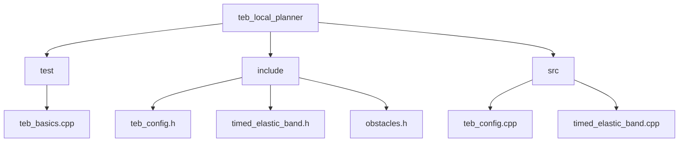
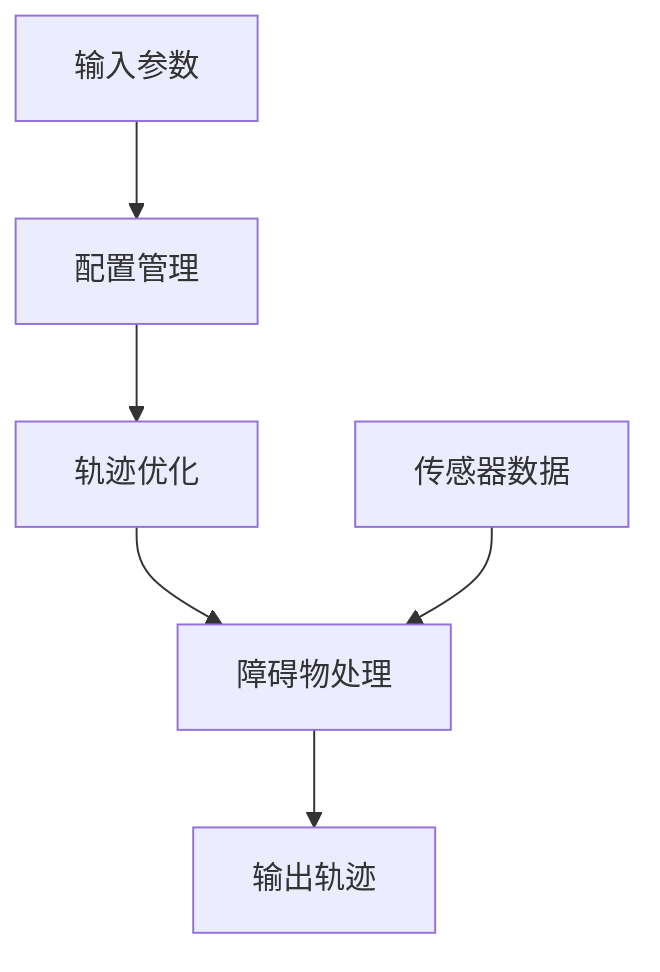
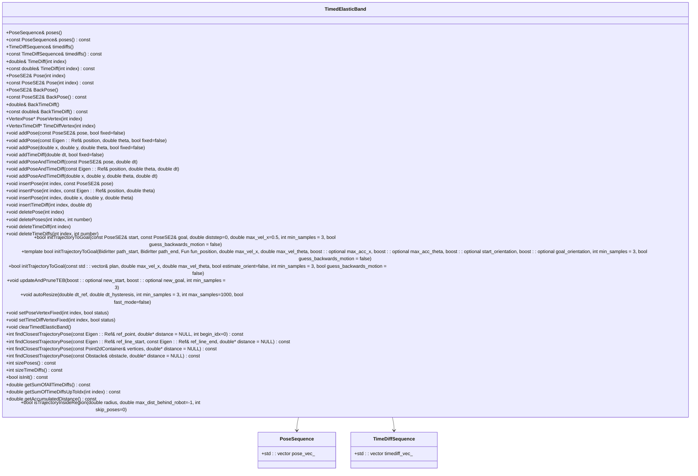
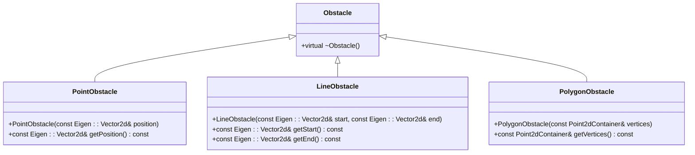
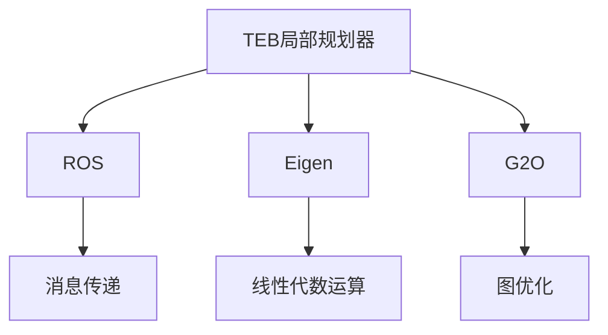

# 单元测试

<cite>
**本文档中引用的文件**  
- [teb_basics.cpp](file://teb_local_planner/test/teb_basics.cpp)
- [teb_config.h](file://teb_local_planner/include/teb_local_planner/teb_config.h)
- [timed_elastic_band.h](file://teb_local_planner/include/teb_local_planner/timed_elastic_band.h)
- [obstacles.h](file://teb_local_planner/include/teb_local_planner/obstacles.h)
</cite>

## 目录
1. [简介](#简介)
2. [项目结构](#项目结构)
3. [核心组件](#核心组件)
4. [架构概述](#架构概述)
5. [详细组件分析](#详细组件分析)
6. [依赖分析](#依赖分析)
7. [性能考虑](#性能考虑)
8. [故障排除指南](#故障排除指南)
9. [结论](#结论)

## 简介
本文档详细说明了基于teb_basics.cpp等实际测试文件的C++组件单元测试编写规范。重点介绍如何使用Google Test框架构建测试用例，涵盖TebConfig、TimedElasticBand和Obstacle等核心类的测试方法。文档还描述了测试覆盖率要求，包括函数覆盖、分支覆盖和边界条件验证，并提供了编写可维护、高可靠性的测试代码的最佳实践。

## 项目结构
项目结构显示了teb_local_planner模块的组织方式，其中包含测试文件、头文件和源文件。测试文件位于test目录下，头文件位于include目录下，源文件位于src目录下。这种结构有助于分离测试代码和生产代码，便于管理和维护。

**图示来源**
- [teb_basics.cpp](file://teb_local_planner/test/teb_basics.cpp)
- [teb_config.h](file://teb_local_planner/include/teb_local_planner/teb_config.h)
- [timed_elastic_band.h](file://teb_local_planner/include/teb_local_planner/timed_elastic_band.h)
- [obstacles.h](file://teb_local_planner/include/teb_local_planner/obstacles.h)

**节来源**
- [teb_basics.cpp](file://teb_local_planner/test/teb_basics.cpp)

## 核心组件
核心组件包括TebConfig、TimedElasticBand和Obstacle类。TebConfig类用于配置TEB（Timed Elastic Band）算法的参数，TimedElasticBand类用于表示和操作时间弹性带，Obstacle类用于表示障碍物。这些组件是TEB局部规划器的核心，其正确性和可靠性对整个系统的性能至关重要。

**节来源**
- [teb_config.h](file://teb_local_planner/include/teb_local_planner/teb_config.h)
- [timed_elastic_band.h](file://teb_local_planner/include/teb_local_planner/timed_elastic_band.h)
- [obstacles.h](file://teb_local_planner/include/teb_local_planner/obstacles.h)

## 架构概述
TEB局部规划器的架构包括配置管理、轨迹优化和障碍物处理三个主要部分。配置管理负责加载和验证参数，轨迹优化负责生成和优化轨迹，障碍物处理负责检测和避免障碍物。这三个部分通过清晰的接口相互协作，确保系统的稳定性和可维护性。

**图示来源**
- [teb_config.h](file://teb_local_planner/include/teb_local_planner/teb_config.h)
- [timed_elastic_band.h](file://teb_local_planner/include/teb_local_planner/timed_elastic_band.h)
- [obstacles.h](file://teb_local_planner/include/teb_local_planner/obstacles.h)

## 详细组件分析
### TebConfig类分析
TebConfig类负责管理TEB算法的所有配置参数。它提供了默认构造函数来设置合理的默认值，并提供了方法来从ROS参数服务器加载参数。该类的结构化设计使得参数管理更加清晰和易于维护。

```mermaid
classDiagram
class TebConfig {
+std : : string odom_topic
+std : : string map_frame
+RobotFootprintModelPtr robot_model
+Trajectory trajectory
+Robot robot
+GoalTolerance goal_tolerance
+Obstacles obstacles
+Optimization optim
+HomotopyClasses hcp
+Recovery recovery
+TebConfig()
+void loadRosParamFromNodeHandle(const ros : : NodeHandle& nh)
+void reconfigure(TebLocalPlannerReconfigureConfig& cfg)
+void checkParameters() const
+void checkDeprecated(const ros : : NodeHandle& nh) const
+boost : : mutex& configMutex()
}
class Trajectory {
+double teb_autosize
+double dt_ref
+double dt_hysteresis
+int min_samples
+int max_samples
+bool global_plan_overwrite_orientation
+bool allow_init_with_backwards_motion
+double global_plan_viapoint_sep
+bool via_points_ordered
+double max_global_plan_lookahead_dist
+double global_plan_prune_distance
+bool exact_arc_length
+double force_reinit_new_goal_dist
+double force_reinit_new_goal_angular
+int feasibility_check_no_poses
+double feasibility_check_lookahead_distance
+bool publish_feedback
+double min_resolution_collision_check_angular
+int control_look_ahead_poses
+int prevent_look_ahead_poses_near_goal
}
class Robot {
+double max_vel_x
+double max_vel_x_backwards
+double max_vel_y
+double max_vel_trans
+double max_vel_theta
+double acc_lim_x
+double acc_lim_y
+double acc_lim_theta
+double min_turning_radius
+double wheelbase
+bool cmd_angle_instead_rotvel
+bool is_footprint_dynamic
+bool use_proportional_saturation
+double transform_tolerance
}
class GoalTolerance {
+double yaw_goal_tolerance
+double xy_goal_tolerance
+bool free_goal_vel
+double trans_stopped_vel
+double theta_stopped_vel
+bool complete_global_plan
}
class Obstacles {
+double min_obstacle_dist
+double inflation_dist
+double dynamic_obstacle_inflation_dist
+bool include_dynamic_obstacles
+bool include_costmap_obstacles
+double costmap_obstacles_behind_robot_dist
+int obstacle_poses_affected
+bool legacy_obstacle_association
+double obstacle_association_force_inclusion_factor
+double obstacle_association_cutoff_factor
+std : : string costmap_converter_plugin
+bool costmap_converter_spin_thread
+int costmap_converter_rate
+double obstacle_proximity_ratio_max_vel
+double obstacle_proximity_lower_bound
+double obstacle_proximity_upper_bound
}
class Optimization {
+int no_inner_iterations
+int no_outer_iterations
+bool optimization_activate
+bool optimization_verbose
+double penalty_epsilon
+double weight_max_vel_x
+double weight_max_vel_y
+double weight_max_vel_theta
+double weight_acc_lim_x
+double weight_acc_lim_y
+double weight_acc_lim_theta
+double weight_kinematics_nh
+double weight_kinematics_forward_drive
+double weight_kinematics_turning_radius
+double weight_optimaltime
+double weight_shortest_path
+double weight_obstacle
+double weight_inflation
+double weight_dynamic_obstacle
+double weight_dynamic_obstacle_inflation
+double weight_velocity_obstacle_ratio
+double weight_viapoint
+double weight_prefer_rotdir
+double weight_adapt_factor
+double obstacle_cost_exponent
}
class HomotopyClasses {
+bool enable_homotopy_class_planning
+bool enable_multithreading
+bool simple_exploration
+int max_number_classes
+int max_number_plans_in_current_class
+double selection_cost_hysteresis
+double selection_prefer_initial_plan
+double selection_obst_cost_scale
+double selection_viapoint_cost_scale
+bool selection_alternative_time_cost
+double selection_dropping_probability
+double switching_blocking_period
+int roadmap_graph_no_samples
+double roadmap_graph_area_width
+double roadmap_graph_area_length_scale
+double h_signature_prescaler
+double h_signature_threshold
+double obstacle_keypoint_offset
+double obstacle_heading_threshold
+bool viapoints_all_candidates
+bool visualize_hc_graph
+double visualize_with_time_as_z_axis_scale
+bool delete_detours_backwards
+double detours_orientation_tolerance
+double length_start_orientation_vector
+double max_ratio_detours_duration_best_duration
}
class Recovery {
+bool shrink_horizon_backup
+double shrink_horizon_min_duration
+bool oscillation_recovery
+double oscillation_v_eps
+double oscillation_omega_eps
+double oscillation_recovery_min_duration
+double oscillation_filter_duration
+bool divergence_detection_enable
+int divergence_detection_max_chi_squared
}
TebConfig --> Trajectory
TebConfig --> Robot
TebConfig --> GoalTolerance
TebConfig --> Obstacles
TebConfig --> Optimization
TebConfig --> HomotopyClasses
TebConfig --> Recovery
```

**图示来源**
- [teb_config.h](file://teb_local_planner/include/teb_local_planner/teb_config.h)

**节来源**
- [teb_config.h](file://teb_local_planner/include/teb_local_planner/teb_config.h)

### TimedElasticBand类分析
TimedElasticBand类用于表示和操作时间弹性带。它提供了多种方法来访问和修改姿态序列和时间差序列，以及初始化和更新轨迹。该类的设计考虑了优化过程中的需求，如固定某些顶点以保持轨迹的稳定性。

**图示来源**
- [timed_elastic_band.h](file://teb_local_planner/include/teb_local_planner/timed_elastic_band.h)

**节来源**
- [timed_elastic_band.h](file://teb_local_planner/include/teb_local_planner/timed_elastic_band.h)

### Obstacle类分析
Obstacle类是障碍物的基类，提供了虚析构函数以支持多态性。该类的设计允许派生类实现具体的障碍物类型，如点障碍物、线障碍物和多边形障碍物。这种设计提高了代码的灵活性和可扩展性。

**图示来源**
- [obstacles.h](file://teb_local_planner/include/teb_local_planner/obstacles.h)

**节来源**
- [obstacles.h](file://teb_local_planner/include/teb_local_planner/obstacles.h)

## 依赖分析
TEB局部规划器依赖于多个外部库和模块，包括ROS、Eigen和G2O。这些依赖项为规划器提供了必要的功能，如消息传递、线性代数运算和图优化。通过合理管理这些依赖项，可以确保系统的稳定性和性能。

**图示来源**
- [teb_config.h](file://teb_local_planner/include/teb_local_planner/teb_config.h)
- [timed_elastic_band.h](file://teb_local_planner/include/teb_local_planner/timed_elastic_band.h)
- [obstacles.h](file://teb_local_planner/include/teb_local_planner/obstacles.h)

**节来源**
- [teb_config.h](file://teb_local_planner/include/teb_local_planner/teb_config.h)
- [timed_elastic_band.h](file://teb_local_planner/include/teb_local_planner/timed_elastic_band.h)
- [obstacles.h](file://teb_local_planner/include/teb_local_planner/obstacles.h)

## 性能考虑
在编写单元测试时，需要考虑性能因素。例如，避免在测试中进行耗时的操作，如网络请求或文件I/O。此外，应尽量减少测试之间的依赖，以便可以并行运行测试，提高测试效率。

## 故障排除指南
当单元测试失败时，首先检查测试代码本身是否有错误。然后，检查被测试的代码是否符合预期行为。如果问题仍然存在，可以使用调试工具逐步执行测试代码，观察变量的值和程序的执行流程，以定位问题所在。

**节来源**
- [teb_basics.cpp](file://teb_local_planner/test/teb_basics.cpp)

## 结论
本文档详细介绍了TEB局部规划器中C++组件的单元测试编写规范。通过遵循这些规范，可以确保代码的质量和可靠性，提高开发效率。建议在开发过程中始终编写和运行单元测试，以及时发现和修复问题。