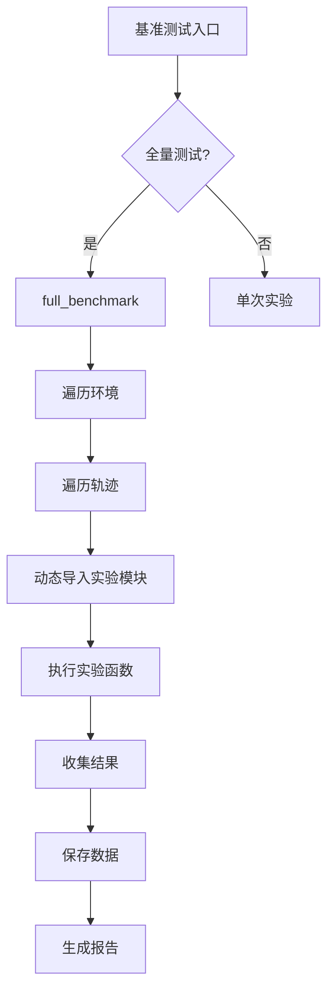
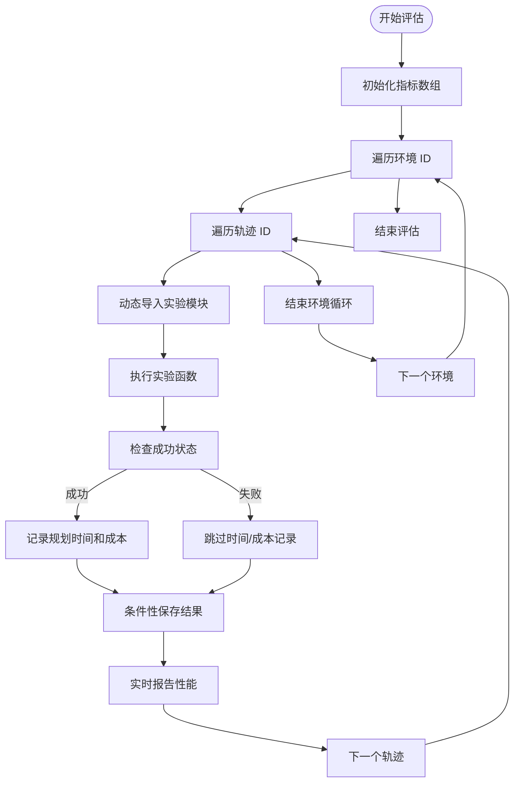
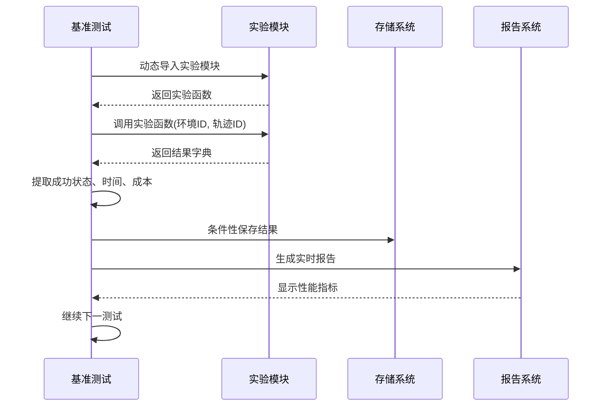

# 性能基准测试

<cite>
**本文档中引用的文件**  
- [benchmark.py](file://mpc-mpnet-py/benchmarks/benchmark.py)
- [mp_path_exp.py](file://mpc-mpnet-py/benchmarks/experiments/mp_path_exp.py)
- [mp_tree_exp.py](file://mpc-mpnet-py/benchmarks/experiments/mp_tree_exp.py)
- [sst_exp.py](file://mpc-mpnet-py/benchmarks/experiments/sst_exp.py)
- [params/mp_path_default.py](file://mpc-mpnet-py/params/car_obs/mp_path_default.py)
- [params/mp_tree_default.py](file://mpc-mpnet-py/params/car_obs/mp_tree_default.py)
- [params/sst_default.py](file://mpc-mpnet-py/params/car_obs/sst_default.py)
</cite>

## 目录
1. [简介](#简介)
2. [基准测试框架结构](#基准测试框架结构)
3. [核心评估指标](#核心评估指标)
4. [测试数据集生成](#测试数据集生成)
5. [算法评估流程](#算法评估流程)
6. [结果存储与可视化](#结果存储与可视化)
7. [配置参数管理](#配置参数管理)
8. [多系统兼容性设计](#多系统兼容性设计)
9. [性能报告生成](#性能报告生成)
10. [结论](#结论)

## 简介
本文档深入分析`benchmark.py`中定义的性能评估框架，详细说明NeuPAN、RDA-planner、MPNet等规划算法的基准测试方法。该框架为研究人员提供了标准化的性能对比流程，支持算法迭代和论文结果复现。通过量化比较规划成功率、计算耗时、路径成本等关键指标，实现对不同算法性能的客观评估。

## 基准测试框架结构

性能评估框架采用模块化设计，核心由`full_benchmark`函数驱动，通过动态导入机制调用特定实验模块。框架支持全量测试和单次测试两种模式，通过命令行参数灵活控制。

**Diagram sources**  
- [benchmark.py](file://mpc-mpnet-py/benchmarks/benchmark.py#L15-L100)

**Section sources**  
- [benchmark.py](file://mpc-mpnet-py/benchmarks/benchmark.py#L1-L102)

## 核心评估指标

框架定义了三个核心性能指标用于量化算法表现：

- **规划成功率 (Success Rate)**: 成功完成规划任务的轨迹占比
- **规划耗时 (Planning Time)**: 算法生成有效路径所需的计算时间
- **路径成本 (Costs)**: 规划路径的综合质量度量，包括长度、平滑度和避障程度

这些指标通过numpy数组进行批量存储和统计分析，确保评估结果的准确性和可重复性。

**Section sources**  
- [benchmark.py](file://mpc-mpnet-py/benchmarks/benchmark.py#L15-L30)

## 测试数据集生成

测试数据集通过参数化方式生成，支持多种系统类型（如acrobot_obs、cartpole_obs、car_obs等）。每个测试环境包含多个预定义的轨迹ID，通过`traj_id_offset`参数控制测试轨迹的起始编号。

数据集生成过程依赖于外部实验模块，通过`importlib`动态导入对应的实验函数，确保框架的可扩展性和灵活性。

**Section sources**  
- [benchmark.py](file://mpc-mpnet-py/benchmarks/benchmark.py#L20-L25)
- [mp_path_exp.py](file://mpc-mpnet-py/benchmarks/experiments/mp_path_exp.py)
- [sst_exp.py](file://mpc-mpnet-py/benchmarks/experiments/sst_exp.py)

## 算法评估流程

评估流程采用双重循环结构，外层遍历测试环境，内层遍历测试轨迹。对于每个测试案例，框架执行以下步骤：

1. 动态导入指定的实验模块
2. 调用实验函数获取结果
3. 提取成功状态、规划时间和路径成本
4. 条件性保存中间结果
5. 实时报告累计性能指标

**Diagram sources**  
- [benchmark.py](file://mpc-mpnet-py/benchmarks/benchmark.py#L15-L80)

**Section sources**  
- [benchmark.py](file://mpc-mpnet-py/benchmarks/benchmark.py#L15-L100)

## 结果存储与可视化

评估结果以NumPy二进制格式（.npy）存储，便于后续分析和可视化。存储路径遵循层级结构：`results/{实验类型}/{系统类型}/{配置}/`，包含三个主要文件：

- `sr_*.npy`: 规划成功率数据
- `time_*.npy`: 规划时间数据
- `costs_*.npy`: 路径成本数据

这种存储方案支持大规模实验数据的高效管理和快速检索。

**Section sources**  
- [benchmark.py](file://mpc-mpnet-py/benchmarks/benchmark.py#L45-L60)

## 配置参数管理

框架通过模块化参数管理实现不同配置的灵活切换。参数配置存储在`params`目录下，按系统类型和实验类型组织。通过`importlib`动态导入对应配置模块的`get_params()`函数获取参数。

这种设计支持多种配置方案（如default、unseen等），便于进行消融实验和参数敏感性分析。

**Section sources**  
- [benchmark.py](file://mpc-mpnet-py/benchmarks/benchmark.py#L90-L100)
- [params/mp_path_default.py](file://mpc-mpnet-py/params/car_obs/mp_path_default.py)

## 多系统兼容性设计

基准测试框架设计具有良好的系统兼容性，通过`system`参数指定目标系统类型。支持的系统包括：

- acrobot_obs（欠驱动机器人）
- cartpole_obs（倒立摆）
- car_obs（车辆模型）
- quadrotor_obs（四旋翼无人机）

这种设计使得同一套评估框架可以应用于多种机器人系统的规划算法测试。

**Section sources**  
- [benchmark.py](file://mpc-mpnet-py/benchmarks/benchmark.py#L90-L100)

## 性能报告生成

框架支持实时性能报告生成，通过`report=True`参数启用。报告内容包括：

- 当前累计规划成功率
- 成功案例的平均规划时间
- 成功案例的平均路径成本

报告采用掩码机制，仅对成功案例的耗时和成本进行平均，确保统计结果的合理性。

**Diagram sources**  
- [benchmark.py](file://mpc-mpnet-py/benchmarks/benchmark.py#L70-L80)

**Section sources**  
- [benchmark.py](file://mpc-mpnet-py/benchmarks/benchmark.py#L70-L100)

## 结论

`benchmark.py`实现了一个功能完整、结构清晰的性能评估框架，为规划算法的客观比较提供了标准化工具。通过模块化设计、动态导入机制和灵活的参数管理，该框架支持多种算法、系统和配置的性能测试。建议研究人员在使用时注意参数配置的一致性，确保实验结果的可比性和可复现性。