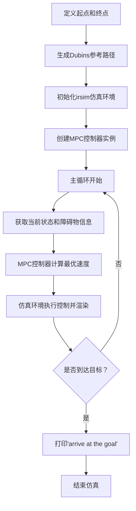
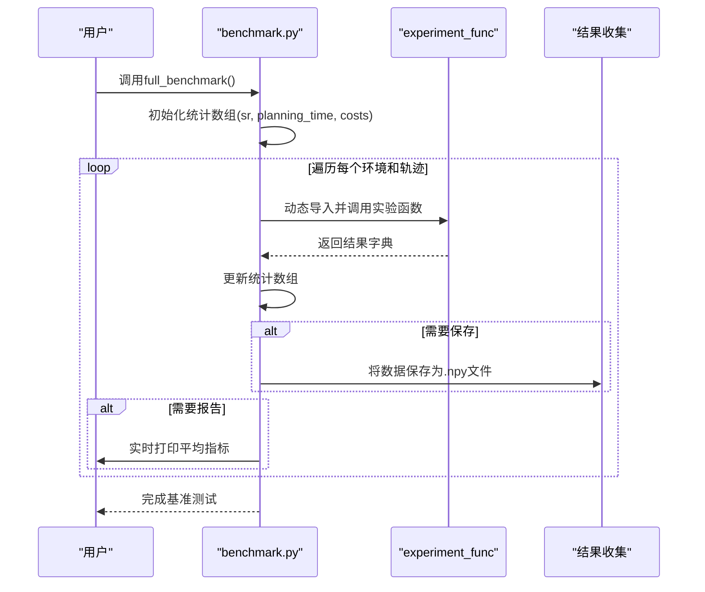

# 测试要求

<cite>
**本文档中引用的文件**  
- [teb_basics.cpp](file://teb_local_planner/test/teb_basics.cpp)
- [benchmark.py](file://mpc-mpnet-py/benchmarks/benchmark.py)
- [corridor.py](file://RDA-planner/example/corridor/corridor.py)
</cite>

## 目录
1. [引言](#引言)
2. [单元测试策略](#单元测试策略)
3. [集成测试与功能验证](#集成测试与功能验证)
4. [性能基准测试方法](#性能基准测试方法)
5. [持续集成流程](#持续集成流程)
6. [测试用例编写规范](#测试用例编写规范)
7. [覆盖率要求](#覆盖率要求)
8. [开发者指导](#开发者指导)
9. [结论](#结论)

## 引言
本文件系统性地描述了项目中的测试策略和质量保证机制，涵盖单元测试、集成测试及性能基准测试。通过分析 `teb_basics.cpp`、`benchmark.py` 和 `corridor.py` 等关键测试与示例文件，阐明测试用例的编写规范、覆盖率目标、性能评估方法以及自动化测试流程。旨在为开发者提供清晰的测试指导，确保代码变更不会引入回归问题，并保障系统的稳定性与可靠性。

## 单元测试策略

单元测试是验证代码最小可测试单元（如函数、类）行为正确性的基础手段。在本项目中，`teb_local_planner` 模块使用 Google Test (gtest) 框架进行 C++ 单元测试，测试文件位于 `test/teb_basics.cpp`。

该测试文件主要针对 `TimedElasticBand` 类的时间间隔自动调整功能（`autoResize`）进行验证，确保其在不同输入条件下能正确地维持时间步长在指定的容差范围内。测试用例包括：
- 在末尾添加较大时间差后自动调整
- 在末尾添加较小时间差后自动调整
- 中间和末尾同时存在异常时间差时的整体调整

这些测试通过断言（`ASSERT_LE`）验证调整后的时间差是否满足预设的上下限，从而保证算法的鲁棒性。

**Section sources**
- [teb_basics.cpp](file://teb_local_planner/test/teb_basics.cpp#L1-L72)

## 集成测试与功能验证

集成测试用于验证多个模块协同工作的正确性，而功能验证则确保系统在真实或模拟场景下能完成预期任务。`corridor.py` 文件作为 `RDA-planner` 的一个示例脚本，展示了如何通过集成 MPC 控制器与仿真环境 `irsim` 来验证路径规划功能。

该脚本的执行流程如下：
1. 定义机器人的起始点和目标点。
2. 使用 `curve_generator` 生成从起点到终点的 Dubins 曲线作为参考路径。
3. 初始化仿真环境 `env` 并绘制参考路径。
4. 创建 `MPC` 控制器实例，传入车辆动力学模型和参考路径。
5. 在主循环中，控制器根据当前机器人状态和障碍物信息计算最优控制输入。
6. 仿真环境执行控制指令并渲染状态，直到机器人到达目标或仿真结束。

此过程不仅验证了 MPC 算法的有效性，也测试了其与仿真环境、路径生成模块的集成能力。

**Diagram sources**
- [corridor.py](file://RDA-planner/example/corridor/corridor.py#L1-L51)

**Section sources**
- [corridor.py](file://RDA-planner/example/corridor/corridor.py#L1-L51)

## 性能基准测试方法

性能基准测试是评估算法在不同场景下表现（如成功率、规划时间、路径成本）的关键环节。`benchmark.py` 文件定义了 `full_benchmark` 函数，用于系统性地运行大量实验并收集性能数据。

该函数的核心逻辑包括：
- 接收起始环境ID、环境数量、每环境轨迹数量、实验类型等参数。
- 初始化成功率（`sr`）、规划时间（`planning_time`）和路径成本（`costs`）的统计数组。
- 遍历所有环境和轨迹ID，动态导入对应的实验函数（如 `mp_path_exp`）并执行。
- 收集每次实验的结果，仅在成功时记录规划时间和成本。
- 支持将结果以 `.npy` 文件格式保存到指定目录，便于后续分析。
- 提供实时报告功能，输出当前的平均成功率、平均规划时间和平均成本。

此方法通过参数化和模块化设计，实现了对不同系统（如 `acrobot_obs`, `cartpole_obs`）和不同配置的可扩展性能评估。

**Diagram sources**
- [benchmark.py](file://mpc-mpnet-py/benchmarks/benchmark.py#L1-L102)

**Section sources**
- [benchmark.py](file://mpc-mpnet-py/benchmarks/benchmark.py#L1-L102)

## 持续集成流程

持续集成（CI）流程确保每次代码提交都能自动触发测试，快速发现并修复问题。虽然项目中未直接提供 CI 配置文件（如 `.github/workflows`），但可以从现有测试结构推断出理想的 CI 流程：

1. **触发条件**：当代码推送到主分支或创建 Pull Request 时自动触发。
2. **执行环境**：使用与开发环境一致的 Docker 镜像，确保依赖项（如 ROS、Julia、Python 包）的版本统一。
3. **执行步骤**：
   - 安装项目依赖（通过 `pip install` 或 `catkin_make`）。
   - 编译 C++ 代码（如 `teb_local_planner`）。
   - 运行所有单元测试（`gtest`）。
   - 执行关键的集成测试脚本（如 `corridor.py`）。
   - 运行轻量级的基准测试以监控性能趋势。
4. **结果分析**：CI 系统（如 GitHub Actions）会报告测试是否通过。失败的测试会提供详细的日志，帮助开发者定位问题。性能数据可以与历史数据对比，检测性能退化。

此流程能有效防止引入破坏性变更，保障代码库的健康。

## 测试用例编写规范

为了保证测试代码的质量和可维护性，应遵循以下编写规范：

1. **单一职责**：每个测试用例应只验证一个明确的功能点或行为。
2. **可读性**：使用清晰的命名（如 `TEST(TEBBasic, autoResizeLargeValueAtEnd)`），让测试目的一目了然。
3. **独立性**：测试用例之间不应有依赖关系，可以独立运行。
4. **可重复性**：测试结果不应依赖于外部状态或随机性，确保每次运行结果一致。
5. **断言明确**：使用合适的断言宏（如 `ASSERT_EQ`, `ASSERT_LE`）并提供清晰的错误信息。
6. **边界条件**：测试应覆盖正常值、边界值和异常值。
7. **集成测试场景化**：像 `corridor.py` 一样，集成测试应模拟真实使用场景，验证端到端的功能。

## 覆盖率要求

为了确保代码质量，项目应设定合理的测试覆盖率目标：
- **单元测试覆盖率**：核心算法模块（如 `teb_local_planner`）的 C++ 代码行覆盖率应达到 80% 以上。
- **分支覆盖率**：关键决策逻辑（如 `if-else` 分支）应尽可能被覆盖。
- **集成测试覆盖率**：主要的功能路径（如路径规划、避障）都应有对应的集成测试脚本进行验证。
- **性能测试覆盖率**：应定期运行基准测试，覆盖不同复杂度的环境和不同的机器人模型。

使用工具（如 `gcov`/`lcov` for C++, `coverage.py` for Python）来量化覆盖率，并将其作为 CI 流程的一部分。

## 开发者指导

为开发者提供以下指导，以编写高效且可靠的测试用例：

1. **先写测试**：在实现新功能前，先思考其预期行为并编写测试用例（测试驱动开发 TDD）。
2. **利用现有框架**：C++ 模块使用 `gtest`，Python 模块使用 `unittest` 或 `pytest`。
3. **模拟外部依赖**：对于难以在测试中重现的外部服务（如传感器数据），使用 Mock 对象进行模拟。
4. **关注性能**：避免在单元测试中进行耗时操作，保持测试快速。
5. **定期维护**：随着代码演进，及时更新或删除过时的测试用例。
6. **参考示例**：以 `teb_basics.cpp` 为模板编写 C++ 单元测试，以 `corridor.py` 为模板编写 Python 集成测试。

## 结论

本项目通过结合单元测试、集成测试和性能基准测试，构建了一个多层次的质量保证体系。`teb_basics.cpp` 确保了核心算法的正确性，`corridor.py` 验证了系统级功能，而 `benchmark.py` 提供了量化性能评估的能力。通过建立规范的测试编写流程和持续集成机制，可以有效防止回归问题，提升代码的可靠性和可维护性。开发者应遵循本文档的指导，积极参与到测试活动中，共同保障项目的高质量交付。