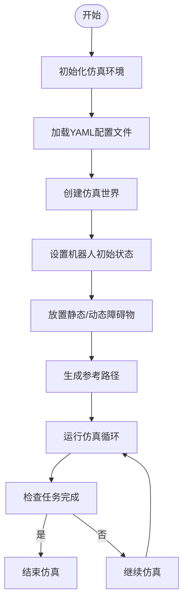
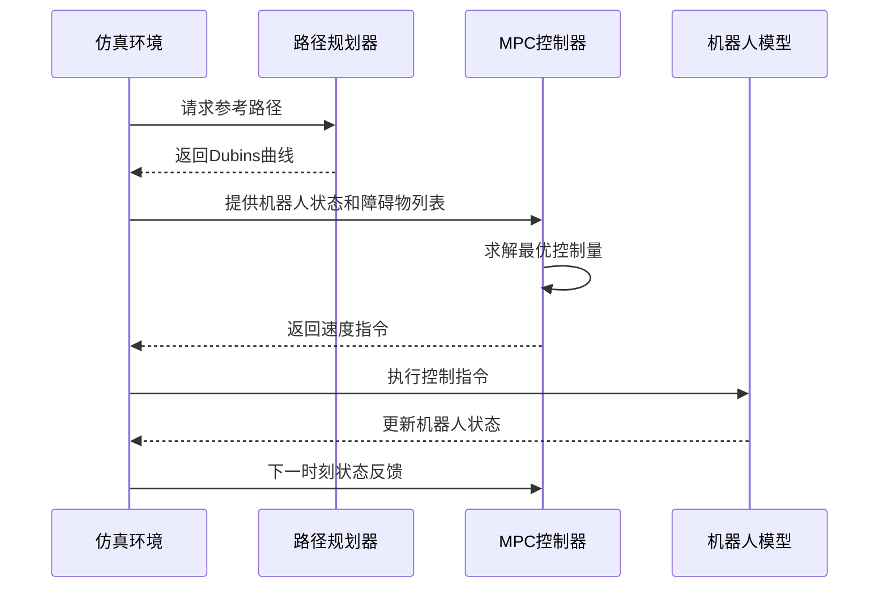

# 集成测试

<cite>
**本文档中引用的文件**   
- [corridor.py](file://RDA-planner/example/corridor/corridor.py)
- [corridor.yaml](file://RDA-planner/example/corridor/corridor.yaml)
- [LON_corridor.py](file://NeuPAN/example/LON/LON_corridor.py)
- [LON_corridor.yaml](file://NeuPAN/example/LON/LON_corridor.yaml)
</cite>

## 目录
1. [引言](#引言)
2. [集成测试策略概述](#集成测试策略概述)
3. [端到端仿真环境构建](#端到端仿真环境构建)
4. [测试场景配置方法](#测试场景配置方法)
5. [模块协同工作验证](#模块协同工作验证)
6. [可视化与日志调试](#可视化与日志调试)
7. [行为一致性保障](#行为一致性保障)
8. [结论](#结论)

## 引言
本文档旨在阐述基于RDA-planner项目中`corridor.py`等示例脚本的集成测试策略。通过分析NeuPAN和RDA-planner中的典型测试用例，说明如何在端到端仿真环境中验证路径规划器、碰撞检测、控制输出等关键模块的协同工作能力。重点介绍测试场景的构建方式、多障碍物环境配置以及系统行为一致性验证方法。

## 集成测试策略概述
集成测试采用基于仿真的端到端验证框架，利用`irsim`仿真环境实现对机器人导航系统的全面测试。测试策略的核心是通过预定义的测试脚本（如`corridor.py`）驱动整个系统运行，监控各模块间的数据交互与行为响应。

测试流程包括：
- 初始化仿真环境与机器人状态
- 加载参考路径并启动规划器
- 实时获取障碍物信息进行动态避障
- 执行MPC控制算法生成速度指令
- 可视化最优轨迹与参考轨迹
- 判断目标到达条件与任务完成状态

该策略确保了从感知到决策再到执行的完整闭环验证。

**Section sources**
- [corridor.py](file://RDA-planner/example/corridor/corridor.py#L1-L51)

## 端到端仿真环境构建
仿真环境由`irsim.make()`函数初始化，依据YAML配置文件定义世界参数、机器人属性和障碍物布局。环境支持多种碰撞模式（停止、无阻碍、反应式）和控制模式（自动、键盘控制），为不同测试需求提供灵活性。

环境初始化时可选择是否保存动画、全屏显示等选项。通过`env.get_robot_info()`获取机器人动力学参数，并封装为命名元组传递给MPC控制器，确保物理模型一致性。

**Diagram sources**
- [corridor.py](file://RDA-planner/example/corridor/corridor.py#L1-L51)
- [corridor.yaml](file://RDA-planner/example/corridor/corridor.yaml#L1-L36)

## 测试场景配置方法
测试场景通过YAML配置文件进行声明式定义，包含世界尺寸、时间步长、机器人参数和障碍物列表。

### 静态障碍物配置
静态障碍物通过`obstacle`字段手动指定数量、形状和位姿。例如在`corridor.yaml`中定义了6个矩形障碍物，形成狭窄通道环境，用于测试复杂几何空间下的路径规划能力。

### 动态障碍物扩展
虽然当前示例主要使用静态障碍物，但框架支持通过`env.get_obstacle_info_list()`实时更新障碍物状态，为未来引入动态障碍物预留接口。

### 复杂几何环境
通过调整障碍物的长度、宽度和旋转角度（如`state`中的航向角），可以构造S型弯道、交叉路口等复杂场景。`LON_corridor.yaml`中设置的非对称障碍物布局即为此类测试的典型代表。

**Section sources**
- [corridor.yaml](file://RDA-planner/example/corridor/corridor.yaml#L1-L36)
- [LON_corridor.yaml](file://NeuPAN/example/LON/LON_corridor.yaml#L1-L49)

## 模块协同工作验证
集成测试重点验证以下模块间的协同工作：

### 路径规划器
使用`curve_generator`生成Dubins曲线作为参考路径，确保路径连续性和曲率约束。通过`env.draw_trajectory()`可视化参考轨迹。

### 碰撞检测
MPC控制器接收`obs_list`作为输入，在优化过程中考虑障碍物约束。`cal_distance_loss`函数在NeuPAN版本中显式计算距离损失，实现避障目标。

### 控制输出
MPC模块根据当前状态、参考路径和障碍物信息求解最优控制输入（`opt_vel`），并通过`env.step(opt_vel)`应用到仿真机器人。

**Diagram sources**
- [corridor.py](file://RDA-planner/example/corridor/corridor.py#L1-L51)
- [LON_corridor.py](file://NeuPAN/example/LON/LON_corridor.py#L1-L146)

## 可视化与日志调试
系统提供多层次的可视化与调试支持：

### 实时轨迹绘制
- 黑色实线：初始参考路径
- 红色轨迹：MPC优化结果
- 蓝色轨迹：NeuPAN中的参考轨迹
- 尾迹显示：机器人移动轨迹

### 状态监控
通过`info`字典返回规划状态（如`arrive`标志位），并在控制台输出关键事件（到达目标、任务完成等）。

### 损失函数分析
在NeuPAN训练脚本中，`train_one_epoch`函数记录每步损失值，用于评估学习过程稳定性。`distance_loss`直接反映避障性能。

### 动画记录
`env.end()`支持生成动画文件（如GIF或视频），便于后期回放分析。

**Section sources**
- [corridor.py](file://RDA-planner/example/corridor/corridor.py#L1-L51)
- [LON_corridor.py](file://NeuPAN/example/LON/LON_corridor.py#L1-L146)

## 行为一致性保障
为确保仿真与真实机器人行为一致，采取以下措施：

1. **参数同步**：机器人尺寸、轮距、速度限制等参数在YAML文件与代码中保持一致
2. **时间步长匹配**：仿真步长（`step_time`）与控制器采样时间对齐
3. **动力学建模**：使用真实机器人动力学模型（如阿克曼转向）进行仿真
4. **传感器模拟**：在`LON_corridor.yaml`中配置2D激光雷达，模拟真实感知输入
5. **闭环验证**：通过多次迭代测试，确保系统在不同初始条件下均能稳定收敛

这些措施有效缩小了仿真与现实之间的"现实差距"（reality gap），为真实机器人部署提供可靠验证。

**Section sources**
- [corridor.yaml](file://RDA-planner/example/corridor/corridor.yaml#L1-L36)
- [LON_corridor.yaml](file://NeuPAN/example/LON/LON_corridor.yaml#L1-L49)

## 结论
本文档详细阐述了基于RDA-planner和NeuPAN项目的集成测试策略。通过`corridor.py`等示例脚本，展示了如何构建端到端仿真环境，配置多样化测试场景，并验证多模块协同工作能力。该测试框架不仅支持静态障碍物避障验证，还具备扩展动态障碍物和复杂几何环境的能力。结合可视化工具和日志分析，能够有效调试集成问题，确保系统在真实机器人部署前的行为一致性。此方法为自动驾驶和机器人导航系统的可靠验证提供了标准化解决方案。