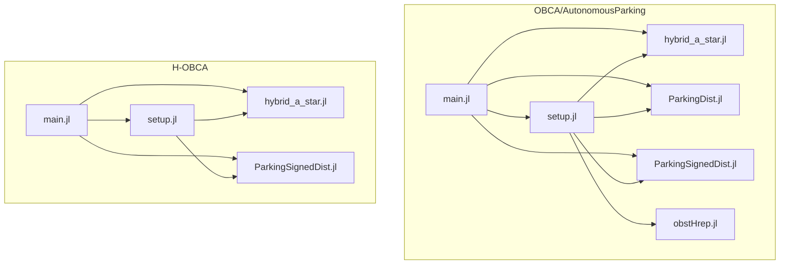
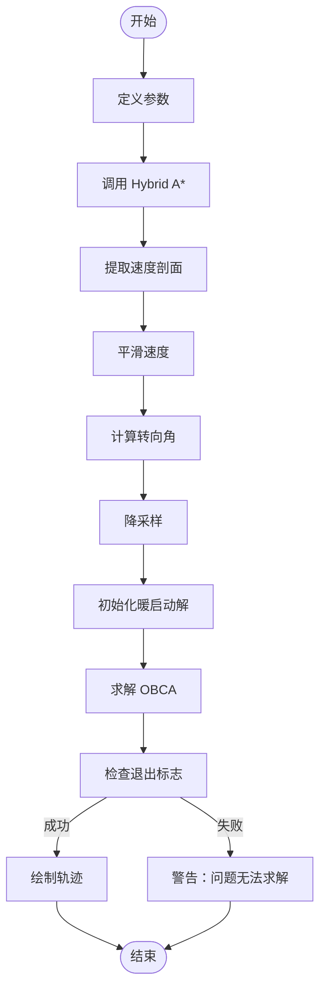

# Julia编码规范

<cite>
**本文档中引用的文件**  
- [main.jl](file://OBCA/AutonomousParking/main.jl)
- [main.jl](file://H-OBCA/main.jl)
- [setup.jl](file://OBCA/AutonomousParking/setup.jl)
- [setup.jl](file://H-OBCA/setup.jl)
- [ParkingDist.jl](file://OBCA/AutonomousParking/ParkingDist.jl)
- [ParkingSignedDist.jl](file://OBCA/AutonomousParking/ParkingSignedDist.jl)
- [ParkingSignedDist.jl](file://H-OBCA/ParkingSignedDist.jl)
- [hybrid_a_star.jl](file://OBCA/AutonomousParking/hybrid_a_star.jl)
- [hybrid_a_star.jl](file://H-OBCA/hybrid_a_star.jl)
</cite>

## 目录
1. [引言](#引言)
2. [项目结构分析](#项目结构分析)
3. [函数式编程风格实践](#函数式编程风格实践)
4. [模块组织方式](#模块组织方式)
5. [命名约定](#命名约定)
6. [性能优化实践](#性能优化实践)
7. [代码简洁性与数学表达清晰性](#代码简洁性与数学表达清晰性)
8. [结论](#结论)

## 引言

OBCA（Optimization-based Collision Avoidance）和H-OBCA（Hierarchical OBCA）是用于自动驾驶泊车路径规划的Julia项目。这些项目通过优化方法实现避障和最小穿透轨迹计算，结合Hybrid A*算法生成初始路径，并利用非线性优化器（如IPOPT）进行精细化调整。本规范旨在总结这两个项目中的Julia编码实践，涵盖函数式编程风格、模块组织、命名约定以及性能优化策略。

**Section sources**
- [main.jl](file://OBCA/AutonomousParking/main.jl#L1-L288)
- [main.jl](file://H-OBCA/main.jl#L1-L262)

## 项目结构分析

OBCA和H-OBCA项目均采用模块化设计，每个功能组件以独立的`.jl`文件实现。核心文件包括`main.jl`作为入口点，`setup.jl`用于初始化依赖项和包含其他模块，`ParkingDist.jl`和`ParkingSignedDist.jl`实现不同的避障优化逻辑，`hybrid_a_star.jl`提供路径搜索算法，`obstHrep.jl`处理障碍物表示转换等。

项目遵循清晰的文件组织结构，将不同功能分离到不同文件中，便于维护和扩展。例如，OBCA项目下的`AutonomousParking`目录包含了所有与自动泊车相关的模块，而H-OBCA项目则专注于分层优化框架。



**Diagram sources**
- [main.jl](file://OBCA/AutonomousParking/main.jl#L1-L288)
- [setup.jl](file://OBCA/AutonomousParking/setup.jl#L1-L52)
- [main.jl](file://H-OBCA/main.jl#L1-L262)
- [setup.jl](file://H-OBCA/setup.jl#L1-L57)

**Section sources**
- [main.jl](file://OBCA/AutonomousParking/main.jl#L1-L288)
- [setup.jl](file://OBCA/AutonomousParking/setup.jl#L1-L52)
- [main.jl](file://H-OBCA/main.jl#L1-L262)
- [setup.jl](file://H-OBCA/setup.jl#L1-L57)

## 函数式编程风格实践

在OBCA和H-OBCA项目中，Julia的函数式编程风格得到了充分体现。主要实践包括避免使用全局变量、优先使用不可变数据结构以及广泛应用高阶函数。

### 避免全局变量

尽管在`main.jl`中定义了一些配置参数（如`scenario`、`fixTime`、`TsPF`等），但这些变量主要用于脚本执行的配置，实际的算法逻辑封装在函数内部。核心优化函数如`ParkingDist`和`ParkingSignedDist`接受所有必要参数作为输入，确保函数的纯度和可测试性。

### 使用不可变数据结构

项目中广泛使用了元组和命名元组来表示不可变的数据结构。例如，在`hybrid_a_star.jl`中定义的`Node`和`Config`类型虽然使用`type`关键字（在旧版Julia中可变），但在实际使用中，它们的实例通常在创建后不再修改，体现了不可变性的设计思想。

### 高阶函数的应用

Julia的高阶函数特性在项目中被充分利用。例如，在`ParkingDist.jl`和`ParkingSignedDist.jl`中，成本函数和约束条件通过`@NLobjective`和`@NLconstraint`宏定义，这些宏本质上是接受函数作为参数的高阶函数。此外，`map`、`filter`等函数式编程工具在数据处理和转换中也有潜在应用。


**Diagram sources**
- [main.jl](file://OBCA/AutonomousParking/main.jl#L1-L288)
- [main.jl](file://H-OBCA/main.jl#L1-L262)

**Section sources**
- [main.jl](file://OBCA/AutonomousParking/main.jl#L1-L288)
- [ParkingDist.jl](file://OBCA/AutonomousParking/ParkingDist.jl#L1-L315)
- [ParkingSignedDist.jl](file://OBCA/AutonomousParking/ParkingSignedDist.jl#L1-L314)
- [ParkingSignedDist.jl](file://H-OBCA/ParkingSignedDist.jl#L1-L307)

## 模块组织方式

OBCA和H-OBCA项目采用“每个文件一个模块”的组织方式，并通过`include`语句进行模块间的组织和依赖管理。

### 每个文件一个模块

每个`.jl`文件通常定义一个主要的模块或一组相关的函数。例如，`hybrid_a_star.jl`文件定义了一个名为`hybrid_a_star`的模块，该模块封装了Hybrid A*算法的所有相关函数和类型。这种方式使得代码结构清晰，易于理解和维护。

### 使用include进行组织

在`setup.jl`文件中，通过一系列`include`语句将各个模块引入到主程序中。这种做法允许在`main.jl`中直接使用这些模块的功能，而无需关心其具体的实现细节。例如：

```julia
include("ParkingDist.jl")
include("ParkingSignedDist.jl")
include("obstHrep.jl")
include("plotTraj.jl")
include("hybrid_a_star.jl")
```

这种方式不仅简化了依赖管理，还提高了代码的可读性和可维护性。

**Section sources**
- [setup.jl](file://OBCA/AutonomousParking/setup.jl#L1-L52)
- [setup.jl](file://H-OBCA/setup.jl#L1-L57)
- [hybrid_a_star.jl](file://OBCA/AutonomousParking/hybrid_a_star.jl#L1-L639)
- [hybrid_a_star.jl](file://H-OBCA/hybrid_a_star.jl#L1-L640)

## 命名约定

项目中的函数和变量命名遵循一致的小写字母和下划线风格，提高了代码的可读性和一致性。

### 函数命名

函数名使用小写字母和下划线分隔单词，清晰地表达了函数的功能。例如：
- `calc_hybrid_astar_path`: 计算Hybrid A*路径
- `update_node_with_analystic_expantion`: 使用解析扩展更新节点
- `calc_rs_path_cost`: 计算Reeds-Shepp路径成本

### 变量命名

变量名同样采用小写字母和下划线风格，通常具有描述性，便于理解其用途。例如：
- `x0`: 初始状态
- `xF`: 目标状态
- `ego`: 自车形状参数
- `lOb`: 障碍物顶点列表

这种命名约定使得代码更加直观，减少了阅读和理解代码的时间。

**Section sources**
- [main.jl](file://OBCA/AutonomousParking/main.jl#L1-L288)
- [hybrid_a_star.jl](file://OBCA/AutonomousParking/hybrid_a_star.jl#L1-L639)
- [ParkingDist.jl](file://OBCA/AutonomousParking/ParkingDist.jl#L1-L315)
- [ParkingSignedDist.jl](file://OBCA/AutonomousParking/ParkingSignedDist.jl#L1-L314)

## 性能优化实践

通过分析`main.jl`中的代码示例，可以总结出一系列性能优化实践，确保算法实现的高效和准确。

### 避免类型不稳定

Julia的性能高度依赖于类型稳定性。在项目中，数组和变量的类型在声明时即已明确，避免了运行时的类型推断开销。例如，使用`Float64[]`明确指定浮点数数组类型。

### 使用@inbounds和@fastmath宏

虽然在提供的代码片段中未直接看到`@inbounds`和`@fastmath`宏的使用，但这是Julia中常见的性能优化手段。`@inbounds`用于禁用数组边界检查，`@fastmath`允许编译器进行更激进的数学优化。在关键的循环和数学运算中应用这些宏可以显著提升性能。

### 预分配数组

在`hybrid_a_star.jl`中，可以看到预分配数组的使用，例如在`calc_next_node`函数中使用`fill(0.0, nlist)`预分配`xlist`、`ylist`和`yawlist`。这避免了在循环中动态增长数组带来的性能损耗。

### 利用向量化操作

项目中广泛使用了Julia的向量化操作，如`vcat`、`diff`等，这些操作底层由高效的C/Fortran库实现，能够充分利用现代CPU的SIMD指令集。



**Diagram sources**
- [main.jl](file://OBCA/AutonomousParking/main.jl#L1-L288)
- [main.jl](file://H-OBCA/main.jl#L1-L262)

**Section sources**
- [main.jl](file://OBCA/AutonomousParking/main.jl#L1-L288)
- [hybrid_a_star.jl](file://OBCA/AutonomousParking/hybrid_a_star.jl#L1-L639)
- [veloSmooth.jl](file://OBCA/AutonomousParking/veloSmooth.jl)
- [veloSmooth.jl](file://H-OBCA/veloSmooth.jl)

## 代码简洁性与数学表达清晰性

OBCA和H-OBCA项目的代码设计强调简洁性和数学表达的清晰性，确保算法实现的高效和准确。

### 简洁的代码结构

代码结构清晰，逻辑流程直观。例如，`main.jl`中的主流程按照“定义参数 -> 调用Hybrid A* -> 提取和处理路径 -> 求解OBCA -> 绘制结果”的顺序组织，每一步都有明确的注释说明。

### 清晰的数学表达

项目中的数学公式和优化模型通过JuMP建模语言清晰地表达。例如，在`ParkingDist.jl`和`ParkingSignedDist.jl`中，非线性目标函数和约束条件使用`@NLobjective`和`@NLconstraint`宏定义，直接对应于数学公式，便于验证和调试。

### 注释和文档

代码中包含丰富的注释，解释了关键参数和算法步骤。例如，在`hybrid_a_star.jl`中，常量如`VEHICLE_RADIUS`、`BUBBLE_DIST`等都有详细的单位和说明，有助于理解算法的设计意图。

**Section sources**
- [main.jl](file://OBCA/AutonomousParking/main.jl#L1-L288)
- [ParkingDist.jl](file://OBCA/AutonomousParking/ParkingDist.jl#L1-L315)
- [ParkingSignedDist.jl](file://OBCA/AutonomousParking/ParkingSignedDist.jl#L1-L314)
- [hybrid_a_star.jl](file://OBCA/AutonomousParking/hybrid_a_star.jl#L1-L639)

## 结论

通过对OBCA和H-OBCA项目的分析，我们总结了一套适用于Julia语言的编码规范。这些规范涵盖了函数式编程风格的实践、模块的组织方式、命名约定以及性能优化策略。遵循这些规范，可以编写出高效、可读性强且易于维护的Julia代码，特别适用于科学计算和优化问题求解。

**Section sources**
- [main.jl](file://OBCA/AutonomousParking/main.jl#L1-L288)
- [main.jl](file://H-OBCA/main.jl#L1-L262)
- [setup.jl](file://OBCA/AutonomousParking/setup.jl#L1-L52)
- [setup.jl](file://H-OBCA/setup.jl#L1-L57)