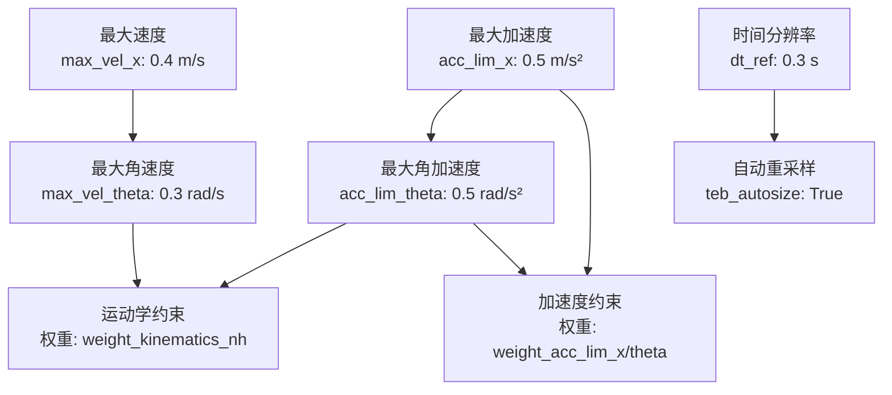
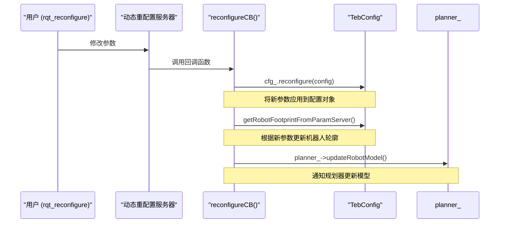

# 运行时配置

<cite>
**本文档中引用的文件**   
- [TebLocalPlannerReconfigure.cfg](file://teb_local_planner/cfg/TebLocalPlannerReconfigure.cfg)
- [teb_local_planner_ros.cpp](file://teb_local_planner/src/teb_local_planner_ros.cpp)
- [teb_local_planner_ros.h](file://teb_local_planner/include/teb_local_planner/teb_local_planner_ros.h)
- [teb_local_planner_plugin.xml](file://teb_local_planner/teb_local_planner_plugin.xml)
</cite>

## 目录
1. [引言](#引言)
2. [参数组结构与分类](#参数组结构与分类)
3. [核心参数详解](#核心参数详解)
4. [动态重配置机制实现](#动态重配置机制实现)
5. [运行时参数调整](#运行时参数调整)
6. [配置保存与启动文件集成](#配置保存与启动文件集成)
7. [参数调优策略与应用场景](#参数调优策略与应用场景)
8. [结论](#结论)

## 引言
teb_local_planner 是 ROS 导航栈中一种基于时间弹性带（Timed Elastic Band）的局部路径规划器，广泛应用于移动机器人的实时避障与路径跟踪。其核心优势在于能够通过动态重配置（dynamic_reconfigure）机制在运行时实时调整大量关键参数，从而适应不同的机器人动力学特性、环境复杂度和任务需求。本文件深入解析 `TebLocalPlannerReconfigure.cfg` 配置文件中定义的参数体系，阐明其对局部路径规划行为（如速度、加速度、避障距离等）的影响，并指导如何利用 `rqt_reconfigure` 等工具进行调优。

**本节不分析具体源文件，因此不提供来源**

## 参数组结构与分类
`TebLocalPlannerReconfigure.cfg` 文件通过 `ParameterGenerator` 定义了多个逻辑分组（Group），这些分组在 `rqt_reconfigure` 界面中以标签页（tab）形式呈现，便于用户分类管理。主要参数组包括：

- **Trajectory (轨迹)**：控制轨迹的生成、采样和优化过程。
- **ViaPoints (途经点)**：管理全局路径上提取途经点的行为。
- **Robot (机器人)**：定义机器人的运动学约束，如最大速度和加速度。
- **GoalTolerance (目标容差)**：设定机器人到达目标时的精度要求。
- **Obstacles (障碍物)**：配置与障碍物避让相关的距离、膨胀和检测策略。
- **Optimization (优化)**：调整优化器的权重，影响轨迹在时间、长度、安全等方面的权衡。
- **HCPlanning (同伦类规划)**：控制并行探索不同拓扑路径的高级规划行为。
- **Recovery (恢复)**：定义在规划失败或检测到振荡时的恢复策略。

**Section sources**
- [TebLocalPlannerReconfigure.cfg](file://teb_local_planner/cfg/TebLocalPlannerReconfigure.cfg#L1-L447)

## 核心参数详解

### 轨迹与机器人运动学参数
该类参数直接决定了机器人的运动能力和轨迹的平滑性。



**Diagram sources**
- [TebLocalPlannerReconfigure.cfg](file://teb_local_planner/cfg/TebLocalPlannerReconfigure.cfg#L50-L100)

**Section sources**
- [TebLocalPlannerReconfigure.cfg](file://teb_local_planner/cfg/TebLocalPlannerReconfigure.cfg#L50-L100)

### 障碍物与避障参数
这些参数是确保机器人安全导航的核心，控制其与障碍物的交互行为。

```mermaid
erDiagram
OBSTACLE {
double min_obstacle_dist 0.5
double inflation_dist 0.6
bool include_dynamic_obstacles False
}
OPTIMIZATION {
double weight_obstacle 50
double weight_dynamic_obstacle 50
double obstacle_cost_exponent 1
}
ASSOCIATION {
double obstacle_association_force_inclusion_factor 1.5
double obstacle_association_cutoff_factor 5.0
}
OBSTACLE ||--o{ OPTIMIZATION : "影响优化权重"
OBSTACLE ||--o{ ASSOCIATION : "决定关联策略"
```

**Diagram sources**
- [TebLocalPlannerReconfigure.cfg](file://teb_local_planner/cfg/TebLocalPlannerReconfigure.cfg#L180-L250)

**Section sources**
- [TebLocalPlannerReconfigure.cfg](file://teb_local_planner/cfg/TebLocalPlannerReconfigure.cfg#L180-L250)

### 优化权重参数
优化权重是 TEB 算法的“调音台”，通过调整这些参数，可以精细地控制轨迹在不同目标之间的权衡。

| 参数名称 | 类型 | 默认值 | 描述 | 影响 |
| :--- | :--- | :--- | :--- | :--- |
| `weight_optimaltime` | double | 1 | 时间最优性权重 | 值越大，轨迹越短，速度越快 |
| `weight_shortest_path` | double | 0 | 路径最短权重 | 值越大，路径越直，但可能更危险 |
| `weight_obstacle` | double | 50 | 障碍物避让权重 | 值越大，离障碍物越远，更安全 |
| `weight_kinematics_nh` | double | 1000 | 非完整约束权重 | 必须足够大以保证运动学可行性 |
| `weight_adapt_factor` | double | 2 | 权重自适应因子 | 在迭代中动态增加障碍物权重，改善数值稳定性 |

**Section sources**
- [TebLocalPlannerReconfigure.cfg](file://teb_local_planner/cfg/TebLocalPlannerReconfigure.cfg#L250-L350)

## 动态重配置机制实现
teb_local_planner 通过 ROS 的 `dynamic_reconfigure` 框架实现了运行时参数调整。其核心实现位于 `teb_local_planner_ros.cpp` 文件中。



**Diagram sources**
- [teb_local_planner_ros.cpp](file://teb_local_planner/src/teb_local_planner_ros.cpp#L100-L120)
- [teb_local_planner_ros.h](file://teb_local_planner/include/teb_local_planner/teb_local_planner_ros.h#L200-L220)

**Section sources**
- [teb_local_planner_ros.cpp](file://teb_local_planner/src/teb_local_planner_ros.cpp#L100-L120)
- [teb_local_planner_ros.h](file://teb_local_planner/include/teb_local_planner/teb_local_planner_ros.h#L200-L220)

## 运行时参数调整
用户可以通过 `rqt_reconfigure` 工具在机器人运行时实时调整 `teb_local_planner` 的参数。操作步骤如下：
1.  启动机器人导航系统。
2.  打开终端，运行 `rosrun rqt_reconfigure rqt_reconfigure`。
3.  在 `rqt_reconfigure` 界面中，展开 `move_base` 节点，找到 `TebLocalPlannerROS` 插件。
4.  浏览各个标签页（如 Trajectory, Robot, Obstacles），根据需要调整滑块或复选框。
5.  观察机器人行为的变化，例如在狭窄通道中调整 `min_obstacle_dist` 可以改变其通过时的保守程度。

**本节不分析具体源文件，因此不提供来源**

## 配置保存与启动文件集成
为了将调优后的参数持久化，避免每次启动都重新配置，可以将参数保存为 YAML 文件，并在启动文件中加载。

1.  **保存配置**：在 `rqt_reconfigure` 界面中，点击左上角的磁盘图标，将当前参数保存为 `teb_params.yaml`。
2.  **创建启动文件**：在启动文件（如 `move_base.launch`）中，为 `teb_local_planner` 节点添加参数加载：
    ```xml
    <node name="move_base" pkg="move_base" type="move_base">
      <rosparam file="$(find your_package)/config/teb_params.yaml" command="load" ns="TebLocalPlannerROS" />
    </node>
    ```
3.  **插件注册**：`teb_local_planner_plugin.xml` 文件声明了该插件，使其能被 `move_base` 加载。


**Diagram sources**
- [teb_local_planner_plugin.xml](file://teb_local_planner/teb_local_planner_plugin.xml#L1-L15)

**Section sources**
- [teb_local_planner_plugin.xml](file://teb_local_planner/teb_local_planner_plugin.xml#L1-L15)

## 参数调优策略与应用场景

### 常见配置模式
- **高速走廊模式**：增大 `max_vel_x` 和 `weight_optimaltime`，减小 `min_obstacle_dist`，适用于开阔、无障碍的快速移动。
- **狭窄避障模式**：增大 `weight_obstacle` 和 `min_obstacle_dist`，减小 `max_vel_x`，适用于人多或障碍物密集的环境。
- **精确停靠模式**：减小 `xy_goal_tolerance` 和 `yaw_goal_tolerance`，增大 `weight_kinematics_nh`，确保机器人能精确停在目标点。

### 调优策略
1.  **分步调优**：先固定 `Robot` 和 `GoalTolerance` 组的参数，再调整 `Obstacles` 和 `Optimization` 组的权重。
2.  **观察反馈**：启用 `publish_feedback` 可以可视化轨迹和障碍物，帮助诊断问题。
3.  **利用恢复行为**：当机器人卡住时，`shrink_horizon_backup` 和 `oscillation_recovery` 能帮助其摆脱困境。

**本节不分析具体源文件，因此不提供来源**

## 结论
`teb_local_planner` 的动态重配置机制为其提供了极高的灵活性和适应性。通过深入理解 `TebLocalPlannerReconfigure.cfg` 中各参数组的结构、类型、取值范围及其对规划行为的影响，开发者可以有效地对局部路径规划器进行调优。结合 `rqt_reconfigure` 工具进行实时调整，并将最优配置保存至启动文件，是实现机器人高效、安全导航的关键步骤。掌握这些参数的调优策略，能够显著提升机器人在复杂动态环境中的自主导航能力。

**本节不分析具体源文件，因此不提供来源**