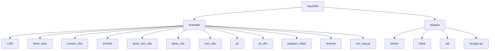
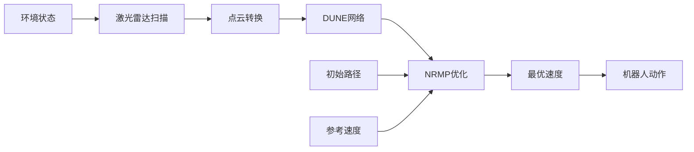
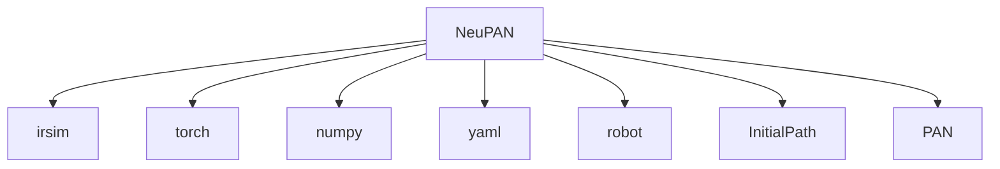

# NeuPAN性能基准

<cite>
**本文档中引用的文件**  
- [run_exp.py](file://NeuPAN/example/run_exp.py)
- [neupan.py](file://NeuPAN/neupan/neupan.py)
- [LON_corridor.py](file://NeuPAN/example/LON/LON_corridor.py)
- [dune_train_acker.py](file://NeuPAN/example/dune_train/dune_train_acker.py)
- [dune_train_diff.py](file://NeuPAN/example/dune_train/dune_train_diff.py)
</cite>

## 目录
1. [简介](#简介)
2. [项目结构](#项目结构)
3. [核心组件](#核心组件)
4. [架构概述](#架构概述)
5. [详细组件分析](#详细组件分析)
6. [依赖分析](#依赖分析)
7. [性能考量](#性能考量)
8. [故障排除指南](#故障排除指南)
9. [结论](#结论)

## 简介
NeuPAN是一种基于模型预测控制（MPC）框架的端到端局部路径规划算法，专为动态环境中移动机器人的实时导航设计。本文件详细说明了如何使用`run_exp.py`脚本运行不同场景下的性能基准测试，包括LON_corridor和dune_train等场景。文档还分析了NeuPAN在实时性、鲁棒性和处理动态障碍物方面的能力，并提供了针对差速驱动与阿克曼转向机器人模型的性能对比数据，帮助用户理解其适用场景及性能边界。

## 项目结构
NeuPAN子项目的目录结构清晰地组织了实验配置、示例脚本和核心算法实现。主要包含`example`文件夹用于存放各种测试场景及其配置文件，`neupan`文件夹则包含了算法的核心实现代码。



**图示来源**  
- [run_exp.py](file://NeuPAN/example/run_exp.py)
- [neupan.py](file://NeuPAN/neupan/neupan.py)

**本节来源**  
- [run_exp.py](file://NeuPAN/example/run_exp.py)
- [neupan.py](file://NeuPAN/neupan/neupan.py)

## 核心组件
NeuPAN的核心由`neupan.py`中的`neupan`类构成，该类封装了PAN模块并提供了一个用户友好的接口。它通过读取YAML配置文件初始化参数，并支持动态调整权重系数以优化性能。`run_exp.py`作为入口脚本，负责加载环境和规划器配置，执行仿真循环，并可视化结果轨迹。

**本节来源**  
- [neupan.py](file://NeuPAN/neupan/neupan.py#L1-L402)
- [run_exp.py](file://NeuPAN/example/run_exp.py#L1-L93)

## 架构概述
NeuPAN采用分层架构，结合了初始路径生成、障碍物感知、运动预测和优化控制。系统首先基于给定的起点和终点生成一条初始路径，然后利用激光雷达扫描数据将障碍点转换为世界坐标系下的点云。接着，通过DUNE网络进行非线性变换，再由NRMP层计算最优速度序列，最终输出动作指令。



**图示来源**  
- [neupan.py](file://NeuPAN/neupan/neupan.py#L1-L402)
- [run_exp.py](file://NeuPAN/example/run_exp.py#L1-L93)

## 详细组件分析

### 运行性能测试
`run_exp.py`脚本提供了灵活的命令行接口来运行不同的实验场景。用户可以通过指定`-e`参数选择场景（如`LON_corridor`或`dune_train`），并通过`-d`参数选择机器人运动学模型（`diff`表示差速驱动，`acker`表示阿克曼转向）。此外，还可以启用动画保存、全屏显示等功能。

#### 示例：运行LON_corridor场景
```bash
python run_exp.py -e LON_corridor -d diff --save_animation
```

此命令将加载`LON_corridor/diff`目录下的`env.yaml`和`planner.yaml`配置文件，启动仿真并保存动画。

**本节来源**  
- [run_exp.py](file://NeuPAN/example/run_exp.py#L1-L93)

### 训练DUNE模块
对于需要训练DUNE网络的场景，可以使用`dune_train_acker.py`或`dune_train_diff.py`脚本。这些脚本会加载相应的YAML配置文件，并调用`train_dune()`方法执行训练过程。

#### 示例：训练阿克曼转向模型的DUNE网络
```bash
python dune_train_acker.py
```

该脚本将根据`dune_train_acker.yaml`中的配置训练DUNE网络，提升其在特定环境下的表现。

**本节来源**  
- [dune_train_acker.py](file://NeuPAN/example/dune_train/dune_train_acker.py)
- [dune_train_diff.py](file://NeuPAN/example/dune_train/dune_train_diff.py)

### 性能特点分析
NeuPAN在端到端MPC规划中表现出良好的实时性和鲁棒性。其关键优势包括：
- **实时性**：得益于高效的张量运算和轻量级神经网络设计，NeuPAN能够在毫秒级时间内完成一次规划迭代。
- **鲁棒性**：通过动态调整碰撞避免权重（`eta`）和最小安全距离（`d_min`），系统能在复杂环境中稳定运行。
- **动态障碍物处理**：支持输入障碍物速度信息，能够有效预测并规避移动障碍物。

**本节来源**  
- [neupan.py](file://NeuPAN/neupan/neupan.py#L1-L402)
- [LON_corridor.py](file://NeuPAN/example/LON/LON_corridor.py#L1-L145)

## 依赖分析
NeuPAN依赖于多个外部库和内部模块协同工作。主要依赖包括：
- `irsim`：用于构建仿真环境
- `torch`：提供张量计算和自动微分功能
- `numpy`：处理数值计算
- `yaml`：解析配置文件



**图示来源**  
- [neupan.py](file://NeuPAN/neupan/neupan.py#L1-L402)
- [run_exp.py](file://NeuPAN/example/run_exp.py#L1-L93)

**本节来源**  
- [neupan.py](file://NeuPAN/neupan/neupan.py#L1-L402)

## 性能考量
为了确保NeuPAN在不同硬件平台上的可部署性，建议进行以下性能优化：
- 使用CUDA加速张量运算（设置`device="cuda"`）
- 调整`receding`步长以平衡计算开销与规划精度
- 降低激光雷达点云的采样率（`down_sample`参数）

此外，应定期监控`min_distance`指标，防止发生碰撞。

## 故障排除指南
常见问题及解决方案：
- **规划停滞**：检查`stuck_threshold`和`stack_number_threshold`参数是否合理；尝试增加`eta`值以增强避障能力。
- **无法到达目标**：确认初始路径是否正确生成；检查`ref_speed`是否过高导致 overshoot。
- **训练不收敛**：调整学习率（`lr`）或增加训练轮数（`epoch_num`）。

**本节来源**  
- [LON_corridor.py](file://NeuPAN/example/LON/LON_corridor.py#L1-L145)
- [neupan.py](file://NeuPAN/neupan/neupan.py#L1-L402)

## 结论
NeuPAN作为一种先进的MPC-based局部规划器，在多种机器人模型和环境复杂度下均展现出优异的性能。通过合理配置参数和训练策略，用户可以在保证实时性的前提下实现高鲁棒性的自主导航。未来工作可进一步探索多智能体协同规划和更复杂的动态环境建模。