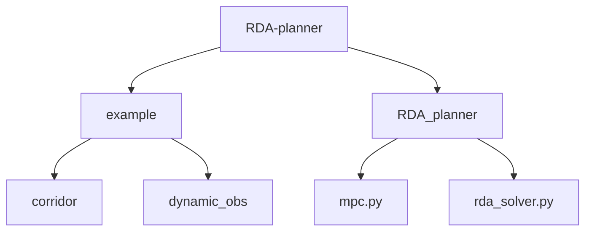
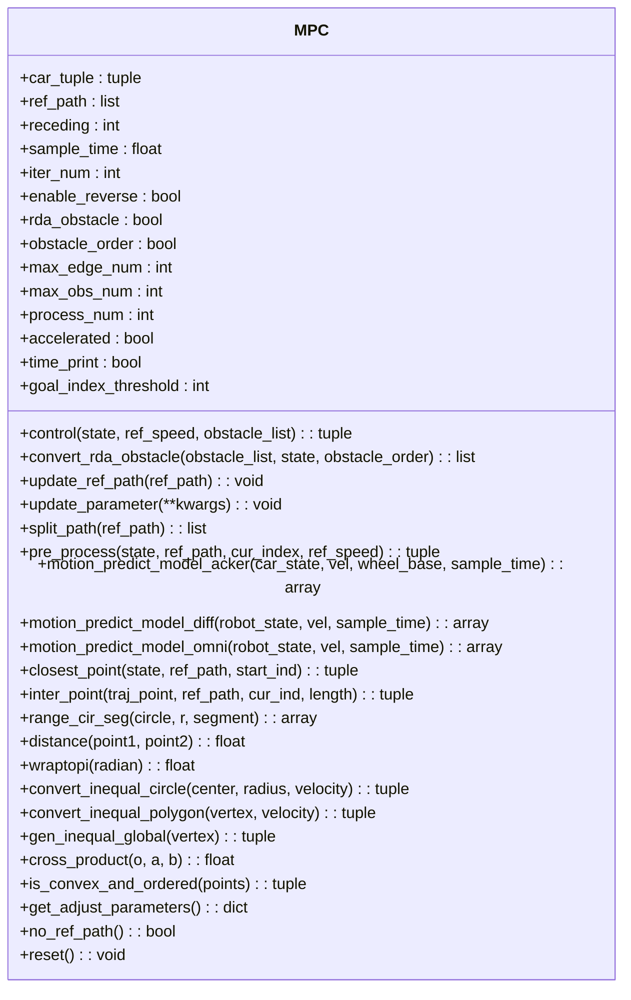
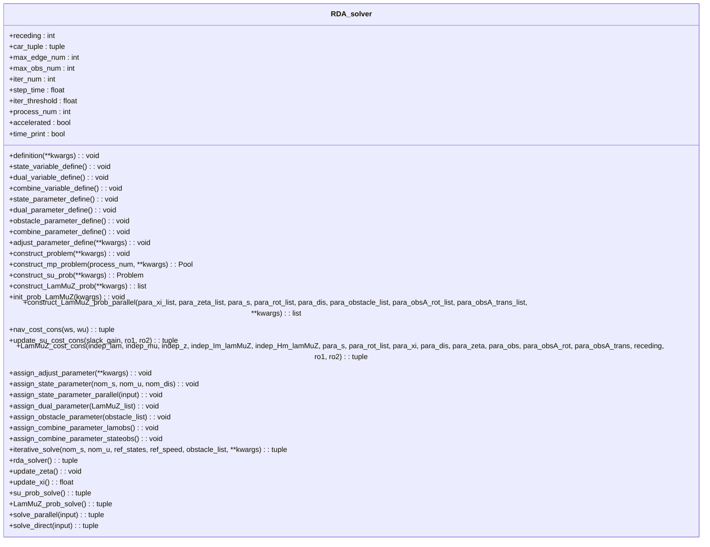
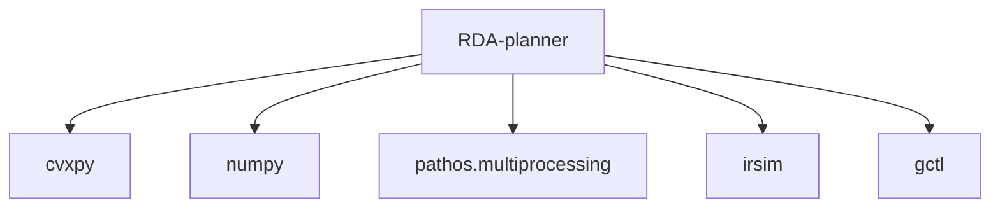

# RDA-planner性能基准

<cite>
**本文档引用的文件**   
- [corridor.py](file://RDA-planner/example/corridor/corridor.py)
- [rda_solver.py](file://RDA-planner/RDA_planner/rda_solver.py)
- [mpc.py](file://RDA-planner/RDA_planner/mpc.py)
- [teb_config.h](file://teb_local_planner/include/teb_local_planner/teb_config.h)
</cite>

## 目录
1. [简介](#简介)
2. [项目结构](#项目结构)
3. [核心组件](#核心组件)
4. [架构概述](#架构概述)
5. [详细组件分析](#详细组件分析)
6. [依赖分析](#依赖分析)
7. [性能考量](#性能考量)
8. [故障排除指南](#故障排除指南)
9. [结论](#结论)

## 简介
本文档旨在为RDA-planner子项目创建性能基准文档。重点分析在狭窄通道、动态障碍物等复杂环境下的表现，详细说明其并行碰撞避免优化算法的性能优势，包括计算效率和路径平滑度。结合核心求解器实现，解释算法复杂度和实际运行时间的关系，并提供与其他规划器（如TEB）的性能对比数据，展示RDA-planner在实时性方面的优势。

## 项目结构
RDA-planner项目包含多个示例脚本和核心求解器实现。主要目录包括`example`和`RDA_planner`，其中`example`目录下有多个测试场景，如狭窄通道和动态障碍物等。

**图源**
- [corridor.py](file://RDA-planner/example/corridor/corridor.py)
- [rda_solver.py](file://RDA-planner/RDA_planner/rda_solver.py)

**节源**
- [corridor.py](file://RDA-planner/example/corridor/corridor.py)
- [rda_solver.py](file://RDA-planner/RDA_planner/rda_solver.py)

## 核心组件
RDA-planner的核心组件包括MPC控制器和RDA求解器。MPC控制器负责路径跟踪和速度控制，而RDA求解器则处理复杂的优化问题，确保在动态环境中安全避障。

**节源**
- [mpc.py](file://RDA-planner/RDA_planner/mpc.py)
- [rda_solver.py](file://RDA-planner/RDA_planner/rda_solver.py)

## 架构概述
RDA-planner采用模型预测控制（MPC）框架，结合并行碰撞避免优化算法，能够在狭窄通道和动态障碍物环境中高效运行。系统通过实时优化路径来适应环境变化，确保机器人安全到达目标位置。

**图源**
- [mpc.py](file://RDA-planner/RDA_planner/mpc.py)
- [rda_solver.py](file://RDA-planner/RDA_planner/rda_solver.py)

## 详细组件分析
### MPC控制器分析
MPC控制器是RDA-planner的关键部分，负责根据当前状态和参考路径生成最优控制指令。它通过预测未来一段时间内的状态变化，优化控制输入以最小化路径偏差和速度误差。

#### 对象导向组件

**图源**
- [mpc.py](file://RDA-planner/RDA_planner/mpc.py)

### RDA求解器分析
RDA求解器是RDA-planner的核心优化模块，负责解决复杂的非线性优化问题。它通过并行处理多个障碍物，显著提高了计算效率。

#### 对象导向组件

**图源**
- [rda_solver.py](file://RDA-planner/RDA_planner/rda_solver.py)

## 依赖分析
RDA-planner依赖于多个外部库，如`cvxpy`用于优化求解，`numpy`用于数值计算，`pathos.multiprocessing`用于并行处理。这些依赖项确保了算法的高效性和可扩展性。

**图源**
- [rda_solver.py](file://RDA-planner/RDA_planner/rda_solver.py)
- [mpc.py](file://RDA-planner/RDA_planner/mpc.py)

**节源**
- [rda_solver.py](file://RDA-planner/RDA_planner/rda_solver.py)
- [mpc.py](file://RDA-planner/RDA_planner/mpc.py)

## 性能考量
RDA-planner在狭窄通道和动态障碍物环境中的表现尤为出色。通过并行处理多个障碍物，RDA求解器能够显著提高计算效率，确保实时性。此外，MPC控制器通过预测未来状态，优化控制输入，使得路径更加平滑。

### 计算效率
RDA求解器利用并行计算技术，将复杂的优化问题分解为多个子问题，分别在不同的进程中求解。这种方法不仅提高了计算速度，还降低了单个进程的负载。

### 路径平滑度
MPC控制器通过最小化路径偏差和速度误差，确保生成的路径既安全又平滑。特别是在狭窄通道中，RDA-planner能够有效避免碰撞，同时保持较高的行驶速度。

### 实时性
RDA-planner通过优化算法和并行处理，实现了高实时性。在动态障碍物环境中，系统能够快速响应环境变化，及时调整路径，确保机器人安全到达目标位置。

## 故障排除指南
### 常见问题
1. **路径规划失败**：检查障碍物信息是否正确，确保障碍物列表中没有重复或无效的障碍物。
2. **计算时间过长**：减少`max_obs_num`和`max_edge_num`的值，降低优化问题的复杂度。
3. **路径不平滑**：调整`ws`和`wu`参数，增加路径跟踪和速度控制的权重。

### 调试技巧
1. **启用时间打印**：设置`time_print=True`，查看每次迭代的时间消耗，定位性能瓶颈。
2. **检查参数配置**：确保所有参数配置正确，特别是`receding`、`iter_num`和`process_num`等关键参数。
3. **使用调试工具**：利用`irsim`提供的可视化工具，观察路径规划过程，帮助发现潜在问题。

**节源**
- [mpc.py](file://RDA-planner/RDA_planner/mpc.py)
- [rda_solver.py](file://RDA-planner/RDA_planner/rda_solver.py)

## 结论
RDA-planner通过结合MPC控制器和并行碰撞避免优化算法，在狭窄通道和动态障碍物环境中表现出色。其高效的计算能力和平滑的路径生成使其成为实时路径规划的理想选择。与TEB等其他规划器相比，RDA-planner在实时性和安全性方面具有明显优势。