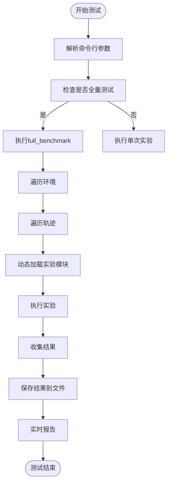
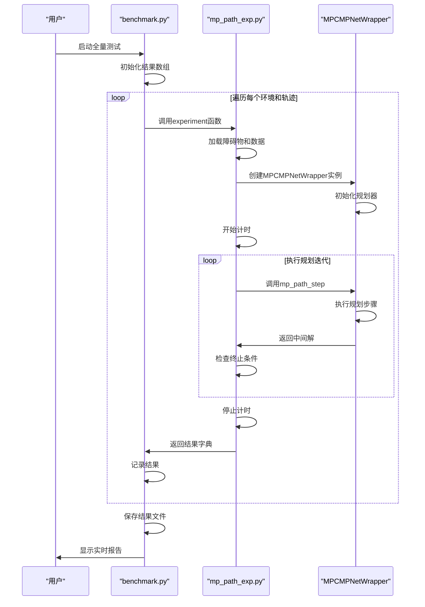
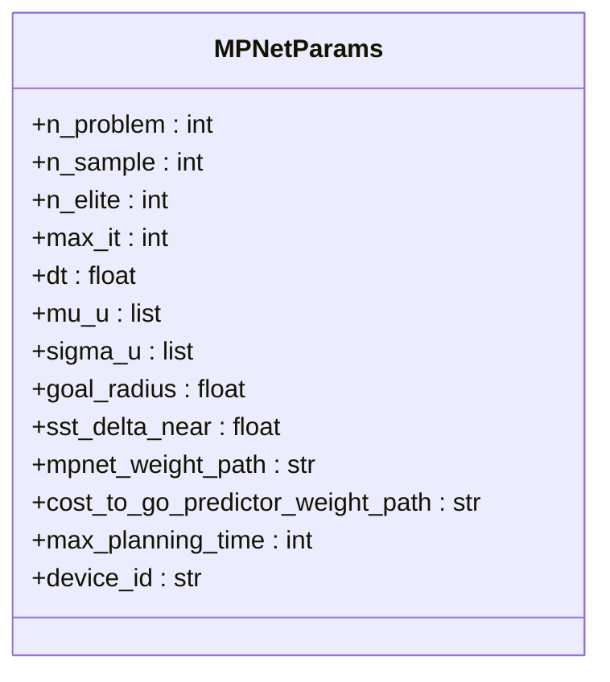

# mpc-mpnet-py性能基准

<cite>
**本文档引用文件**  
- [benchmark.py](file://mpc-mpnet-py/benchmarks/benchmark.py)
- [mp_path_exp.py](file://mpc-mpnet-py/benchmarks/experiments/mp_path_exp.py)
- [sst_exp.py](file://mpc-mpnet-py/benchmarks/experiments/sst_exp.py)
- [data_exp.py](file://mpc-mpnet-py/benchmarks/experiments/data_exp.py)
- [mp_path_default.py](file://mpc-mpnet-py/params/quadrotor_obs/mp_path_default.py)
- [mp_path.sh](file://mpc-mpnet-py/scripts/benchmarks/cartpole_obs/mp_path.sh)
</cite>

## 目录
1. [简介](#简介)
2. [基准测试框架设计](#基准测试框架设计)
3. [核心测试指标](#核心测试指标)
4. [实验流程分析](#实验流程分析)
5. [参数配置影响分析](#参数配置影响分析)
6. [性能调优建议](#性能调优建议)
7. [结论](#结论)

## 简介
本文档详细分析mpc-mpnet-py子项目的性能基准测试体系，重点解析其对MPNet、SST等规划算法在不同环境（如四旋翼、小车）下的性能评估机制。文档深入探讨基准测试框架的设计原理、关键性能指标、实验执行流程以及参数配置对测试结果的影响，为开发者提供全面的性能调优指导。

## 基准测试框架设计

mpc-mpnet-py的基准测试框架以`benchmark.py`为核心，采用模块化设计，支持多种算法和环境的性能评估。框架通过`full_benchmark`函数实现批量测试，能够系统性地评估算法在多个环境和轨迹上的表现。

框架的核心设计特点包括：
- **模块化实验接口**：通过`importlib`动态加载不同类型的实验模块（如`mp_path_exp`、`sst_exp`），实现算法的灵活扩展。
- **参数化配置**：支持通过命令行参数和配置文件（如`mp_path_default.py`）灵活调整测试参数。
- **结果持久化**：自动将成功率、规划时间、路径成本等指标保存为`.npy`格式文件，便于后续分析。

**Diagram sources**  
- [benchmark.py](file://mpc-mpnet-py/benchmarks/benchmark.py#L0-L101)

**Section sources**  
- [benchmark.py](file://mpc-mpnet-py/benchmarks/benchmark.py#L0-L101)

## 核心测试指标

基准测试框架主要评估以下三个核心性能指标：

### 成功率 (Success Rate)
衡量算法在给定环境和起止点条件下成功找到可行路径的能力。成功率是评估算法鲁棒性的关键指标。

### 规划时间 (Planning Time)
记录算法从开始搜索到返回结果所消耗的时间，单位为秒。该指标反映算法的计算效率和实时性。

### 路径质量 (Path Quality)
通过路径的总成本（costs）来衡量，通常与路径长度、平滑度、安全性等相关。成本越低，路径质量越高。

这些指标通过`full_benchmark`函数中的`sr`、`planning_time`和`costs`三个数组进行记录和统计，并支持实时报告功能。

**Section sources**  
- [benchmark.py](file://mpc-mpnet-py/benchmarks/benchmark.py#L15-L52)

## 实验流程分析

### MPNet路径规划实验流程
`mp_path_exp.py`实现了基于MPNet的路径规划实验，其执行流程如下：

**Diagram sources**  
- [mp_path_exp.py](file://mpc-mpnet-py/benchmarks/experiments/mp_path_exp.py#L0-L96)
- [benchmark.py](file://mpc-mpnet-py/benchmarks/benchmark.py#L27-L52)

### SST算法实验流程
`sst_exp.py`实现了SST（Stable Sparse RRT）算法的测试流程，与MPNet实验类似，但使用不同的规划器实现。

**Section sources**  
- [mp_path_exp.py](file://mpc-mpnet-py/benchmarks/experiments/mp_path_exp.py#L0-L96)
- [sst_exp.py](file://mpc-mpnet-py/benchmarks/experiments/sst_exp.py#L0-L74)

## 参数配置影响分析

### 默认参数配置
`mp_path_default.py`文件定义了MPNet路径规划的默认参数，这些参数对测试结果有显著影响：

**Diagram sources**  
- [mp_path_default.py](file://mpc-mpnet-py/params/quadrotor_obs/mp_path_default.py#L0-L54)

### 关键参数说明
- **`n_sample` (32)**：每次迭代的样本数量，影响搜索的广度。
- **`n_elite` (4)**：精英样本数量，影响搜索方向的引导。
- **`max_planning_time` (500)**：最大规划时间（秒），决定算法的超时阈值。
- **`goal_radius` (2)**：目标半径，影响算法对目标点的判定精度。
- **`mpnet_weight_path`**：预训练MPNet模型的路径，直接影响规划质量。
- **`device_id` ("cuda:3")**：指定GPU设备，影响计算性能。

这些参数的设置需要根据具体应用场景进行调整，例如在实时性要求高的场景中，应适当降低`max_planning_time`；在复杂环境中，可能需要增加`n_sample`以提高成功率。

**Section sources**  
- [mp_path_default.py](file://mpc-mpnet-py/params/quadrotor_obs/mp_path_default.py#L0-L54)

## 性能调优建议

### 修改测试场景
开发者可以通过以下方式修改测试场景：
1. 在`params/`目录下创建新的参数配置文件。
2. 在`experiments/`目录下实现新的实验模块。
3. 使用脚本（如`mp_path.sh`）调用新的配置。

### 添加新的对比算法
添加新算法的步骤：
1. 实现新的实验模块（继承`experiment`函数接口）。
2. 在`benchmark.py`中通过`experiment_type`参数调用新模块。
3. 使用统一的指标进行性能对比。

### 解读测试输出结果
测试结果保存在`results/`目录下，包含：
- `sr_*.npy`：成功率数据
- `time_*.npy`：规划时间数据  
- `costs_*.npy`：路径成本数据

开发者可以使用NumPy加载这些文件，进行统计分析和可视化。

**Section sources**  
- [mp_path.sh](file://mpc-mpnet-py/scripts/benchmarks/cartpole_obs/mp_path.sh#L0-L1)

## 结论
mpc-mpnet-py的性能基准测试框架提供了一套完整、灵活的算法评估体系。通过深入理解其设计原理和参数配置，开发者可以有效地评估和优化路径规划算法的性能，为不同应用场景选择最合适的算法配置。