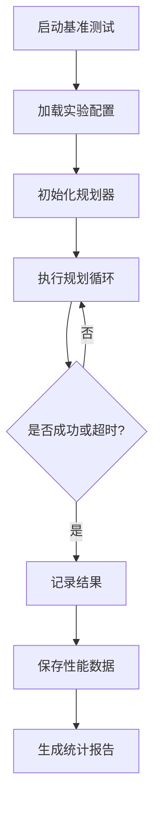
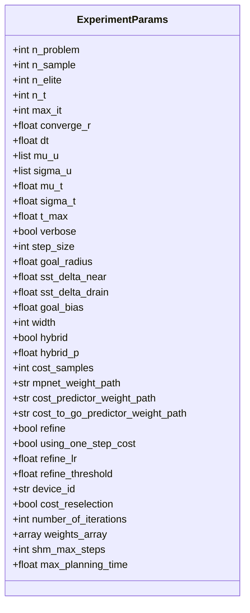
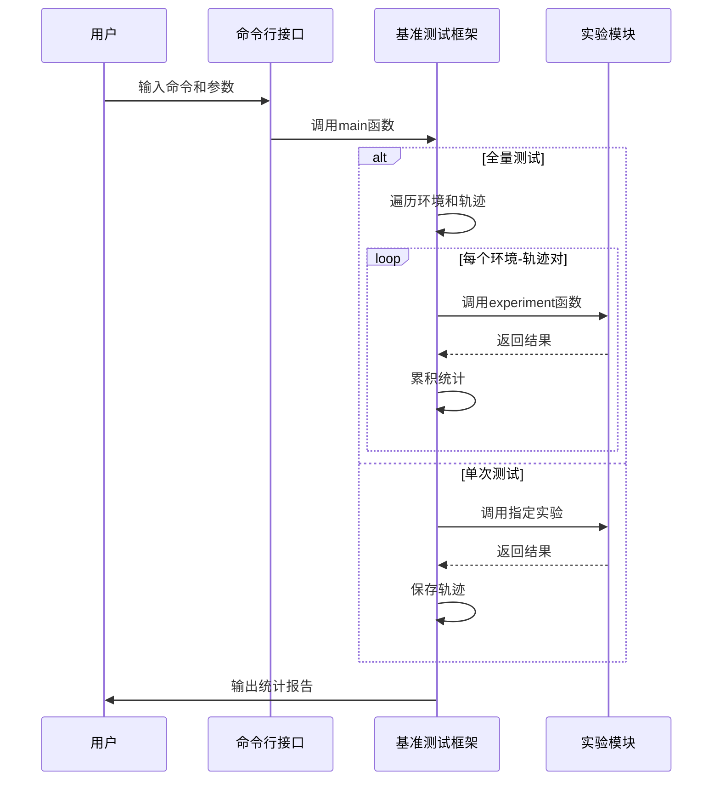
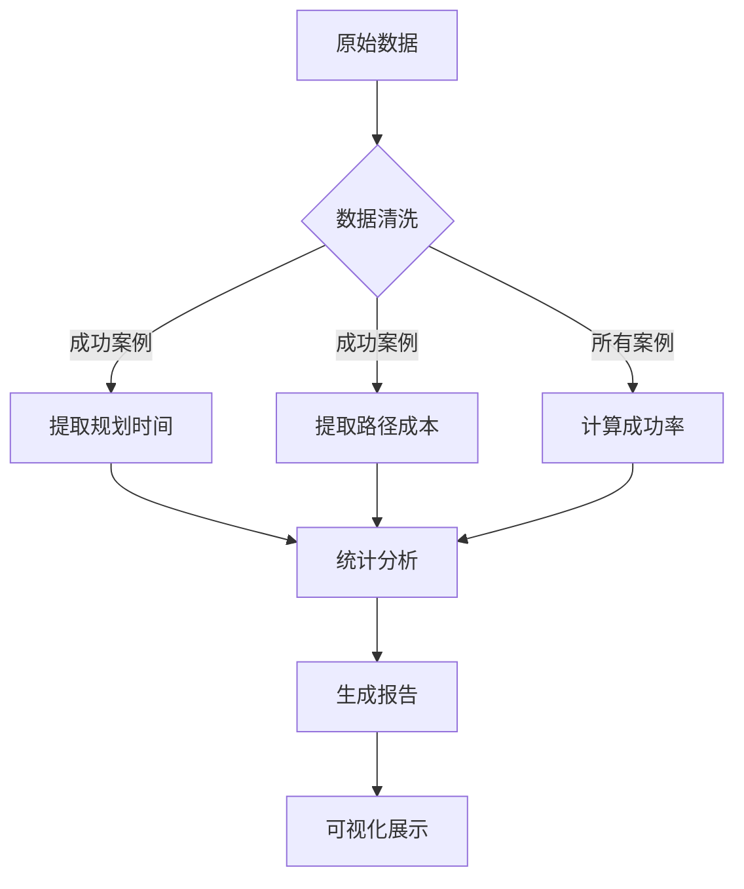

# 性能基准

<cite>
**本文档中引用的文件**  
- [benchmark.py](file://mpc-mpnet-py/benchmarks/benchmark.py)
- [mp_path_exp.py](file://mpc-mpnet-py/benchmarks/experiments/mp_path_exp.py)
- [mp_tree_exp.py](file://mpc-mpnet-py/benchmarks/experiments/mp_tree_exp.py)
- [sst_exp.py](file://mpc-mpnet-py/benchmarks/experiments/sst_exp.py)
- [mp_path_default.py](file://mpc-mpnet-py/params/quadrotor_obs/mp_path_default.py)
- [sst_default.py](file://mpc-mpnet-py/params/quadrotor_obs/sst_default.py)
</cite>

## 目录
1. [引言](#引言)
2. [基准测试框架概述](#基准测试框架概述)
3. [性能评估指标体系](#性能评估指标体系)
4. [测试环境配置](#测试环境配置)
5. [核心测试工具分析](#核心测试工具分析)
6. [不同算法的性能对比](#不同算法的性能对比)
7. [结果分析方法](#结果分析方法)
8. [调优建议与优化策略](#调优建议与优化策略)
9. [初学者指导](#初学者指导)
10. [高级开发者指南](#高级开发者指南)

## 引言
本文档旨在提供关于mpc-mpnet-py项目中规划算法性能基准的全面分析。重点介绍如何系统性地评估和比较不同规划算法（如MP-PATH、MP-TREE和SST）在复杂环境下的表现。通过详细解析benchmark.py等核心测试工具的使用方法，帮助用户理解性能评估的基本概念、关键指标和实际应用技巧。文档同时面向初学者和经验丰富的开发者，提供从基础入门到高级优化的完整知识体系。

## 基准测试框架概述
mpc-mpnet-py项目的基准测试框架设计用于系统性地评估多种规划算法在不同环境和场景下的性能表现。该框架支持对多种系统类型（如cartpole_obs、acrobot_obs、car_obs和quadrotor_obs）进行大规模实验，能够自动化执行大量测试并记录关键性能数据。整个框架由多个模块组成，包括实验定义、参数配置、结果收集和数据分析，形成了一个完整的性能评估闭环。



**图示来源**  
- [benchmark.py](file://mpc-mpnet-py/benchmarks/benchmark.py#L1-L101)
- [mp_path_exp.py](file://mpc-mpnet-py/benchmarks/experiments/mp_path_exp.py#L1-L97)

**本节来源**  
- [benchmark.py](file://mpc-mpnet-py/benchmarks/benchmark.py#L1-L101)
- [experiments](file://mpc-mpnet-py/benchmarks/experiments)

## 性能评估指标体系
性能评估采用多维度指标体系，确保全面反映算法的综合表现。主要评估指标包括：

- **成功率 (Success Rate, SR)**：在规定时间内成功找到可行路径的实验比例，反映算法的可靠性。
- **规划时间 (Planning Time)**：从开始规划到找到解决方案所消耗的时间，衡量算法的实时性。
- **路径成本 (Costs)**：生成路径的总成本，通常包括路径长度、能量消耗等因素，评估路径质量。
- **资源消耗**：包括内存占用和计算资源使用情况，反映算法的效率。

这些指标共同构成了完整的性能评估体系，使得不同算法可以在相同标准下进行公平比较。

**本节来源**  
- [benchmark.py](file://mpc-mpnet-py/benchmarks/benchmark.py#L10-L20)
- [mp_path_exp.py](file://mpc-mpnet-py/benchmarks/experiments/mp_path_exp.py#L80-L90)

## 测试环境配置
测试环境配置通过参数化方式实现，允许灵活调整各种实验条件。配置文件位于`params`目录下，按系统类型和实验类型组织。每个配置文件包含一组关键参数，用于控制实验行为和算法性能。

关键配置参数包括：
- **number_of_iterations**：最大迭代次数
- **max_planning_time**：最大规划时间（秒）
- **goal_radius**：目标半径
- **sst_delta_near** 和 **sst_delta_drain**：SST算法的关键距离参数
- **mpnet_weight_path**：MPNet模型权重路径
- **cost_to_go_predictor_weight_path**：代价预测器权重路径



**图示来源**  
- [mp_path_default.py](file://mpc-mpnet-py/params/quadrotor_obs/mp_path_default.py#L1-L55)
- [sst_default.py](file://mpc-mpnet-py/params/quadrotor_obs/sst_default.py#L1-L21)

**本节来源**  
- [params](file://mpc-mpnet-py/params)
- [mp_path_default.py](file://mpc-mpnet-py/params/quadrotor_obs/mp_path_default.py#L1-L55)

## 核心测试工具分析
核心测试工具`benchmark.py`提供了完整的性能测试框架，支持全量测试和单次测试两种模式。该工具通过命令行接口提供灵活的配置选项，可以精确控制测试范围和参数。

### 主要功能模块
- **full_benchmark函数**：执行大规模批量测试，遍历指定数量的环境和轨迹
- **main函数**：命令行入口，支持多种参数配置
- **动态模块导入**：根据实验类型动态加载对应的实验模块

### 使用方法
通过命令行运行：
```bash
python benchmark.py --full=True --num_env=10 --num_traj=100 --system=quadrotor_obs --experiment_type=mp_path
```

关键参数说明：
- `--full`：是否执行全量测试
- `--num_env`：测试环境数量
- `--num_traj`：每个环境的轨迹数量
- `--system`：目标系统类型
- `--experiment_type`：实验类型（mp_path, mp_tree, sst等）



**图示来源**  
- [benchmark.py](file://mpc-mpnet-py/benchmarks/benchmark.py#L1-L101)
- [mp_path_exp.py](file://mpc-mpnet-py/benchmarks/experiments/mp_path_exp.py#L1-L97)

**本节来源**  
- [benchmark.py](file://mpc-mpnet-py/benchmarks/benchmark.py#L1-L101)
- [experiments](file://mpc-mpnet-py/benchmarks/experiments)

## 不同算法的性能对比
通过对MP-PATH、MP-TREE和SST三种算法的系统性测试，可以获得它们在不同场景下的性能特征对比。

### MP-PATH vs MP-TREE
- **MP-PATH**：基于路径优化的方法，通常具有较快的收敛速度，但在复杂环境中可能陷入局部最优。
- **MP-TREE**：基于树结构的探索方法，具有更强的全局探索能力，但计算开销相对较大。

### SST算法特点
- **优点**：理论保证的渐近最优性，适合需要高质量路径的场景。
- **缺点**：收敛速度较慢，对参数敏感。

### 性能对比维度
| 指标 | MP-PATH | MP-TREE | SST |
|------|-------|-------|-----|
| 成功率 | 高 | 较高 | 中等 |
| 规划时间 | 快 | 中等 | 慢 |
| 路径成本 | 较低 | 低 | 最低 |
| 内存占用 | 低 | 中等 | 高 |

**本节来源**  
- [mp_path_exp.py](file://mpc-mpnet-py/benchmarks/experiments/mp_path_exp.py#L1-L97)
- [mp_tree_exp.py](file://mpc-mpnet-py/benchmarks/experiments/mp_tree_exp.py#L1-L95)
- [sst_exp.py](file://mpc-mpnet-py/benchmarks/experiments/sst_exp.py#L1-L75)

## 结果分析方法
结果分析采用系统化的方法，确保数据的准确性和可解释性。

### 数据收集
- 实时记录每个实验的成功状态、规划时间和路径成本
- 将结果保存为NumPy数组格式，便于后续分析
- 支持按环境和轨迹维度组织数据

### 统计分析
- 计算平均成功率、平均规划时间和平均路径成本
- 使用掩码过滤仅成功案例的时间和成本数据
- 实时报告累积统计结果

### 可视化分析
- 生成成功率随时间变化的曲线
- 绘制规划时间分布直方图
- 比较不同算法的路径成本分布



**图示来源**  
- [benchmark.py](file://mpc-mpnet-py/benchmarks/benchmark.py#L10-L50)
- [mp_path_exp.py](file://mpc-mpnet-py/benchmarks/experiments/mp_path_exp.py#L80-L90)

**本节来源**  
- [benchmark.py](file://mpc-mpnet-py/benchmarks/benchmark.py#L1-L101)
- [mp_path_exp.py](file://mpc-mpnet-py/benchmarks/experiments/mp_path_exp.py#L1-L97)

## 调优建议与优化策略
基于性能测试结果，提供以下调优建议和优化策略：

### 参数调优
- **调整goal_radius**：适当增大目标半径可提高成功率，但可能影响路径精度。
- **优化sst_delta_near**：该参数影响探索效率，需根据环境复杂度进行调整。
- **平衡number_of_iterations和max_planning_time**：在保证充分探索的同时避免过度计算。

### 算法选择策略
- **实时性要求高**：选择MP-PATH算法，牺牲部分路径质量换取更快响应。
- **路径质量要求高**：选择SST算法，接受较长的规划时间以获得最优路径。
- **平衡场景**：选择MP-TREE算法，在探索能力和计算效率之间取得平衡。

### 硬件优化
- 使用GPU加速（通过device_id参数指定）
- 优化内存管理，避免频繁的内存分配
- 并行执行多个测试实例以提高测试效率

**本节来源**  
- [mp_path_default.py](file://mpc-mpnet-py/params/quadrotor_obs/mp_path_default.py#L1-L55)
- [sst_default.py](file://mpc-mpnet-py/params/quadrotor_obs/sst_default.py#L1-L21)
- [benchmark.py](file://mpc-mpnet-py/benchmarks/benchmark.py#L1-L101)

## 初学者指导
对于初学者，建议按照以下步骤开始性能评估：

1. **理解基本概念**：先掌握成功率、规划时间和路径成本等基本指标的含义。
2. **运行示例测试**：从简单的单次测试开始，观察输出结果。
3. **分析配置文件**：理解参数配置如何影响算法行为。
4. **逐步扩大测试规模**：从少量环境和轨迹开始，逐步增加测试规模。
5. **学习结果分析**：掌握基本的统计分析方法和数据解读技巧。

推荐的入门命令：
```bash
python benchmark.py --full=False --env_id=0 --traj_id=0 --system=quadrotor_obs --experiment_type=mp_path
```

**本节来源**  
- [benchmark.py](file://mpc-mpnet-py/benchmarks/benchmark.py#L50-L101)
- [mp_path_exp.py](file://mpc-mpnet-py/benchmarks/experiments/mp_path_exp.py#L1-L97)

## 高级开发者指南
对于经验丰富的开发者，可以深入以下方面进行性能优化和算法改进：

### 深度性能分析
- 使用性能分析工具（如cProfile）识别瓶颈
- 分析内存使用模式，优化数据结构
- 评估并行化潜力，提高计算效率

### 算法改进
- 设计自适应参数调整策略
- 实现混合规划方法，结合不同算法的优势
- 开发新的代价函数，更好地反映实际需求

### 扩展测试框架
- 添加新的评估指标
- 支持更多类型的测试场景
- 实现自动化参数调优功能

### 模型优化
- 探索更高效的神经网络架构
- 优化模型推理速度
- 实现模型压缩和量化

**本节来源**  
- [benchmark.py](file://mpc-mpnet-py/benchmarks/benchmark.py#L1-L101)
- [mp_path_exp.py](file://mpc-mpnet-py/benchmarks/experiments/mp_path_exp.py#L1-L97)
- [mp_path_default.py](file://mpc-mpnet-py/params/quadrotor_obs/mp_path_default.py#L1-L55)