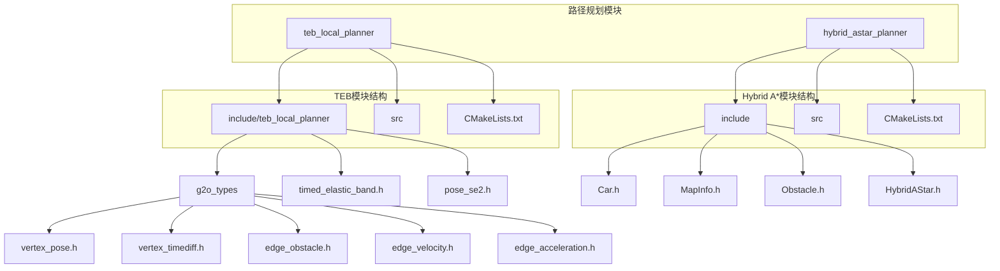
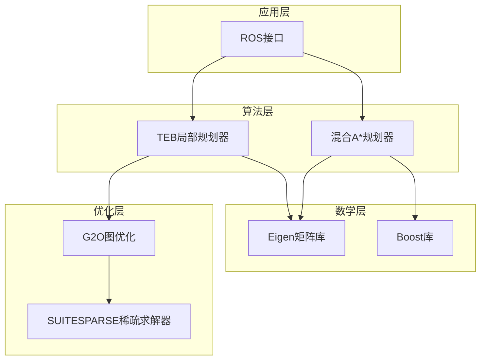
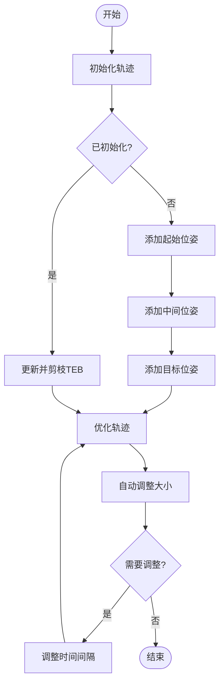
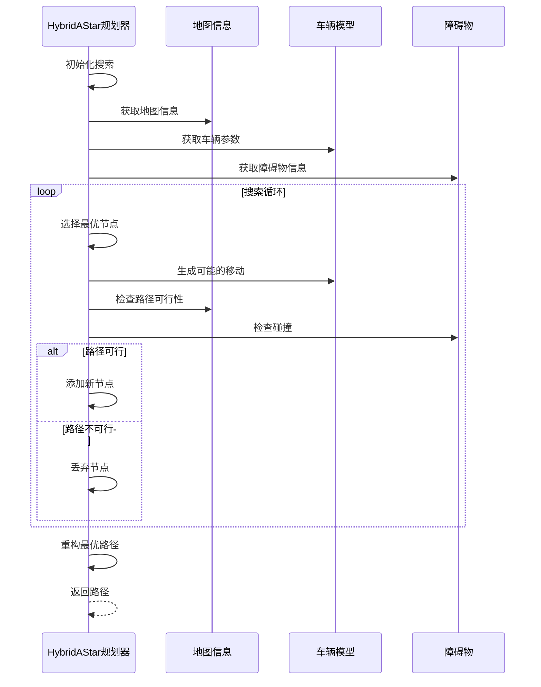
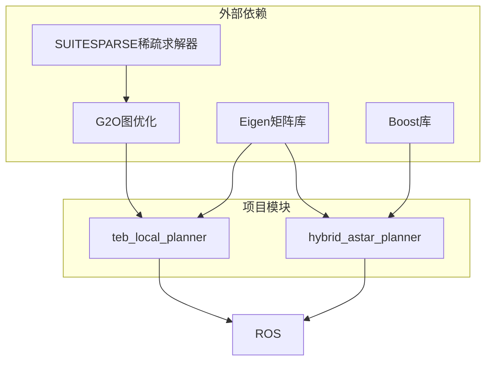

# C++技术栈

<cite>
**本文档中引用的文件**   
- [timed_elastic_band.h](file://teb_local_planner/include/teb_local_planner/timed_elastic_band.h)
- [timed_elastic_band.hpp](file://teb_local_planner/include/teb_local_planner/timed_elastic_band.hpp)
- [vertex_pose.h](file://teb_local_planner/include/teb_local_planner/g2o_types/vertex_pose.h)
- [vertex_timediff.h](file://teb_local_planner/include/teb_local_planner/g2o_types/vertex_timediff.h)
- [pose_se2.h](file://teb_local_planner/include/teb_local_planner/pose_se2.h)
- [hybrid_astar_planner/src/HybridAStar.cpp](file://hybrid_astar_planner/src/HybridAStar.cpp)
- [hybrid_astar_planner/include/HybridAStar.h](file://hybrid_astar_planner/include/HybridAStar.h)
- [teb_local_planner/include/teb_local_planner/g2o_types/edge_obstacle.h](file://teb_local_planner/include/teb_local_planner/g2o_types/edge_obstacle.h)
- [teb_local_planner/include/teb_local_planner/g2o_types/edge_velocity.h](file://teb_local_planner/include/teb_local_planner/g2o_types/edge_velocity.h)
- [teb_local_planner/include/teb_local_planner/g2o_types/edge_acceleration.h](file://teb_local_planner/include/teb_local_planner/g2o_types/edge_acceleration.h)
- [teb_local_planner/cmake_modules/FindG2O.cmake](file://teb_local_planner/cmake_modules/FindG2O.cmake)
- [teb_local_planner/cmake_modules/FindSUITESPARSE.cmake](file://teb_local_planner/cmake_modules/FindSUITESPARSE.cmake)
</cite>

## 目录
1. [引言](#引言)
2. [项目结构](#项目结构)
3. [核心组件](#核心组件)
4. [架构概述](#架构概述)
5. [详细组件分析](#详细组件分析)
6. [依赖分析](#依赖分析)
7. [性能考量](#性能考量)
8. [故障排除指南](#故障排除指南)
9. [结论](#结论)

## 引言
本文档深入探讨了C++技术栈在高性能路径规划模块中的实现细节，重点分析teb_local_planner和hybrid_astar_planner等关键组件。文档详细解析了时序弹性带算法在C++中的优化实现，结合timed_elastic_band.h中的类设计说明实时路径规划的性能考量。同时，解释了G2O和SUITESPARSE库在优化问题求解中的集成方式及其在TEB算法中的具体应用。为初学者提供C++编译和调试指南，为经验丰富的开发者提供内存管理、多线程优化和实时系统集成的最佳实践。最后，结合实际代码示例，说明C++模块如何通过ROS与Python组件进行高效通信。

## 项目结构
本项目包含多个路径规划相关的模块，其中teb_local_planner和hybrid_astar_planner是两个核心的C++实现模块。teb_local_planner模块实现了基于时序弹性带的局部路径规划算法，而hybrid_astar_planner模块实现了混合A*全局路径规划算法。两个模块都采用了现代C++编程范式，利用模板、STL容器和Eigen库进行高效的数值计算。



**图源**
- [teb_local_planner/include/teb_local_planner](file://teb_local_planner/include/teb_local_planner)
- [hybrid_astar_planner/include](file://hybrid_astar_planner/include)

**节源**
- [teb_local_planner](file://teb_local_planner)
- [hybrid_astar_planner](file://hybrid_astar_planner)

## 核心组件
本项目的核心组件包括时序弹性带(Timed Elastic Band)算法和混合A*算法。时序弹性带算法在teb_local_planner中实现，通过将路径表示为一系列带有时间间隔的位姿点来优化轨迹。混合A*算法在hybrid_astar_planner中实现，结合了A*搜索和车辆运动学约束，生成可行的全局路径。

**节源**
- [timed_elastic_band.h](file://teb_local_planner/include/teb_local_planner/timed_elastic_band.h)
- [HybridAStar.h](file://hybrid_astar_planner/include/HybridAStar.h)

## 架构概述
系统的整体架构采用分层设计，上层为路径规划算法，中层为优化求解器，底层为数学计算库。teb_local_planner模块使用G2O作为非线性优化框架，将路径规划问题转化为图优化问题。hybrid_astar_planner模块则采用传统的搜索算法，结合车辆动力学模型进行路径搜索。



**图源**
- [teb_local_planner](file://teb_local_planner)
- [hybrid_astar_planner](file://hybrid_astar_planner)

## 详细组件分析

### 时序弹性带算法分析
时序弹性带算法是teb_local_planner模块的核心，通过将路径表示为一系列带有时间间隔的位姿点来优化轨迹。算法的关键在于将路径规划问题转化为非线性优化问题，利用G2O框架进行求解。

#### 类设计分析
```mermaid
classDiagram
class TimedElasticBand {
+PoseSequence pose_vec_
+TimeDiffSequence timediff_vec_
+initTrajectoryToGoal()
+autoResize()
+getSumOfAllTimeDiffs()
+getAccumulatedDistance()
}
class PoseSE2 {
+Eigen : : Vector2d _position
+double _theta
+rotateGlobal()
+average()
+plus()
}
class VertexPose {
+PoseSE2 _estimate
+oplusImpl()
+setToOriginImpl()
}
class VertexTimeDiff {
+double _estimate
+oplusImpl()
+setToOriginImpl()
}
TimedElasticBand --> PoseSE2 : "包含"
TimedElasticBand --> VertexPose : "使用"
TimedElasticBand --> VertexTimeDiff : "使用"
VertexPose --> PoseSE2 : "封装"
VertexTimeDiff --> "double" : "封装"
```

**图源**
- [timed_elastic_band.h](file://teb_local_planner/include/teb_local_planner/timed_elastic_band.h)
- [pose_se2.h](file://teb_local_planner/include/teb_local_planner/pose_se2.h)
- [vertex_pose.h](file://teb_local_planner/include/teb_local_planner/g2o_types/vertex_pose.h)
- [vertex_timediff.h](file://teb_local_planner/include/teb_local_planner/g2o_types/vertex_timediff.h)

#### 算法流程分析


**图源**
- [timed_elastic_band.h](file://teb_local_planner/include/teb_local_planner/timed_elastic_band.h)
- [timed_elastic_band.hpp](file://teb_local_planner/include/teb_local_planner/timed_elastic_band.hpp)

**节源**
- [timed_elastic_band.h](file://teb_local_planner/include/teb_local_planner/timed_elastic_band.h)
- [timed_elastic_band.hpp](file://teb_local_planner/include/teb_local_planner/timed_elastic_band.hpp)

### 混合A*算法分析
混合A*算法在hybrid_astar_planner模块中实现，结合了A*搜索和车辆运动学约束，生成可行的全局路径。算法通过离散化车辆的运动空间，考虑车辆的转向和速度约束，生成平滑且可行的路径。



**图源**
- [HybridAStar.h](file://hybrid_astar_planner/include/HybridAStar.h)
- [HybridAStar.cpp](file://hybrid_astar_planner/src/HybridAStar.cpp)

**节源**
- [hybrid_astar_planner](file://hybrid_astar_planner)

## 依赖分析
本项目依赖多个第三方库来实现高性能的路径规划功能。主要依赖包括G2O图优化框架、SUITESPARSE稀疏矩阵求解器、Eigen线性代数库和Boost库。



**图源**
- [teb_local_planner/cmake_modules/FindG2O.cmake](file://teb_local_planner/cmake_modules/FindG2O.cmake)
- [teb_local_planner/cmake_modules/FindSUITESPARSE.cmake](file://teb_local_planner/cmake_modules/FindSUITESPARSE.cmake)

**节源**
- [teb_local_planner/cmake_modules](file://teb_local_planner/cmake_modules)

## 性能考量
在实现高性能路径规划算法时，需要考虑多个性能因素。对于teb_local_planner，关键的性能考量包括优化问题的规模、稀疏矩阵求解的效率和实时性要求。对于hybrid_astar_planner，关键的性能考量包括搜索空间的大小、碰撞检测的效率和路径平滑的计算成本。

在teb_local_planner中，通过以下方式优化性能：
1. 使用稀疏矩阵表示优化问题，减少内存占用和计算复杂度
2. 采用增量式优化策略，只优化变化的部分
3. 实现自动调整大小功能，根据需要动态调整轨迹点的数量
4. 利用G2O框架的并行计算能力

在hybrid_astar_planner中，通过以下方式优化性能：
1. 采用启发式搜索策略，减少搜索空间
2. 实现高效的碰撞检测算法
3. 使用预计算的运动原语，减少在线计算量
4. 采用多分辨率地图表示，提高搜索效率

## 故障排除指南
在使用和开发这些C++路径规划模块时，可能会遇到各种问题。以下是一些常见问题及其解决方案：

1. **编译错误**：确保所有依赖库正确安装，特别是G2O和SUITESPARSE。检查CMakeLists.txt文件中的依赖配置。

2. **优化失败**：检查初始轨迹是否合理，确保起点和终点在可行区域内。调整优化参数，如最大迭代次数和收敛阈值。

3. **性能问题**：监控CPU和内存使用情况，分析性能瓶颈。对于teb_local_planner，可以减少轨迹点的数量；对于hybrid_astar_planner，可以调整搜索分辨率。

4. **路径不平滑**：检查优化目标函数的权重设置，适当增加平滑性约束的权重。

5. **ROS通信问题**：确保ROS节点正确启动，话题名称匹配。使用rostopic命令检查话题发布和订阅情况。

**节源**
- [teb_local_planner/CMakeLists.txt](file://teb_local_planner/CMakeLists.txt)
- [hybrid_astar_planner/CMakeLists.txt](file://hybrid_astar_planner/CMakeLists.txt)

## 结论
本文档详细分析了C++技术栈在高性能路径规划模块中的实现细节。teb_local_planner和hybrid_astar_planner两个模块展示了如何利用现代C++技术和优化算法实现高效的路径规划。通过深入理解这些模块的设计和实现，开发者可以更好地使用和扩展这些功能，为机器人系统提供可靠的路径规划能力。