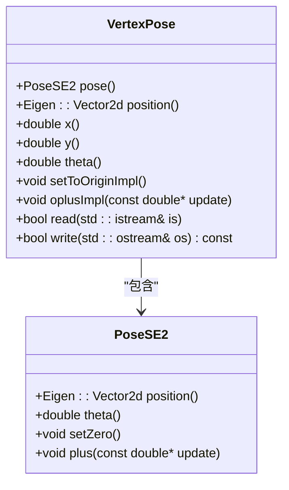
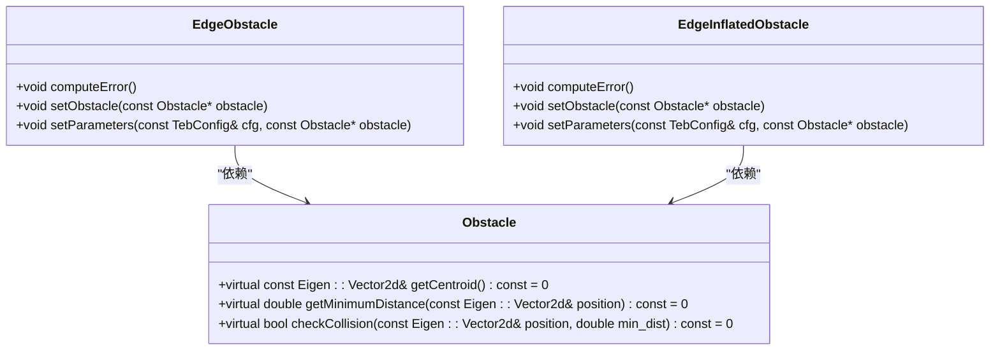
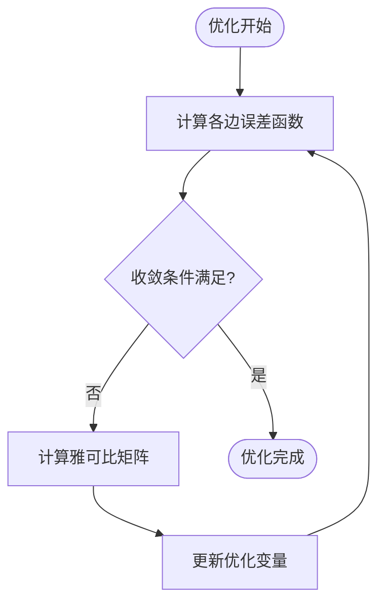
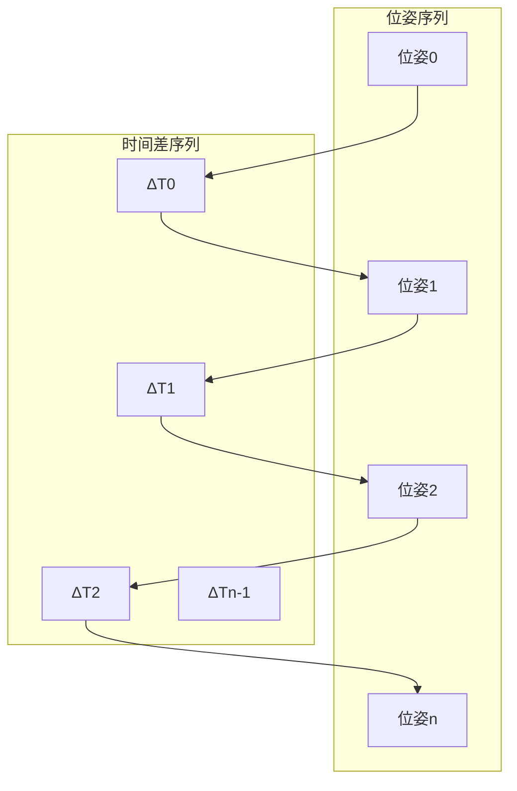

# G2O图优化理论基础

<cite>
**本文档引用的文件**  
- [vertex_pose.h](file://teb_local_planner/include/teb_local_planner/g2o_types/vertex_pose.h)
- [edge_obstacle.h](file://teb_local_planner/include/teb_local_planner/g2o_types/edge_obstacle.h)
- [timed_elastic_band.h](file://teb_local_planner/include/teb_local_planner/timed_elastic_band.h)
- [obstacles.h](file://teb_local_planner/include/teb_local_planner/obstacles.h)
- [teb_config.h](file://teb_local_planner/include/teb_local_planner/teb_config.h)
</cite>

## 目录
1. [引言](#引言)
2. [图优化基础理论](#图优化基础理论)
3. [位姿顶点建模](#位姿顶点建模)
4. [障碍物边建模](#障碍物边建模)
5. [优化目标函数构建](#优化目标函数构建)
6. [雅可比矩阵推导](#雅可比矩阵推导)
7. [图结构数学表示](#图结构数学表示)
8. [优化变量与约束](#优化变量与约束)
9. [TEB局部规划器中的应用](#teb局部规划器中的应用)
10. [总结](#总结)

## 引言

G2O（General Graph Optimization）图优化是一种将路径规划问题转化为非线性最小二乘问题的数学优化方法。在TEB（Timed Elastic Band）局部规划器中，该方法通过构建包含位姿顶点和障碍物边的图结构来实现路径优化。本文档详细阐述了G2O图优化在TEB局部规划器中的数学原理，重点解释位姿顶点和障碍物边的数学建模过程，包括误差函数的定义、雅可比矩阵的推导以及优化目标函数的构建。

**本节不分析具体源文件**

## 图优化基础理论

图优化将路径规划问题表示为一个图结构，其中顶点表示优化变量，边表示约束条件。在TEB局部规划器中，优化目标是最小化由多个成本函数组成的总成本。这些成本函数包括障碍物避让、运动学约束、时间最优性等。通过将路径规划问题转化为非线性最小二乘问题，可以利用高效的数值优化算法求解。

图优化的核心思想是将复杂的路径规划问题分解为一系列局部约束，这些约束通过图的边连接起来。每个约束对应一个误差函数，优化过程的目标是最小化所有误差函数的加权平方和。这种方法的优势在于可以灵活地添加和修改约束条件，同时保持优化问题的数学一致性。

**本节不分析具体源文件**

## 位姿顶点建模

位姿顶点（VertexPose）是图优化中的基本单元，用于表示机器人在特定时刻的位姿状态。在TEB局部规划器中，位姿顶点存储了SE2空间中的位姿信息，包括二维位置坐标（x, y）和航向角θ。

**图源**  
- [vertex_pose.h](file://teb_local_planner/include/teb_local_planner/g2o_types/vertex_pose.h#L1-L230)

**节源**  
- [vertex_pose.h](file://teb_local_planner/include/teb_local_planner/g2o_types/vertex_pose.h#L1-L230)

## 障碍物边建模

障碍物边（EdgeObstacle）定义了机器人与障碍物之间保持最小距离的成本函数。该边依赖于单个位姿顶点，其成本函数为：min penaltyBelow(dist2point) · weight，其中dist2point表示到障碍物的最小距离，weight为权重系数。

**图源**  
- [edge_obstacle.h](file://teb_local_planner/include/teb_local_planner/g2o_types/edge_obstacle.h#L1-L262)
- [obstacles.h](file://teb_local_planner/include/teb_local_planner/obstacles.h#L1-L799)

**节源**  
- [edge_obstacle.h](file://teb_local_planner/include/teb_local_planner/g2o_types/edge_obstacle.h#L1-L262)
- [obstacles.h](file://teb_local_planner/include/teb_local_planner/obstacles.h#L1-L799)

## 优化目标函数构建

TEB局部规划器的优化目标函数由多个成本项组成，每个成本项对应图中的一类边。总成本函数为所有边成本的加权平方和：

J(ξ) = Σ wi · ei(ξ)²

其中ξ表示优化变量向量，ei(ξ)表示第i个约束的误差函数，wi为对应的权重系数。在TEB中，主要的成本项包括：
- 障碍物避让成本
- 运动学约束成本
- 时间最优性成本
- 路径长度成本
- 速度约束成本

这些成本项通过图的边连接相应的顶点，形成一个完整的优化问题。通过调整各成本项的权重系数，可以控制规划器的行为特性，如更注重安全性还是效率。

**图源**  
- [edge_obstacle.h](file://teb_local_planner/include/teb_local_planner/g2o_types/edge_obstacle.h#L1-L262)
- [vertex_pose.h](file://teb_local_planner/include/teb_local_planner/g2o_types/vertex_pose.h#L1-L230)

**节源**  
- [edge_obstacle.h](file://teb_local_planner/include/teb_local_planner/g2o_types/edge_obstacle.h#L1-L262)
- [vertex_pose.h](file://teb_local_planner/include/teb_local_planner/g2o_types/vertex_pose.h#L1-L230)

## 雅可比矩阵推导

雅可比矩阵是优化过程中计算梯度的关键部分，它描述了误差函数对优化变量的偏导数。在TEB局部规划器中，雅可比矩阵的计算主要集中在障碍物边的实现中。

对于障碍物边，误差函数的雅可比矩阵计算涉及位置和方向的偏导数。具体来说，需要计算距离函数对机器人位置(x,y)和航向角θ的偏导数。这些偏导数反映了机器人位姿变化对与障碍物距离的影响程度。

在代码实现中，雅可比矩阵的计算被注释掉了，但保留了计算逻辑。这表明在实际应用中可能使用了数值微分或其他近似方法来计算梯度，以提高计算效率和数值稳定性。

**节源**  
- [edge_obstacle.h](file://teb_local_planner/include/teb_local_planner/g2o_types/edge_obstacle.h#L1-L262)

## 图结构数学表示

TEB局部规划器中的图结构由位姿序列Q = {si}i=0...n和时间差序列τ = {ΔTi}i=0...n-1组成，其中si = [xi, yi, βi]T表示机器人在第i个时刻的位姿，ΔTi表示从第i个位姿到第i+1个位姿所需的时间。

**图源**  
- [timed_elastic_band.h](file://teb_local_planner/include/teb_local_planner/timed_elastic_band.h#L1-L660)

**节源**  
- [timed_elastic_band.h](file://teb_local_planner/include/teb_local_planner/timed_elastic_band.h#L1-L660)

## 优化变量与约束

在TEB局部规划器中，优化变量包括位姿顶点和时间差顶点。位姿顶点表示机器人在特定时刻的状态，时间差顶点表示相邻位姿之间的时间间隔。

约束条件通过图的边来表达，主要包括：
- 障碍物约束：通过EdgeObstacle和EdgeInflatedObstacle实现
- 运动学约束：通过EdgeKinematics实现
- 加速度约束：通过EdgeAcceleration实现
- 速度约束：通过EdgeVelocity实现
- 时间最优性约束：通过EdgeTimeOptimal实现

这些约束共同作用，确保生成的轨迹既安全又高效。通过调整各约束的权重系数，可以平衡不同目标之间的关系。

**节源**  
- [timed_elastic_band.h](file://teb_local_planner/include/teb_local_planner/timed_elastic_band.h#L1-L660)
- [teb_config.h](file://teb_local_planner/include/teb_local_planner/teb_config.h#L1-L436)

## TEB局部规划器中的应用

在TEB局部规划器中，图优化被用于生成平滑、安全且时间最优的轨迹。规划器首先初始化一个初始轨迹，然后通过迭代优化不断改进轨迹质量。

轨迹初始化可以通过多种方式实现：
- 在起点和终点之间均匀采样
- 从参考路径生成
- 从全局规划器提供的路径初始化

优化过程中，规划器会自动调整轨迹的采样点数量，以适应不同的环境复杂度。当检测到障碍物时，规划器会增加轨迹的分辨率，以确保能够精确避障；当环境开阔时，规划器会减少采样点数量，以提高计算效率。

**节源**  
- [timed_elastic_band.h](file://teb_local_planner/include/teb_local_planner/timed_elastic_band.h#L1-L660)
- [teb_config.h](file://teb_local_planner/include/teb_local_planner/teb_config.h#L1-L436)

## 总结

G2O图优化为TEB局部规划器提供了一个强大的数学框架，使其能够将复杂的路径规划问题转化为可求解的非线性最小二乘问题。通过精心设计的位姿顶点和障碍物边模型，结合多种约束条件，TEB规划器能够生成高质量的局部轨迹。

该方法的优势在于其灵活性和可扩展性，可以方便地添加新的约束条件或修改现有约束的权重。同时，基于图的表示方法使得优化过程具有良好的数值稳定性和计算效率，适合在实时系统中应用。

**本节不分析具体源文件**