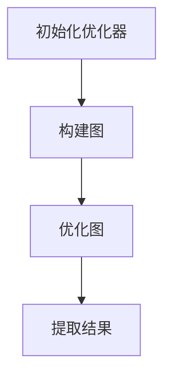

# G2O实践应用与扩展

<cite>
**本文档引用的文件**   
- [edge_time_optimal.h](file://teb_local_planner/include/teb_local_planner/g2o_types/edge_time_optimal.h)
- [teb_local_planner_ros.cpp](file://teb_local_planner/src/teb_local_planner_ros.cpp)
- [optimal_planner.cpp](file://teb_local_planner/src/optimal_planner.cpp)
- [optimal_planner.h](file://teb_local_planner/include/teb_local_planner/optimal_planner.h)
</cite>

## 目录
1. [引言](#引言)
2. [时间最优边的实现机制](#时间最优边的实现机制)
3. [G2O图的构建与优化流程](#g2o图的构建与优化流程)
4. [G2O集成的调试与性能优化](#g2o集成的调试与性能优化)
5. [自定义优化边与顶点的完整指南](#自定义优化边与顶点的完整指南)
6. [结论](#结论)

## 引言
本文档旨在深入探讨G2O在TEB局部规划器中的实践应用，重点分析`edge_time_optimal.h`中时间最优边的实现机制，并结合`teb_local_planner_ros.cpp`中的实际代码，展示G2O图的构建、优化求解器的配置和结果提取的完整流程。此外，本文档还提供G2O集成的调试方法和性能优化技巧，以及自定义优化边和顶点的完整指南，帮助开发者顺利扩展G2O功能以满足特定应用需求。

## 时间最优边的实现机制
`edge_time_optimal.h`文件定义了用于最小化轨迹过渡时间的成本函数。该边依赖于单个顶点`ΔT_i`，其目标是最小化`ΔT_i^2 * scale * weight`。其中，`scale`由`penaltyEquality()`函数确定，而`weight`可以通过`setInformation()`设置。该边的实现机制确保了轨迹的平滑性和时间最优性。

**Section sources**
- [edge_time_optimal.h](file://teb_local_planner/include/teb_local_planner/g2o_types/edge_time_optimal.h#L1-L117)

## G2O图的构建与优化流程
在`teb_local_planner_ros.cpp`中，G2O图的构建和优化流程包括以下几个步骤：
1. **初始化优化器**：通过`initOptimizer()`函数初始化G2O优化器，设置求解器参数。
2. **构建图**：通过`buildGraph()`函数添加顶点和边，构建优化问题的超图。
3. **优化图**：通过`optimizeGraph()`函数调用G2O框架进行优化，求解最优轨迹。
4. **提取结果**：从优化后的图中提取速度命令，用于控制机器人。

**Diagram sources **
- [teb_local_planner_ros.cpp](file://teb_local_planner/src/teb_local_planner_ros.cpp#L38-L78)
- [optimal_planner.cpp](file://teb_local_planner/src/optimal_planner.cpp#L156-L190)

**Section sources**
- [teb_local_planner_ros.cpp](file://teb_local_planner/src/teb_local_planner_ros.cpp#L38-L78)
- [optimal_planner.cpp](file://teb_local_planner/src/optimal_planner.cpp#L156-L190)

## G2O集成的调试与性能优化
为了确保G2O集成的稳定性和性能，开发者可以采取以下调试和优化技巧：
1. **稀疏矩阵处理**：利用G2O的稀疏矩阵求解器，减少内存占用和计算时间。
2. **求解器选择**：根据具体需求选择合适的求解器，如Levenberg-Marquardt算法。
3. **收敛性分析**：通过监控优化过程中的误差变化，确保优化过程的收敛性。

**Section sources**
- [optimal_planner.h](file://teb_local_planner/include/teb_local_planner/optimal_planner.h#L372-L385)

## 自定义优化边与顶点的完整指南
开发者可以通过以下步骤自定义优化边和顶点：
1. **定义新的边类**：继承`BaseTebUnaryEdge`或`BaseTebBinaryEdge`，实现`computeError()`和`linearizeOplus()`方法。
2. **注册新类型**：在`registerG2OTypes()`函数中注册新的边和顶点类型。
3. **添加到图中**：在`buildGraph()`函数中添加新的边和顶点。

**Section sources**
- [optimal_planner.cpp](file://teb_local_planner/src/optimal_planner.cpp#L156-L190)
- [optimal_planner.h](file://teb_local_planner/include/teb_local_planner/optimal_planner.h#L372-L385)

## 结论
本文档详细介绍了G2O在TEB局部规划器中的实践应用，包括时间最优边的实现机制、G2O图的构建与优化流程、调试与性能优化技巧，以及自定义优化边和顶点的完整指南。希望这些内容能帮助开发者更好地理解和应用G2O，以满足特定的应用需求。