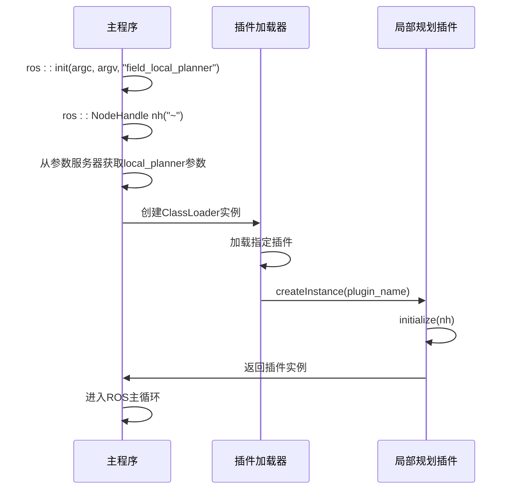
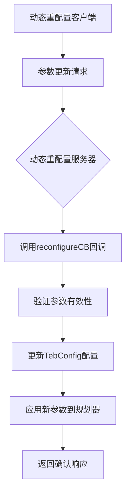

# ROS C++接口

<cite>
**本文档中引用的文件**   
- [teb_local_planner_ros.h](file://teb_local_planner/include/teb_local_planner/teb_local_planner_ros.h)
- [local_planner_node.cpp](file://field_local_planner/field_local_planner_ros/src/local_planner_node.cpp)
</cite>

## 目录
1. [引言](#引言)
2. [核心组件分析](#核心组件分析)
3. [ROS接口类设计](#ros接口类设计)
4. [节点实现与线程安全](#节点实现与线程安全)
5. [通信机制与消息类型](#通信机制与消息类型)
6. [参数管理与动态重配置](#参数管理与动态重配置)
7. [调试与性能分析工具](#调试与性能分析工具)
8. [最佳实践指南](#最佳实践指南)

## 引言
本文档深入探讨ROS C++接口在路径规划模块中的应用，重点分析teb_local_planner和field_local_planner两个关键组件的实现机制。文档详细解析了C++规划模块与ROS系统的集成方式，包括ROS接口类设计、节点实现、通信机制、参数管理以及调试工具的使用。通过分析teb_local_planner_ros.h中的接口类和local_planner_node.cpp中的节点实现，为开发者提供完整的ROS C++开发指导。

## 核心组件分析

本文档重点分析两个核心组件：teb_local_planner和field_local_planner。teb_local_planner实现了基于时间弹性带（Timed Elastic Band）的局部路径规划算法，通过优化方法生成平滑且安全的轨迹。field_local_planner则采用插件化架构，支持多种局部规划算法的动态加载和切换。这两个组件共同构成了ROS导航系统中的关键局部规划能力。

**本节来源**
- [teb_local_planner_ros.h](file://teb_local_planner/include/teb_local_planner/teb_local_planner_ros.h#L1-L50)
- [local_planner_node.cpp](file://field_local_planner/field_local_planner_ros/src/local_planner_node.cpp#L1-L10)

## ROS接口类设计

### TebLocalPlannerROS类架构
TebLocalPlannerROS类是teb_local_planner的核心接口实现，它同时继承了nav_core::BaseLocalPlanner和mbf_costmap_core::CostmapController两个抽象接口，使其能够兼容move_base和move_base_flex（MBF）两种导航框架。

```mermaid
classDiagram
class TebLocalPlannerROS {
+TebLocalPlannerROS()
+~TebLocalPlannerROS()
+initialize(name, tf, costmap_ros)
+setPlan(orig_global_plan)
+computeVelocityCommands(cmd_vel)
+computeVelocityCommands(pose, velocity, cmd_vel, message)
+isGoalReached()
+cancel()
+tfPoseToEigenVector2dTransRot(tf_vel)
+getRobotFootprintFromParamServer(nh, config)
+makeFootprintFromXMLRPC(footprint_xmlrpc, full_param_name)
+getNumberFromXMLRPC(value, full_param_name)
}
class nav_core : : BaseLocalPlanner {
+initialize(name, tf, costmap_ros)
+setPlan(plan)
+computeVelocityCommands(cmd_vel)
+isGoalReached()
}
class mbf_costmap_core : : CostmapController {
+computeVelocityCommands(pose, velocity, cmd_vel, message)
+isGoalReached(xy_tolerance, yaw_tolerance)
+cancel()
}
TebLocalPlannerROS --|> nav_core : : BaseLocalPlanner : "实现"
TebLocalPlannerROS --|> mbf_costmap_core : : CostmapController : "实现"
```

**图表来源**
- [teb_local_planner_ros.h](file://teb_local_planner/include/teb_local_planner/teb_local_planner_ros.h#L92-L450)

### 接口方法详解
TebLocalPlannerROS提供了完整的局部规划器接口实现：

1. **初始化方法**：`initialize()`方法接收ROS节点名称、TF缓冲区指针和成本地图ROS包装器，完成规划器的初始化配置。

2. **路径设置方法**：`setPlan()`方法接收全局规划路径作为输入，为局部规划器提供参考轨迹。

3. **速度命令计算**：提供两个版本的`computeVelocityCommands()`方法，分别兼容传统move_base接口和MBF接口，计算并返回机器人应执行的速度命令。

4. **目标检测**：`isGoalReached()`方法检查机器人是否已到达目标位置。

5. **取消操作**：`cancel()`方法用于请求规划器取消当前任务。

**本节来源**
- [teb_local_planner_ros.h](file://teb_local_planner/include/teb_local_planner/teb_local_planner_ros.h#L100-L200)

## 节点实现与线程安全

### 节点主程序结构
field_local_planner的节点实现采用插件化设计模式，通过pluginlib库实现动态加载和实例化不同的局部规划算法插件。



**图表来源**
- [local_planner_node.cpp](file://field_local_planner/field_local_planner_ros/src/local_planner_node.cpp#L1-L50)

### 线程安全机制
TebLocalPlannerROS类在多线程环境下通过以下机制保障线程安全：

1. **互斥锁保护**：使用boost::mutex保护共享数据结构，如自定义障碍物消息和途经点容器。

2. **回调函数同步**：在ROS回调函数中使用互斥锁确保数据访问的原子性。

3. **状态标志管理**：通过布尔标志（如custom_via_points_active_）协调不同线程间的状态同步。

4. **原子操作**：对简单的状态变量（如goal_reached_）使用原子操作确保读写一致性。

这些机制共同确保了在ROS多线程环境下的数据一致性和系统稳定性。

**本节来源**
- [teb_local_planner_ros.h](file://teb_local_planner/include/teb_local_planner/teb_local_planner_ros.h#L350-L400)

## 通信机制与消息类型

### 话题通信设计
TebLocalPlannerROS通过多种ROS话题与导航系统其他组件通信：

1. **输入话题**：
   - 自定义障碍物话题：接收costmap_converter::ObstacleArrayMsg类型的消息
   - 自定义途经点话题：接收nav_msgs::Path类型的消息

2. **输出话题**：
   - 可视化消息：发布visualization_msgs::MarkerArray用于RViz可视化
   - 路径消息：发布nav_msgs::Path用于显示规划轨迹

### 服务与参数服务器
1. **动态重配置**：通过dynamic_reconfigure服务器实现参数的实时调整，无需重启节点。

2. **参数服务器**：从ROS参数服务器读取规划器配置参数，包括机器人尺寸、速度限制、优化权重等。

3. **TF变换**：依赖tf2_ros::Buffer获取坐标变换，实现不同坐标系间的数据转换。

### 消息类型定义
规划模块使用的主要ROS消息类型包括：

- geometry_msgs::Twist：速度命令消息
- geometry_msgs::PoseStamped：位姿消息
- nav_msgs::Path：路径消息
- nav_msgs::Odometry：里程计消息
- visualization_msgs::MarkerArray：可视化标记数组

**本节来源**
- [teb_local_planner_ros.h](file://teb_local_planner/include/teb_local_planner/teb_local_planner_ros.h#L50-L90)

## 参数管理与动态重配置

### 配置参数结构
TebLocalPlannerROS使用TebConfig类集中管理所有配置参数，包括：

1. **机器人参数**：最大速度、加速度、转向角限制等
2. **规划参数**：时间分辨率、轨迹点数、优化权重等
3. **障碍物参数**：最小安全距离、障碍物膨胀半径等
4. **目标参数**：目标容差、停止条件等

### 动态重配置实现
动态重配置通过以下步骤实现：

1. **服务器初始化**：创建dynamic_reconfigure::Server实例
2. **回调函数注册**：注册reconfigureCB回调函数处理参数更新
3. **参数验证**：在回调函数中验证新参数的有效性
4. **配置更新**：将新参数应用到TebConfig实例中



**图表来源**
- [teb_local_planner_ros.h](file://teb_local_planner/include/teb_local_planner/teb_local_planner_ros.h#L300-L320)

## 调试与性能分析工具

### rosbag记录与回放
rosbag工具可用于记录和回放ROS系统运行时的数据，为调试提供重要支持：

1. **数据记录**：记录传感器数据、规划结果、控制命令等关键信息
2. **问题复现**：通过回放记录的数据复现特定问题场景
3. **算法验证**：在相同输入条件下测试不同算法版本的性能
4. **性能分析**：分析系统各组件的响应时间和数据处理延迟

### rqt工具链应用
rqt提供了一系列图形化工具用于系统监控和调试：

1. **rqt_graph**：可视化ROS节点和话题的连接关系
2. **rqt_plot**：实时绘制数值数据的变化曲线
3. **rqt_console**：查看和过滤ROS日志消息
4. **rqt_reconfigure**：动态调整节点参数
5. **rqt_topic**：监控话题消息的发布和订阅情况

### 内置调试功能
TebLocalPlannerROS内置了多种调试功能：

1. **可视化**：通过TebVisualization类发布各种可视化标记
2. **日志输出**：使用ROS_INFO、ROS_WARN等宏输出调试信息
3. **故障检测**：FailureDetector类用于检测机器人是否卡住
4. **性能统计**：记录规划失败次数、振荡检测时间等指标

**本节来源**
- [teb_local_planner_ros.h](file://teb_local_planner/include/teb_local_planner/teb_local_planner_ros.h#L400-L450)

## 最佳实践指南

### ROS消息处理最佳实践
1. **消息队列管理**：合理设置消息队列大小，避免数据丢失或内存溢出
2. **回调函数优化**：保持回调函数简洁高效，避免长时间阻塞
3. **数据同步**：使用message_filters实现多传感器数据的时间同步
4. **异常处理**：在消息处理中添加适当的异常处理机制

### 性能优化建议
1. **计算负载均衡**：将计算密集型任务分配到合适的线程
2. **内存管理**：避免频繁的内存分配和释放操作
3. **算法复杂度**：选择适合实时性要求的算法复杂度
4. **缓存机制**：对重复计算的结果进行缓存

### 系统集成建议
1. **接口标准化**：遵循ROS导航堆栈的接口规范
2. **参数化设计**：将可配置项通过参数服务器暴露
3. **模块化架构**：采用插件化设计提高系统的可扩展性
4. **错误恢复**：实现健壮的错误检测和恢复机制

**本节来源**
- [teb_local_planner_ros.h](file://teb_local_planner/include/teb_local_planner/teb_local_planner_ros.h#L1-L458)
- [local_planner_node.cpp](file://field_local_planner/field_local_planner_ros/src/local_planner_node.cpp#L1-L50)