# ROS通信机制

<cite>
**本文档引用的文件**
- [teb_local_planner_ros.h](file://teb_local_planner/include/teb_local_planner/teb_local_planner_ros.h)
- [teb_local_planner_ros.cpp](file://teb_local_planner/src/teb_local_planner_ros.cpp)
- [visualization.h](file://teb_local_planner/include/teb_local_planner/visualization.h)
- [visualization.cpp](file://teb_local_planner/src/visualization.cpp)
- [teb_config.h](file://teb_local_planner/include/teb_local_planner/teb_config.h)
- [teb_config.cpp](file://teb_local_planner/src/teb_config.cpp)
</cite>

## 目录
1. [引言](#引言)
2. [局部规划器通信接口设计](#局部规划器通信接口设计)
3. [订阅者与发布者机制](#订阅者与发布者机制)
4. [服务调用机制](#服务调用机制)
5. [回调函数与多线程执行](#回调函数与多线程执行)
6. [消息同步与时间戳处理](#消息同步与时间戳处理)
7. [可视化与调试接口](#可视化与调试接口)
8. [参数配置与动态重配置](#参数配置与动态重配置)
9. [故障检测与恢复机制](#故障检测与恢复机制)
10. [总结](#总结)

## 引言
TEB（Timed Elastic Band）局部规划器是ROS导航栈中的一个重要组件，它通过优化方法生成平滑且时间最优的轨迹。本文档详细解析teb_local_planner_ros.h中定义的通信机制，重点介绍订阅者和发布者接口设计，以及如何实现高效的局部路径规划。

## 局部规划器通信接口设计
TEB局部规划器实现了nav_core::BaseLocalPlanner和mbf_costmap_core::CostmapController两个抽象接口，使其能够在move_base和move_base_flex（MBF）中使用。

```mermaid
classDiagram
class TebLocalPlannerROS {
+TebLocalPlannerROS()
+~TebLocalPlannerROS()
+initialize(name, tf, costmap_ros)
+setPlan(orig_global_plan)
+computeVelocityCommands(cmd_vel)
+isGoalReached()
+reconfigureCB(config, level)
+customObstacleCB(obst_msg)
+customViaPointsCB(via_points_msg)
}
class nav_core : : BaseLocalPlanner {
<<interface>>
+initialize(name, tf, costmap_ros)
+setPlan(orig_global_plan)
+computeVelocityCommands(cmd_vel)
+isGoalReached()
}
class mbf_costmap_core : : CostmapController {
<<interface>>
+computeVelocityCommands(pose, velocity, cmd_vel, message)
+isGoalReached(xy_tolerance, yaw_tolerance)
+cancel()
}
TebLocalPlannerROS --|> nav_core : : BaseLocalPlanner
TebLocalPlannerROS --|> mbf_costmap_core : : CostmapController
```

**图源**
- [teb_local_planner_ros.h](file://teb_local_planner/include/teb_local_planner/teb_local_planner_ros.h#L78-L450)

**本节源码**
- [teb_local_planner_ros.h](file://teb_local_planner/include/teb_local_planner/teb_local_planner_ros.h#L78-L450)

## 订阅者与发布者机制
TEB局部规划器通过订阅多个话题来获取环境信息，并向控制接口发布速度指令。

### 订阅者接口
局部规划器订阅以下话题：
- /cmd_vel：接收速度命令
- /odom：获取里程计信息
- /tf：获取坐标变换信息

```mermaid
flowchart TD
A[/cmd_vel] --> B(TebLocalPlannerROS)
C[/odom] --> B
D[/tf] --> B
E[Custom Obstacles] --> B
F[Via Points] --> B
B --> G[/cmd_vel_out]
B --> H[Visualization Topics]
```

**图源**
- [teb_local_planner_ros.h](file://teb_local_planner/include/teb_local_planner/teb_local_planner_ros.h#L427-L454)

**本节源码**
- [teb_local_planner_ros.h](file://teb_local_planner/include/teb_local_planner/teb_local_planner_ros.h#L427-L454)
- [teb_local_planner_ros.cpp](file://teb_local_planner/src/teb_local_planner_ros.cpp#L92-L134)

### 发布者接口
局部规划器向以下话题发布信息：
- /cmd_vel_out：发布控制指令
- /global_plan：发布全局路径
- /local_plan：发布局部路径
- /teb_markers：发布可视化标记

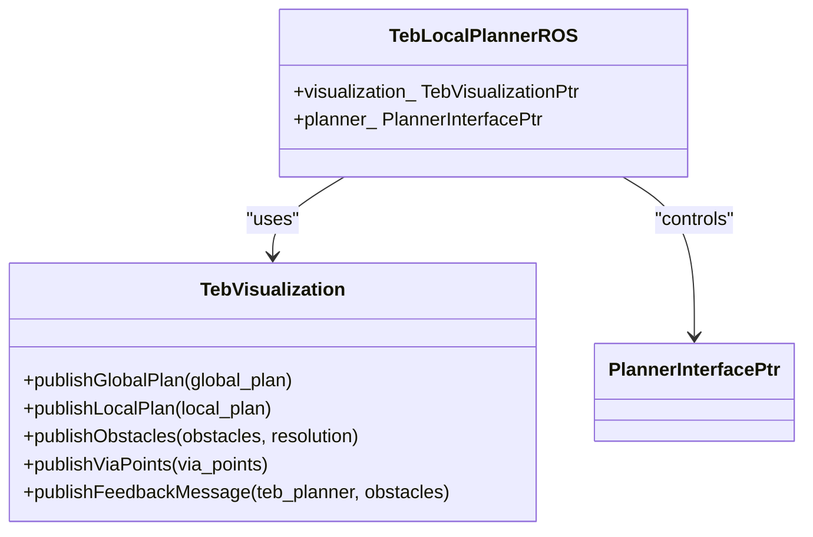

**图源**
- [visualization.h](file://teb_local_planner/include/teb_local_planner/visualization.h#L74-L121)
- [visualization.cpp](file://teb_local_planner/src/visualization.cpp#L38-L85)

**本节源码**
- [visualization.h](file://teb_local_planner/include/teb_local_planner/visualization.h#L74-L121)
- [visualization.cpp](file://teb_local_planner/src/visualization.cpp#L38-L85)

## 服务调用机制
TEB局部规划器通过服务调用机制实现路径请求和状态查询功能。

### 路径规划服务
局部规划器实现了move_base_msgs::GetPlan服务，用于获取从当前位置到目标位置的路径。

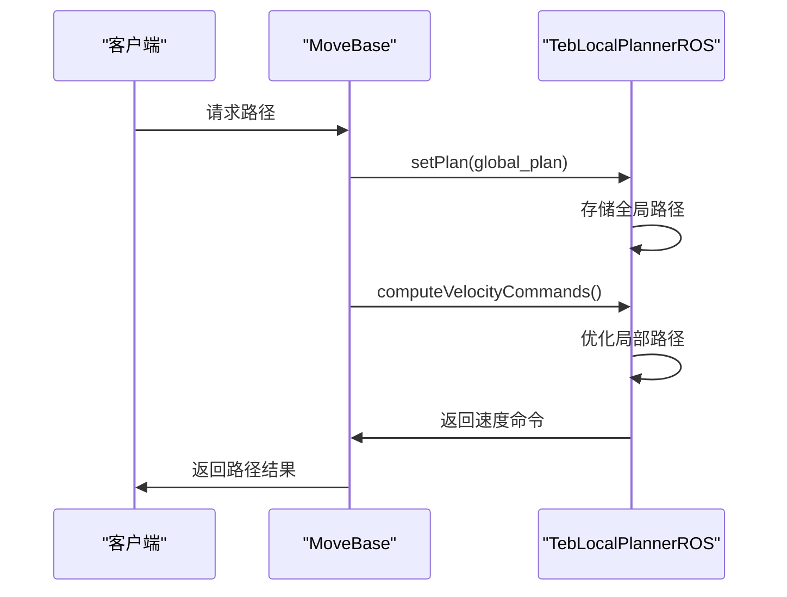

**图源**
- [teb_local_planner_ros.h](file://teb_local_planner/include/teb_local_planner/teb_local_planner_ros.h#L128-L156)
- [teb_local_planner_ros.cpp](file://teb_local_planner/src/teb_local_planner_ros.cpp#L202-L246)

**本节源码**
- [teb_local_planner_ros.h](file://teb_local_planner/include/teb_local_planner/teb_local_planner_ros.h#L128-L156)
- [teb_local_planner_ros.cpp](file://teb_local_planner/src/teb_local_planner_ros.cpp#L202-L246)

### 状态查询服务
局部规划器提供isGoalReached()方法，用于检查是否已到达目标位置。

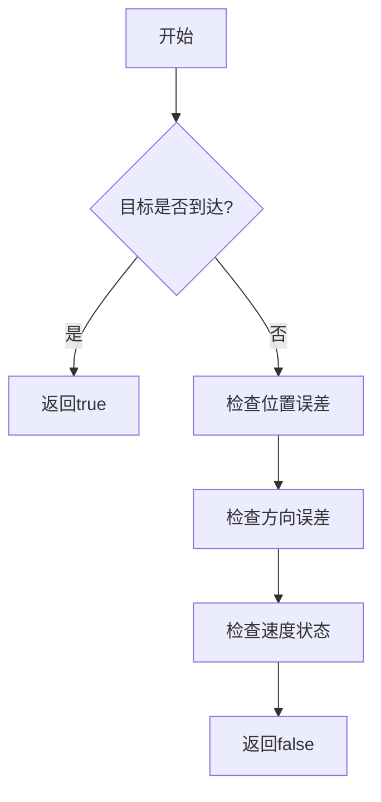

**本节源码**
- [teb_local_planner_ros.h](file://teb_local_planner/include/teb_local_planner/teb_local_planner_ros.h#L110-L115)
- [teb_local_planner_ros.cpp](file://teb_local_planner/src/teb_local_planner_ros.cpp#L580-L590)

## 回调函数与多线程执行
TEB局部规划器采用回调函数机制处理异步事件，并通过多线程执行器确保实时性能。

### 回调函数队列管理
局部规划器使用ROS的回调队列管理机制，确保消息处理的及时性。

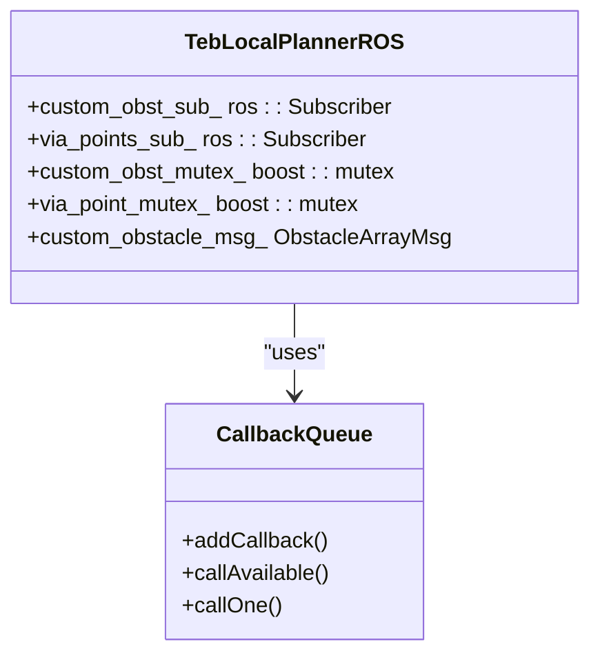

**本节源码**
- [teb_local_planner_ros.h](file://teb_local_planner/include/teb_local_planner/teb_local_planner_ros.h#L427-L454)

### 多线程执行器配置
局部规划器通过配置多线程执行器来提高性能。

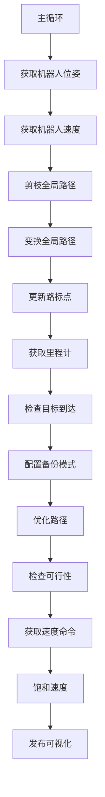

**本节源码**
- [teb_local_planner_ros.cpp](file://teb_local_planner/src/teb_local_planner_ros.cpp#L248-L600)

## 消息同步与时间戳处理
TEB局部规划器采用精确的时间戳处理机制，确保传感器数据与规划周期的同步。

### 时间戳同步策略
局部规划器使用tf2库进行坐标变换，确保不同传感器数据的时间一致性。

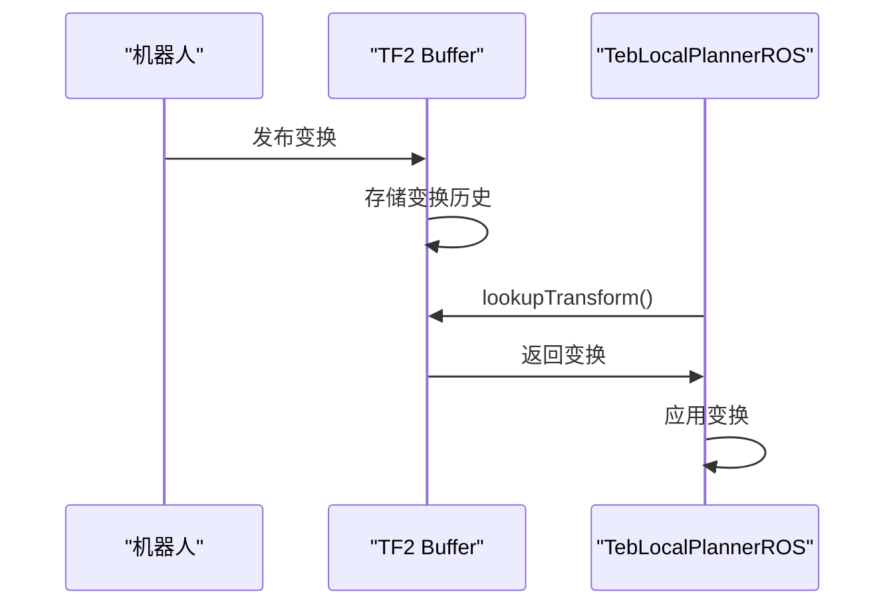

**本节源码**
- [teb_local_planner_ros.cpp](file://teb_local_planner/src/teb_local_planner_ros.cpp#L300-L320)

### 传感器数据同步
局部规划器通过时间戳对齐不同传感器的数据。

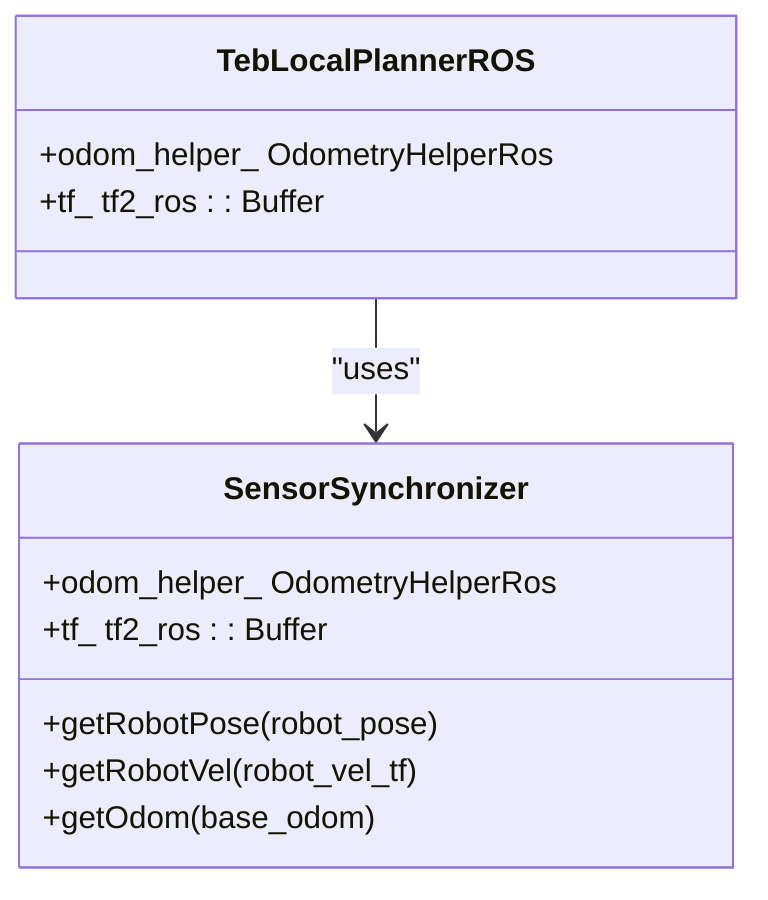

**本节源码**
- [teb_local_planner_ros.h](file://teb_local_planner/include/teb_local_planner/teb_local_planner_ros.h#L427-L454)
- [teb_local_planner_ros.cpp](file://teb_local_planner/src/teb_local_planner_ros.cpp#L270-L280)

## 可视化与调试接口
TEB局部规划器提供丰富的可视化和调试接口，便于开发和调试。

### 可视化话题
局部规划器发布多个可视化话题，用于RViz显示。

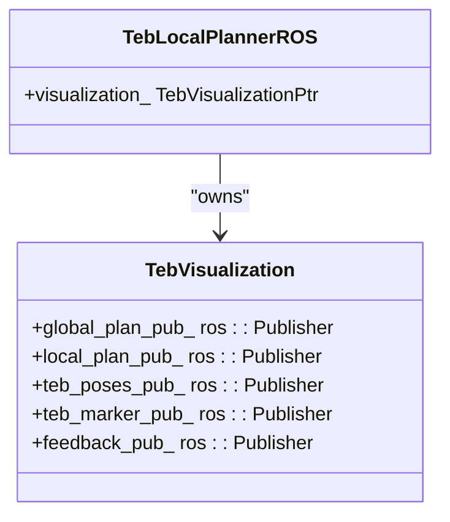

**图源**
- [visualization.cpp](file://teb_local_planner/src/visualization.cpp#L38-L85)

**本节源码**
- [visualization.cpp](file://teb_local_planner/src/visualization.cpp#L38-L85)

### 调试反馈消息
局部规划器发布反馈消息，包含轨迹、速度剖面和障碍物信息。

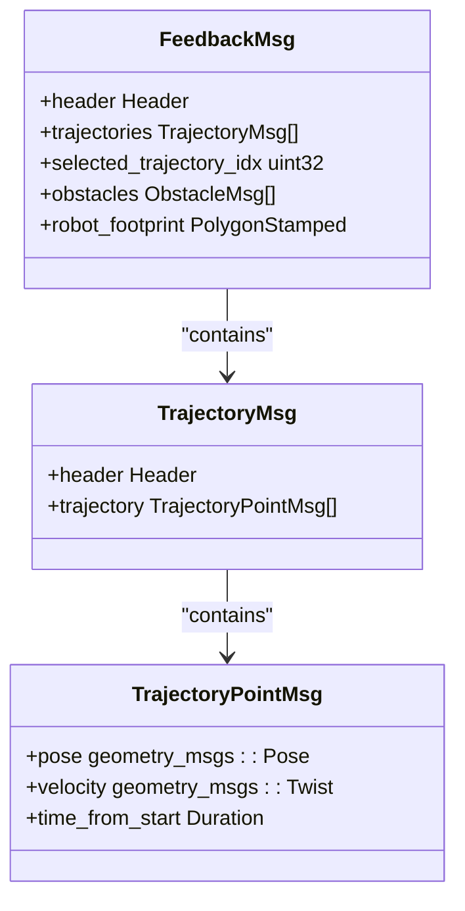

**本节源码**
- [visualization.h](file://teb_local_planner/include/teb_local_planner/visualization.h#L206-L238)

## 参数配置与动态重配置
TEB局部规划器支持通过参数服务器和动态重配置进行参数调整。

### 参数配置机制
局部规划器使用TebConfig类管理所有参数。

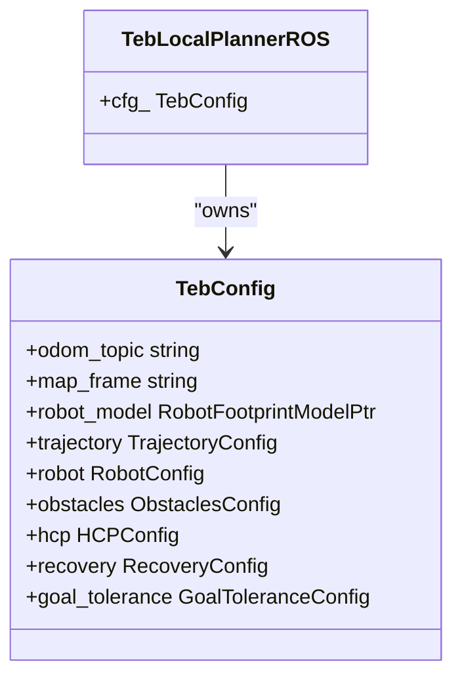

**图源**
- [teb_config.h](file://teb_local_planner/include/teb_local_planner/teb_config.h#L26-L68)

**本节源码**
- [teb_config.h](file://teb_local_planner/include/teb_local_planner/teb_config.h#L26-L68)
- [teb_config.cpp](file://teb_local_planner/src/teb_config.cpp#L40-L60)

### 动态重配置
局部规划器支持运行时动态调整参数。

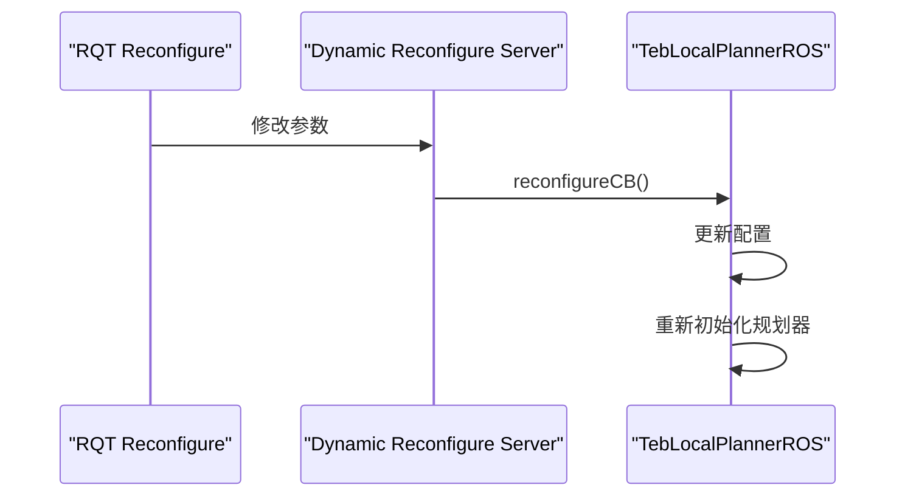

**本节源码**
- [teb_local_planner_ros.h](file://teb_local_planner/include/teb_local_planner/teb_local_planner_ros.h#L158-L167)
- [teb_local_planner_ros.cpp](file://teb_local_planner/src/teb_local_planner_ros.cpp#L170-L180)

## 故障检测与恢复机制
TEB局部规划器内置了故障检测和恢复机制，确保系统的鲁棒性。

### 故障检测
局部规划器检测多种故障情况，包括轨迹发散、不可行路径等。

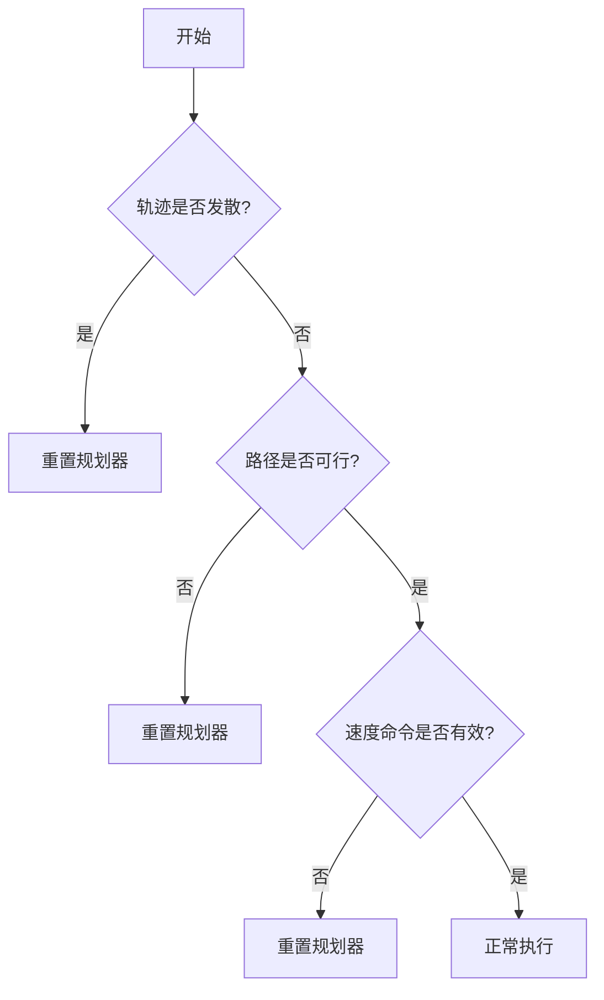

**本节源码**
- [teb_local_planner_ros.cpp](file://teb_local_planner/src/teb_local_planner_ros.cpp#L360-L427)

### 恢复策略
局部规划器提供多种恢复策略，包括缩小规划视界等。

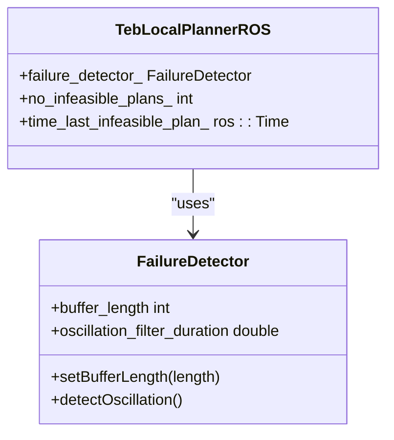

**本节源码**
- [teb_local_planner_ros.h](file://teb_local_planner/include/teb_local_planner/teb_local_planner_ros.h#L427-L454)
- [teb_local_planner_ros.cpp](file://teb_local_planner/src/teb_local_planner_ros.cpp#L931-L954)

## 总结
TEB局部规划器通过精心设计的通信机制，实现了高效的局部路径规划。其订阅者-发布者模式、服务调用机制、回调函数队列管理和多线程执行器配置，确保了系统的实时性和鲁棒性。同时，丰富的可视化和调试接口，以及灵活的参数配置机制，为开发和调试提供了便利。