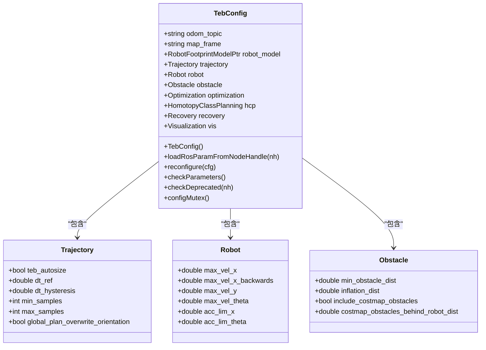
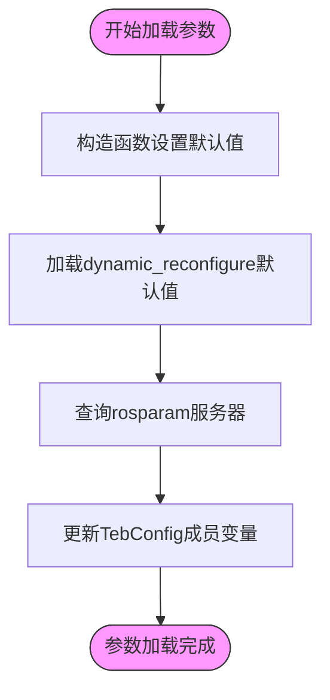
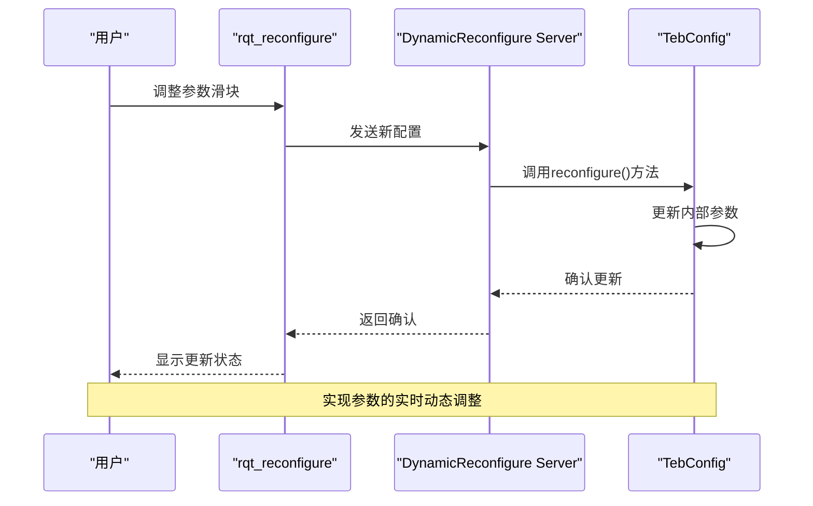

# 开发实践与调试

<cite>
**本文档引用的文件**  
- [teb_config.h](file://teb_local_planner/include/teb_local_planner/teb_config.h)
- [teb_config.cpp](file://teb_local_planner/src/teb_config.cpp)
- [TebLocalPlannerReconfigure.cfg](file://teb_local_planner/cfg/TebLocalPlannerReconfigure.cfg)
- [teb_local_planner_ros.cpp](file://teb_local_planner/src/teb_local_planner_ros.cpp)
- [package.xml](file://teb_local_planner/package.xml)
- [CMakeLists.txt](file://teb_local_planner/CMakeLists.txt)
</cite>

## 目录
1. [引言](#引言)
2. [参数服务器与动态重配置机制](#参数服务器与动态重配置机制)
3. [teb_config.h 参数类设计模式](#teb_configh-参数类设计模式)
4. [YAML 配置文件加载流程](#yaml-配置文件加载流程)
5. [rqt_reconfigure 动态调参工作流](#rqt_reconfigure-动态调参工作流)
6. [rosbag 数据记录与回放](#rosbag-数据记录与回放)
7. [系统监控与性能分析](#系统监控与性能分析)
8. [C++ 单元测试实践](#c-单元测试实践)
9. [结论](#结论)

## 引言
本文档深入探讨ROS C++开发中的关键实践，重点围绕teb_local_planner模块的参数管理机制展开。详细解析参数服务器的使用、动态重配置的实现原理，以及teb_config.h中参数类的设计模式。同时涵盖rosbag数据记录、rqt工具链监控、C++单元测试等核心调试技术，为机器人算法开发提供完整的工程实践指导。

## 参数服务器与动态重配置机制

ROS参数服务器是节点间共享配置数据的核心机制，支持静态参数加载和动态运行时调整。teb_local_planner通过结合rosparam和dynamic_reconfigure实现灵活的参数管理。

动态重配置（dynamic_reconfigure）允许在不重启节点的情况下修改参数，特别适用于算法调优。该机制通过生成配置服务器，将GUI工具（如rqt_reconfigure）与节点内部参数同步，实现参数的实时更新。

**Section sources**
- [teb_config.h](file://teb_local_planner/include/teb_local_planner/teb_config.h#L231-L251)
- [teb_local_planner_ros.cpp](file://teb_local_planner/src/teb_local_planner_ros.cpp#L76-L90)

## teb_config.h 参数类设计模式

`TebConfig`类是teb_local_planner的配置核心，采用集中式设计模式管理所有算法参数。该类封装了轨迹规划、机器人动力学、障碍物处理等多个模块的配置项。



**Diagram sources**
- [teb_config.h](file://teb_local_planner/include/teb_local_planner/teb_config.h#L68-L397)

**Section sources**
- [teb_config.h](file://teb_local_planner/include/teb_local_planner/teb_config.h#L26-L68)

## YAML 配置文件加载流程

参数加载遵循优先级顺序：构造函数默认值 < dynamic_reconfigure默认值 < rosparam服务器值。通过`loadRosParamFromNodeHandle()`方法从NodeHandle加载YAML配置。

YAML文件中的参数层级与TebConfig类结构对应，例如：
```yaml
odom_topic: "odom"
map_frame: "map"
trajectory:
  teb_autosize: true
  dt_ref: 0.3
  min_samples: 3
robot:
  max_vel_x: 0.5
  max_vel_theta: 0.8
```

加载过程通过`nh.param()`系列方法实现，支持默认值回退机制。若参数未在YAML中定义，则保持构造函数中的默认值。



**Diagram sources**
- [teb_config.cpp](file://teb_local_planner/src/teb_config.cpp#L40-L60)

**Section sources**
- [teb_config.cpp](file://teb_local_planner/src/teb_config.cpp#L40-L60)

## rqt_reconfigure 动态调参工作流

动态重配置工作流包含以下步骤：

1. **配置定义**：在`.cfg`文件中定义可调参数及其类型、范围
2. **服务器注册**：节点初始化时创建dynamic_reconfigure服务器
3. **回调连接**：服务器回调函数连接到`TebConfig::reconfigure()`
4. **实时更新**：GUI操作触发参数更新并同步到算法



**Diagram sources**
- [teb_config.h](file://teb_local_planner/include/teb_local_planner/teb_config.h#L397-L434)
- [teb_local_planner_ros.cpp](file://teb_local_planner/src/teb_local_planner_ros.cpp#L76-L90)

**Section sources**
- [TebLocalPlannerReconfigure.cfg](file://teb_local_planner/cfg/TebLocalPlannerReconfigure.cfg)
- [teb_local_planner_ros.cpp](file://teb_local_planner/src/teb_local_planner_ros.cpp#L76-L90)

## rosbag 数据记录与回放

rosbag是ROS中用于记录和回放话题数据的核心工具，广泛应用于算法验证和调试。

### 记录策略
```bash
# 记录关键导航话题
rosbag record /tf /tf_static /scan /odom /move_base_simple/goal /planner/plan
```

### 回放验证
```bash
# 回放数据用于算法测试
rosbag play recorded_data.bag --clock
```

关键消息类型记录策略：
- `/tf` 和 `/tf_static`：坐标变换数据
- `/scan`：激光雷达扫描数据
- `/odom`：里程计信息
- `/planner/plan`：全局/局部路径
- `/cmd_vel`：控制指令

**Section sources**
- [package.xml](file://teb_local_planner/package.xml)
- [requirements.txt](file://AEMCARL/attachments/ros_ws/requirements.txt#L139)

## 系统监控与性能分析

### rqt_graph 可视化
使用`rqt_graph`监控节点间通信拓扑，验证：
- 节点连接正确性
- 话题发布/订阅关系
- TF树完整性

### rqt_plot 数据分析
通过`rqt_plot`实时绘制关键变量：
- 机器人速度（`/odom`中的vx, vy, vtheta）
- 轨迹误差
- 控制指令变化
- 优化代价函数值


**Section sources**
- [requirements.txt](file://AEMCARL/attachments/ros_ws/requirements.txt#L139)

## C++ 单元测试实践

使用rosunit进行C++单元测试，验证核心算法模块的正确性。

测试框架配置：
```xml
<!-- package.xml -->
<test_depend>rosunit</test_depend>
```

```cmake
# CMakeLists.txt
find_package(catkin REQUIRED COMPONENTS rostest rosunit)
catkin_add_gtest(test_teb_basics test/teb_basics.cpp)
target_link_libraries(test_teb_basics ${catkin_LIBRARIES})
```

测试内容包括：
- 轨迹优化求解器验证
- 障碍物距离计算
- 动力学约束检查
- 路径可行性验证

**Section sources**
- [CMakeLists.txt](file://teb_local_planner/CMakeLists.txt)
- [package.xml](file://teb_local_planner/package.xml)
- [test/teb_basics.cpp](file://teb_local_planner/test/teb_basics.cpp)

## 结论
本文档系统阐述了ROS C++开发中的核心实践方法。teb_local_planner通过`TebConfig`类实现了结构化的参数管理，结合YAML配置和dynamic_reconfigure提供了灵活的调参机制。rosbag数据记录与rqt工具链为算法验证提供了完整解决方案，而rosunit确保了代码质量。这些实践共同构成了机器人软件开发的标准化工作流程，显著提升了开发效率和系统可靠性。