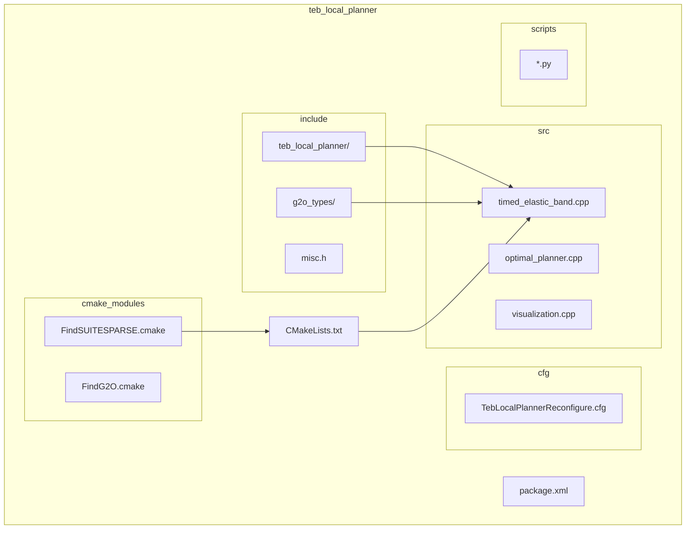
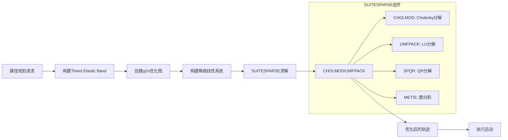
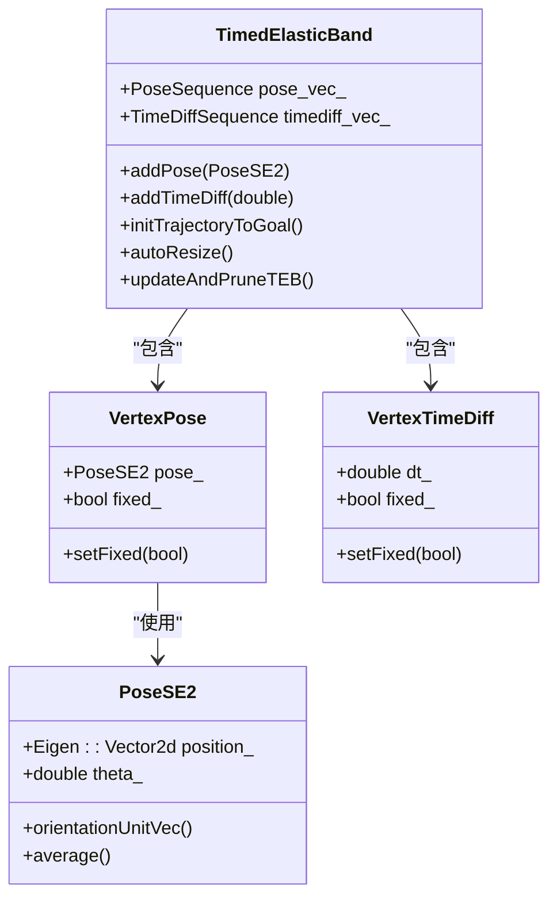
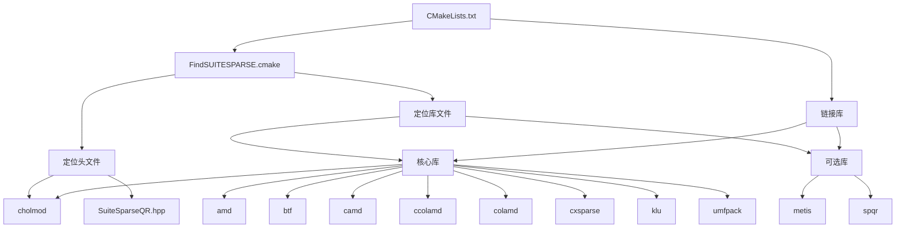

# SUITESPARSE稀疏求解器

<cite>
**本文档中引用的文件**   
- [timed_elastic_band.cpp](file://teb_local_planner/src/timed_elastic_band.cpp)
- [CMakeLists.txt](file://teb_local_planner/CMakeLists.txt)
- [FindSUITESPARSE.cmake](file://teb_local_planner/cmake_modules/FindSUITESPARSE.cmake)
</cite>

## 目录
1. [简介](#简介)
2. [项目结构](#项目结构)
3. [核心组件](#核心组件)
4. [架构概述](#架构概述)
5. [详细组件分析](#详细组件分析)
6. [依赖分析](#依赖分析)
7. [性能考虑](#性能考虑)
8. [故障排除指南](#故障排除指南)
9. [结论](#结论)

## 简介
本文档深入探讨SUITESPARSE稀疏求解器在TEB（Timed Elastic Band）算法中的关键作用。重点介绍SUITESPARSE如何高效求解大规模稀疏线性系统，结合timed_elastic_band.cpp中的优化求解过程说明稀疏矩阵的构建和求解流程。文档详细阐述CHOLMOD和UMFPACK等SUITESPARSE组件在不同求解场景下的性能特点，提供求解器配置和调优指南。同时说明CMakeLists.txt中SUITESPARSE依赖管理的最佳实践，包括版本兼容性和跨平台编译注意事项，并为开发者提供性能监控和瓶颈分析的方法，帮助优化求解器的运行效率。

## 项目结构
TEB局部规划器项目采用标准的ROS包结构，核心功能集中在teb_local_planner目录下。该包通过CMakeLists.txt和package.xml文件管理依赖关系，其中SUITESPARSE作为关键的数值计算依赖被明确声明。项目包含多个子目录：include目录存放头文件，src目录包含核心实现代码，cmake_modules目录包含自定义的CMake查找模块，特别是用于定位SUITESPARSE库的FindSUITESPARSE.cmake文件。



**图示来源**
- [CMakeLists.txt](file://teb_local_planner/CMakeLists.txt#L1-L285)
- [FindSUITESPARSE.cmake](file://teb_local_planner/cmake_modules/FindSUITESPARSE.cmake#L1-L134)

**本节来源**
- [CMakeLists.txt](file://teb_local_planner/CMakeLists.txt#L1-L285)
- [FindSUITESPARSE.cmake](file://teb_local_planner/cmake_modules/FindSUITESPARSE.cmake#L1-L134)

## 核心组件
SUITESPARSE稀疏求解器在TEB算法中扮演着至关重要的角色，主要负责求解由优化问题构建的大型稀疏线性系统。在TEB局部规划器中，优化过程将路径规划问题转化为一个非线性最小二乘问题，该问题通过g2o框架进行建模，最终需要求解一个稀疏的线性方程组。SUITESPARSE提供的CHOLMOD和UMFPACK等组件为这一求解过程提供了高效的数值计算支持。

**本节来源**
- [timed_elastic_band.cpp](file://teb_local_planner/src/timed_elastic_band.cpp#L1-L635)
- [CMakeLists.txt](file://teb_local_planner/CMakeLists.txt#L1-L285)

## 架构概述
TEB局部规划器的架构围绕稀疏优化展开，SUITESPARSE作为底层数值计算引擎，与g2o优化框架紧密集成。系统首先通过timed_elastic_band.cpp中的代码构建优化问题的图结构，然后将该问题转化为稀疏线性系统，最后调用SUITESPARSE提供的求解器进行高效求解。这种架构设计充分利用了路径规划问题固有的稀疏性，实现了实时性能和路径质量的平衡。



**图示来源**
- [timed_elastic_band.cpp](file://teb_local_planner/src/timed_elastic_band.cpp#L1-L635)
- [CMakeLists.txt](file://teb_local_planner/CMakeLists.txt#L1-L285)

## 详细组件分析

### Timed Elastic Band分析
Timed Elastic Band是TEB算法的核心数据结构，负责表示和管理随时间变化的机器人轨迹。该组件通过一系列位姿顶点和时间差顶点来建模轨迹，这些顶点构成了优化问题的变量。在优化过程中，这些变量被调整以最小化目标函数，同时满足各种约束条件。

#### 对象导向组件


**图示来源**
- [timed_elastic_band.cpp](file://teb_local_planner/src/timed_elastic_band.cpp#L1-L635)

**本节来源**
- [timed_elastic_band.cpp](file://teb_local_planner/src/timed_elastic_band.cpp#L1-L635)

### SUITESPARSE求解流程
SUITESPARSE在TEB优化中的求解流程始于稀疏矩阵的构建，该矩阵由g2o框架根据优化图的结构自动生成。矩阵的稀疏模式反映了优化变量之间的连接关系，这种稀疏性是SUITESPARSE能够高效求解的关键。求解器首先对矩阵进行分析和排序，然后选择合适的分解算法进行求解。

#### 算法实现流程
```mermaid
flowchart TD
Start([开始优化]) --> BuildMatrix["构建稀疏雅可比矩阵"]
BuildMatrix --> AnalyzePattern["分析稀疏模式"]
AnalyzePattern --> ChooseSolver{"选择求解器"}
ChooseSolver --> |对称正定| UseCHOLMOD["使用CHOLMOD进行Cholesky分解"]
ChooseSolver --> |一般方阵| UseUMFPACK["使用UMFPACK进行LU分解"]
ChooseSolver --> |最小二乘| UseSPQR["使用SPQR进行QR分解"]
UseCHOLMOD --> Factorize["矩阵分解"]
UseUMFPACK --> Factorize
UseSPQR --> Factorize
Factorize --> SolveSystem["求解线性系统"]
SolveSystem --> UpdateVariables["更新优化变量"]
UpdateVariables --> CheckConvergence{"收敛？"}
CheckConvergence --> |否| BuildMatrix
CheckConvergence --> |是| ReturnResult["返回优化轨迹"]
Note over UseCHOLMOD,UseUMFPACK: 根据矩阵特性自动选择
```

**图示来源**
- [timed_elastic_band.cpp](file://teb_local_planner/src/timed_elastic_band.cpp#L1-L635)
- [CMakeLists.txt](file://teb_local_planner/CMakeLists.txt#L1-L285)

## 依赖分析
TEB局部规划器对SUITESPARSE的依赖通过CMake构建系统进行管理，其中FindSUITESPARSE.cmake文件扮演着关键角色。该文件实现了跨平台的SUITESPARSE库查找逻辑，能够自动定位库文件和头文件。依赖分析显示，SUITESPARSE并非单一库，而是一个包含多个组件的库集合，包括CHOLMOD、UMFPACK、SPQR和METIS等。



**图示来源**
- [CMakeLists.txt](file://teb_local_planner/CMakeLists.txt#L1-L285)
- [FindSUITESPARSE.cmake](file://teb_local_planner/cmake_modules/FindSUITESPARSE.cmake#L1-L134)

**本节来源**
- [CMakeLists.txt](file://teb_local_planner/CMakeLists.txt#L1-L285)
- [FindSUITESPARSE.cmake](file://teb_local_planner/cmake_modules/FindSUITESPARSE.cmake#L1-L134)

## 性能考虑
SUITESPARSE的性能特点在TEB算法中至关重要。CHOLMOD组件特别适用于对称正定矩阵的求解，在TEB的许多场景下能提供最优性能。UMFPACK则更适合一般方阵的求解，提供了良好的通用性。性能优化的关键在于正确配置求解器参数，利用METIS进行图分割以减少填充，以及根据问题特性选择合适的分解算法。跨平台编译时需要注意不同操作系统下库文件的命名和路径差异，确保SUITESPARSE能够被正确链接和调用。

## 故障排除指南
在使用SUITESPARSE时常见的问题包括库文件找不到、版本不兼容和求解失败等。解决这些问题的关键是确保FindSUITESPARSE.cmake能够正确定位库文件，检查CMakeLists.txt中的依赖声明是否完整，以及验证SUITESPARSE的安装是否包含所有必需的组件。对于求解失败的情况，应检查稀疏矩阵的条件数，确保问题具有良好的数值特性。

**本节来源**
- [CMakeLists.txt](file://teb_local_planner/CMakeLists.txt#L1-L285)
- [FindSUITESPARSE.cmake](file://teb_local_planner/cmake_modules/FindSUITESPARSE.cmake#L1-L134)

## 结论
SUITESPARSE稀疏求解器是TEB局部规划器高性能的核心保障。通过深入理解其在timed_elastic_band.cpp中的应用流程，掌握CHOLMOD和UMFPACK等组件的性能特点，以及正确配置CMakeLists.txt中的依赖关系，开发者可以充分发挥SUITESPARSE的潜力，实现高效、稳定的路径规划。未来的工作可以进一步探索自适应求解器选择策略和更精细的性能调优方法。