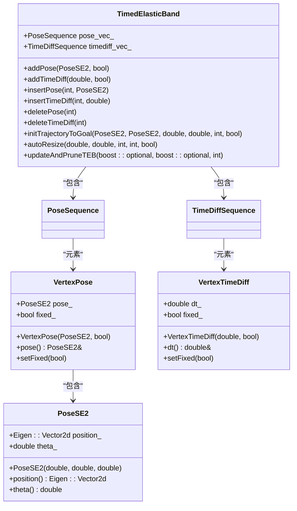
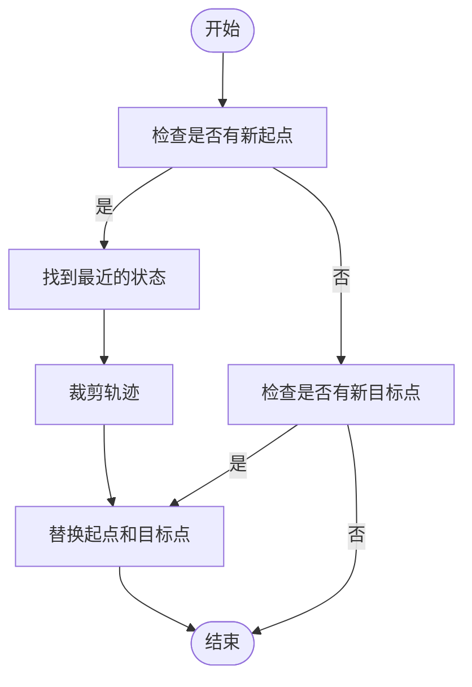
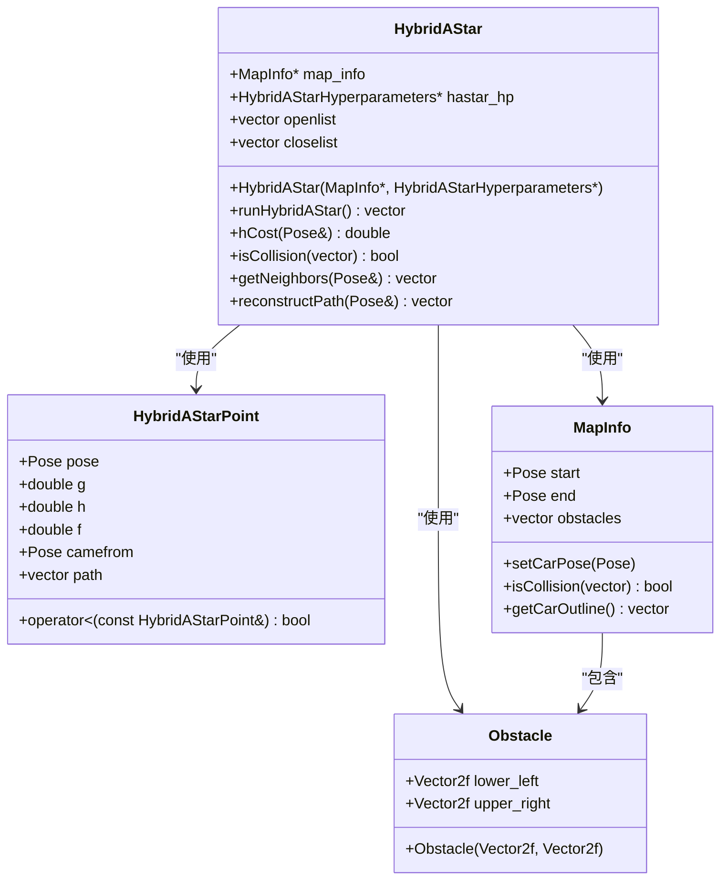
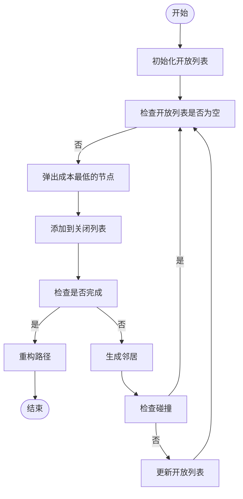
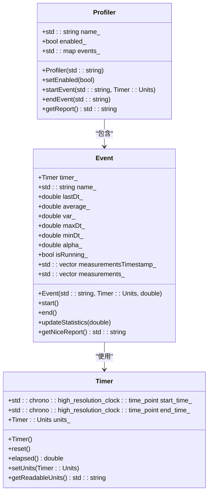
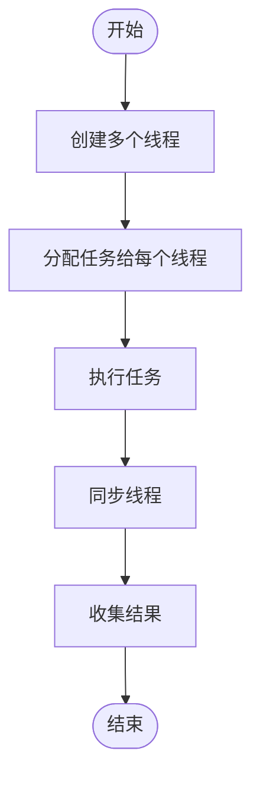
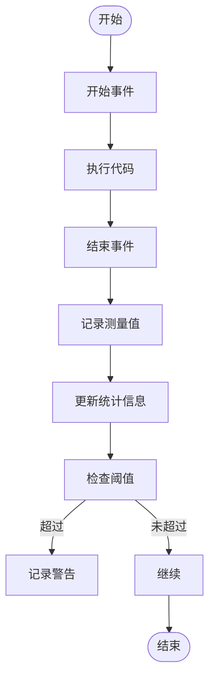

# 实时性能优化

<cite>
**本文档中引用的文件**  
- [timed_elastic_band.h](file://teb_local_planner/include/teb_local_planner/timed_elastic_band.h)
- [timed_elastic_band.cpp](file://teb_local_planner/src/timed_elastic_band.cpp)
- [HybridAStar.cpp](file://hybrid_astar_planner/src/HybridAStar.cpp)
- [HybridAStar.h](file://hybrid_astar_planner/include/HybridAStar.h)
- [profiler.hpp](file://field_local_planner/field_local_planner_base/field_local_planner_base/include/field_local_planner_base/profiler.hpp)
- [profiler.cpp](file://field_local_planner/field_local_planner_base/field_local_planner_base/src/field_local_planner_base/profiler.cpp)
</cite>

## 目录
1. [引言](#引言)
2. [时间弹性带数据结构设计](#时间弹性带数据结构设计)
3. [增量优化与计算延迟减少](#增量优化与计算延迟减少)
4. [Hybrid A*搜索实现与启发式函数](#hybrid-a搜索实现与启发式函数)
5. [搜索空间剪枝策略](#搜索空间剪枝策略)
6. [内存管理与缓存优化](#内存管理与缓存优化)
7. [多线程并行计算最佳实践](#多线程并行计算最佳实践)
8. [性能剖析工具使用方法](#性能剖析工具使用方法)
9. [总结](#总结)

## 引言
本文档深入探讨实时系统中C++规划算法的性能优化技术。重点分析时间弹性带（Timed Elastic Band）数据结构的设计原理，以及如何通过增量优化减少计算延迟。同时，结合Hybrid A*搜索算法的实现，阐述启发式函数设计和搜索空间剪枝对性能的影响。文档还提供了内存管理、缓存优化和多线程并行计算的最佳实践，包括智能指针使用和避免动态内存分配的技巧。最后，介绍性能剖析工具的使用方法，帮助开发者识别和解决性能瓶颈。

## 时间弹性带数据结构设计
时间弹性带（Timed Elastic Band）是一种用于表示轨迹的弹性带模型，通过增强时间信息来优化轨迹规划。该数据结构由一系列姿态（Pose）和时间差（TimeDiff）组成，其中姿态表示机器人的位置和方向，时间差表示从一个姿态到下一个姿态所需的时间。

**图示来源**
- [timed_elastic_band.h](file://teb_local_planner/include/teb_local_planner/timed_elastic_band.h#L67-L97)
- [timed_elastic_band.cpp](file://teb_local_planner/src/timed_elastic_band.cpp#L38-L91)

**本节来源**
- [timed_elastic_band.h](file://teb_local_planner/include/teb_local_planner/timed_elastic_band.h#L67-L97)
- [timed_elastic_band.cpp](file://teb_local_planner/src/timed_elastic_band.cpp#L38-L91)

## 增量优化与计算延迟减少
时间弹性带通过增量优化方法减少计算延迟。当新的起点或目标点更新时，系统会裁剪已通过的轨迹部分，并用新的起点和目标点替换。这种热启动（Hot-Start）方法避免了重新计算整个轨迹，从而显著减少了计算时间。

**图示来源**
- [timed_elastic_band.cpp](file://teb_local_planner/src/timed_elastic_band.cpp#L542-L565)

**本节来源**
- [timed_elastic_band.cpp](file://teb_local_planner/src/timed_elastic_band.cpp#L542-L565)

## Hybrid A*搜索实现与启发式函数
Hybrid A*算法结合了A*搜索和Dubin's路径规划，用于在复杂环境中找到最优路径。该算法通过启发式函数估计从当前点到目标点的成本，从而指导搜索方向。

**图示来源**
- [HybridAStar.h](file://hybrid_astar_planner/include/HybridAStar.h#L0-L36)
- [HybridAStar.cpp](file://hybrid_astar_planner/src/HybridAStar.cpp#L0-L42)

**本节来源**
- [HybridAStar.h](file://hybrid_astar_planner/include/HybridAStar.h#L0-L36)
- [HybridAStar.cpp](file://hybrid_astar_planner/src/HybridAStar.cpp#L0-L42)

## 搜索空间剪枝策略
为了提高搜索效率，Hybrid A*算法采用了多种剪枝策略。首先，通过设置最大迭代次数和完成阈值来限制搜索范围。其次，利用启发式函数排除不可能到达目标的节点。最后，通过碰撞检测避免无效路径的扩展。

**图示来源**
- [HybridAStar.cpp](file://hybrid_astar_planner/src/HybridAStar.cpp#L91-L111)

**本节来源**
- [HybridAStar.cpp](file://hybrid_astar_planner/src/HybridAStar.cpp#L91-L111)

## 内存管理与缓存优化
高效的内存管理和缓存优化对于实时系统至关重要。通过使用智能指针和避免频繁的动态内存分配，可以显著提高性能。此外，合理利用缓存可以减少内存访问延迟。

**图示来源**
- [profiler.hpp](file://field_local_planner/field_local_planner_base/field_local_planner_base/include/field_local_planner_base/profiler.hpp#L36-L84)
- [profiler.cpp](file://field_local_planner/field_local_planner_base/field_local_planner_base/src/field_local_planner_base/profiler.cpp#L0-L35)

**本节来源**
- [profiler.hpp](file://field_local_planner/field_local_planner_base/field_local_planner_base/include/field_local_planner_base/profiler.hpp#L36-L84)
- [profiler.cpp](file://field_local_planner/field_local_planner_base/field_local_planner_base/src/field_local_planner_base/profiler.cpp#L0-L35)

## 多线程并行计算最佳实践
在实时系统中，多线程并行计算可以显著提高性能。通过合理分配任务和使用线程安全的数据结构，可以充分利用多核处理器的计算能力。

**图示来源**
- [profiler.cpp](file://field_local_planner/field_local_planner_base/field_local_planner_base/src/field_local_planner_base/profiler.cpp#L162-L196)

**本节来源**
- [profiler.cpp](file://field_local_planner/field_local_planner_base/field_local_planner_base/src/field_local_planner_base/profiler.cpp#L162-L196)

## 性能剖析工具使用方法
性能剖析工具可以帮助开发者识别和解决性能瓶颈。通过记录和分析各个事件的执行时间，可以找到需要优化的部分。

**图示来源**
- [profiler.cpp](file://field_local_planner/field_local_planner_base/field_local_planner_base/src/field_local_planner_base/profiler.cpp#L79-L124)

**本节来源**
- [profiler.cpp](file://field_local_planner/field_local_planner_base/field_local_planner_base/src/field_local_planner_base/profiler.cpp#L79-L124)

## 总结
本文档详细介绍了实时系统中C++规划算法的性能优化技术。通过分析时间弹性带数据结构的设计原理和增量优化方法，结合Hybrid A*搜索算法的实现，阐述了启发式函数设计和搜索空间剪枝对性能的影响。同时，提供了内存管理、缓存优化和多线程并行计算的最佳实践，以及性能剖析工具的使用方法。这些技术和方法可以帮助开发者构建高效、可靠的实时系统。