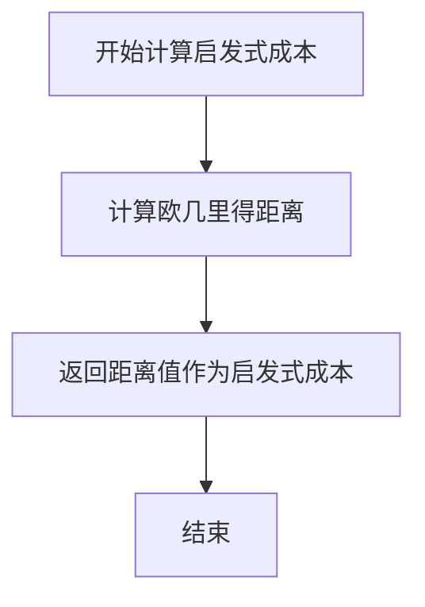
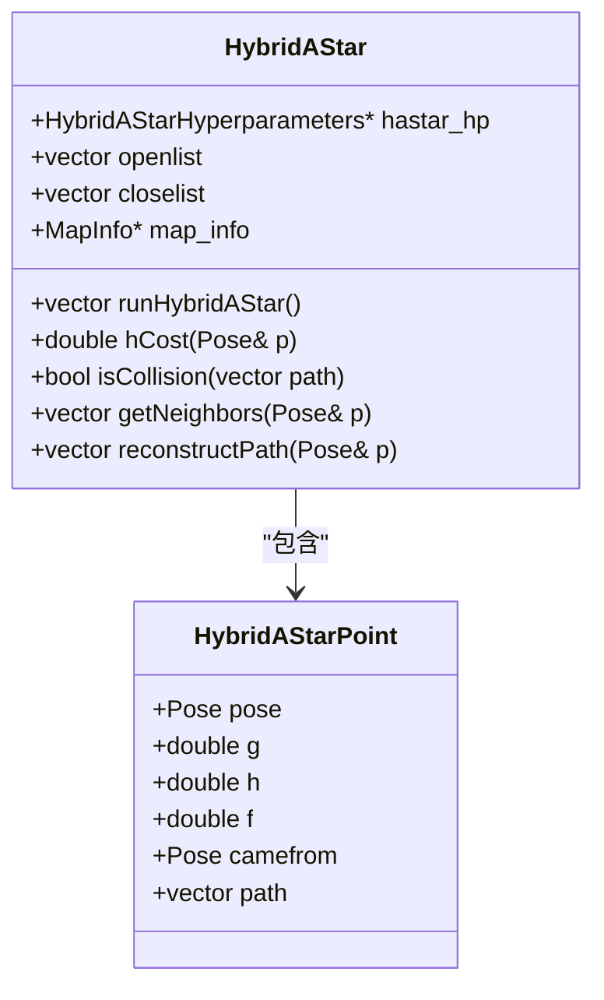
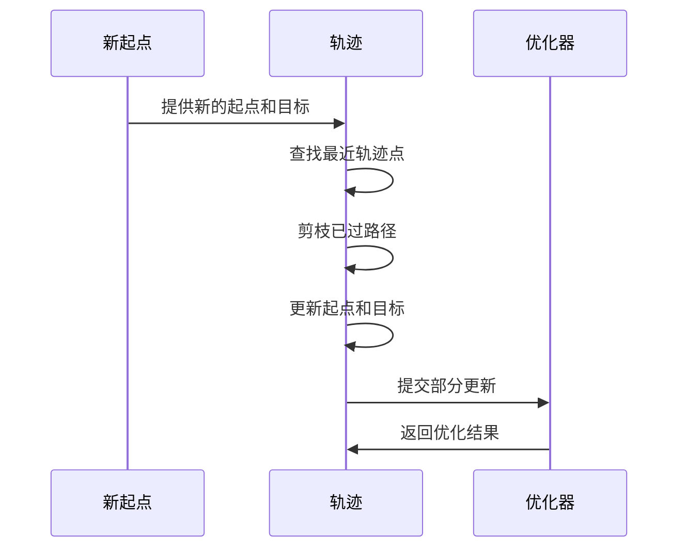
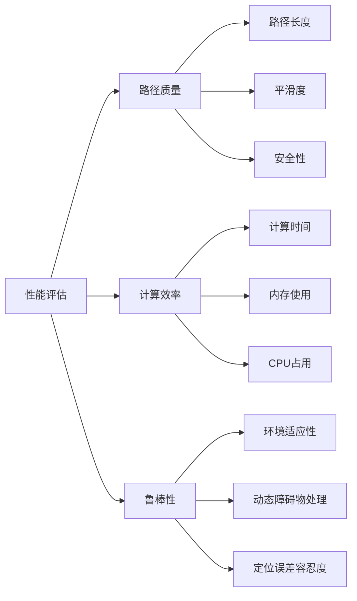

# 算法优化

<cite>
**本文档中引用的文件**  
- [timed_elastic_band.h](file://teb_local_planner/include/teb_local_planner/timed_elastic_band.h)
- [timed_elastic_band.cpp](file://teb_local_planner/src/timed_elastic_band.cpp)
- [HybridAStar.h](file://hybrid_astar_planner/include/HybridAStar.h)
- [HybridAStar.cpp](file://hybrid_astar_planner/src/HybridAStar.cpp)
- [hybrid_a_star.jl](file://H-OBCA/hybrid_a_star.jl)
</cite>

## 目录
1. [引言](#引言)
2. [时间弹性带增量优化机制](#时间弹性带增量优化机制)
3. [HybridA*算法启发式函数设计](#hybrida算法启发式函数设计)
4. [状态空间离散化与剪枝技术](#状态空间离散化与剪枝技术)
5. [路径质量与计算时间平衡](#路径质量与计算时间平衡)
6. [优化参数调优指南](#优化参数调优指南)
7. [算法复杂度分析与应对策略](#算法复杂度分析与应对策略)
8. [性能评估方法](#性能评估方法)

## 引言
本文档深入探讨路径规划算法中的性能优化技术，重点分析时间弹性带（Timed Elastic Band）和HybridA*算法的核心优化机制。通过解析局部更新轨迹节点、启发式函数设计、状态空间离散化等关键技术，为开发者提供全面的算法优化指南。

## 时间弹性带增量优化机制

时间弹性带（Timed Elastic Band）是一种将轨迹建模为具有时间信息的弹性带的算法，通过局部更新轨迹节点来显著减少计算开销。该机制的核心在于动态调整轨迹的时空分辨率，仅在必要时进行局部优化。

算法通过`autoResize`方法实现动态调整，根据参考时间分辨率`dt_ref`和滞后范围`dt_hysteresis`来决定是否插入或删除轨迹点。当时间间隔大于`dt_ref + dt_hysteresis`时，算法会将该间隔一分为二，并在中间插入新的轨迹点；当时间间隔小于`dt_ref - dt_hysteresis`时，则会合并相邻的时间间隔并删除相应的轨迹点。

这种增量优化机制避免了对整个轨迹进行全局重新优化，从而大幅降低了计算复杂度。同时，通过设置最小和最大样本数限制，确保了轨迹的连续性和优化效率。

**Section sources**
- [timed_elastic_band.h](file://teb_local_planner/include/teb_local_planner/timed_elastic_band.h#L67-L97)
- [timed_elastic_band.cpp](file://teb_local_planner/src/timed_elastic_band.cpp#L226-L248)

## HybridA*算法启发式函数设计

HybridA*算法的启发式函数设计对搜索效率有着决定性影响。该算法采用欧几里得距离作为基础启发式函数，通过`hCost`方法计算当前位姿到目标位姿的直线距离。

**Diagram sources**
- [HybridAStar.cpp](file://hybrid_astar_planner/src/HybridAStar.cpp#L89-L91)

启发式函数的设计原则包括：
1. **可接纳性**：启发式成本必须小于或等于实际成本，确保算法的最优性
2. **一致性**：相邻节点间的启发式成本变化应与实际移动成本相匹配
3. **计算效率**：启发式函数应尽可能简单，避免成为性能瓶颈

在实际实现中，HybridA*算法还结合了Reeds-Shepp路径启发式，通过解析扩展（analytic expansion）来快速连接当前节点与目标节点，进一步提高了搜索效率。

**Section sources**
- [HybridAStar.h](file://hybrid_astar_planner/include/HybridAStar.h#L28-L30)
- [HybridAStar.cpp](file://hybrid_astar_planner/src/HybridAStar.cpp#L89-L91)

## 状态空间离散化与剪枝技术

状态空间离散化策略是HybridA*算法的核心组成部分，通过将连续的状态空间划分为离散的网格来实现高效搜索。算法使用`rad_step`参数控制转向角度的离散化精度，`step_size`参数控制移动步长。

**Diagram sources**
- [HybridAStar.h](file://hybrid_astar_planner/include/HybridAStar.h#L16-L36)

剪枝技术通过多种方式减少搜索空间：
1. **碰撞检测剪枝**：在生成邻居节点时立即进行碰撞检测，避免无效搜索
2. **距离阈值剪枝**：使用`completion_threshold`参数限制搜索范围
3. **重复状态剪枝**：通过检查`closelist`避免重复探索已访问状态

这些技术共同作用，显著降低了算法的时间和空间复杂度。

**Section sources**
- [HybridAStar.h](file://hybrid_astar_planner/include/HybridAStar.h#L16-L36)
- [HybridAStar.cpp](file://hybrid_astar_planner/src/HybridAStar.cpp#L44-L89)

## 路径质量与计算时间平衡

在实际应用中，需要在路径质量和计算时间之间找到最佳平衡点。时间弹性带算法通过`updateAndPruneTEB`方法实现这一平衡，该方法在更新轨迹时只修改必要的部分。

**Diagram sources**
- [timed_elastic_band.cpp](file://teb_local_planner/src/timed_elastic_band.cpp#L542-L565)

平衡策略包括：
- 动态调整时间分辨率
- 限制最大迭代次数
- 设置合理的路径采样密度
- 采用分层优化策略

这些策略确保了算法在保证路径质量的同时，能够满足实时性要求。

**Section sources**
- [timed_elastic_band.cpp](file://teb_local_planner/src/timed_elastic_band.cpp#L542-L565)

## 优化参数调优指南

有效的参数调优是实现最佳性能的关键。以下是主要优化参数的调优建议：

| 参数 | 推荐范围 | 调优策略 |
|------|---------|---------|
| dt_ref | 0.1-0.5秒 | 根据机器人速度和环境复杂度调整 |
| dt_hysteresis | dt_ref的1/3 | 避免频繁的轨迹调整 |
| max_iterations | 1000-5000 | 在搜索完整性和计算时间间平衡 |
| completion_threshold | 0.1-0.5米 | 根据定位精度和环境尺寸设置 |
| rad_step | 0.1-0.3弧度 | 影响转向精度和计算开销 |

参数调优应遵循以下步骤：
1. 从默认值开始
2. 逐步调整单个参数
3. 评估性能变化
4. 记录最佳配置
5. 在不同场景下验证鲁棒性

**Section sources**
- [HybridAStar.cpp](file://hybrid_astar_planner/src/HybridAStar.cpp#L91-L111)
- [hybrid_a_star.jl](file://H-OBCA/hybrid_a_star.jl#L183-L228)

## 算法复杂度分析与应对策略

算法复杂度随环境复杂度和路径长度呈非线性增长。时间弹性带算法的时间复杂度主要取决于轨迹点数和优化迭代次数，而HybridA*算法的复杂度受状态空间离散化程度影响显著。

应对策略包括：
- **分层规划**：先进行粗略规划，再进行精细优化
- **并行计算**：利用多核处理器并行执行搜索
- **增量更新**：只重新计算受影响的路径部分
- **预计算**：提前计算常用路径模式

在动态环境中，应采用滑动窗口策略，只维护有限长度的轨迹，从而控制计算开销。

**Section sources**
- [timed_elastic_band.cpp](file://teb_local_planner/src/timed_elastic_band.cpp#L280-L329)
- [HybridAStar.cpp](file://hybrid_astar_planner/src/HybridAStar.cpp#L91-L111)

## 性能评估方法

有效的性能评估需要综合考虑多个指标：

**Diagram sources**
- [timed_elastic_band.h](file://teb_local_planner/include/teb_local_planner/timed_elastic_band.h#L67-L97)

评估方法包括：
1. **基准测试**：在标准场景下进行重复测试
2. **真实环境验证**：在实际应用环境中测试
3. **压力测试**：在极端条件下评估算法表现
4. **对比分析**：与其他算法进行性能对比

通过系统化的评估，可以全面了解算法的性能特征，为优化提供依据。

**Section sources**
- [timed_elastic_band.h](file://teb_local_planner/include/teb_local_planner/timed_elastic_band.h#L67-L97)
- [HybridAStar.h](file://hybrid_astar_planner/include/HybridAStar.h#L16-L36)