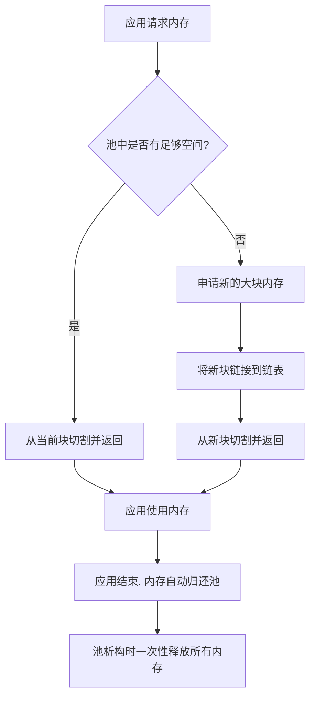
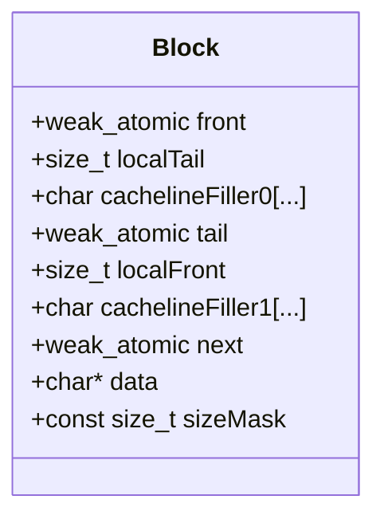
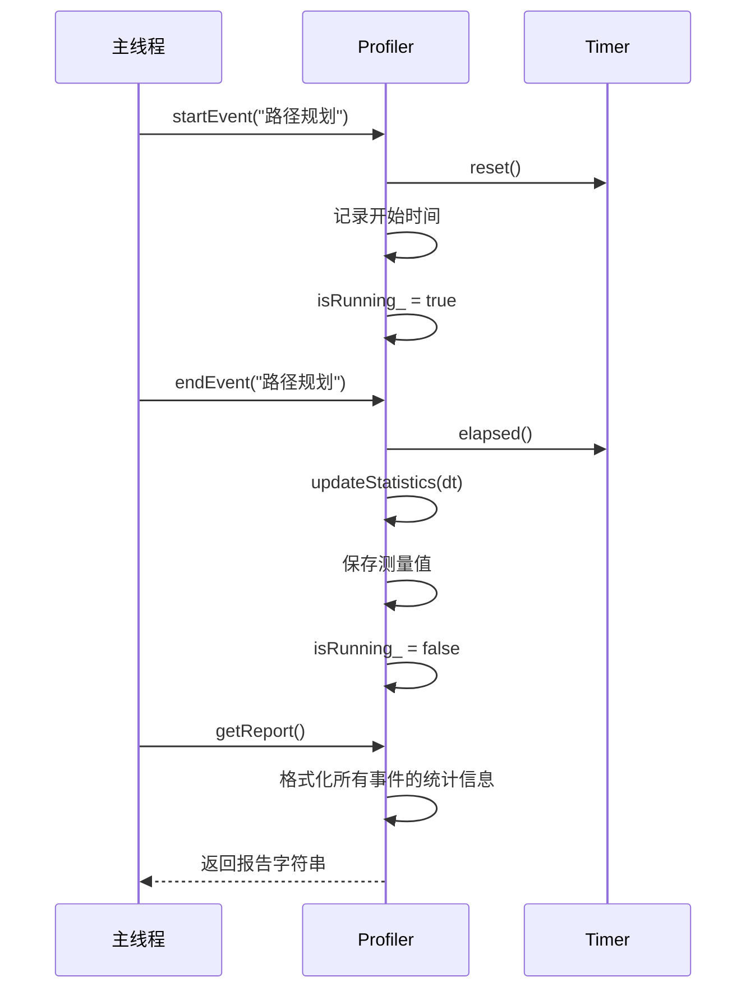

# 系统优化

<cite>
**本文档中引用的文件**  
- [timed_elastic_band.h](file://teb_local_planner\include\teb_local_planner\timed_elastic_band.h)
- [timed_elastic_band.hpp](file://teb_local_planner\include\teb_local_planner\timed_elastic_band.hpp)
- [profiler.hpp](file://field_local_planner\field_local_planner_base\field_local_planner_base\include\field_local_planner_base\profiler.hpp)
- [profiler.cpp](file://field_local_planner\field_local_planner_base\field_local_planner_base\src\field_local_planner_base\profiler.cpp)
- [nanoflann.hpp](file://Dftpav\src\Sim\core\semantic_map_manager\thirdparty\nanoflann\include\nanoflann.hpp)
- [readerwriterqueue.h](file://Dftpav\src\Sim\core\common\thirdparty\moodycamel\readerwriterqueue.h)
- [atomicops.h](file://Dftpav\src\Sim\core\common\thirdparty\moodycamel\atomicops.h)
</cite>

## 目录
1. [引言](#引言)
2. [对象池与内存预分配](#对象池与内存预分配)
3. [高效内存布局与缓存友好性](#高效内存布局与缓存友好性)
4. [多线程并行计算在路径搜索中的应用](#多线程并行计算在路径搜索中的应用)
5. [性能剖析工具实战指南](#性能剖析工具实战指南)
6. [典型性能问题与解决方案](#典型性能问题与解决方案)
7. [结论](#结论)

## 引言
本文档深入探讨系统级性能优化策略，重点聚焦于C++层面的实现。通过分析`teb_local_planner`和`field_local_planner`等项目中的核心组件，详细阐述如何利用对象池、内存预分配、缓存友好性编程和多线程并行计算来显著提升系统性能。同时，提供使用性能剖析工具进行瓶颈分析的实战方法，并给出常见性能问题的解决方案。

## 对象池与内存预分配

### 对象池模式减少动态内存分配开销
在实时系统中，频繁的动态内存分配（`new`/`delete` 或 `malloc`/`free`）会带来显著的性能开销和内存碎片问题。对象池模式通过预先创建一组对象并重复使用它们，有效避免了这一问题。

在 `nanoflann` 库中，`PooledAllocator` 类实现了一个高效的内存池。它通过维护一个内存块链表，将小块内存的分配请求合并到大块内存中，从而减少了系统调用的次数。当需要分配内存时，`PooledAllocator` 优先从当前内存块中切割，只有当当前块空间不足时才申请新的大块内存。所有通过该池分配的对象，其生命周期与池本身绑定，无需单独释放，极大地简化了内存管理。

**Diagram sources**
- [nanoflann.hpp](file://Dftpav\src\Sim\core\semantic_map_manager\thirdparty\nanoflann\include\nanoflann.hpp#L582-L709)

### 预分配内存策略
除了对象池，直接预分配大块内存也是一种有效的策略。`moodycamel::ReaderWriterQueue` 在初始化时，会根据预估的最大队列大小一次性分配多个内存块。这确保了在队列增长的常见路径上，`enqueue` 操作几乎不会触发 `malloc`，从而实现了“等待自由”（wait-free）的性能保证。

**Section sources**
- [nanoflann.hpp](file://Dftpav\src\Sim\core\semantic_map_manager\thirdparty\nanoflann\include\nanoflann.hpp#L582-L709)
- [readerwriterqueue.h](file://Dftpav\src\Sim\core\common\thirdparty\moodycamel\readerwriterqueue.h#L100-L150)

## 高效内存布局与缓存友好性

### timed_elastic_band中的数据结构设计
`teb_local_planner` 中的 `TimedElasticBand` 类是高效内存布局的典范。它将轨迹表示为两个独立的序列：`PoseSequence`（姿态顶点）和 `TimeDiffSequence`（时间差顶点）。这种设计避免了将姿态和时间差混合存储在一个结构体中可能造成的内存浪费和访问不连续。

更重要的是，`TimedElasticBand` 使用 `std::vector` 来存储这些顶点。`std::vector` 保证了元素在内存中的连续存储，这使得遍历轨迹时的缓存命中率极高。当算法需要对轨迹进行优化时，CPU可以高效地预取连续的内存块，极大地提升了计算效率。

### 数据对齐与访问局部性优化
缓存友好性编程的核心是提高数据的访问局部性。`moodycamel::ReaderWriterQueue` 的 `Block` 结构体通过精心设计，将高频率访问的原子变量（`front`, `tail`, `next`）用 `char cachelineFiller[]` 分隔，确保它们位于不同的CPU缓存行（Cache Line）上。这有效避免了“伪共享”（False Sharing）问题，即多个核心同时修改位于同一缓存行的不同变量，导致缓存行在核心间频繁无效和同步，从而严重降低性能。

**Diagram sources**
- [readerwriterqueue.h](file://Dftpav\src\Sim\core\common\thirdparty\moodycamel\readerwriterqueue.h#L450-L480)

**Section sources**
- [timed_elastic_band.h](file://teb_local_planner\include\teb_local_planner\timed_elastic_band.h#L100-L150)
- [readerwriterqueue.h](file://Dftpav\src\Sim\core\common\thirdparty\moodycamel\readerwriterqueue.h#L450-L480)

## 多线程并行计算在路径搜索中的应用

### 任务分解与同步机制
虽然提供的代码片段中没有直接展示多线程路径搜索的完整实现，但 `moodycamel::ReaderWriterQueue` 和 `LightweightSemaphore` 提供了构建此类系统的基石。

一个典型的并行路径搜索框架可以这样设计：
1.  **任务分解**：将搜索空间（如地图的不同区域）或搜索算法的不同阶段（如粗略搜索和精细优化）分解为多个独立任务。
2.  **任务队列**：使用 `ReaderWriterQueue` 作为任务分发队列。生产者线程（如主控制线程）将任务放入队列，多个消费者线程（工作线程）从队列中取出任务并执行。
3.  **结果同步**：当一个工作线程找到一条可行路径后，它将结果放入一个结果队列。主线程通过 `LightweightSemaphore` 被通知有新结果到达，然后从结果队列中获取并评估该路径。

这种设计利用了 `ReaderWriterQueue` 的无锁特性，使得任务的生产和消费可以高效并发，而 `LightweightSemaphore` 则提供了轻量级的线程间同步，避免了传统互斥锁带来的性能瓶颈。

**Section sources**
- [readerwriterqueue.h](file://Dftpav\src\Sim\core\common\thirdparty\moodycamel\readerwriterqueue.h)
- [atomicops.h](file://Dftpav\src\Sim\core\common\thirdparty\moodycamel\atomicops.h)

## 性能剖析工具实战指南

### 使用内置剖析器进行瓶颈分析
`field_local_planner` 提供了一个名为 `Profiler` 的内置性能剖析工具，它是进行瓶颈分析的绝佳实战案例。

`Profiler` 的使用非常简单：
1.  **创建剖析器**：在模块初始化时创建一个 `Profiler` 实例。
2.  **标记事件**：在需要测量性能的代码段前后，调用 `startEvent("event_name")` 和 `endEvent("event_name")`。
3.  **获取报告**：在运行结束后，调用 `getReport()` 获取包含每个事件的平均耗时、标准差、最大/最小耗时等统计信息的报告。

该剖析器通过 `Event` 类内部的 `Timer` 来测量时间，并使用指数移动平均（EMA）在线计算统计值，避免了存储所有原始数据带来的内存开销。

**Diagram sources**
- [profiler.hpp](file://field_local_planner\field_local_planner_base\field_local_planner_base\include\field_local_planner_base\profiler.hpp#L36-L84)
- [profiler.cpp](file://field_local_planner\field_local_planner_base\field_local_planner_base\src\field_local_planner_base\profiler.cpp#L37-L81)

### 结合gprof和Valgrind
虽然 `Profiler` 适用于特定模块的细粒度分析，但对于整个程序的宏观性能分析，`gprof` 和 `Valgrind` 仍然是不可或缺的工具。
- **gprof**：通过在编译时添加 `-pg` 标志，程序运行后会生成 `gmon.out` 文件。使用 `gprof` 命令分析该文件，可以得到每个函数的调用次数和耗时占比，快速定位热点函数。
- **Valgrind (Callgrind)**：`valgrind --tool=callgrind ./your_program` 可以生成详细的调用图和指令计数。配合 `kcachegrind` 工具，可以直观地看到哪些代码行消耗了最多的CPU周期。

**Section sources**
- [profiler.hpp](file://field_local_planner\field_local_planner_base\field_local_planner_base\include\field_local_planner_base\profiler.hpp#L36-L127)
- [profiler.cpp](file://field_local_planner\field_local_planner_base\field_local_planner_base\src\field_local_planner_base\profiler.cpp#L0-L197)

## 典型性能问题与解决方案

### 问题1：动态内存分配导致的延迟尖峰
**现象**：系统在运行过程中偶尔出现明显的卡顿或延迟。
**根源**：`new`/`delete` 操作触发了操作系统的内存分配器，尤其是在内存碎片化严重时，`malloc` 可能需要遍历内存管理结构，耗时不可预测。
**解决方案**：
1.  **使用对象池**：如 `PooledAllocator`，预先分配大块内存。
2.  **使用内存池分配器**：为 `std::vector` 等容器指定自定义的内存分配器。
3.  **预分配容器**：使用 `std::vector::reserve()` 预先分配足够容量。

### 问题2：多线程竞争导致的性能下降
**现象**：增加线程数后，程序性能不升反降。
**根源**：多个线程竞争同一个锁或共享变量，导致大量的缓存行无效和上下文切换。
**解决方案**：
1.  **避免伪共享**：使用 `MOODYCAMEL_CACHE_LINE_SIZE` 对齐和填充，确保不同线程访问的变量位于不同的缓存行。
2.  **使用无锁数据结构**：采用 `ReaderWriterQueue` 等无锁队列替代 `std::queue` + `std::mutex`。
3.  **减少共享状态**：尽可能让线程独立工作，通过消息传递而非共享内存进行通信。

### 问题3：缓存未命中导致的CPU利用率低下
**现象**：CPU占用率不高，但程序运行缓慢。
**根源**：数据访问模式不连续，导致CPU缓存命中率低，频繁从主存加载数据。
**解决方案**：
1.  **数据结构体数组 (SoA)**：将相关的数据结构从“结构体数组 (AoS)”改为“数组的结构体 (SoA)”，例如将 `std::vector<Pose>` 改为 `std::vector<double> x, y, theta`，这样在只处理位置信息时，可以连续访问 `x` 和 `y` 数组，提高缓存效率。
2.  **提高访问局部性**：优化算法，使其在处理数据时尽可能访问相邻的内存地址。

**Section sources**
- [nanoflann.hpp](file://Dftpav\src\Sim\core\semantic_map_manager\thirdparty\nanoflann\include\nanoflann.hpp)
- [readerwriterqueue.h](file://Dftpav\src\Sim\core\common\thirdparty\moodycamel\readerwriterqueue.h)
- [profiler.hpp](file://field_local_planner\field_local_planner_base\field_local_planner_base\include\field_local_planner_base\profiler.hpp)

## 结论
系统级性能优化是一个多维度的工程挑战。通过采用对象池和内存预分配策略，可以从根本上消除动态内存分配的开销。通过精心设计数据结构，利用数据对齐和访问局部性原则，可以最大化CPU缓存的利用率。通过合理的任务分解和使用高效的无锁同步原语，可以充分发挥多核处理器的并行计算能力。最后，结合内置剖析器和专业的性能分析工具，开发者可以精准定位瓶颈，持续迭代优化，最终构建出高效、稳定的系统。