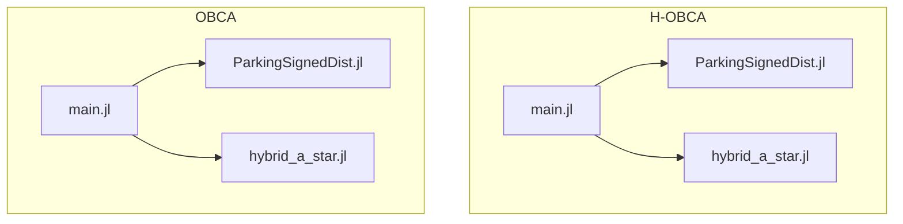
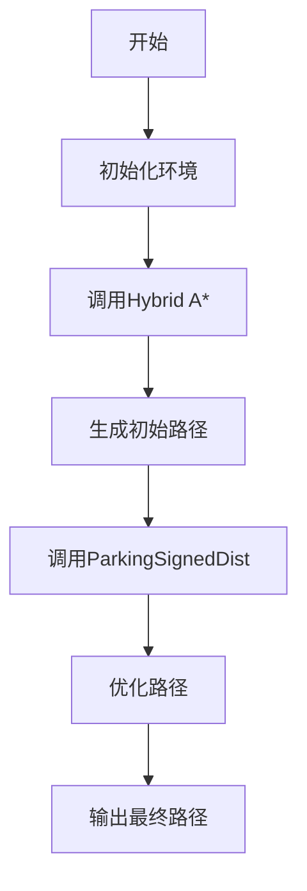
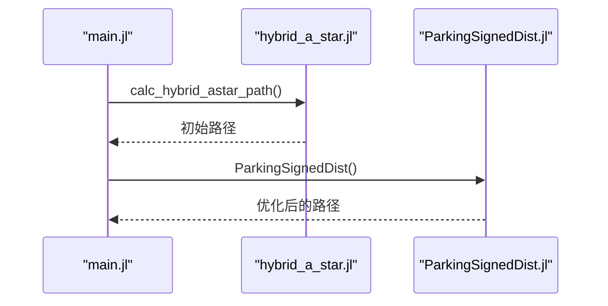
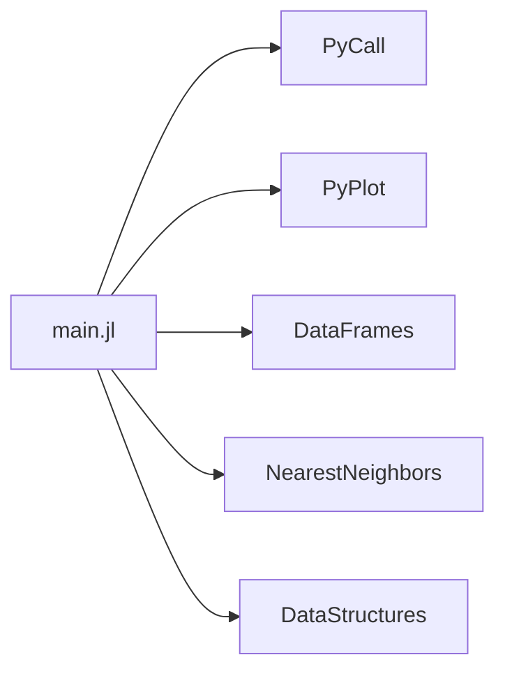

# Julia技术栈

<cite>
**本文档中引用的文件**   
- [main.jl](file://H-OBCA/main.jl)
- [ParkingSignedDist.jl](file://H-OBCA/ParkingSignedDist.jl)
- [hybrid_a_star.jl](file://H-OBCA/hybrid_a_star.jl)
- [main.jl](file://OBCA/AutonomousParking/main.jl)
- [ParkingSignedDist.jl](file://OBCA/AutonomousParking/ParkingSignedDist.jl)
</cite>

## 目录
1. [简介](#简介)
2. [项目结构](#项目结构)
3. [核心组件](#核心组件)
4. [架构概述](#架构概述)
5. [详细组件分析](#详细组件分析)
6. [依赖分析](#依赖分析)
7. [性能考量](#性能考量)
8. [故障排除指南](#故障排除指南)
9. [结论](#结论)

## 简介
Julia是一种高性能的动态编程语言，专为科学计算、数值分析和数据科学而设计。在优化碰撞避免（OBCA）和分层优化碰撞避免（H-OBCA）等自动驾驶停车项目中，Julia展现了其在数值优化和微分方程求解方面的显著优势。本文件详细介绍了Julia在这些项目中的应用，包括混合整数规划问题的建模与求解过程，并探讨了Julia与其他技术栈的互操作性及其在高性能计算场景下的性能表现。

## 项目结构
项目结构清晰地展示了各个模块的组织方式，主要包含H-OBCA和OBCA两个子项目，分别用于实现分层优化碰撞避免和优化碰撞避免算法。每个子项目都包含了多个Julia脚本文件，如`main.jl`、`ParkingSignedDist.jl`和`hybrid_a_star.jl`等，这些文件共同构成了完整的路径规划系统。



**图示来源**
- [main.jl](file://H-OBCA/main.jl#L1-L262)
- [ParkingSignedDist.jl](file://H-OBCA/ParkingSignedDist.jl#L1-L308)
- [hybrid_a_star.jl](file://H-OBCA/hybrid_a_star.jl#L1-L641)

**章节来源**
- [main.jl](file://H-OBCA/main.jl#L1-L262)
- [main.jl](file://OBCA/AutonomousParking/main.jl#L1-L289)

## 核心组件
核心组件包括路径规划算法、碰撞检测和优化求解器。`main.jl`文件作为入口点，调用`hybrid_a_star.jl`进行初步路径搜索，并通过`ParkingSignedDist.jl`进行优化以确保路径的安全性和最小穿透性。

**章节来源**
- [main.jl](file://H-OBCA/main.jl#L1-L262)
- [main.jl](file://OBCA/AutonomousParking/main.jl#L1-L289)

## 架构概述
系统架构采用分层设计，首先使用Hybrid A*算法生成初始路径，然后利用优化方法（如OBCA）对路径进行精细化调整。这种分层方法结合了快速搜索和精确优化的优点，能够在复杂环境中高效生成安全路径。



**图示来源**
- [main.jl](file://H-OBCA/main.jl#L1-L262)
- [ParkingSignedDist.jl](file://H-OBCA/ParkingSignedDist.jl#L1-L308)

## 详细组件分析

### 组件A分析
#### 对象导向组件：
```mermaid
classDiagram
class Node {
+Int64 xind
+Int64 yind
+Int64 yawind
+Bool direction
+Array{Float64} x
+Array{Float64} y
+Array{Float64} yaw
+Float64 steer
+Float64 cost
+Int64 pind
}
class Config {
+Int64 minx
+Int64 miny
+Int64 minyaw
+Int64 maxx
+Int64 maxy
+Int64 maxyaw
+Int64 xw
+Int64 yw
+Int64 yaww
+Float64 xyreso
+Float64 yawreso
+Int64 obminx
+Int64 obminy
+Int64 obmaxx
+Int64 obmaxy
+Int64 obxw
+Int64 obyw
+Float64 obreso
}
Node --> Config : "使用"
```

**图示来源**
- [hybrid_a_star.jl](file://H-OBCA/hybrid_a_star.jl#L1-L641)

#### API/服务组件：


**图示来源**
- [main.jl](file://H-OBCA/main.jl#L1-L262)
- [hybrid_a_star.jl](file://H-OBCA/hybrid_a_star.jl#L1-L641)
- [ParkingSignedDist.jl](file://H-OBCA/ParkingSignedDist.jl#L1-L308)

**章节来源**
- [main.jl](file://H-OBCA/main.jl#L1-L262)
- [hybrid_a_star.jl](file://H-OBCA/hybrid_a_star.jl#L1-L641)
- [ParkingSignedDist.jl](file://H-OBCA/ParkingSignedDist.jl#L1-L308)

## 依赖分析
项目依赖于多个Julia包，如PyCall、PyPlot、DataFrames、NearestNeighbors和DataStructures，这些包提供了必要的功能支持，如Python接口、绘图、数据处理和最近邻搜索等。



**图示来源**
- [main.jl](file://H-OBCA/main.jl#L1-L262)
- [hybrid_a_star.jl](file://H-OBCA/hybrid_a_star.jl#L1-L641)

**章节来源**
- [main.jl](file://H-OBCA/main.jl#L1-L262)
- [hybrid_a_star.jl](file://H-OBCA/hybrid_a_star.jl#L1-L641)

## 性能考量
Julia的即时编译（JIT）特性使其在执行数值计算时表现出色。此外，通过并行计算和与其他语言的集成，可以进一步提升性能。例如，在H-OBCA项目中，利用IPOPT求解器进行非线性优化，显著提高了路径规划的效率。

## 故障排除指南
常见问题包括路径规划失败、优化求解器无法收敛等。解决这些问题的方法包括检查输入参数、调整优化设置和验证环境配置。

**章节来源**
- [main.jl](file://H-OBCA/main.jl#L1-L262)
- [ParkingSignedDist.jl](file://H-OBCA/ParkingSignedDist.jl#L1-L308)

## 结论
Julia在OBCA和H-OBCA项目中的应用展示了其在数值优化和微分方程求解方面的强大能力。通过合理的架构设计和高效的算法实现，Julia能够有效支持复杂的自动驾驶停车任务。对于初学者，建议从基础语法和环境搭建开始；对于有经验的开发者，则可以探索并行计算和与其他语言的集成技巧。